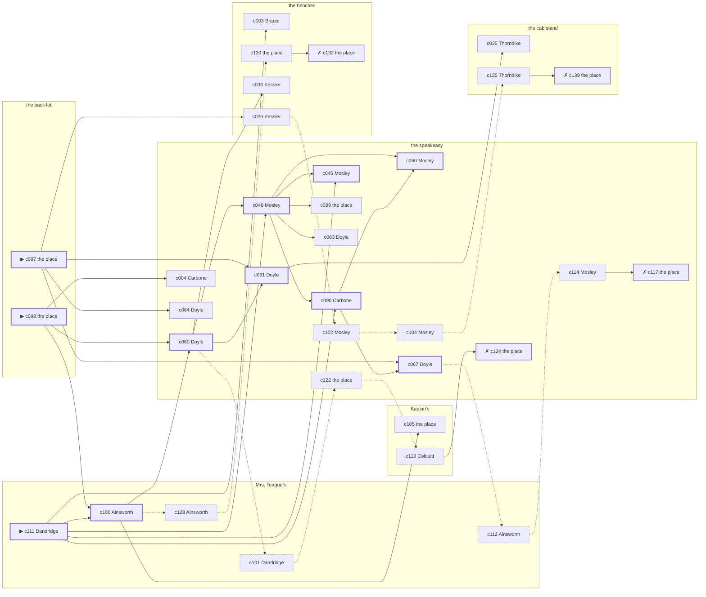

# the Bowery — case 7

**Seed** 7 · **Difficulty** 2 · **Attempts** 1 · **Detective** Dashiell

**Par** 10 actions · **Slack** 6 · **Budget** 16 · **Findable** 34 (spine 11, corroboration 9, noise 10 + 4 disqualifiers) · **Noise ratio** 41% · **Candidate pool** 140

## 1. The Truth

Otto Brauer, a stagehand at the Selwyn, the victim’s neighbour across the airshaft, killed Salvatore Vitale, a retired dry-goods wholesaler, with a gunshot at the back lot at 9:30 PM. Brauer blamed the victim for a ruin (revenge). Brauer had been at the speakeasy earlier in the evening, where the weapon lived, and was alone with Vitale when it happened. Dandridge hired us.

## 2. Dramatis Personae

| Name | Role | Relationship | Class of secret | Motive | Found at | Killer |
| --- | --- | --- | --- | --- | --- | --- |
| Salvatore Vitale | a retired dry-goods wholesaler | the victim | — | — | — | — |
| Domenica Carbone | a piano teacher | the victim’s tenant | secret-drinking | — | the speakeasy | — |
| Alonzo Dandridge (client) | a doorman at a club with no sign on it | in the victim’s debt | gambling-debt | — | Mrs. Teague’s | — |
| Otto Brauer | a stagehand at the Selwyn | the victim’s neighbour across the airshaft | murder | revenge | the benches | **YES** |
| Nathan Kessler | a young man living on expectations | the victim’s cousin | affair | inheritance | the benches | — |
| Beatrice Thorndike | a seamstress | the victim’s tenant | affair | — | the cab stand | — |
| Roscoe Mosley | a ward heeler | the victim’s business partner | fence | property | the speakeasy | — |
| Marion Ainsworth | the landlady | fixture (landlady) | — | — | Mrs. Teague’s | — |
| Dennis Doyle | the bartender | fixture (bartender) | — | — | the speakeasy | — |
| Bernice Colquitt | the druggist | fixture (druggist) | — | — | Kaplan’s | — |
| Lurline Bledsoe | the hackman on the stand | fixture (cabbie) | — | — | the cab stand | — |

## 3. Places

- **the back room at Mrs. Teague’s** (private) — watched by landlady (Ainsworth); objects: a framed photograph, a bronze bookend, a strapped suitcase
- **the speakeasy under the hat shop** (semi) — watched by bartender (Doyle); objects: a nickel-plated revolver, a seltzer siphon, a silver cigarette case, a bottle of chloral drops — where the weapon lived; within earshot of the scene
- **the victim’s house on the back lot** (private) — unwatched; objects: a length of sash cord, a mechanic’s toolbox, the roof-door key — **THE SCENE**; the victim’s address
- **Kaplan’s drugstore with the soda fountain** (public) — watched by druggist (Colquitt); objects: a wall telephone, an ice pick
- **the cab stand outside the Hippodrome** (public) — watched by cabbie (Bledsoe); objects: a pasted-up timetable, a folded stack of evening papers
- **the benches at the north end of the square** (public) — unwatched; objects: a brass umbrella stand — within earshot of the scene

## 4. Anchors

The coroner gives 9:00 PM–10:30 PM, four ticks wide. These are what close it: **bar-radio** and **piano-lesson**.

- **the piano lesson on the floor above** — at 9:00 PM; at Mrs. Teague’s. You can time things by it: the same four bars, over and over, and then nothing. Only those present know that the child never did get the passage right.
- **the fight card on the bar radio** — at 9:30 PM; at the speakeasy. Only those present know that the challenger went down in the fourth and the crowd booed it. You can time things by it: the set was turned up loud enough to carry into the street.
- **the drunk singing under the window** — at 8:30 PM; at Mrs. Teague’s. You can time things by it: the same two verses until somebody threw a shoe. Only those present know that it was a shoe, and it was thrown by a woman, and it did not land.

## 5. Timelines

### Vitale — the victim

| Tick | Time | Truth | Claimed | Companion claimed |
| --- | --- | --- | --- | --- |
| 0 | 6:00 PM | Kaplan’s | Kaplan’s | — |
| 1 | 6:30 PM | Kaplan’s | Kaplan’s | — |
| 2 | 7:00 PM | the benches | the benches | — |
| 3 | 7:30 PM | the benches | the benches | — |
| 4 | 8:00 PM | the benches | the benches | — |
| 5 | 8:30 PM | the benches | the benches | — |
| 6 | 9:00 PM | Mrs. Teague’s | Mrs. Teague’s | — |
| 7 | 9:30 PM | the back lot ☠ | the back lot | — |
| 8 | 10:00 PM | — | — | — |
| 9 | 10:30 PM | — | — | — |
| 10 | 11:00 PM | — | — | — |
| 11 | 11:30 PM | — | — | — |

### Carbone

| Tick | Time | Truth | Claimed | Companion claimed |
| --- | --- | --- | --- | --- |
| 0 | 6:00 PM | Mrs. Teague’s | Mrs. Teague’s | — |
| 1 | 6:30 PM | Kaplan’s | Kaplan’s | — |
| 2 | 7:00 PM | Kaplan’s | Kaplan’s | — |
| 3 | 7:30 PM | Kaplan’s | Kaplan’s | — |
| 4 | 8:00 PM | the speakeasy | the speakeasy | — |
| 5 | 8:30 PM | Kaplan’s | Kaplan’s | — |
| 6 | 9:00 PM | Kaplan’s | Kaplan’s | — |
| 7 | 9:30 PM | the speakeasy | **Mrs. Teague’s** | Thorndike |
| 8 | 10:00 PM | the speakeasy | **Mrs. Teague’s** | Thorndike |
| 9 | 10:30 PM | the speakeasy | the speakeasy | — |
| 10 | 11:00 PM | the speakeasy | the speakeasy | — |
| 11 | 11:30 PM | the speakeasy | the speakeasy | — |

### Dandridge

| Tick | Time | Truth | Claimed | Companion claimed |
| --- | --- | --- | --- | --- |
| 0 | 6:00 PM | the benches | the benches | — |
| 1 | 6:30 PM | the benches | the benches | — |
| 2 | 7:00 PM | Kaplan’s | Kaplan’s | — |
| 3 | 7:30 PM | the speakeasy | the speakeasy | — |
| 4 | 8:00 PM | Kaplan’s | Kaplan’s | — |
| 5 | 8:30 PM | Kaplan’s | Kaplan’s | — |
| 6 | 9:00 PM | the speakeasy | **Mrs. Teague’s** | Carbone |
| 7 | 9:30 PM | the speakeasy | **Mrs. Teague’s** | Carbone |
| 8 | 10:00 PM | Mrs. Teague’s | Mrs. Teague’s | — |
| 9 | 10:30 PM | Mrs. Teague’s | Mrs. Teague’s | — |
| 10 | 11:00 PM | Mrs. Teague’s | Mrs. Teague’s | — |
| 11 | 11:30 PM | Mrs. Teague’s | Mrs. Teague’s | — |

### Brauer — the killer

| Tick | Time | Truth | Claimed | Companion claimed |
| --- | --- | --- | --- | --- |
| 0 | 6:00 PM | the benches | the benches | — |
| 1 | 6:30 PM | the benches | the benches | — |
| 2 | 7:00 PM | the benches | the benches | — |
| 3 | 7:30 PM | the benches | the benches | — |
| 4 | 8:00 PM | the speakeasy | the speakeasy | — |
| 5 | 8:30 PM | the back lot | **the speakeasy** | Carbone |
| 6 | 9:00 PM | the back lot | **the speakeasy** | Carbone |
| 7 | 9:30 PM | the back lot ☠ | **the speakeasy** | Carbone |
| 8 | 10:00 PM | the benches | the benches | — |
| 9 | 10:30 PM | the benches | the benches | — |
| 10 | 11:00 PM | the benches | the benches | — |
| 11 | 11:30 PM | the cab stand | the cab stand | — |

### Kessler

| Tick | Time | Truth | Claimed | Companion claimed |
| --- | --- | --- | --- | --- |
| 0 | 6:00 PM | the benches | the benches | — |
| 1 | 6:30 PM | the benches | the benches | — |
| 2 | 7:00 PM | the benches | the benches | — |
| 3 | 7:30 PM | the benches | the benches | — |
| 4 | 8:00 PM | the speakeasy | the speakeasy | — |
| 5 | 8:30 PM | the speakeasy | the speakeasy | — |
| 6 | 9:00 PM | Kaplan’s | Kaplan’s | — |
| 7 | 9:30 PM | the speakeasy | the speakeasy | — |
| 8 | 10:00 PM | the benches | **the cab stand** | Mosley |
| 9 | 10:30 PM | the benches | **the cab stand** | Mosley |
| 10 | 11:00 PM | the benches | the benches | — |
| 11 | 11:30 PM | the benches | the benches | — |

### Thorndike

| Tick | Time | Truth | Claimed | Companion claimed |
| --- | --- | --- | --- | --- |
| 0 | 6:00 PM | the cab stand | the cab stand | — |
| 1 | 6:30 PM | the cab stand | the cab stand | — |
| 2 | 7:00 PM | the cab stand | the cab stand | — |
| 3 | 7:30 PM | the cab stand | the cab stand | — |
| 4 | 8:00 PM | the cab stand | the cab stand | — |
| 5 | 8:30 PM | the cab stand | the cab stand | — |
| 6 | 9:00 PM | Kaplan’s | Kaplan’s | — |
| 7 | 9:30 PM | the speakeasy | the speakeasy | — |
| 8 | 10:00 PM | the benches | **the cab stand** | Mosley |
| 9 | 10:30 PM | the benches | **the cab stand** | Mosley |
| 10 | 11:00 PM | the benches | the benches | — |
| 11 | 11:30 PM | the speakeasy | the speakeasy | — |

### Mosley

| Tick | Time | Truth | Claimed | Companion claimed |
| --- | --- | --- | --- | --- |
| 0 | 6:00 PM | the speakeasy | the speakeasy | — |
| 1 | 6:30 PM | the speakeasy | the speakeasy | — |
| 2 | 7:00 PM | the speakeasy | the speakeasy | — |
| 3 | 7:30 PM | the cab stand | the cab stand | — |
| 4 | 8:00 PM | the cab stand | the cab stand | — |
| 5 | 8:30 PM | the cab stand | **Mrs. Teague’s** | Dandridge |
| 6 | 9:00 PM | the cab stand | **Mrs. Teague’s** | Dandridge |
| 7 | 9:30 PM | the speakeasy | the speakeasy | — |
| 8 | 10:00 PM | the speakeasy | the speakeasy | — |
| 9 | 10:30 PM | the cab stand | the cab stand | — |
| 10 | 11:00 PM | the speakeasy | the speakeasy | — |
| 11 | 11:30 PM | the speakeasy | the speakeasy | — |

### Fixtures (never lie, never withhold)

| Tick | Time | Ainsworth (the landlady) | Doyle (the bartender) | Colquitt (the druggist) | Bledsoe (the hackman on the stand) |
| --- | --- | --- | --- | --- | --- |
| 0 | 6:00 PM | Mrs. Teague’s | the speakeasy | Kaplan’s | the cab stand |
| 1 | 6:30 PM | Mrs. Teague’s | the speakeasy | Kaplan’s | the cab stand |
| 2 | 7:00 PM | the cab stand | the speakeasy | Kaplan’s | the cab stand |
| 3 | 7:30 PM | Mrs. Teague’s | the speakeasy | Kaplan’s | the cab stand |
| 4 | 8:00 PM | Mrs. Teague’s | the speakeasy | Kaplan’s | the cab stand |
| 5 | 8:30 PM | Mrs. Teague’s | the speakeasy | Kaplan’s | the cab stand |
| 6 | 9:00 PM | Mrs. Teague’s | the speakeasy | Kaplan’s | the cab stand |
| 7 | 9:30 PM | Mrs. Teague’s | the speakeasy | Kaplan’s | the cab stand |
| 8 | 10:00 PM | Mrs. Teague’s | the speakeasy | Kaplan’s | the cab stand |
| 9 | 10:30 PM | Mrs. Teague’s | the speakeasy | Kaplan’s | the cab stand |
| 10 | 11:00 PM | Mrs. Teague’s | the cab stand | Kaplan’s | the cab stand |
| 11 | 11:30 PM | Mrs. Teague’s | the speakeasy | Kaplan’s | the cab stand |

## 6. Secrets in play

- **Carbone** (secret-drinking): Carbone drinks alone at the speakeasy from 9:30 PM to 10:00 PM and will claim to have been anywhere else.
- **Dandridge** (gambling-debt): Dandridge slips off to the speakeasy from 9:00 PM to 9:30 PM to settle with a bookmaker.
- **Brauer** (murder): Brauer is at the back lot from 8:30 PM to 9:30 PM, alone with Vitale when it happens at 9:30 PM.
- **Kessler** (affair): Kessler is with Thorndike at the benches from 10:00 PM to 10:30 PM, and both will say they were somewhere else.
- **Thorndike** (affair): Thorndike is with Kessler at the benches from 10:00 PM to 10:30 PM, and both will say they were somewhere else.
- **Mosley** (fence): Mosley hands a parcel of stolen goods to a man at the cab stand from 8:30 PM to 9:00 PM.

## 7. Clue list — the 34 findable

The opening three, free at the start: c097, c098, c111. Everything else has to be led to. The full candidate pool is in the companion file.

### At Mrs. Teague’s

- **c111** [spine ⟨opening⟩] (client; Dandridge on why I was hired) → c100, c048, c090, c045, c103
  - Dandridge hired us, and wants it known that Brauer blamed the victim for a ruin, and would rather we started there.
  - _establishes: Brauer had a motive (revenge)_
- **c100** [spine] (anchor; Ainsworth on Vitale that evening) → c060, c105, c128
  - Ainsworth puts Vitale at Mrs. Teague’s while the lesson was still going on overhead, which was 9:00 PM, and alive enough to argue about the weather.
  - _establishes: the victim alive at 9:00 PM; Vitale at Mrs. Teague’s, 9:00 PM_
- **c101** [noise {b1}] (anchor; Dandridge on the piano lesson on the floor above) → c122
  - Dandridge claims Mrs. Teague’s at 9:00 PM, which is when the piano lesson on the floor above was on. Asked about it, Dandridge cannot say that the child never did get the passage right — and everybody who was there can.
  - _establishes: Dandridge not at Mrs. Teague’s, 9:00 PM_
- **c128** [noise {b3}] (overheard; Ainsworth on Kessler) → c130
  - Ainsworth on Kessler: Thorndike answers for Kessler before Kessler can answer, and neither of them likes being asked twice.
  - _establishes: context only_
- **c112** [noise {b4}] (overheard; Ainsworth on Carbone) → c114
  - Ainsworth on Carbone: Carbone had taken a drink and had gone to some trouble about the smell of it.
  - _establishes: context only_

### At the speakeasy

- **c060** [spine] (observation; Doyle on Dandridge) → c048, c061, c033, c101
  - Doyle says Dandridge was at the speakeasy from 9:00 PM to 9:30 PM.
  - _establishes: Dandridge at the speakeasy, 9:00 PM–9:30 PM; Dandridge could reach the weapon_
- **c048** [spine] (observation; Mosley on Kessler) → c090, c050, c045, c099, c063
  - Mosley says Kessler was at the speakeasy at 9:30 PM.
  - _establishes: Kessler at the speakeasy, 9:30 PM_
- **c090** [spine] (denial; Carbone on Brauer’s account) → c050, c067
  - Brauer names Carbone as the company for the speakeasy from 8:30 PM to 9:30 PM. Carbone says they were not together that evening.
  - _establishes: Brauer not at the speakeasy, 8:30 PM–9:30 PM_
- **c050** [spine] (observation; Mosley on Thorndike) → (end)
  - Mosley says Thorndike was at the speakeasy at 9:30 PM.
  - _establishes: Thorndike at the speakeasy, 9:30 PM_
- **c061** [spine] (observation; Doyle on Brauer) → c035
  - Doyle says Brauer was at the speakeasy at 8:00 PM.
  - _establishes: Brauer at the speakeasy, 8:00 PM; Brauer could reach the weapon_
- **c045** [spine] (observation; Mosley on Carbone) → (end)
  - Mosley says Carbone was at the speakeasy from 9:30 PM to 10:00 PM.
  - _establishes: Carbone at the speakeasy, 9:30 PM–10:00 PM_
- **c067** [spine] (observation; Doyle on Mosley) → c112
  - Doyle says Mosley was at the speakeasy from 9:30 PM to 10:00 PM.
  - _establishes: Mosley at the speakeasy, 9:30 PM–10:00 PM_
- **c004** [corroboration] (observation; Carbone on Brauer) → (end)
  - Carbone says Brauer was at the speakeasy at 8:00 PM.
  - _establishes: Brauer at the speakeasy, 8:00 PM; Brauer could reach the weapon_
- **c099** [corroboration] (physical; the place itself) → (end)
  - A nickel-plated revolver is gone from the speakeasy. The drawer it was kept in is open and the oiled cloth is still in it.
  - _establishes: something gone from the speakeasy; how it was done_
- **c063** [corroboration] (observation; Doyle on Kessler) → (end)
  - Doyle says Kessler was at the speakeasy at 9:30 PM.
  - _establishes: Kessler at the speakeasy, 9:30 PM_
- **c064** [corroboration] (observation; Doyle on Thorndike) → (end)
  - Doyle says Thorndike was at the speakeasy at 9:30 PM.
  - _establishes: Thorndike at the speakeasy, 9:30 PM_
- **c122** [noise {b1}] (physical; the place itself) → c119
  - Betting slips at the speakeasy in Dandridge’s pocketbook, all of them losers, all of them this month.
  - _establishes: context only_
- **c124** [disqualifier {b1}] (overheard; the place itself) → (end)
  - The bookmaker’s runner is found and will say it: Dandridge was at the speakeasy from 9:00 PM to 9:30 PM paying off eleven hundred dollars, a dollar at a time, and went nowhere near the killing.
  - _establishes: Dandridge’s gambling-debt accounted for; Dandridge at the speakeasy, 9:00 PM–9:30 PM_
- **c102** [noise {b2}] (anchor; Mosley on the piano lesson on the floor above) → c104
  - Mosley claims Mrs. Teague’s at 9:00 PM, which is when the piano lesson on the floor above was on. Asked about it, Mosley cannot say that the child never did get the passage right — and everybody who was there can.
  - _establishes: Mosley not at Mrs. Teague’s, 9:00 PM_
- **c104** [noise {b2}] (anchor; Mosley on the drunk singing under the window) → c135
  - Mosley claims Mrs. Teague’s at 8:30 PM, which is when the drunk singing under the window was on. Asked about it, Mosley cannot say that it was a shoe, and it was thrown by a woman, and it did not land — and everybody who was there can.
  - _establishes: Mosley not at Mrs. Teague’s, 8:30 PM_
- **c114** [noise {b4}] (overheard; Mosley on Carbone) → c117
  - Mosley on Carbone: Somebody at the speakeasy says Carbone is in more often than Carbone lets on.
  - _establishes: context only_
- **c117** [disqualifier {b4}] (overheard; the place itself) → (end)
  - The man behind the counter at the speakeasy knows exactly: Carbone was on the same stool from 9:30 PM to 10:00 PM and was in no condition to walk anywhere, let alone do this.
  - _establishes: Carbone’s secret-drinking accounted for; Carbone at the speakeasy, 9:30 PM–10:00 PM_

### At the back lot

- **c097** [spine ⟨opening⟩] (scene; the place itself) → c061, c067, c026, c064
  - Vitale was found at the back lot. The cigarette he had going burned itself out on the sill where it fell. The fight card was on the bar radio at 9:30 PM, turned up loud enough to carry into the street, and off when the card ended.
  - _establishes: the victim dead by 9:30 PM; how it was done_
- **c098** [spine ⟨opening⟩] (morgue; the place itself) → c100, c060, c004
  - The coroner puts death between 9:00 PM and 10:30 PM — two hours of nothing useful. One bullet below the sternum. Powder burns on the shirt front: fired close.
  - _establishes: death between 9:00 PM and 10:30 PM; how it was done_

### At Kaplan’s

- **c105** [corroboration] (document; the place itself) → (end)
  - Found at Kaplan’s: A clipping about the failure of Brauer’s business, with Vitale’s name underlined twice in pencil.
  - _establishes: Brauer had a motive (revenge)_
- **c119** [noise {b1}] (overheard; Colquitt on Dandridge) → c124
  - Colquitt on Dandridge: Dandridge was asking around for a hundred dollars in a hurry earlier in the week.
  - _establishes: context only_

### At the cab stand

- **c035** [corroboration] (observation; Thorndike on Carbone) → (end)
  - Thorndike says Carbone was at the speakeasy at 9:30 PM.
  - _establishes: Carbone at the speakeasy, 9:30 PM_
- **c135** [noise {b2}] (overheard; Thorndike on Mosley) → c139
  - Thorndike on Mosley: There is a man who meets people at the cab stand and nobody will say his name out loud.
  - _establishes: context only_
- **c139** [disqualifier {b2}] (overheard; the place itself) → (end)
  - The receiver at the cab stand would rather talk than be held: Mosley was there from 8:30 PM to 9:00 PM handing over a parcel of somebody else’s silver, which is a charge Mosley will take over this one.
  - _establishes: Mosley’s fence accounted for; Mosley at the cab stand, 8:30 PM–9:00 PM_

### At the benches

- **c103** [corroboration] (anchor; Brauer on the fight card on the bar radio) → (end)
  - Brauer claims the speakeasy at 9:30 PM, which is when the fight card on the bar radio was on. Asked about it, Brauer cannot say that the challenger went down in the fourth and the crowd booed it — and everybody who was there can.
  - _establishes: Brauer not at the speakeasy, 9:30 PM_
- **c026** [corroboration] (observation; Kessler on Dandridge) → c102
  - Kessler says Dandridge was at the speakeasy at 9:30 PM.
  - _establishes: Dandridge at the speakeasy, 9:30 PM_
- **c033** [corroboration] (observation; Kessler on Mosley) → (end)
  - Kessler says Mosley was at the speakeasy at 9:30 PM.
  - _establishes: Mosley at the speakeasy, 9:30 PM_
- **c130** [noise {b3}] (physical; the place itself) → c132
  - A note in a woman’s hand at the benches, no name on it, naming a time and nothing else.
  - _establishes: context only_
- **c132** [disqualifier {b3}] (overheard; the place itself) → (end)
  - Thorndike breaks and says it plainly: Thorndike was with Kessler at the benches for the whole of it, from 10:00 PM to 10:30 PM, and it is a marriage they are hiding, not a killing.
  - _establishes: Kessler’s affair accounted for; Kessler at the benches, 10:00 PM–10:30 PM; Thorndike’s affair accounted for; Thorndike at the benches, 10:00 PM–10:30 PM_

## 8. Clue graph

## 9. Deduction path

Par is **10 actions** and the budget is par plus 6: **16**. Every id below is a spine clue; the inference is the sheet’s, not the clue’s.

**Time of death.** The coroner gives four ticks. The anchors close it to 9:30 PM: one puts Vitale alive at 9:00 PM, the other times the scene at 9:30 PM. _(c098, c100, c097)_

**Clearing the innocent.**

- Carbone was not at the back lot at 9:30 PM. _(c045; + 2 corroborating)_
- Dandridge was not at the back lot at 9:30 PM. _(c060; + 2 corroborating)_
- Kessler was not at the back lot at 9:30 PM. _(c048; + 1 corroborating)_
- Thorndike was not at the back lot at 9:30 PM. _(c050; + 1 corroborating)_
- Mosley was not at the back lot at 9:30 PM. _(c067; + 1 corroborating)_

**Naming the killer.** Brauer claims the speakeasy at 9:30 PM. Two independent sources put that out of the question. _(c090; + 1 corroborating)_

**The weapon.** Brauer was at the speakeasy before 9:30 PM, where a nickel-plated revolver was kept. _(c061; + 1 corroborating)_

**Method.** A gunshot, on two physical sources. _(c097, c098; + 1 corroborating)_

**Motive.** revenge, on two independent sources. _(c111; + 1 corroborating)_

## 10. Red herrings

**Innocents who lie about the murder tick:**

- Carbone claims Mrs. Teague’s at 9:30 PM and was really at the speakeasy. Reason: Carbone drinks alone at the speakeasy from 9:30 PM to 10:00 PM and will claim to have been anywhere else.
- Dandridge claims Mrs. Teague’s at 9:30 PM and was really at the speakeasy. Reason: Dandridge slips off to the speakeasy from 9:00 PM to 9:30 PM to settle with a bookmaker.

**Innocents with a motive:**

- Kessler — inheritance: stands to inherit.
- Mosley — property: wanted the victim out of a lease.

**Noise branches, and what knocks each one down:**

- **b1** (Dandridge, gambling-debt): c101 → c122 → c119 → **c124** — The bookmaker’s runner is found and will say it: Dandridge was at the speakeasy from 9:00 PM to 9:30 PM paying off eleven hundred dollars, a dollar at a time, and went nowhere near the killing.
- **b2** (Mosley, fence): c102 → c104 → c135 → **c139** — The receiver at the cab stand would rather talk than be held: Mosley was there from 8:30 PM to 9:00 PM handing over a parcel of somebody else’s silver, which is a charge Mosley will take over this one.
- **b3** (Kessler, affair): c128 → c130 → **c132** — Thorndike breaks and says it plainly: Thorndike was with Kessler at the benches for the whole of it, from 10:00 PM to 10:30 PM, and it is a marriage they are hiding, not a killing.
- **b4** (Carbone, secret-drinking): c112 → c114 → **c117** — The man behind the counter at the speakeasy knows exactly: Carbone was on the same stool from 9:30 PM to 10:00 PM and was in no condition to walk anywhere, let alone do this.

