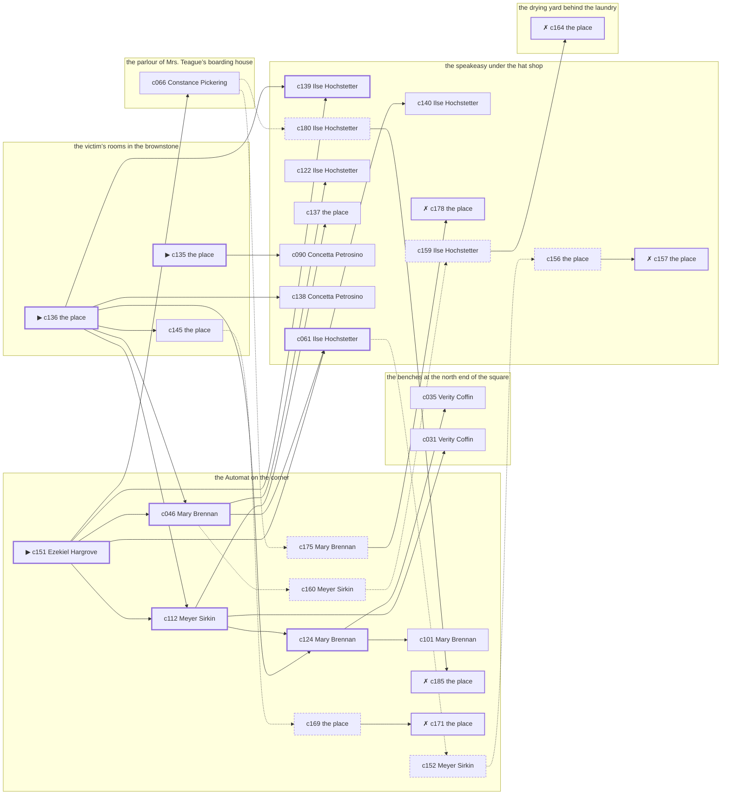

# Hell’s Kitchen — case 8

**Seed** 8 · **Difficulty** 2 · **Attempts** 1 · **Detective** Humphrey

**Par** 7 actions · **Budget** 20 · **Slack** 13 · **Findable** 30 (spine 8, corroboration 10, noise 7 + 5 disqualifiers) · **Noise ratio** 40% · **Candidate pool** 186

## 1. The Truth

Thomas Hanrahan, a ward heeler, a witness against the people the victim worked for, killed Vivian Dandridge, an heiress between marriages, with a gunshot at the victim’s rooms in the brownstone at 9:30 PM. Thomas Hanrahan needed the victim silent (silence-a-witness). Thomas Hanrahan had been at the speakeasy under the hat shop earlier in the evening, where the weapon lived, and was alone with Vivian Dandridge when it happened. Ezekiel Hargrove hired us.

## 2. Dramatis Personae

| Name | Role | Relationship | Class of secret | Motive | Found at | Killer |
| --- | --- | --- | --- | --- | --- | --- |
| Vivian Dandridge | an heiress between marriages | the victim | — | — | — | — |
| Ezekiel Hargrove (client) | the victim’s nephew, at loose ends | the victim’s cousin | secret-drinking | inheritance | the Automat on the corner | — |
| Thomas Hanrahan | a ward heeler | a witness against the people the victim worked for | murder | silence-a-witness | the Automat on the corner | **YES** |
| Concetta Petrosino | the owner of the block | the victim’s rival in trade | fence | revenge | the speakeasy under the hat shop | — |
| Verity Coffin | a private nurse | the victim’s private nurse | hidden-family | — | the benches at the north end of the square | — |
| Albrecht Lindemann | a doorman at a club with no sign on it | in the victim’s debt | fence | debt | the benches at the north end of the square | — |
| Mary Brennan | a switchboard operator | the victim’s tenant | hidden-family | — | the Automat on the corner | — |
| Ilse Hochstetter | the bartender | fixture (bartender) | — | — | the speakeasy under the hat shop | — |
| Constance Pickering | the landlady | fixture (landlady) | — | — | the parlour of Mrs. Teague’s boarding house | — |
| Meyer Sirkin | the man behind the counter | fixture (counterman) | — | — | the Automat on the corner | — |

## 3. Places

- **the speakeasy under the hat shop** (semi) — watched by bartender (Ilse Hochstetter); objects: a nickel-plated revolver, a silver cigarette case, a bottle of chloral drops — where the weapon lived; within earshot of the scene
- **the parlour of Mrs. Teague’s boarding house** (semi) — watched by landlady (Constance Pickering); objects: a wall telephone, a length of sash cord, a framed photograph
- **the drying yard behind the laundry** (private) — unwatched; objects: an ice pick, a mop and bucket
- **the victim’s rooms in the brownstone** (private) — unwatched; objects: a bronze bookend — **THE SCENE**; the victim’s address
- **the benches at the north end of the square** (public) — unwatched; objects: a brass umbrella stand, a folded stack of evening papers — within earshot of the scene
- **the Automat on the corner** (public) — watched by counterman (Meyer Sirkin); objects: none

## 4. Anchors

The coroner gives 8:30 PM–10:00 PM, four ticks wide. These are what close it: **bar-radio** and **church-bells**.

- **the fight card on the bar radio** — at 9:00 PM; at the speakeasy under the hat shop. Only those present know that the challenger went down in the fourth and the crowd booed it. You can time things by it: the set was turned up loud enough to carry into the street.
- **the bells at St. Malachy’s** — at 6:30 PM, 7:30 PM, 8:30 PM, 9:30 PM, 10:30 PM, 11:30 PM; across the whole neighbourhood. You can time things by it: the half hours are rung and the whole hours are rung twice.

## 5. Timelines

### Vivian Dandridge — the victim

| Tick | Time | Truth | Claimed | Companion claimed |
| --- | --- | --- | --- | --- |
| 0 | 6:00 PM | the speakeasy under the hat shop | the speakeasy under the hat shop | — |
| 1 | 6:30 PM | the speakeasy under the hat shop | the speakeasy under the hat shop | — |
| 2 | 7:00 PM | the victim’s rooms in the brownstone | the victim’s rooms in the brownstone | — |
| 3 | 7:30 PM | the victim’s rooms in the brownstone | the victim’s rooms in the brownstone | — |
| 4 | 8:00 PM | the victim’s rooms in the brownstone | the victim’s rooms in the brownstone | — |
| 5 | 8:30 PM | the victim’s rooms in the brownstone | the victim’s rooms in the brownstone | — |
| 6 | 9:00 PM | the speakeasy under the hat shop | the speakeasy under the hat shop | — |
| 7 | 9:30 PM | the victim’s rooms in the brownstone ☠ | the victim’s rooms in the brownstone | — |
| 8 | 10:00 PM | — | — | — |
| 9 | 10:30 PM | — | — | — |
| 10 | 11:00 PM | — | — | — |
| 11 | 11:30 PM | — | — | — |

### Ezekiel Hargrove

| Tick | Time | Truth | Claimed | Companion claimed |
| --- | --- | --- | --- | --- |
| 0 | 6:00 PM | the parlour of Mrs. Teague’s boarding house | the parlour of Mrs. Teague’s boarding house | — |
| 1 | 6:30 PM | the parlour of Mrs. Teague’s boarding house | the parlour of Mrs. Teague’s boarding house | — |
| 2 | 7:00 PM | the Automat on the corner | the Automat on the corner | — |
| 3 | 7:30 PM | the speakeasy under the hat shop | **the Automat on the corner** | — |
| 4 | 8:00 PM | the speakeasy under the hat shop | **the Automat on the corner** | — |
| 5 | 8:30 PM | the speakeasy under the hat shop | the speakeasy under the hat shop | — |
| 6 | 9:00 PM | the benches at the north end of the square | the benches at the north end of the square | — |
| 7 | 9:30 PM | the Automat on the corner | the Automat on the corner | — |
| 8 | 10:00 PM | the Automat on the corner | the Automat on the corner | — |
| 9 | 10:30 PM | the Automat on the corner | the Automat on the corner | — |
| 10 | 11:00 PM | the Automat on the corner | the Automat on the corner | — |
| 11 | 11:30 PM | the Automat on the corner | the Automat on the corner | — |

### Thomas Hanrahan — the killer

| Tick | Time | Truth | Claimed | Companion claimed |
| --- | --- | --- | --- | --- |
| 0 | 6:00 PM | the benches at the north end of the square | the benches at the north end of the square | — |
| 1 | 6:30 PM | the benches at the north end of the square | the benches at the north end of the square | — |
| 2 | 7:00 PM | the benches at the north end of the square | the benches at the north end of the square | — |
| 3 | 7:30 PM | the speakeasy under the hat shop | the speakeasy under the hat shop | — |
| 4 | 8:00 PM | the speakeasy under the hat shop | the speakeasy under the hat shop | — |
| 5 | 8:30 PM | the victim’s rooms in the brownstone | **the speakeasy under the hat shop** | Mary Brennan |
| 6 | 9:00 PM | the victim’s rooms in the brownstone | **the speakeasy under the hat shop** | Mary Brennan |
| 7 | 9:30 PM | the victim’s rooms in the brownstone ☠ | **the speakeasy under the hat shop** | Mary Brennan |
| 8 | 10:00 PM | the Automat on the corner | the Automat on the corner | — |
| 9 | 10:30 PM | the Automat on the corner | the Automat on the corner | — |
| 10 | 11:00 PM | the Automat on the corner | the Automat on the corner | — |
| 11 | 11:30 PM | the Automat on the corner | the Automat on the corner | — |

### Concetta Petrosino

| Tick | Time | Truth | Claimed | Companion claimed |
| --- | --- | --- | --- | --- |
| 0 | 6:00 PM | the speakeasy under the hat shop | the speakeasy under the hat shop | — |
| 1 | 6:30 PM | the drying yard behind the laundry | **the speakeasy under the hat shop** | — |
| 2 | 7:00 PM | the drying yard behind the laundry | the drying yard behind the laundry | — |
| 3 | 7:30 PM | the speakeasy under the hat shop | the speakeasy under the hat shop | — |
| 4 | 8:00 PM | the speakeasy under the hat shop | the speakeasy under the hat shop | — |
| 5 | 8:30 PM | the speakeasy under the hat shop | the speakeasy under the hat shop | — |
| 6 | 9:00 PM | the speakeasy under the hat shop | the speakeasy under the hat shop | — |
| 7 | 9:30 PM | the Automat on the corner | the Automat on the corner | — |
| 8 | 10:00 PM | the Automat on the corner | the Automat on the corner | — |
| 9 | 10:30 PM | the Automat on the corner | the Automat on the corner | — |
| 10 | 11:00 PM | the Automat on the corner | the Automat on the corner | — |
| 11 | 11:30 PM | the benches at the north end of the square | the benches at the north end of the square | — |

### Verity Coffin

| Tick | Time | Truth | Claimed | Companion claimed |
| --- | --- | --- | --- | --- |
| 0 | 6:00 PM | the benches at the north end of the square | the benches at the north end of the square | — |
| 1 | 6:30 PM | the benches at the north end of the square | the benches at the north end of the square | — |
| 2 | 7:00 PM | the benches at the north end of the square | the benches at the north end of the square | — |
| 3 | 7:30 PM | the benches at the north end of the square | the benches at the north end of the square | — |
| 4 | 8:00 PM | the speakeasy under the hat shop | the speakeasy under the hat shop | — |
| 5 | 8:30 PM | the speakeasy under the hat shop | the speakeasy under the hat shop | — |
| 6 | 9:00 PM | the benches at the north end of the square | the benches at the north end of the square | — |
| 7 | 9:30 PM | the Automat on the corner | **the speakeasy under the hat shop** | — |
| 8 | 10:00 PM | the Automat on the corner | the Automat on the corner | — |
| 9 | 10:30 PM | the Automat on the corner | the Automat on the corner | — |
| 10 | 11:00 PM | the Automat on the corner | the Automat on the corner | — |
| 11 | 11:30 PM | the Automat on the corner | the Automat on the corner | — |

### Albrecht Lindemann

| Tick | Time | Truth | Claimed | Companion claimed |
| --- | --- | --- | --- | --- |
| 0 | 6:00 PM | the drying yard behind the laundry | the drying yard behind the laundry | — |
| 1 | 6:30 PM | the parlour of Mrs. Teague’s boarding house | the parlour of Mrs. Teague’s boarding house | — |
| 2 | 7:00 PM | the victim’s rooms in the brownstone | the victim’s rooms in the brownstone | — |
| 3 | 7:30 PM | the victim’s rooms in the brownstone | the victim’s rooms in the brownstone | — |
| 4 | 8:00 PM | the victim’s rooms in the brownstone | the victim’s rooms in the brownstone | — |
| 5 | 8:30 PM | the benches at the north end of the square | the benches at the north end of the square | — |
| 6 | 9:00 PM | the drying yard behind the laundry | the drying yard behind the laundry | — |
| 7 | 9:30 PM | the speakeasy under the hat shop | **the Automat on the corner** | Thomas Hanrahan |
| 8 | 10:00 PM | the speakeasy under the hat shop | the speakeasy under the hat shop | — |
| 9 | 10:30 PM | the speakeasy under the hat shop | the speakeasy under the hat shop | — |
| 10 | 11:00 PM | the benches at the north end of the square | the benches at the north end of the square | — |
| 11 | 11:30 PM | the benches at the north end of the square | the benches at the north end of the square | — |

### Mary Brennan

| Tick | Time | Truth | Claimed | Companion claimed |
| --- | --- | --- | --- | --- |
| 0 | 6:00 PM | the speakeasy under the hat shop | the speakeasy under the hat shop | — |
| 1 | 6:30 PM | the Automat on the corner | **the parlour of Mrs. Teague’s boarding house** | — |
| 2 | 7:00 PM | the Automat on the corner | **the parlour of Mrs. Teague’s boarding house** | — |
| 3 | 7:30 PM | the speakeasy under the hat shop | the speakeasy under the hat shop | — |
| 4 | 8:00 PM | the Automat on the corner | the Automat on the corner | — |
| 5 | 8:30 PM | the Automat on the corner | the Automat on the corner | — |
| 6 | 9:00 PM | the Automat on the corner | the Automat on the corner | — |
| 7 | 9:30 PM | the Automat on the corner | the Automat on the corner | — |
| 8 | 10:00 PM | the Automat on the corner | the Automat on the corner | — |
| 9 | 10:30 PM | the Automat on the corner | the Automat on the corner | — |
| 10 | 11:00 PM | the Automat on the corner | the Automat on the corner | — |
| 11 | 11:30 PM | the parlour of Mrs. Teague’s boarding house | the parlour of Mrs. Teague’s boarding house | — |

### Fixtures (never lie, never withhold)

| Tick | Time | Ilse Hochstetter (the bartender) | Constance Pickering (the landlady) | Meyer Sirkin (the man behind the counter) |
| --- | --- | --- | --- | --- |
| 0 | 6:00 PM | the speakeasy under the hat shop | the parlour of Mrs. Teague’s boarding house | the Automat on the corner |
| 1 | 6:30 PM | the parlour of Mrs. Teague’s boarding house | the parlour of Mrs. Teague’s boarding house | the Automat on the corner |
| 2 | 7:00 PM | the speakeasy under the hat shop | the parlour of Mrs. Teague’s boarding house | the Automat on the corner |
| 3 | 7:30 PM | the speakeasy under the hat shop | the parlour of Mrs. Teague’s boarding house | the Automat on the corner |
| 4 | 8:00 PM | the speakeasy under the hat shop | the parlour of Mrs. Teague’s boarding house | the Automat on the corner |
| 5 | 8:30 PM | the speakeasy under the hat shop | the parlour of Mrs. Teague’s boarding house | the Automat on the corner |
| 6 | 9:00 PM | the speakeasy under the hat shop | the parlour of Mrs. Teague’s boarding house | the Automat on the corner |
| 7 | 9:30 PM | the speakeasy under the hat shop | the speakeasy under the hat shop | the Automat on the corner |
| 8 | 10:00 PM | the speakeasy under the hat shop | the parlour of Mrs. Teague’s boarding house | the Automat on the corner |
| 9 | 10:30 PM | the speakeasy under the hat shop | the parlour of Mrs. Teague’s boarding house | the Automat on the corner |
| 10 | 11:00 PM | the speakeasy under the hat shop | the parlour of Mrs. Teague’s boarding house | the Automat on the corner |
| 11 | 11:30 PM | the speakeasy under the hat shop | the parlour of Mrs. Teague’s boarding house | the Automat on the corner |

## 6. Secrets in play

- **Ezekiel Hargrove** (secret-drinking): Ezekiel Hargrove drinks alone at the speakeasy under the hat shop from 7:30 PM to 8:00 PM and will claim to have been anywhere else.
- **Thomas Hanrahan** (murder): Thomas Hanrahan is at the victim’s rooms in the brownstone from 8:30 PM to 9:30 PM, alone with Vivian Dandridge when it happens at 9:30 PM.
- **Concetta Petrosino** (fence): Concetta Petrosino hands a parcel of stolen goods to a man at the drying yard behind the laundry from 6:30 PM.
- **Verity Coffin** (hidden-family): Verity Coffin goes to the Automat on the corner from 9:30 PM to see a child nobody is supposed to know about.
- **Albrecht Lindemann** (fence): Albrecht Lindemann hands a parcel of stolen goods to a man at the speakeasy under the hat shop from 9:30 PM.
- **Mary Brennan** (hidden-family): Mary Brennan goes to the Automat on the corner from 6:30 PM to 7:00 PM to see a child nobody is supposed to know about.

## 7. Clue list — the 30 findable

The opening three, free at the start: c135, c136, c151. Everything else has to be led to. The full candidate pool is in the companion file.

### At the speakeasy under the hat shop

- **c139** [spine] (anchor; Ilse Hochstetter on Vivian Dandridge that evening) → (end)
  - Ilse Hochstetter puts Vivian Dandridge at the speakeasy under the hat shop while the fight was on the radio, which was 9:00 PM, and alive enough to argue about the weather.
  - _establishes: the victim alive at 9:00 PM; Vivian Dandridge at the speakeasy under the hat shop, 9:00 PM_
- **c061** [spine] (observation; Ilse Hochstetter on Albrecht Lindemann) → c140, c152
  - Ilse Hochstetter says Albrecht Lindemann was at the speakeasy under the hat shop from 9:30 PM to 10:30 PM.
  - _establishes: Albrecht Lindemann at the speakeasy under the hat shop, 9:30 PM–10:30 PM_
- **c122** [corroboration] (observation; Ilse Hochstetter on Thomas Hanrahan’s account) → (end)
  - Ilse Hochstetter was at the speakeasy under the hat shop from 8:30 PM to 9:30 PM and says Thomas Hanrahan was not.
  - _establishes: Thomas Hanrahan not at the speakeasy under the hat shop, 8:30 PM–9:30 PM_
- **c137** [corroboration] (physical; the place itself) → (end)
  - A nickel-plated revolver is gone from the speakeasy under the hat shop. The drawer it was kept in is open and the oiled cloth is still in it.
  - _establishes: something gone from the speakeasy under the hat shop; how it was done_
- **c090** [corroboration] (observation; Concetta Petrosino on who was there at 9:30 PM) → (end)
  - Concetta Petrosino runs through it: at 9:30 PM there were Ezekiel Hargrove, Verity Coffin, Mary Brennan at the Automat on the corner, and nobody else worth naming.
  - _establishes: Ezekiel Hargrove at the Automat on the corner, 9:30 PM; Verity Coffin at the Automat on the corner, 9:30 PM; Mary Brennan at the Automat on the corner, 9:30 PM_
- **c138** [corroboration] (anchor; Concetta Petrosino on Vivian Dandridge that evening) → (end)
  - Concetta Petrosino puts Vivian Dandridge at the speakeasy under the hat shop while the fight was on the radio, which was 9:00 PM, and alive enough to argue about the weather.
  - _establishes: the victim alive at 9:00 PM; Vivian Dandridge at the speakeasy under the hat shop, 9:00 PM_
- **c140** [corroboration] (anchor; Ilse Hochstetter on the noise that evening) → (end)
  - Ilse Hochstetter was at the speakeasy under the hat shop at 9:30 PM and heard a shot from the direction of the victim’s rooms in the brownstone, as the bells were going.
  - _establishes: noise at the victim’s rooms in the brownstone at 9:30 PM; the victim dead by 9:30 PM; how it was done_
- **c180** [noise {b1}] (overheard; Ilse Hochstetter on Mary Brennan) → c185
  - Ilse Hochstetter on Mary Brennan: Mary Brennan sends money out of every pay envelope and cannot say where it goes.
  - _establishes: context only_
- **c178** [disqualifier {b2}] (overheard; the place itself) → (end)
  - The receiver at the speakeasy under the hat shop would rather talk than be held: Albrecht Lindemann was there from 9:30 PM handing over a parcel of somebody else’s silver, which is a charge Albrecht Lindemann will take over this one.
  - _establishes: Albrecht Lindemann’s fence accounted for; Albrecht Lindemann at the speakeasy under the hat shop, 9:30 PM_
- **c159** [noise {b4}] (overheard; Ilse Hochstetter on Concetta Petrosino) → c164
  - Ilse Hochstetter on Concetta Petrosino: Concetta Petrosino was carrying a parcel into the drying yard behind the laundry and came out without it.
  - _establishes: context only_
- **c156** [noise {b5}] (physical; the place itself) → c157
  - A tab at the speakeasy under the hat shop in a name that is not Ezekiel Hargrove’s, in Ezekiel Hargrove’s handwriting.
  - _establishes: context only_
- **c157** [disqualifier {b5}] (overheard; the place itself) → (end)
  - The man behind the counter at the speakeasy under the hat shop knows exactly: Ezekiel Hargrove was on the same stool from 7:30 PM to 8:00 PM and was in no condition to walk anywhere, let alone do this.
  - _establishes: Ezekiel Hargrove’s secret-drinking accounted for; Ezekiel Hargrove at the speakeasy under the hat shop, 7:30 PM–8:00 PM_

### At the parlour of Mrs. Teague’s boarding house

- **c066** [corroboration] (observation; Constance Pickering on Albrecht Lindemann) → c180, c175
  - Constance Pickering says Albrecht Lindemann was at the speakeasy under the hat shop at 9:30 PM.
  - _establishes: Albrecht Lindemann at the speakeasy under the hat shop, 9:30 PM_

### At the drying yard behind the laundry

- **c164** [disqualifier {b4}] (overheard; the place itself) → (end)
  - The receiver at the drying yard behind the laundry would rather talk than be held: Concetta Petrosino was there from 6:30 PM handing over a parcel of somebody else’s silver, which is a charge Concetta Petrosino will take over this one.
  - _establishes: Concetta Petrosino’s fence accounted for; Concetta Petrosino at the drying yard behind the laundry, 6:30 PM_

### At the victim’s rooms in the brownstone

- **c135** [spine ⟨opening⟩] (scene; the place itself) → c090
  - Vivian Dandridge was found at the victim’s rooms in the brownstone. The cigarette he had going burned itself out on the sill where it fell. The bells at St. Malachy’s came at 9:30 PM, and the bells fix it: the sexton rings them off the sacristy clock and it keeps good time. That puts the killing in that half hour and no later.
  - _establishes: the victim dead by 9:30 PM; how it was done_
- **c136** [spine ⟨opening⟩] (morgue; the place itself) → c112, c124, c046, c139, c145, c138
  - The coroner puts death between 8:30 PM and 10:00 PM — two hours of nothing useful. One bullet below the sternum. Powder burns on the shirt front: fired close.
  - _establishes: death between 8:30 PM and 10:00 PM; how it was done_
- **c145** [corroboration] (document; the place itself) → c169
  - Found at the victim’s rooms in the brownstone: A subpoena naming Vivian Dandridge before the grand jury, with Thomas Hanrahan’s name written in the margin.
  - _establishes: Thomas Hanrahan had a motive (silence-a-witness)_

### At the benches at the north end of the square

- **c035** [corroboration] (observation; Verity Coffin on Thomas Hanrahan) → (end)
  - Verity Coffin says Thomas Hanrahan was at the speakeasy under the hat shop at 8:00 PM.
  - _establishes: Thomas Hanrahan at the speakeasy under the hat shop, 8:00 PM; Thomas Hanrahan could reach the weapon_
- **c031** [corroboration] (observation; Verity Coffin on Ezekiel Hargrove) → (end)
  - Verity Coffin says Ezekiel Hargrove was at the speakeasy under the hat shop from 8:00 PM to 8:30 PM.
  - _establishes: Ezekiel Hargrove at the speakeasy under the hat shop, 8:00 PM–8:30 PM; Ezekiel Hargrove could reach the weapon_

### At the Automat on the corner

- **c151** [spine ⟨opening⟩] (client; Ezekiel Hargrove on why I was hired) → c112, c046, c139, c061, c066
  - Ezekiel Hargrove hired us. Ezekiel Hargrove wants it known that Thomas Hanrahan needed the victim silent, and would rather we started there.
  - _establishes: Thomas Hanrahan had a motive (silence-a-witness)_
- **c112** [spine] (observation; Meyer Sirkin on who was there at 9:30 PM) → c124, c137, c031
  - Meyer Sirkin runs through it: at 9:30 PM there were Ezekiel Hargrove, Concetta Petrosino, Verity Coffin, Mary Brennan at the Automat on the corner, and nobody else worth naming.
  - _establishes: Ezekiel Hargrove at the Automat on the corner, 9:30 PM; Concetta Petrosino at the Automat on the corner, 9:30 PM; Verity Coffin at the Automat on the corner, 9:30 PM; Mary Brennan at the Automat on the corner, 9:30 PM_
- **c124** [spine] (observation; Mary Brennan on Thomas Hanrahan’s account) → c101, c035
  - Thomas Hanrahan says Mary Brennan was there for it. Mary Brennan says otherwise: Mary Brennan was at the Automat on the corner from 8:30 PM to 9:30 PM, nowhere near the speakeasy under the hat shop.
  - _establishes: Thomas Hanrahan not at the speakeasy under the hat shop, 8:30 PM–9:30 PM_
- **c046** [spine] (observation; Mary Brennan on Thomas Hanrahan) → c061, c122, c160
  - Mary Brennan says Thomas Hanrahan was at the speakeasy under the hat shop at 7:30 PM.
  - _establishes: Thomas Hanrahan at the speakeasy under the hat shop, 7:30 PM; Thomas Hanrahan could reach the weapon_
- **c101** [corroboration] (observation; Mary Brennan on who was there at 9:30 PM) → (end)
  - Mary Brennan runs through it: at 9:30 PM there were Ezekiel Hargrove, Concetta Petrosino, Verity Coffin at the Automat on the corner, and nobody else worth naming.
  - _establishes: Ezekiel Hargrove at the Automat on the corner, 9:30 PM; Concetta Petrosino at the Automat on the corner, 9:30 PM; Verity Coffin at the Automat on the corner, 9:30 PM_
- **c185** [disqualifier {b1}] (overheard; the place itself) → (end)
  - The woman who keeps the child says it straight out: Mary Brennan was at the Automat on the corner from 6:30 PM to 7:00 PM, the same as every week, and left with the same face as always.
  - _establishes: Mary Brennan’s hidden-family accounted for; Mary Brennan at the Automat on the corner, 6:30 PM–7:00 PM_
- **c175** [noise {b2}] (overheard; Mary Brennan on Albrecht Lindemann) → c178
  - Mary Brennan on Albrecht Lindemann: Albrecht Lindemann has been selling things that were never Albrecht Lindemann’s to sell.
  - _establishes: context only_
- **c169** [noise {b3}] (physical; the place itself) → c171
  - A board-and-keep receipt at the Automat on the corner, monthly, eight years of them.
  - _establishes: context only_
- **c171** [disqualifier {b3}] (overheard; the place itself) → (end)
  - The woman who keeps the child says it straight out: Verity Coffin was at the Automat on the corner from 9:30 PM, the same as every week, and left with the same face as always.
  - _establishes: Verity Coffin’s hidden-family accounted for; Verity Coffin at the Automat on the corner, 9:30 PM_
- **c160** [noise {b4}] (overheard; Meyer Sirkin on Concetta Petrosino) → c159
  - Meyer Sirkin on Concetta Petrosino: There is a man who meets people at the drying yard behind the laundry and nobody will say his name out loud.
  - _establishes: context only_
- **c152** [noise {b5}] (overheard; Meyer Sirkin on Ezekiel Hargrove) → c156
  - Meyer Sirkin on Ezekiel Hargrove: Ezekiel Hargrove had taken a drink and had gone to some trouble about the smell of it.
  - _establishes: context only_

## 8. Clue graph

## 9. Deduction path

Par is **7 actions** against a budget of 20: 13 spare. Every id below is a spine clue.

**Time of death.** The coroner gives four ticks. The anchors close it to 9:30 PM: one puts Vivian Dandridge alive at 9:00 PM, the other times the scene at 9:30 PM. _(c136, c139, c135; + 2 corroborating)_

**Clearing the innocent.**

- Ezekiel Hargrove was not at the victim’s rooms in the brownstone at 9:30 PM, on two independent sources. _(c112; + 2 corroborating)_
- Concetta Petrosino was not at the victim’s rooms in the brownstone at 9:30 PM, on two independent sources. _(c112; + 1 corroborating)_
- Verity Coffin was not at the victim’s rooms in the brownstone at 9:30 PM, on two independent sources. _(c112; + 3 corroborating)_
- Albrecht Lindemann was not at the victim’s rooms in the brownstone at 9:30 PM, on two independent sources. _(c061; + 2 corroborating)_
- Mary Brennan was not at the victim’s rooms in the brownstone at 9:30 PM, on two independent sources. _(c112; + 1 corroborating)_

**Naming the killer.** Thomas Hanrahan claims the speakeasy under the hat shop at 9:30 PM. Two independent sources put that out of the question. _(c124; + 1 corroborating)_

**The weapon.** Thomas Hanrahan was at the speakeasy under the hat shop before 9:30 PM, where a nickel-plated revolver was kept. _(c046; + 1 corroborating)_

**Method.** A gunshot, on two physical sources. _(c135, c136; + 2 corroborating)_

**Motive.** silence-a-witness, on two independent sources. _(c151; + 1 corroborating)_

## 10. Red herrings

**Innocents who lie about the murder tick:**

- Verity Coffin claims the speakeasy under the hat shop at 9:30 PM and was really at the Automat on the corner. Reason: Verity Coffin goes to the Automat on the corner from 9:30 PM to see a child nobody is supposed to know about.
- Albrecht Lindemann claims the Automat on the corner at 9:30 PM and was really at the speakeasy under the hat shop. Reason: Albrecht Lindemann hands a parcel of stolen goods to a man at the speakeasy under the hat shop from 9:30 PM.

**Innocents with a motive:**

- Ezekiel Hargrove — inheritance: stands to inherit.
- Concetta Petrosino — revenge: blamed the victim for a ruin.
- Albrecht Lindemann — debt: owed the victim money.

**Noise branches, and what knocks each one down:**

- **b1** (Mary Brennan, hidden-family): c180 → **c185** — The woman who keeps the child says it straight out: Mary Brennan was at the Automat on the corner from 6:30 PM to 7:00 PM, the same as every week, and left with the same face as always.
- **b2** (Albrecht Lindemann, fence): c175 → **c178** — The receiver at the speakeasy under the hat shop would rather talk than be held: Albrecht Lindemann was there from 9:30 PM handing over a parcel of somebody else’s silver, which is a charge Albrecht Lindemann will take over this one.
- **b3** (Verity Coffin, hidden-family): c169 → **c171** — The woman who keeps the child says it straight out: Verity Coffin was at the Automat on the corner from 9:30 PM, the same as every week, and left with the same face as always.
- **b4** (Concetta Petrosino, fence): c160 → c159 → **c164** — The receiver at the drying yard behind the laundry would rather talk than be held: Concetta Petrosino was there from 6:30 PM handing over a parcel of somebody else’s silver, which is a charge Concetta Petrosino will take over this one.
- **b5** (Ezekiel Hargrove, secret-drinking): c152 → c156 → **c157** — The man behind the counter at the speakeasy under the hat shop knows exactly: Ezekiel Hargrove was on the same stool from 7:30 PM to 8:00 PM and was in no condition to walk anywhere, let alone do this.

