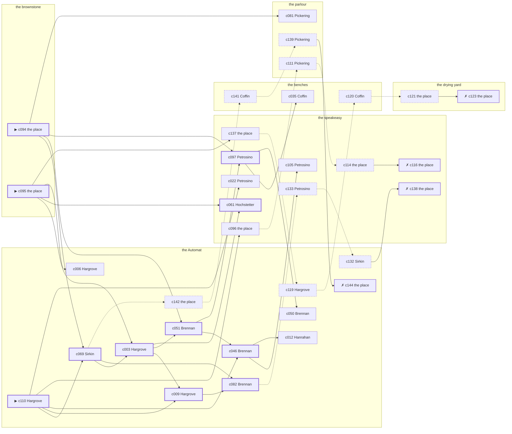

# Hell’s Kitchen — case 8

**Seed** 8 · **Difficulty** 2 · **Attempts** 1 · **Detective** Dashiell

**Par** 10 actions · **Slack** 6 · **Budget** 16 · **Findable** 34 (spine 11, corroboration 9, noise 10 + 4 disqualifiers) · **Noise ratio** 41% · **Candidate pool** 145

## 1. The Truth

Thomas Hanrahan, a ward heeler, a witness against the people the victim worked for, killed Vivian Dandridge, an heiress between marriages, with a gunshot at the brownstone at 9:30 PM. Hanrahan needed the victim silent (silence-a-witness). Hanrahan had been at the speakeasy earlier in the evening, where the weapon lived, and was alone with Dandridge when it happened. Hargrove hired us.

## 2. Dramatis Personae

| Name | Role | Relationship | Class of secret | Motive | Found at | Killer |
| --- | --- | --- | --- | --- | --- | --- |
| Vivian Dandridge | an heiress between marriages | the victim | — | — | — | — |
| Ezekiel Hargrove (client) | a young man living on expectations | the victim’s cousin | secret-drinking | inheritance | the Automat | — |
| Thomas Hanrahan | a ward heeler | a witness against the people the victim worked for | murder | silence-a-witness | the Automat | **YES** |
| Concetta Petrosino | the owner of the block | the victim’s business partner | fence | property | the speakeasy | — |
| Verity Coffin | a private nurse | the victim’s private nurse | hidden-family | — | the benches | — |
| Albrecht Lindemann | a doorman at a club with no sign on it | in the victim’s debt | fence | debt | the benches | — |
| Mary Brennan | a switchboard operator | the victim’s tenant | hidden-family | — | the Automat | — |
| Ilse Hochstetter | the bartender | fixture (bartender) | — | — | the speakeasy | — |
| Constance Pickering | the landlady | fixture (landlady) | — | — | the parlour | — |
| Meyer Sirkin | the man behind the counter | fixture (counterman) | — | — | the Automat | — |

## 3. Places

- **the speakeasy under the hat shop** (semi) — watched by bartender (Hochstetter); objects: a nickel-plated revolver, a silver cigarette case, a bottle of chloral drops — where the weapon lived; within earshot of the scene
- **the parlour of Mrs. Teague’s boarding house** (semi) — watched by landlady (Pickering); objects: a wall telephone, a length of sash cord, a framed photograph
- **the drying yard behind the laundry** (private) — unwatched; objects: an ice pick, a mop and bucket
- **the victim’s rooms in the brownstone** (private) — unwatched; objects: a bronze bookend — **THE SCENE**; the victim’s address
- **the benches at the north end of the square** (public) — unwatched; objects: a brass umbrella stand, a folded stack of evening papers — within earshot of the scene
- **the Automat on the corner** (public) — watched by counterman (Sirkin); objects: none

## 4. Anchors

The coroner gives 8:30 PM–10:00 PM, four ticks wide. These are what close it: **bar-radio** and **church-bells**.

- **the fight card on the bar radio** — at 9:00 PM; at the speakeasy. Only those present know that the challenger went down in the fourth and the crowd booed it. You can time things by it: the set was turned up loud enough to carry into the street.
- **the bells at St. Malachy’s** — at 6:30 PM, 7:30 PM, 8:30 PM, 9:30 PM, 10:30 PM, 11:30 PM; across the whole neighbourhood. You can time things by it: the half hours are rung and the whole hours are rung twice.

## 5. Timelines

### Dandridge — the victim

| Tick | Time | Truth | Claimed | Companion claimed |
| --- | --- | --- | --- | --- |
| 0 | 6:00 PM | the speakeasy | the speakeasy | — |
| 1 | 6:30 PM | the speakeasy | the speakeasy | — |
| 2 | 7:00 PM | the brownstone | the brownstone | — |
| 3 | 7:30 PM | the brownstone | the brownstone | — |
| 4 | 8:00 PM | the brownstone | the brownstone | — |
| 5 | 8:30 PM | the brownstone | the brownstone | — |
| 6 | 9:00 PM | the speakeasy | the speakeasy | — |
| 7 | 9:30 PM | the brownstone ☠ | the brownstone | — |
| 8 | 10:00 PM | — | — | — |
| 9 | 10:30 PM | — | — | — |
| 10 | 11:00 PM | — | — | — |
| 11 | 11:30 PM | — | — | — |

### Hargrove

| Tick | Time | Truth | Claimed | Companion claimed |
| --- | --- | --- | --- | --- |
| 0 | 6:00 PM | the parlour | the parlour | — |
| 1 | 6:30 PM | the parlour | the parlour | — |
| 2 | 7:00 PM | the Automat | the Automat | — |
| 3 | 7:30 PM | the speakeasy | **the Automat** | — |
| 4 | 8:00 PM | the speakeasy | **the Automat** | — |
| 5 | 8:30 PM | the speakeasy | the speakeasy | — |
| 6 | 9:00 PM | the benches | the benches | — |
| 7 | 9:30 PM | the Automat | the Automat | — |
| 8 | 10:00 PM | the Automat | the Automat | — |
| 9 | 10:30 PM | the Automat | the Automat | — |
| 10 | 11:00 PM | the Automat | the Automat | — |
| 11 | 11:30 PM | the Automat | the Automat | — |

### Hanrahan — the killer

| Tick | Time | Truth | Claimed | Companion claimed |
| --- | --- | --- | --- | --- |
| 0 | 6:00 PM | the benches | the benches | — |
| 1 | 6:30 PM | the benches | the benches | — |
| 2 | 7:00 PM | the benches | the benches | — |
| 3 | 7:30 PM | the speakeasy | the speakeasy | — |
| 4 | 8:00 PM | the speakeasy | the speakeasy | — |
| 5 | 8:30 PM | the brownstone | **the speakeasy** | Brennan |
| 6 | 9:00 PM | the brownstone | **the speakeasy** | Brennan |
| 7 | 9:30 PM | the brownstone ☠ | **the speakeasy** | Brennan |
| 8 | 10:00 PM | the Automat | the Automat | — |
| 9 | 10:30 PM | the Automat | the Automat | — |
| 10 | 11:00 PM | the Automat | the Automat | — |
| 11 | 11:30 PM | the Automat | the Automat | — |

### Petrosino

| Tick | Time | Truth | Claimed | Companion claimed |
| --- | --- | --- | --- | --- |
| 0 | 6:00 PM | the speakeasy | the speakeasy | — |
| 1 | 6:30 PM | the drying yard | **the speakeasy** | — |
| 2 | 7:00 PM | the drying yard | the drying yard | — |
| 3 | 7:30 PM | the speakeasy | the speakeasy | — |
| 4 | 8:00 PM | the speakeasy | the speakeasy | — |
| 5 | 8:30 PM | the speakeasy | the speakeasy | — |
| 6 | 9:00 PM | the speakeasy | the speakeasy | — |
| 7 | 9:30 PM | the Automat | the Automat | — |
| 8 | 10:00 PM | the Automat | the Automat | — |
| 9 | 10:30 PM | the Automat | the Automat | — |
| 10 | 11:00 PM | the Automat | the Automat | — |
| 11 | 11:30 PM | the benches | the benches | — |

### Coffin

| Tick | Time | Truth | Claimed | Companion claimed |
| --- | --- | --- | --- | --- |
| 0 | 6:00 PM | the benches | the benches | — |
| 1 | 6:30 PM | the benches | the benches | — |
| 2 | 7:00 PM | the benches | the benches | — |
| 3 | 7:30 PM | the benches | the benches | — |
| 4 | 8:00 PM | the speakeasy | the speakeasy | — |
| 5 | 8:30 PM | the speakeasy | the speakeasy | — |
| 6 | 9:00 PM | the benches | the benches | — |
| 7 | 9:30 PM | the Automat | **the speakeasy** | — |
| 8 | 10:00 PM | the Automat | the Automat | — |
| 9 | 10:30 PM | the Automat | the Automat | — |
| 10 | 11:00 PM | the Automat | the Automat | — |
| 11 | 11:30 PM | the Automat | the Automat | — |

### Lindemann

| Tick | Time | Truth | Claimed | Companion claimed |
| --- | --- | --- | --- | --- |
| 0 | 6:00 PM | the drying yard | the drying yard | — |
| 1 | 6:30 PM | the parlour | the parlour | — |
| 2 | 7:00 PM | the brownstone | the brownstone | — |
| 3 | 7:30 PM | the brownstone | the brownstone | — |
| 4 | 8:00 PM | the brownstone | the brownstone | — |
| 5 | 8:30 PM | the benches | the benches | — |
| 6 | 9:00 PM | the drying yard | the drying yard | — |
| 7 | 9:30 PM | the speakeasy | **the Automat** | Hanrahan |
| 8 | 10:00 PM | the speakeasy | the speakeasy | — |
| 9 | 10:30 PM | the speakeasy | the speakeasy | — |
| 10 | 11:00 PM | the benches | the benches | — |
| 11 | 11:30 PM | the benches | the benches | — |

### Brennan

| Tick | Time | Truth | Claimed | Companion claimed |
| --- | --- | --- | --- | --- |
| 0 | 6:00 PM | the speakeasy | the speakeasy | — |
| 1 | 6:30 PM | the Automat | **the parlour** | — |
| 2 | 7:00 PM | the Automat | **the parlour** | — |
| 3 | 7:30 PM | the speakeasy | the speakeasy | — |
| 4 | 8:00 PM | the Automat | the Automat | — |
| 5 | 8:30 PM | the Automat | the Automat | — |
| 6 | 9:00 PM | the Automat | the Automat | — |
| 7 | 9:30 PM | the Automat | the Automat | — |
| 8 | 10:00 PM | the Automat | the Automat | — |
| 9 | 10:30 PM | the Automat | the Automat | — |
| 10 | 11:00 PM | the Automat | the Automat | — |
| 11 | 11:30 PM | the parlour | the parlour | — |

### Fixtures (never lie, never withhold)

| Tick | Time | Hochstetter (the bartender) | Pickering (the landlady) | Sirkin (the man behind the counter) |
| --- | --- | --- | --- | --- |
| 0 | 6:00 PM | the speakeasy | the parlour | the Automat |
| 1 | 6:30 PM | the parlour | the parlour | the Automat |
| 2 | 7:00 PM | the speakeasy | the parlour | the Automat |
| 3 | 7:30 PM | the speakeasy | the parlour | the Automat |
| 4 | 8:00 PM | the speakeasy | the parlour | the Automat |
| 5 | 8:30 PM | the speakeasy | the parlour | the Automat |
| 6 | 9:00 PM | the speakeasy | the parlour | the Automat |
| 7 | 9:30 PM | the speakeasy | the speakeasy | the Automat |
| 8 | 10:00 PM | the speakeasy | the parlour | the Automat |
| 9 | 10:30 PM | the speakeasy | the parlour | the Automat |
| 10 | 11:00 PM | the speakeasy | the parlour | the Automat |
| 11 | 11:30 PM | the speakeasy | the parlour | the Automat |

## 6. Secrets in play

- **Hargrove** (secret-drinking): Hargrove drinks alone at the speakeasy from 7:30 PM to 8:00 PM and will claim to have been anywhere else.
- **Hanrahan** (murder): Hanrahan is at the brownstone from 8:30 PM to 9:30 PM, alone with Dandridge when it happens at 9:30 PM.
- **Petrosino** (fence): Petrosino hands a parcel of stolen goods to a man at the drying yard from 6:30 PM.
- **Coffin** (hidden-family): Coffin goes to the Automat from 9:30 PM to see a child nobody is supposed to know about.
- **Lindemann** (fence): Lindemann hands a parcel of stolen goods to a man at the speakeasy from 9:30 PM.
- **Brennan** (hidden-family): Brennan goes to the Automat from 6:30 PM to 7:00 PM to see a child nobody is supposed to know about.

## 7. Clue list — the 34 findable

The opening three, free at the start: c094, c095, c110. Everything else has to be led to. The full candidate pool is in the companion file.

### At the speakeasy

- **c097** [spine] (anchor; Petrosino on Dandridge that evening) → c035, c050
  - Petrosino puts Dandridge at the speakeasy while the fight was on the radio, which was 9:00 PM, and alive enough to argue about the weather.
  - _establishes: the victim alive at 9:00 PM; Dandridge at the speakeasy, 9:00 PM_
- **c061** [spine] (observation; Hochstetter on Lindemann) → (end)
  - Hochstetter says Lindemann was at the speakeasy from 9:30 PM to 10:30 PM.
  - _establishes: Lindemann at the speakeasy, 9:30 PM–10:30 PM_
- **c105** [corroboration] (overheard; Petrosino on Hanrahan and Dandridge) → (end)
  - Petrosino says Dandridge said to Hanrahan that a man who testifies sleeps better.
  - _establishes: Hanrahan had a motive (silence-a-witness)_
- **c096** [corroboration] (physical; the place itself) → c111
  - A nickel-plated revolver is gone from the speakeasy. The drawer it was kept in is open and the oiled cloth is still in it.
  - _establishes: something gone from the speakeasy; how it was done_
- **c022** [corroboration] (observation; Petrosino on Hargrove) → (end)
  - Petrosino says Hargrove was at the Automat from 9:30 PM to 11:00 PM.
  - _establishes: Hargrove at the Automat, 9:30 PM–11:00 PM_
- **c137** [corroboration] (overheard; the place itself) → c119
  - The receiver at the speakeasy would rather talk than be held: Lindemann was there from 9:30 PM handing over a parcel of somebody else’s silver, which is a charge Lindemann will take over this one.
  - _establishes: Lindemann’s fence accounted for; Lindemann at the speakeasy, 9:30 PM_
- **c114** [noise {b3}] (physical; the place itself) → c116
  - A bottle at the speakeasy pushed behind the pipes, the seal broken and the level down.
  - _establishes: context only_
- **c116** [disqualifier {b3}] (overheard; the place itself) → (end)
  - The man behind the counter at the speakeasy knows exactly: Hargrove was on the same stool from 7:30 PM to 8:00 PM and was in no condition to walk anywhere, let alone do this.
  - _establishes: Hargrove’s secret-drinking accounted for; Hargrove at the speakeasy, 7:30 PM–8:00 PM_
- **c133** [noise {b4}] (overheard; Petrosino on Lindemann) → c132
  - Petrosino on Lindemann: There is a man who meets people at the speakeasy and nobody will say his name out loud.
  - _establishes: context only_
- **c138** [disqualifier {b4}] (overheard; the place itself) → (end)
  - The goods turn up, tagged and dated, and the tag puts Lindemann at the speakeasy from 9:30 PM with both hands full.
  - _establishes: Lindemann’s fence accounted for; Lindemann at the speakeasy, 9:30 PM_

### At the parlour

- **c081** [corroboration] (observation; Pickering on Hanrahan’s account) → (end)
  - Pickering was at the speakeasy at 9:30 PM and says Hanrahan was not.
  - _establishes: Hanrahan not at the speakeasy, 9:30 PM_
- **c139** [noise {b1}] (overheard; Pickering on Brennan) → c144
  - Pickering on Brennan: Brennan sends money out of every pay envelope and cannot say where it goes.
  - _establishes: context only_
- **c111** [noise {b3}] (overheard; Pickering on Hargrove) → c114
  - Pickering on Hargrove: Hargrove had taken a drink and had gone to some trouble about the smell of it.
  - _establishes: context only_

### At the drying yard

- **c121** [noise {b2}] (physical; the place itself) → c123
  - Wrapping paper and a cut string at the drying yard, and the shop it came from closed two years ago.
  - _establishes: context only_
- **c123** [disqualifier {b2}] (overheard; the place itself) → (end)
  - The receiver at the drying yard would rather talk than be held: Petrosino was there from 6:30 PM handing over a parcel of somebody else’s silver, which is a charge Petrosino will take over this one.
  - _establishes: Petrosino’s fence accounted for; Petrosino at the drying yard, 6:30 PM_

### At the brownstone

- **c094** [spine ⟨opening⟩] (scene; the place itself) → c069, c051, c097, c081
  - Dandridge was found at the brownstone. The cigarette he had going burned itself out on the sill where it fell. The bells rang the half hour at 9:30 PM. The sexton rings them off the sacristy clock and it keeps good time.
  - _establishes: the victim dead by 9:30 PM; how it was done_
- **c095** [spine ⟨opening⟩] (morgue; the place itself) → c003, c061, c006, c137
  - The coroner puts death between 8:30 PM and 10:00 PM — two hours of nothing useful. One bullet below the sternum. Powder burns on the shirt front: fired close.
  - _establishes: death between 8:30 PM and 10:00 PM; how it was done_

### At the benches

- **c035** [corroboration] (observation; Coffin on Hanrahan) → (end)
  - Coffin says Hanrahan was at the speakeasy at 8:00 PM.
  - _establishes: Hanrahan at the speakeasy, 8:00 PM; Hanrahan could reach the weapon_
- **c141** [noise {b1}] (overheard; Coffin on Brennan) → c139
  - Coffin on Brennan: Brennan keeps a photograph and will not be asked about it twice.
  - _establishes: context only_
- **c120** [noise {b2}] (overheard; Coffin on Petrosino) → c121
  - Coffin on Petrosino: Petrosino has been selling things that were never Petrosino’s to sell.
  - _establishes: context only_

### At the Automat

- **c110** [spine ⟨opening⟩] (client; Hargrove on why I was hired) → c069, c009, c046, c096, c022
  - Hargrove hired us, and wants it known that Hanrahan needed the victim silent, and would rather we started there.
  - _establishes: Hanrahan had a motive (silence-a-witness)_
- **c069** [spine] (observation; Sirkin on Hargrove) → c003, c082, c142
  - Sirkin says Hargrove was at the Automat from 9:30 PM to 11:30 PM.
  - _establishes: Hargrove at the Automat, 9:30 PM–11:30 PM_
- **c003** [spine] (observation; Hargrove on Petrosino) → c009, c051, c061
  - Hargrove says Petrosino was at the Automat from 9:30 PM to 11:00 PM.
  - _establishes: Petrosino at the Automat, 9:30 PM–11:00 PM_
- **c009** [spine] (observation; Hargrove on Brennan) → c082
  - Hargrove says Brennan was at the Automat from 9:30 PM to 11:00 PM.
  - _establishes: Brennan at the Automat, 9:30 PM–11:00 PM_
- **c051** [spine] (observation; Brennan on Coffin) → c046, c097
  - Brennan says Coffin was at the Automat from 9:30 PM to 11:00 PM.
  - _establishes: Coffin at the Automat, 9:30 PM–11:00 PM_
- **c046** [spine] (observation; Brennan on Hanrahan) → c105, c012
  - Brennan says Hanrahan was at the speakeasy at 7:30 PM.
  - _establishes: Hanrahan at the speakeasy, 7:30 PM; Hanrahan could reach the weapon_
- **c082** [spine] (denial; Brennan on Hanrahan’s account) → c133
  - Hanrahan names Brennan as the company for it. Brennan was at the Automat from 8:30 PM to 9:30 PM, and says Hanrahan was not there.
  - _establishes: Hanrahan not at the speakeasy, 8:30 PM–9:30 PM_
- **c012** [corroboration] (observation; Hanrahan on Petrosino) → (end)
  - Hanrahan says Petrosino was at the speakeasy from 7:30 PM to 8:00 PM.
  - _establishes: Petrosino at the speakeasy, 7:30 PM–8:00 PM; Petrosino could reach the weapon_
- **c050** [corroboration] (observation; Brennan on Petrosino) → (end)
  - Brennan says Petrosino was at the Automat from 9:30 PM to 11:00 PM.
  - _establishes: Petrosino at the Automat, 9:30 PM–11:00 PM_
- **c006** [corroboration] (observation; Hargrove on Coffin) → (end)
  - Hargrove says Coffin was at the Automat from 9:30 PM to 11:30 PM.
  - _establishes: Coffin at the Automat, 9:30 PM–11:30 PM_
- **c142** [noise {b1}] (physical; the place itself) → c141
  - A board-and-keep receipt at the Automat, monthly, eight years of them.
  - _establishes: context only_
- **c144** [disqualifier {b1}] (overheard; the place itself) → (end)
  - The woman who keeps the child says it straight out: Brennan was at the Automat from 6:30 PM to 7:00 PM, the same as every week, and left with the same face as always.
  - _establishes: Brennan’s hidden-family accounted for; Brennan at the Automat, 6:30 PM–7:00 PM_
- **c119** [noise {b2}] (overheard; Hargrove on Petrosino) → c120
  - Hargrove on Petrosino: There is a man who meets people at the drying yard and nobody will say his name out loud.
  - _establishes: context only_
- **c132** [noise {b4}] (overheard; Sirkin on Lindemann) → c138
  - Sirkin on Lindemann: Lindemann was carrying a parcel into the speakeasy and came out without it.
  - _establishes: context only_

## 8. Clue graph

## 9. Deduction path

Par is **10 actions** and the budget is par plus 6: **16**. Every id below is a spine clue; the inference is the sheet’s, not the clue’s.

**Time of death.** The coroner gives four ticks. The anchors close it to 9:30 PM: one puts Dandridge alive at 9:00 PM, the other times the scene at 9:30 PM. _(c095, c097, c094)_

**Clearing the innocent.**

- Hargrove was not at the brownstone at 9:30 PM. _(c069; + 1 corroborating)_
- Petrosino was not at the brownstone at 9:30 PM. _(c003; + 1 corroborating)_
- Coffin was not at the brownstone at 9:30 PM. _(c051; + 1 corroborating)_
- Lindemann was not at the brownstone at 9:30 PM. _(c061; + 2 corroborating)_
- Brennan was not at the brownstone at 9:30 PM. _(c009)_

**Naming the killer.** Hanrahan claims the speakeasy at 9:30 PM. Two independent sources put that out of the question. _(c082; + 1 corroborating)_

**The weapon.** Hanrahan was at the speakeasy before 9:30 PM, where a nickel-plated revolver was kept. _(c046; + 1 corroborating)_

**Method.** A gunshot, on two physical sources. _(c094, c095; + 1 corroborating)_

**Motive.** silence-a-witness, on two independent sources. _(c110; + 1 corroborating)_

## 10. Red herrings

**Innocents who lie about the murder tick:**

- Coffin claims the speakeasy at 9:30 PM and was really at the Automat. Reason: Coffin goes to the Automat from 9:30 PM to see a child nobody is supposed to know about.
- Lindemann claims the Automat at 9:30 PM and was really at the speakeasy. Reason: Lindemann hands a parcel of stolen goods to a man at the speakeasy from 9:30 PM.

**Innocents with a motive:**

- Hargrove — inheritance: stands to inherit.
- Petrosino — property: wanted the victim out of a lease.
- Lindemann — debt: owed the victim money.

**Noise branches, and what knocks each one down:**

- **b1** (Brennan, hidden-family): c142 → c141 → c139 → **c144** — The woman who keeps the child says it straight out: Brennan was at the Automat from 6:30 PM to 7:00 PM, the same as every week, and left with the same face as always.
- **b2** (Petrosino, fence): c119 → c120 → c121 → **c123** — The receiver at the drying yard would rather talk than be held: Petrosino was there from 6:30 PM handing over a parcel of somebody else’s silver, which is a charge Petrosino will take over this one.
- **b3** (Hargrove, secret-drinking): c111 → c114 → **c116** — The man behind the counter at the speakeasy knows exactly: Hargrove was on the same stool from 7:30 PM to 8:00 PM and was in no condition to walk anywhere, let alone do this.
- **b4** (Lindemann, fence): c133 → c132 → **c138** — The goods turn up, tagged and dated, and the tag puts Lindemann at the speakeasy from 9:30 PM with both hands full.

