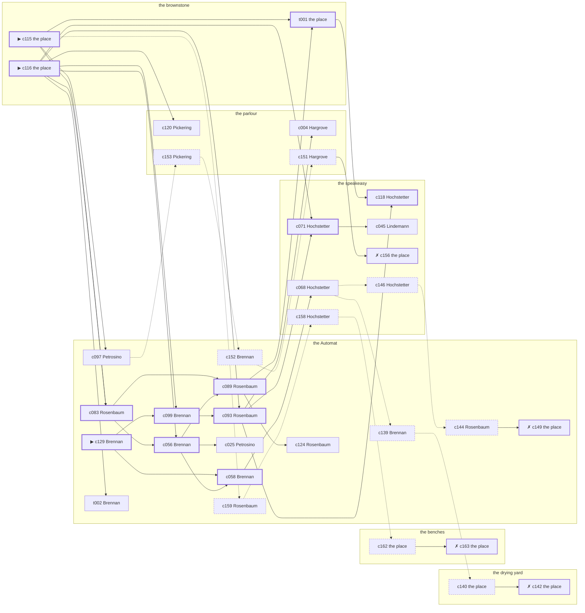

# Hell’s Kitchen — case 8

**Seed** 8 · **Difficulty** 2 · **Attempts** 1 · **Detective** Dashiell

**Type** murder · **Trope** body-at-scene · **Unknowns** who, why, when

**Par** 11 actions · **Slack** 6 · **Budget** 17 · **Findable** 34 (spine 12, corroboration 8, noise 10 + 4 disqualifiers) · **Noise ratio** 41% · **Candidate pool** 166

## 1. The Truth

Thomas Hanrahan, a ward heeler, a witness against the people Dandridge worked for, killed Vivian Dandridge, an heiress between marriages, with a gunshot at the brownstone at 11:00 PM. Hanrahan needed Dandridge silent before the grand jury (silence-a-witness). Hanrahan had been at the speakeasy earlier in the evening, where the means lived, and was alone with Dandridge when it happened. Brennan hired us.

## 2. The Act

**murder** · **body-at-scene** · actor **Hanrahan** · at **the brownstone** · at **11:00 PM**

- found at the brownstone
- fate: dead

**Givens** — what the briefing states and the report does not ask:

- Dandridge was found dead at the brownstone.
- Dandridge was killed at the brownstone, and nothing was carried out of the room afterwards.
- The coroner puts it between 10:00 PM and 11:30 PM, which is two hours of nothing useful.
- It was a gunshot.

**Unknowns** — exactly what the report asks: **who**, **why**, **when**.

## 3. Dramatis Personae

| Name | Role | Relationship | Class of secret | Motive | Found at | Killer |
| --- | --- | --- | --- | --- | --- | --- |
| Vivian Dandridge | an heiress between marriages | the victim | — | — | — | — |
| Ezekiel Hargrove | a young man living on expectations | Dandridge’s cousin | secret-drinking | inheritance | the parlour | — |
| Thomas Hanrahan | a ward heeler | a witness against the people Dandridge worked for | murder | silence-a-witness | the Automat | **YES** |
| Concetta Petrosino | the owner of the block | Dandridge’s business partner | fence | property | the Automat | — |
| Verity Coffin | a private nurse | Dandridge’s private nurse | hidden-family | — | the speakeasy | — |
| Albrecht Lindemann | a doorman at a club with no sign on it | in Dandridge’s debt | fence | debt | the speakeasy | — |
| Mary Brennan (client) | a switchboard operator | Dandridge’s tenant | hidden-family | — | the Automat | — |
| Ilse Hochstetter | the bartender | fixture (bartender) | — | — | the speakeasy | — |
| Constance Pickering | the landlady | fixture (landlady) | — | — | the parlour | — |
| Meyer Rosenbaum | the man behind the counter | fixture (counterman) | — | — | the Automat | — |

## 4. Dossiers

Every person, by layer: **0** on sight, **1** volunteered, **2** from other people, **3** in the documents.

### Dandridge — the victim

40, a woman, an heiress between marriages. Wants: respectability.

- **Standing** — Dandridge had money in a neighbourhood that had none, and was watched for it.
- **Profession** — Dandridge lived on the income of a trust and signed for nothing.
- **Found** — Hargrove found Dandridge at the brownstone at 11:30 PM. By Hargrove, at the brownstone, at 11:30 PM. Precinct: took-a-statement.

**Layer 0, on sight**

- _gender_ — A woman.
- _age_ — In her forties.

**Layer 1, volunteered**

- _profession_ — An heiress between marriages.
- _detail_ — Dandridge lived on the income of a trust and signed for nothing.

**Layer 2, from other people**

- _tie_ — Dandridge had money in a neighbourhood that had none, and was watched for it.
- _want_ — Dandridge wants to be thought respectable by people who are not.

**Self-account** (layer 1, what they say when asked about themselves)

- Dandridge is 40 years old and an heiress between marriages.
- Dandridge lived on the income of a trust and signed for nothing.
- Dandridge is the one this is about.

### Hargrove

24, a man, a young man living on expectations. Wants: to-be-somebody. Tie: Dandridge’s cousin, all their lives.

**Layer 0, on sight**

- _gender_ — A man.
- _age_ — Not much past twenty.

**Layer 1, volunteered**

- _profession_ — A young man living on expectations.
- _detail_ — Hargrove draws an allowance on the first of the month and has it spent by the eighth.

**Layer 2, from other people**

- _tie_ — Hargrove and Dandridge came over on the same boat with Dennis Doyle and split up inside a year.
- _want_ — Hargrove wants a name people know.
- _since_ — Hargrove has been Dandridge’s cousin, all their lives.
- _third_ — Dennis Doyle is the man who held the second mortgage.

**Layer 3, in the documents**

- _secret-hint_ — Hargrove had taken a drink and had gone to some trouble about the smell of it.

**Self-account** (layer 1, what they say when asked about themselves)

- Hargrove is 24 years old and a young man living on expectations.
- Hargrove draws an allowance on the first of the month and has it spent by the eighth.
- Hargrove is Dandridge’s cousin.

### Hanrahan — the killer

54, a man, a ward heeler. Wants: to-be-somebody. Tie: a witness against the people Dandridge worked for, since the indictment.

**Layer 0, on sight**

- _gender_ — A man.
- _age_ — In his fifties.

**Layer 1, volunteered**

- _profession_ — A ward heeler.
- _detail_ — Hanrahan delivers the vote on the block and the coal in February.

**Layer 2, from other people**

- _tie_ — Hanrahan is due before the grand jury about Dandridge’s people, and the date is set.
- _want_ — Hanrahan wants a name people know.
- _since_ — Hanrahan has been a witness against the people Dandridge worked for, since the indictment.

**Self-account** (layer 1, what they say when asked about themselves)

- Hanrahan is 54 years old and a ward heeler.
- Hanrahan delivers the vote on the block and the coal in February.
- Hanrahan is a witness against the people Dandridge worked for.

### Petrosino

62, a woman, the owner of the block. Wants: to-be-feared. Tie: Dandridge’s business partner, going on eight years.

**Layer 0, on sight**

- _gender_ — A woman.
- _age_ — In her sixties.

**Layer 1, volunteered**

- _profession_ — The owner of the block.
- _detail_ — Petrosino has a boilerman, a lawyer and no partners.

**Layer 2, from other people**

- _tie_ — Petrosino bought into Dandridge’s business the year Agnes Corrigan walked out of it.
- _want_ — Petrosino wants to be the one people are careful around.
- _since_ — Petrosino has been Dandridge’s business partner, going on eight years.
- _third_ — Agnes Corrigan is the landlady at the old address.

**Layer 3, in the documents**

- _secret-hint_ — Petrosino was carrying a parcel into the drying yard and came out without it.

**Self-account** (layer 1, what they say when asked about themselves)

- Petrosino is 62 years old and the owner of the block.
- Petrosino has a boilerman, a lawyer and no partners.
- Petrosino is Dandridge’s business partner.

### Coffin

26, a woman, a private nurse. Wants: to-be-forgiven. Tie: Dandridge’s private nurse, since the spring.

**Layer 0, on sight**

- _gender_ — A woman.
- _age_ — In the late twenties.
- _profession_ — A private nurse.

**Layer 1, volunteered**

- _detail_ — Coffin sits nights with patients the hospitals have sent home.

**Layer 2, from other people**

- _tie_ — Coffin was put in to nurse Dandridge by Ernst Reinhardt and stayed on after the fee stopped.
- _want_ — Coffin wants to be forgiven for something nobody else remembers.
- _since_ — Coffin has been Dandridge’s private nurse, since the spring.
- _third_ — Ernst Reinhardt is a partner who walked out of the business.

**Layer 3, in the documents**

- _secret-hint_ — Coffin sends money out of every pay envelope and cannot say where it goes.

**Self-account** (layer 1, what they say when asked about themselves)

- Coffin is 26 years old and a private nurse.
- Coffin sits nights with patients the hospitals have sent home.
- Coffin is Dandridge’s private nurse.

### Lindemann

43, a man, a doorman at a club with no sign on it. Wants: money. Tie: in Dandridge’s debt, since ’23.

**Layer 0, on sight**

- _gender_ — A man.
- _age_ — In his forties.
- _profession_ — A doorman at a club with no sign on it.

**Layer 1, volunteered**

- _detail_ — Lindemann stands the door at a club with no sign on it and knows every face that comes to it.

**Layer 2, from other people**

- _tie_ — Lindemann has owed Dandridge money since ’23 and has not been asked for it lately.
- _want_ — Lindemann wants money, and is not particular about the shape it arrives in.
- _since_ — Lindemann has been in Dandridge’s debt, since ’23.

**Layer 3, in the documents**

- _secret-hint_ — Lindemann was carrying a parcel into the speakeasy and came out without it.

**Self-account** (layer 1, what they say when asked about themselves)

- Lindemann is 43 years old and a doorman at a club with no sign on it.
- Lindemann stands the door at a club with no sign on it and knows every face that comes to it.
- Lindemann is in Dandridge’s debt.

### Brennan — the client

21, a woman, a switchboard operator. Wants: to-get-out. Tie: Dandridge’s tenant, since ’18.

**Layer 0, on sight**

- _gender_ — A woman.
- _age_ — Not much past twenty.
- _profession_ — A switchboard operator.

**Layer 1, volunteered**

- _detail_ — Brennan plugs the calls through and is not supposed to listen.

**Layer 2, from other people**

- _tie_ — Brennan has rented from Dandridge since ’18 and has the same window and the same complaint.
- _want_ — Brennan wants out of the neighbourhood and has wanted it for years.
- _since_ — Brennan has been Dandridge’s tenant, since ’18.

**Layer 3, in the documents**

- _secret-hint_ — Brennan sends money out of every pay envelope and cannot say where it goes.

**Self-account** (layer 1, what they say when asked about themselves)

- Brennan is 21 years old and a switchboard operator.
- Brennan plugs the calls through and is not supposed to listen.
- Brennan is Dandridge’s tenant.

### Hochstetter

44, a woman, the bartender. Wants: to-be-left-alone. Tie: behind the bar at the speakeasy, every night of the week.

**Layer 0, on sight**

- _gender_ — A woman.
- _age_ — In her forties.
- _profession_ — The bartender.

**Layer 1, volunteered**

- _detail_ — Hochstetter has had the stick at the speakeasy for nine years and remembers what everybody drinks.

**Layer 2, from other people**

- _tie_ — Hochstetter is behind the bar at the speakeasy, every night of the week.
- _want_ — Hochstetter wants to be left alone.

**Self-account** (layer 1, what they say when asked about themselves)

- Hochstetter is 44 years old and the bartender.
- Hochstetter has had the stick at the speakeasy for nine years and remembers what everybody drinks.
- Hochstetter is behind the bar at the speakeasy, every night of the week.

### Pickering

50, a woman, the landlady. Wants: respectability. Tie: the keeper of the parlour.

**Layer 0, on sight**

- _gender_ — A woman.
- _age_ — In her fifties.
- _profession_ — The landlady.

**Layer 1, volunteered**

- _detail_ — Pickering keeps the parlour and sits where she can see the stairs.

**Layer 2, from other people**

- _tie_ — Pickering is the keeper of the parlour.
- _want_ — Pickering wants to be thought respectable by people who are not.

**Self-account** (layer 1, what they say when asked about themselves)

- Pickering is 50 years old and the landlady.
- Pickering keeps the parlour and sits where she can see the stairs.
- Pickering is the keeper of the parlour.

### Rosenbaum

32, a man, the man behind the counter. Wants: to-get-out. Tie: behind the counter at the Automat.

**Layer 0, on sight**

- _gender_ — A man.
- _age_ — In his thirties.
- _profession_ — The man behind the counter.

**Layer 1, volunteered**

- _detail_ — Rosenbaum serves at the Automat and has never once been asked his name.

**Layer 2, from other people**

- _tie_ — Rosenbaum is behind the counter at the Automat.
- _want_ — Rosenbaum wants out of the neighbourhood and has wanted it for years.

**Self-account** (layer 1, what they say when asked about themselves)

- Rosenbaum is 32 years old and the man behind the counter.
- Rosenbaum serves at the Automat and has never once been asked his name.
- Rosenbaum is behind the counter at the Automat.

## 5. The Client

**Brennan**, Dandridge’s tenant. Purpose: **find-the-killer-police-wont**.

- **Why** — Brennan wants the one who killed Dandridge found, because the precinct has stopped looking.
- **What it costs** — Brennan knows that asking questions on this block is a way of being asked some.
- **Points at** — Hanrahan: Hanrahan needed Dandridge silent before the grand jury. Honest: **yes**.

**Tells:**

- Dandridge was found dead at the brownstone.
- Dandridge was killed at the brownstone, and nothing was carried out of the room afterwards.
- The coroner puts it between 10:00 PM and 11:30 PM, which is two hours of nothing useful.
- It was a gunshot.
- Brennan would rather we started with Hanrahan: Hanrahan needed Dandridge silent before the grand jury.

**Withholds:**

- Brennan does not mention it, but Brennan goes to the benches from 9:30 PM to see a child nobody is supposed to know about.

**Their own evening, as they tell it:**

- Brennan says she was at the Automat from 6:00 PM to 7:30 PM.
- Brennan says she was at the brownstone from 8:00 PM to 8:30 PM.
- Brennan says she was at the speakeasy from 9:00 PM to 9:30 PM.
- Brennan says she was at the benches from 10:00 PM to 10:30 PM.

## 6. The Briefing

16 plain sentences, derived. This is the model of the plain register: the engine renders it, and Phase 2 measures pages against it.

1. A woman came up the stairs after midnight, and sat down.
2. Mary Brennan is 21 years old and a switchboard operator.
3. Brennan plugs the calls through and is not supposed to listen.
4. Dandridge had money in a neighbourhood that had none, and was watched for it.
5. Dandridge was found dead at the brownstone.
6. Dandridge was killed at the brownstone, and nothing was carried out of the room afterwards.
7. The coroner puts it between 10:00 PM and 11:30 PM, which is two hours of nothing useful.
8. It was a gunshot.
9. Hargrove found Dandridge at the brownstone at 11:30 PM.
10. The precinct took a statement at the desk and filed it.
11. Brennan is Dandridge’s tenant.
12. Brennan has rented from Dandridge since ’18 and has the same window and the same complaint.
13. Brennan wants the one who killed Dandridge found, because the precinct has stopped looking.
14. Brennan knows that asking questions on this block is a way of being asked some.
15. Brennan wants us to start with Hanrahan.
16. Hanrahan needed Dandridge silent before the grand jury.

## 7. Mentions

- **Dennis Doyle** (m-1) — the man who held the second mortgage. Dennis Doyle is the man who held the second mortgage.
- **Agnes Corrigan** (m-2) — the landlady at the old address. Agnes Corrigan is the landlady at the old address.
- **Ernst Reinhardt** (m-3) — a partner who walked out of the business. Ernst Reinhardt is a partner who walked out of the business.

## 8. Places

- **the speakeasy under the hat shop** (semi) — watched by bartender (Hochstetter); objects: a nickel-plated revolver, a silver cigarette case, a bottle of chloral drops — where the weapon lived; within earshot of the scene
- **the parlour of Mrs. Teague’s boarding house** (semi) — watched by landlady (Pickering); objects: a wall telephone, a length of sash cord, a framed photograph
- **the drying yard behind the laundry** (private) — unwatched; objects: an ice pick, a mop and bucket
- **Dandridge’s rooms in the brownstone** (private) — unwatched; objects: a bronze bookend — **THE SCENE**; the victim’s address
- **the benches at the north end of the square** (public) — unwatched; objects: a brass umbrella stand, a folded stack of evening papers — within earshot of the scene
- **the Automat on the corner** (public) — watched by counterman (Rosenbaum); objects: none

## 9. Anchors

The coroner gives 10:00 PM–11:30 PM, four ticks wide. These are what close it: **bar-radio** and **church-bells**.

- **the fight card on the bar radio** — at 10:30 PM; at the speakeasy. Only those present know that the challenger went down in the fourth and the crowd booed it. You can time things by it: the set was turned up loud enough to carry into the street.
- **the bells at St. Malachy’s** — at 6:00 PM, 7:00 PM, 8:00 PM, 9:00 PM, 10:00 PM, 11:00 PM; across the whole neighbourhood. You can time things by it: the half hours are rung and the whole hours are rung twice.

## 10. Timelines

### Dandridge — the victim

| Tick | Time | Truth | Claimed | Companion claimed |
| --- | --- | --- | --- | --- |
| 0 | 6:00 PM | the benches | the benches | — |
| 1 | 6:30 PM | the drying yard | the drying yard | — |
| 2 | 7:00 PM | the speakeasy | the speakeasy | — |
| 3 | 7:30 PM | the speakeasy | the speakeasy | — |
| 4 | 8:00 PM | the parlour | the parlour | — |
| 5 | 8:30 PM | the parlour | the parlour | — |
| 6 | 9:00 PM | the parlour | the parlour | — |
| 7 | 9:30 PM | the parlour | the parlour | — |
| 8 | 10:00 PM | the parlour | the parlour | — |
| 9 | 10:30 PM | the speakeasy | the speakeasy | — |
| 10 | 11:00 PM | the brownstone ☠ | the brownstone | — |
| 11 | 11:30 PM | — | — | — |

### Hargrove

| Tick | Time | Truth | Claimed | Companion claimed |
| --- | --- | --- | --- | --- |
| 0 | 6:00 PM | the brownstone | the brownstone | — |
| 1 | 6:30 PM | the parlour | the parlour | — |
| 2 | 7:00 PM | the parlour | the parlour | — |
| 3 | 7:30 PM | the benches | the benches | — |
| 4 | 8:00 PM | the benches | the benches | — |
| 5 | 8:30 PM | the parlour | **the Automat** | — |
| 6 | 9:00 PM | the parlour | **the Automat** | — |
| 7 | 9:30 PM | the parlour | the parlour | — |
| 8 | 10:00 PM | the parlour | the parlour | — |
| 9 | 10:30 PM | the parlour | the parlour | — |
| 10 | 11:00 PM | the Automat | the Automat | — |
| 11 | 11:30 PM | the brownstone | the brownstone | — |

### Hanrahan — the killer

| Tick | Time | Truth | Claimed | Companion claimed |
| --- | --- | --- | --- | --- |
| 0 | 6:00 PM | the benches | the benches | — |
| 1 | 6:30 PM | the Automat | the Automat | — |
| 2 | 7:00 PM | the Automat | the Automat | — |
| 3 | 7:30 PM | the Automat | the Automat | — |
| 4 | 8:00 PM | the Automat | the Automat | — |
| 5 | 8:30 PM | the parlour | the parlour | — |
| 6 | 9:00 PM | the speakeasy | the speakeasy | — |
| 7 | 9:30 PM | the parlour | the parlour | — |
| 8 | 10:00 PM | the parlour | the parlour | — |
| 9 | 10:30 PM | the brownstone | **the Automat** | Hargrove |
| 10 | 11:00 PM | the brownstone ☠ | **the Automat** | Hargrove |
| 11 | 11:30 PM | the Automat | the Automat | — |

### Petrosino

| Tick | Time | Truth | Claimed | Companion claimed |
| --- | --- | --- | --- | --- |
| 0 | 6:00 PM | the parlour | the parlour | — |
| 1 | 6:30 PM | the drying yard | **the parlour** | — |
| 2 | 7:00 PM | the Automat | the Automat | — |
| 3 | 7:30 PM | the Automat | the Automat | — |
| 4 | 8:00 PM | the Automat | the Automat | — |
| 5 | 8:30 PM | the Automat | the Automat | — |
| 6 | 9:00 PM | the Automat | the Automat | — |
| 7 | 9:30 PM | the parlour | the parlour | — |
| 8 | 10:00 PM | the brownstone | the brownstone | — |
| 9 | 10:30 PM | the drying yard | the drying yard | — |
| 10 | 11:00 PM | the Automat | the Automat | — |
| 11 | 11:30 PM | the speakeasy | the speakeasy | — |

### Coffin

| Tick | Time | Truth | Claimed | Companion claimed |
| --- | --- | --- | --- | --- |
| 0 | 6:00 PM | the speakeasy | the speakeasy | — |
| 1 | 6:30 PM | the speakeasy | the speakeasy | — |
| 2 | 7:00 PM | the speakeasy | the speakeasy | — |
| 3 | 7:30 PM | the speakeasy | the speakeasy | — |
| 4 | 8:00 PM | the Automat | the Automat | — |
| 5 | 8:30 PM | the Automat | the Automat | — |
| 6 | 9:00 PM | the speakeasy | the speakeasy | — |
| 7 | 9:30 PM | the speakeasy | the speakeasy | — |
| 8 | 10:00 PM | the Automat | the Automat | — |
| 9 | 10:30 PM | the Automat | the Automat | — |
| 10 | 11:00 PM | the Automat | **the speakeasy** | — |
| 11 | 11:30 PM | the Automat | **the speakeasy** | — |

### Lindemann

| Tick | Time | Truth | Claimed | Companion claimed |
| --- | --- | --- | --- | --- |
| 0 | 6:00 PM | the Automat | the Automat | — |
| 1 | 6:30 PM | the Automat | the Automat | — |
| 2 | 7:00 PM | the benches | the benches | — |
| 3 | 7:30 PM | the speakeasy | the speakeasy | — |
| 4 | 8:00 PM | the parlour | the parlour | — |
| 5 | 8:30 PM | the speakeasy | the speakeasy | — |
| 6 | 9:00 PM | the speakeasy | the speakeasy | — |
| 7 | 9:30 PM | the benches | the benches | — |
| 8 | 10:00 PM | the Automat | the Automat | — |
| 9 | 10:30 PM | the parlour | the parlour | — |
| 10 | 11:00 PM | the speakeasy | **the Automat** | Hanrahan |
| 11 | 11:30 PM | the speakeasy | the speakeasy | — |

### Brennan

| Tick | Time | Truth | Claimed | Companion claimed |
| --- | --- | --- | --- | --- |
| 0 | 6:00 PM | the Automat | the Automat | — |
| 1 | 6:30 PM | the Automat | the Automat | — |
| 2 | 7:00 PM | the Automat | the Automat | — |
| 3 | 7:30 PM | the Automat | the Automat | — |
| 4 | 8:00 PM | the brownstone | the brownstone | — |
| 5 | 8:30 PM | the brownstone | the brownstone | — |
| 6 | 9:00 PM | the speakeasy | the speakeasy | — |
| 7 | 9:30 PM | the benches | **the speakeasy** | — |
| 8 | 10:00 PM | the benches | the benches | — |
| 9 | 10:30 PM | the benches | the benches | — |
| 10 | 11:00 PM | the Automat | the Automat | — |
| 11 | 11:30 PM | the Automat | the Automat | — |

### Fixtures (never lie, never withhold)

| Tick | Time | Hochstetter (the bartender) | Pickering (the landlady) | Rosenbaum (the man behind the counter) |
| --- | --- | --- | --- | --- |
| 0 | 6:00 PM | the speakeasy | the parlour | the Automat |
| 1 | 6:30 PM | the speakeasy | the parlour | the Automat |
| 2 | 7:00 PM | the speakeasy | the parlour | the Automat |
| 3 | 7:30 PM | the speakeasy | the parlour | the Automat |
| 4 | 8:00 PM | the speakeasy | the parlour | the Automat |
| 5 | 8:30 PM | the speakeasy | the parlour | the Automat |
| 6 | 9:00 PM | the speakeasy | the parlour | the Automat |
| 7 | 9:30 PM | the speakeasy | the parlour | the Automat |
| 8 | 10:00 PM | the speakeasy | the parlour | the Automat |
| 9 | 10:30 PM | the speakeasy | the parlour | the Automat |
| 10 | 11:00 PM | the speakeasy | the speakeasy | the Automat |
| 11 | 11:30 PM | the speakeasy | the parlour | the Automat |

## 11. Secrets in play

- **Hargrove** (secret-drinking): Hargrove drinks alone at the parlour from 8:30 PM to 9:00 PM and will claim to have been anywhere else.
- **Hanrahan** (murder): Hanrahan is at the brownstone from 10:30 PM to 11:00 PM, alone with Dandridge when it happens at 11:00 PM.
- **Petrosino** (fence): Petrosino hands a parcel of stolen goods to a man at the drying yard from 6:30 PM.
- **Coffin** (hidden-family): Coffin goes to the Automat from 11:00 PM to 11:30 PM to see a child nobody is supposed to know about.
- **Lindemann** (fence): Lindemann hands a parcel of stolen goods to a man at the speakeasy from 11:00 PM.
- **Brennan** (hidden-family): Brennan goes to the benches from 9:30 PM to see a child nobody is supposed to know about.

## 12. Clue list — the 34 findable

The opening three, free at the start: c115, c116, c129. Everything else has to be led to. The full candidate pool is in the companion file.

### At the speakeasy

- **c071** [spine] (observation; Hochstetter on Lindemann) → c045
  - Hochstetter says Lindemann was at the speakeasy from 11:00 PM to 11:30 PM.
  - _establishes: Lindemann at the speakeasy, 11:00 PM–11:30 PM_
- **c118** [spine] (anchor; Hochstetter on Dandridge that evening) → (end)
  - Hochstetter puts Dandridge at the speakeasy while the fight was on the radio, which was 10:30 PM, and alive enough to argue about the weather.
  - _establishes: the victim alive at 10:30 PM; Dandridge at the speakeasy, 10:30 PM_
- **c045** [corroboration] (observation; Lindemann on Hanrahan) → (end)
  - Lindemann says Hanrahan was at the speakeasy at 9:00 PM.
  - _establishes: Hanrahan at the speakeasy, 9:00 PM; Hanrahan could reach the weapon_
- **c068** [corroboration] (observation; Hochstetter on Coffin) → c146, c139
  - Hochstetter says Coffin was at the speakeasy from 9:00 PM to 9:30 PM.
  - _establishes: Coffin at the speakeasy, 9:00 PM–9:30 PM; Coffin could reach the weapon_
- **c156** [disqualifier {b1}] (overheard; the place itself) → (end)
  - The receiver at the speakeasy would rather talk than be held: Lindemann was there from 11:00 PM handing over a parcel of somebody else’s silver, which is a charge Lindemann will take over this one.
  - _establishes: Lindemann’s fence accounted for; Lindemann at the speakeasy, 11:00 PM_
- **c158** [noise {b2}] (overheard; Hochstetter on Brennan) → c162
  - Hochstetter on Brennan: Brennan sends money out of every pay envelope and cannot say where it goes.
  - _establishes: context only_
- **c146** [noise {b3}] (overheard; Hochstetter on Coffin) → c144
  - Hochstetter on Coffin: Coffin keeps a photograph and will not be asked about it twice.
  - _establishes: context only_

### At the parlour

- **c120** [corroboration] (anchor; Pickering on the noise that evening) → (end)
  - Pickering was at the speakeasy at 11:00 PM and heard a shot from the direction of the brownstone, while the bells were going.
  - _establishes: noise at the brownstone at 11:00 PM; the victim dead by 11:00 PM; how it was done_
- **c004** [corroboration] (observation; Hargrove on Petrosino) → (end)
  - Hargrove says Petrosino was at the Automat at 11:00 PM.
  - _establishes: Petrosino at the Automat, 11:00 PM_
- **c153** [noise {b1}] (overheard; Pickering on Lindemann) → c152
  - Pickering on Lindemann: Lindemann has been selling things that were never Lindemann’s to sell.
  - _establishes: context only_
- **c151** [noise {b1}] (overheard; Hargrove on Lindemann) → c156
  - Hargrove on Lindemann: Lindemann was carrying a parcel into the speakeasy and came out without it.
  - _establishes: context only_

### At the drying yard

- **c140** [noise {b4}] (physical; the place itself) → c142
  - Wrapping paper and a cut string at the drying yard, and the shop it came from closed two years ago.
  - _establishes: context only_
- **c142** [disqualifier {b4}] (overheard; the place itself) → (end)
  - The receiver at the drying yard would rather talk than be held: Petrosino was there from 6:30 PM handing over a parcel of somebody else’s silver, which is a charge Petrosino will take over this one.
  - _establishes: Petrosino’s fence accounted for; Petrosino at the drying yard, 6:30 PM_

### At the brownstone

- **c115** [spine ⟨opening⟩] (scene; the place itself) → c083, t001, c097, c159
  - Dandridge was found at the brownstone. The cigarette he had going burned itself out on the sill where it fell. The bells rang the half hour at 11:00 PM. The sexton rings them off the sacristy clock and it keeps good time.
  - _establishes: the victim dead by 11:00 PM; how it was done_
- **c116** [spine ⟨opening⟩] (morgue; the place itself) → c083, c056, c099, c093, c071, c120, t002
  - The coroner puts death between 10:00 PM and 11:30 PM — two hours of nothing useful. One bullet below the sternum. Powder burns on the shirt front: fired close.
  - _establishes: death between 10:00 PM and 11:30 PM; how it was done_
- **t001** [spine] (physical; the place itself) → c118
  - The rug at the brownstone is rucked up under Dandridge and the chair beside it went over backwards. Nothing was carried out of the room.
  - _establishes: Dandridge at the brownstone, 11:00 PM_

### At the benches

- **c162** [noise {b2}] (physical; the place itself) → c163
  - A child’s shoe at the benches, and nobody at the benches has any children.
  - _establishes: context only_
- **c163** [disqualifier {b2}] (overheard; the place itself) → (end)
  - The woman who keeps the child says it straight out: Brennan was at the benches from 9:30 PM, the same as every week, and left with the same face as always.
  - _establishes: Brennan’s hidden-family accounted for; Brennan at the benches, 9:30 PM_

### At the Automat

- **c129** [spine ⟨opening⟩] (client; Brennan on why I was hired) → c099, c058
  - Brennan hired us, and wants it known that Hanrahan needed Dandridge silent before the grand jury, and would rather we started there.
  - _establishes: Hanrahan had a motive (silence-a-witness)_
- **c083** [spine] (observation; Rosenbaum on Hargrove) → c056, c089
  - Rosenbaum says Hargrove was at the Automat at 11:00 PM.
  - _establishes: Hargrove at the Automat, 11:00 PM_
- **c056** [spine] (observation; Brennan on Hanrahan) → c089, c058, c025
  - Brennan says Hanrahan was at the speakeasy at 9:00 PM.
  - _establishes: Hanrahan at the speakeasy, 9:00 PM; Hanrahan could reach the weapon_
- **c089** [spine] (observation; Rosenbaum on Coffin) → t001, c124
  - Rosenbaum says Coffin was at the Automat from 10:00 PM to 11:30 PM.
  - _establishes: Coffin at the Automat, 10:00 PM–11:30 PM_
- **c099** [spine] (observation; Brennan on Hanrahan’s account) → c093
  - Brennan was at the Automat at 11:00 PM and says Hanrahan was not.
  - _establishes: Hanrahan not at the Automat, 11:00 PM_
- **c058** [spine] (observation; Brennan on Petrosino) → c068
  - Brennan says Petrosino was at the Automat at 11:00 PM.
  - _establishes: Petrosino at the Automat, 11:00 PM_
- **c093** [spine] (observation; Rosenbaum on Brennan) → c071, c118, c004
  - Rosenbaum says Brennan was at the Automat from 11:00 PM to 11:30 PM.
  - _establishes: Brennan at the Automat, 11:00 PM–11:30 PM_
- **c097** [corroboration] (observation; Petrosino on Hanrahan’s account) → c153
  - Petrosino was at the Automat at 11:00 PM and says Hanrahan was not.
  - _establishes: Hanrahan not at the Automat, 11:00 PM_
- **c124** [corroboration] (overheard; Rosenbaum on Hanrahan and Dandridge) → (end)
  - Rosenbaum says Dandridge said to Hanrahan that a man who testifies sleeps better.
  - _establishes: Hanrahan had a motive (silence-a-witness)_
- **t002** [corroboration] (overheard; Brennan on the brownstone that evening) → (end)
  - Brennan says the door at the brownstone was shut from 11:00 PM on, and nobody came out of it carrying anything.
  - _establishes: Dandridge at the brownstone, 11:00 PM_
- **c025** [corroboration] (observation; Petrosino on Hargrove) → (end)
  - Petrosino says Hargrove was at the Automat at 11:00 PM.
  - _establishes: Hargrove at the Automat, 11:00 PM_
- **c152** [noise {b1}] (overheard; Brennan on Lindemann) → c151
  - Brennan on Lindemann: There is a man who meets people at the speakeasy and nobody will say his name out loud.
  - _establishes: context only_
- **c159** [noise {b2}] (overheard; Rosenbaum on Brennan) → c158
  - Rosenbaum on Brennan: A woman at the benches asked for Brennan by a name Brennan has not used in years.
  - _establishes: context only_
- **c144** [noise {b3}] (overheard; Rosenbaum on Coffin) → c149
  - Rosenbaum on Coffin: Coffin sends money out of every pay envelope and cannot say where it goes.
  - _establishes: context only_
- **c149** [disqualifier {b3}] (overheard; the place itself) → (end)
  - The woman who keeps the child says it straight out: Coffin was at the Automat from 11:00 PM to 11:30 PM, the same as every week, and left with the same face as always.
  - _establishes: Coffin’s hidden-family accounted for; Coffin at the Automat, 11:00 PM–11:30 PM_
- **c139** [noise {b4}] (overheard; Brennan on Petrosino) → c140
  - Brennan on Petrosino: Petrosino has been selling things that were never Petrosino’s to sell.
  - _establishes: context only_

## 13. Clue graph

## 14. Deduction path

Par is **11 actions** and the budget is par plus 6: **17**. Every id below is a spine clue; the inference is the sheet’s, not the clue’s.

**Time of death.** The coroner gives four ticks. The anchors close it to 11:00 PM: one puts Dandridge alive at 10:30 PM, the other times the scene at 11:00 PM. _(c116, c118, c115; + 1 corroborating)_

**Clearing the innocent.**

- Hargrove was not at the brownstone at 11:00 PM. _(c083; + 1 corroborating)_
- Petrosino was not at the brownstone at 11:00 PM. _(c058; + 1 corroborating)_
- Coffin was not at the brownstone at 11:00 PM. _(c089; + 1 corroborating)_
- Lindemann was not at the brownstone at 11:00 PM. _(c071; + 1 corroborating)_
- Brennan was not at the brownstone at 11:00 PM. _(c093)_

**Naming the killer.** Hanrahan claims the Automat at 11:00 PM. Two independent sources put that out of the question. _(c099; + 1 corroborating)_

**The weapon.** Hanrahan was at the speakeasy before 11:00 PM, where a nickel-plated revolver was kept. _(c056; + 1 corroborating)_

**Method.** A gunshot, on two physical sources. _(c115, c116; + 1 corroborating)_

**Motive.** silence-a-witness, on two independent sources. _(c129; + 1 corroborating)_

## 15. Red herrings

**Innocents who lie about the murder tick:**

- Coffin claims the speakeasy at 11:00 PM and was really at the Automat. Reason: Coffin goes to the Automat from 11:00 PM to 11:30 PM to see a child nobody is supposed to know about.
- Lindemann claims the Automat at 11:00 PM and was really at the speakeasy. Reason: Lindemann hands a parcel of stolen goods to a man at the speakeasy from 11:00 PM.

**Innocents with a motive:**

- Hargrove — inheritance: stands to inherit from Dandridge.
- Petrosino — property: wanted Dandridge out of the lease and the lease in Petrosino’s name.
- Lindemann — debt: owed Dandridge four thousand dollars and was past due on it.

**Noise branches, and what knocks each one down:**

- **b1** (Lindemann, fence): c153 → c152 → c151 → **c156** — The receiver at the speakeasy would rather talk than be held: Lindemann was there from 11:00 PM handing over a parcel of somebody else’s silver, which is a charge Lindemann will take over this one.
- **b2** (Brennan, hidden-family): c159 → c158 → c162 → **c163** — The woman who keeps the child says it straight out: Brennan was at the benches from 9:30 PM, the same as every week, and left with the same face as always.
- **b3** (Coffin, hidden-family): c146 → c144 → **c149** — The woman who keeps the child says it straight out: Coffin was at the Automat from 11:00 PM to 11:30 PM, the same as every week, and left with the same face as always.
- **b4** (Petrosino, fence): c139 → c140 → **c142** — The receiver at the drying yard would rather talk than be held: Petrosino was there from 6:30 PM handing over a parcel of somebody else’s silver, which is a charge Petrosino will take over this one.

