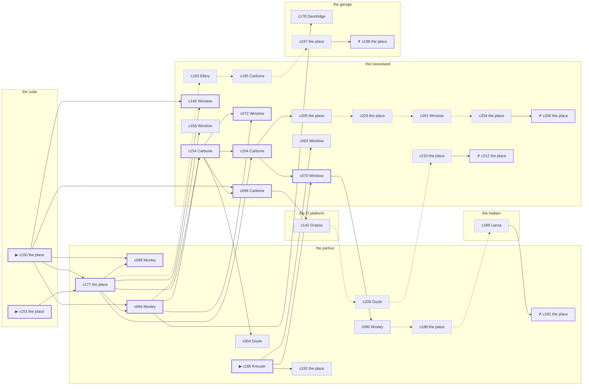

# the Upper West Side — case 9

**Seed** 9 · **Difficulty** 2 · **Attempts** 1 · **Detective** Dashiell

**Par** 11 actions · **Slack** 6 · **Budget** 17 · **Findable** 34 (spine 12, corroboration 8, noise 10 + 4 disqualifiers) · **Noise ratio** 41% · **Candidate pool** 220

## 1. The Truth

Anneliese Kreuzer, a stagehand at the Selwyn, a customer of the victim’s, killed Martin Quill, a bail bondsman, with strangling with a cord at the suite at 9:00 PM. Kreuzer blamed the victim for a ruin (revenge). Kreuzer had been at the parlour earlier in the evening, where the weapon lived, and was alone with Quill when it happened. Kreuzer is also the client: the killer hired us.

## 2. Dramatis Personae

| Name | Role | Relationship | Class of secret | Motive | Found at | Killer |
| --- | --- | --- | --- | --- | --- | --- |
| Martin Quill | a bail bondsman | the victim | — | — | — | — |
| Delia Doyle | a private nurse | named in the victim’s will | hidden-family | — | the parlour | — |
| Karl Lindemann | the owner of the block | the victim’s landlord | fence | — | the newsstand | — |
| Anneliese Kreuzer (client) | a stagehand at the Selwyn | a customer of the victim’s | murder (+ gambling-debt) | revenge | the parlour | **YES** |
| Ellsworth Ellery | a ward heeler | a witness against the people the victim worked for | gambling-debt | silence-a-witness | the newsstand | — |
| Rutherford Winslow | a stringer for the evening papers | a witness against the people the victim worked for | gambling-debt | exposure | the newsstand | — |
| Rosaria Grasso | a curb broker | in the victim’s debt | fence | debt | the El platform | — |
| Lurline Mosley | the landlady | fixture (landlady) | — | — | the parlour | — |
| Concetta Carbone | the news dealer | fixture (newsstand) | — | — | the newsstand | — |
| Nunzio Lanza | the elevator man | fixture (elevator-man) | — | — | the Hallam | — |
| Althea Dandridge | the man behind the counter | fixture (counterman) | — | — | the garage | — |
| Louis Lefkowitz | the patrolman on the beat | fixture (beat-cop) | — | — | the El platform | — |

## 3. Places

- **the parlour of Mrs. Teague’s boarding house** (semi) — watched by landlady (Mosley); objects: a length of sash cord, a framed photograph, a wall telephone — where the weapon lived; within earshot of the scene
- **the El platform at Twenty-Third Street** (public) — unwatched; objects: a folded stack of evening papers, a pasted-up timetable
- **the newsstand on the corner** (public) — watched by newsstand (Carbone); objects: the roof-door key, a spike of pawn tickets — within earshot of the scene
- **the vestibule of the Hallam apartments** (private) — watched by elevator-man (Lanza); objects: a nickel-plated revolver, a day ledger
- **the garage on Eleventh Avenue** (semi) — watched by counterman (Dandridge); objects: an ice pick, a mechanic’s toolbox
- **the victim’s suite at the residential hotel** (private) — unwatched; objects: a silver cigarette case, a bottle of chloral drops — **THE SCENE**; the victim’s address

## 4. Anchors

The coroner gives 9:00 PM–10:30 PM, four ticks wide. These are what close it: **fuse** and **ice-delivery**.

- **the ice being brought in** — at 8:30 PM; at the newsstand. Somebody reliable notes who was there. Only those present know that the iceman dropped a block on the step and it went in three. Those present carry it: a wet patch down one side of a coat.
- **the fuse going in the building** — at 9:00 PM; at the suite. You can time things by it: a crack in the cellar and every light on the riser out at once. Only those present know that it was the second floor that went dark and not the whole house. Those present carry it: candle smoke on the ceilings of everyone who sat it out.
- **the beat cop’s pass** — at 6:30 PM, 8:00 PM, 9:30 PM, 11:00 PM; on a round through the El platform → the garage → the newsstand → the parlour. Somebody reliable notes who was there.

## 5. Timelines

### Quill — the victim

| Tick | Time | Truth | Claimed | Companion claimed |
| --- | --- | --- | --- | --- |
| 0 | 6:00 PM | the newsstand | the newsstand | — |
| 1 | 6:30 PM | the newsstand | the newsstand | — |
| 2 | 7:00 PM | the garage | the garage | — |
| 3 | 7:30 PM | the newsstand | the newsstand | — |
| 4 | 8:00 PM | the garage | the garage | — |
| 5 | 8:30 PM | the newsstand | the newsstand | — |
| 6 | 9:00 PM | the suite ☠ | the suite | — |
| 7 | 9:30 PM | — | — | — |
| 8 | 10:00 PM | — | — | — |
| 9 | 10:30 PM | — | — | — |
| 10 | 11:00 PM | — | — | — |
| 11 | 11:30 PM | — | — | — |

### Doyle

| Tick | Time | Truth | Claimed | Companion claimed |
| --- | --- | --- | --- | --- |
| 0 | 6:00 PM | the parlour | the parlour | — |
| 1 | 6:30 PM | the parlour | the parlour | — |
| 2 | 7:00 PM | the parlour | the parlour | — |
| 3 | 7:30 PM | the garage | the garage | — |
| 4 | 8:00 PM | the newsstand | the newsstand | — |
| 5 | 8:30 PM | the garage | the garage | — |
| 6 | 9:00 PM | the parlour | **the Hallam** | — |
| 7 | 9:30 PM | the El platform | the El platform | — |
| 8 | 10:00 PM | the El platform | the El platform | — |
| 9 | 10:30 PM | the El platform | the El platform | — |
| 10 | 11:00 PM | the parlour | the parlour | — |
| 11 | 11:30 PM | the newsstand | the newsstand | — |

### Lindemann

| Tick | Time | Truth | Claimed | Companion claimed |
| --- | --- | --- | --- | --- |
| 0 | 6:00 PM | the El platform | the El platform | — |
| 1 | 6:30 PM | the parlour | the parlour | — |
| 2 | 7:00 PM | the parlour | the parlour | — |
| 3 | 7:30 PM | the parlour | the parlour | — |
| 4 | 8:00 PM | the newsstand | the newsstand | — |
| 5 | 8:30 PM | the newsstand | the newsstand | — |
| 6 | 9:00 PM | the newsstand | the newsstand | — |
| 7 | 9:30 PM | the newsstand | the newsstand | — |
| 8 | 10:00 PM | the newsstand | the newsstand | — |
| 9 | 10:30 PM | the Hallam | the Hallam | — |
| 10 | 11:00 PM | the parlour | the parlour | — |
| 11 | 11:30 PM | the garage | **the Hallam** | — |

### Kreuzer — the killer

| Tick | Time | Truth | Claimed | Companion claimed |
| --- | --- | --- | --- | --- |
| 0 | 6:00 PM | the parlour | the parlour | — |
| 1 | 6:30 PM | the parlour | the parlour | — |
| 2 | 7:00 PM | the El platform | **the newsstand** | — |
| 3 | 7:30 PM | the garage | the garage | — |
| 4 | 8:00 PM | the suite | **the newsstand** | Grasso |
| 5 | 8:30 PM | the suite | **the newsstand** | Grasso |
| 6 | 9:00 PM | the suite ☠ | **the newsstand** | Grasso |
| 7 | 9:30 PM | the newsstand | the newsstand | — |
| 8 | 10:00 PM | the newsstand | the newsstand | — |
| 9 | 10:30 PM | the Hallam | the Hallam | — |
| 10 | 11:00 PM | the Hallam | the Hallam | — |
| 11 | 11:30 PM | the El platform | the El platform | — |

### Ellery

| Tick | Time | Truth | Claimed | Companion claimed |
| --- | --- | --- | --- | --- |
| 0 | 6:00 PM | the parlour | the parlour | — |
| 1 | 6:30 PM | the El platform | the El platform | — |
| 2 | 7:00 PM | the El platform | the El platform | — |
| 3 | 7:30 PM | the suite | the suite | — |
| 4 | 8:00 PM | the newsstand | the newsstand | — |
| 5 | 8:30 PM | the garage | the garage | — |
| 6 | 9:00 PM | the newsstand | **the parlour** | — |
| 7 | 9:30 PM | the newsstand | the newsstand | — |
| 8 | 10:00 PM | the parlour | the parlour | — |
| 9 | 10:30 PM | the newsstand | the newsstand | — |
| 10 | 11:00 PM | the parlour | the parlour | — |
| 11 | 11:30 PM | the El platform | the El platform | — |

### Winslow

| Tick | Time | Truth | Claimed | Companion claimed |
| --- | --- | --- | --- | --- |
| 0 | 6:00 PM | the El platform | the El platform | — |
| 1 | 6:30 PM | the El platform | the El platform | — |
| 2 | 7:00 PM | the El platform | the El platform | — |
| 3 | 7:30 PM | the garage | the garage | — |
| 4 | 8:00 PM | the garage | the garage | — |
| 5 | 8:30 PM | the garage | the garage | — |
| 6 | 9:00 PM | the newsstand | the newsstand | — |
| 7 | 9:30 PM | the parlour | the parlour | — |
| 8 | 10:00 PM | the newsstand | the newsstand | — |
| 9 | 10:30 PM | the newsstand | **the Hallam** | — |
| 10 | 11:00 PM | the newsstand | the newsstand | — |
| 11 | 11:30 PM | the newsstand | the newsstand | — |

### Grasso

| Tick | Time | Truth | Claimed | Companion claimed |
| --- | --- | --- | --- | --- |
| 0 | 6:00 PM | the El platform | **the Hallam** | Ellery |
| 1 | 6:30 PM | the El platform | **the Hallam** | Ellery |
| 2 | 7:00 PM | the garage | the garage | — |
| 3 | 7:30 PM | the newsstand | the newsstand | — |
| 4 | 8:00 PM | the El platform | the El platform | — |
| 5 | 8:30 PM | the El platform | the El platform | — |
| 6 | 9:00 PM | the newsstand | the newsstand | — |
| 7 | 9:30 PM | the newsstand | the newsstand | — |
| 8 | 10:00 PM | the Hallam | the Hallam | — |
| 9 | 10:30 PM | the parlour | the parlour | — |
| 10 | 11:00 PM | the parlour | the parlour | — |
| 11 | 11:30 PM | the garage | the garage | — |

### Fixtures (never lie, never withhold)

| Tick | Time | Mosley (the landlady) | Carbone (the news dealer) | Lanza (the elevator man) | Dandridge (the man behind the counter) | Lefkowitz (the patrolman on the beat) |
| --- | --- | --- | --- | --- | --- | --- |
| 0 | 6:00 PM | the parlour | the newsstand | the Hallam | the garage | — |
| 1 | 6:30 PM | the parlour | the newsstand | the Hallam | the garage | the El platform |
| 2 | 7:00 PM | the parlour | the newsstand | the Hallam | the garage | — |
| 3 | 7:30 PM | the parlour | the newsstand | the Hallam | the garage | — |
| 4 | 8:00 PM | the parlour | the newsstand | the Hallam | the garage | the garage |
| 5 | 8:30 PM | the parlour | the newsstand | the Hallam | the garage | — |
| 6 | 9:00 PM | the parlour | the newsstand | the Hallam | the parlour | — |
| 7 | 9:30 PM | the parlour | the newsstand | the Hallam | the garage | the newsstand |
| 8 | 10:00 PM | the El platform | the newsstand | the garage | the garage | — |
| 9 | 10:30 PM | the parlour | the newsstand | the Hallam | the garage | — |
| 10 | 11:00 PM | the parlour | the newsstand | the Hallam | the garage | the parlour |
| 11 | 11:30 PM | the parlour | the newsstand | the Hallam | the garage | — |

## 6. Secrets in play

- **Doyle** (hidden-family): Doyle goes to the parlour from 9:00 PM to see a child nobody is supposed to know about.
- **Lindemann** (fence): Lindemann hands a parcel of stolen goods to a man at the garage from 11:30 PM.
- **Kreuzer** (murder): Kreuzer is at the suite from 8:00 PM to 9:00 PM, alone with Quill when it happens at 9:00 PM.
- **Kreuzer** also (gambling-debt): Kreuzer slips off to the El platform from 7:00 PM to settle with a bookmaker.
- **Ellery** (gambling-debt): Ellery slips off to the newsstand from 9:00 PM to settle with a bookmaker.
- **Winslow** (gambling-debt): Winslow slips off to the newsstand from 10:30 PM to settle with a bookmaker.
- **Grasso** (fence): Grasso hands a parcel of stolen goods to a man at the El platform from 6:00 PM to 6:30 PM.

## 7. Clue list — the 34 findable

The opening three, free at the start: c150, c151, c185. Everything else has to be led to. The full candidate pool is in the companion file.

### At the parlour

- **c185** [spine ⟨opening⟩] (client; Kreuzer on why I was hired) → c070, c192, c063
  - Kreuzer hired us, and wants it known that Ellery needed the victim silent, and would rather we started there.
  - _establishes: Ellery had a motive (silence-a-witness)_
- **c177** [spine] (document; the place itself) → c089, c084, c154, c140, c104, c193
  - Found at the parlour: A clipping about the failure of Kreuzer’s business, with Quill’s name underlined twice in pencil.
  - _establishes: Kreuzer had a motive (revenge)_
- **c089** [spine] (observation; Mosley on Kreuzer) → (end)
  - Mosley says Kreuzer was at the parlour from 6:00 PM to 6:30 PM.
  - _establishes: Kreuzer at the parlour, 6:00 PM–6:30 PM; Kreuzer could reach the weapon_
- **c084** [spine] (observation; Mosley on Doyle) → c154, c072, c178, c156
  - Mosley says Doyle was at the parlour at 9:00 PM.
  - _establishes: Doyle at the parlour, 9:00 PM_
- **c004** [corroboration] (observation; Doyle on Kreuzer) → (end)
  - Doyle says Kreuzer was at the parlour from 6:00 PM to 6:30 PM.
  - _establishes: Kreuzer at the parlour, 6:00 PM–6:30 PM; Kreuzer could reach the weapon_
- **c090** [corroboration] (observation; Mosley on Ellery) → c189
  - Mosley says Ellery was at the parlour at 6:00 PM.
  - _establishes: Ellery at the parlour, 6:00 PM; Ellery could reach the weapon_
- **c192** [corroboration] (overheard; the place itself) → (end)
  - The parish register at the parlour has the christening in it, and the board money receipted through the evening in question.
  - _establishes: Doyle’s hidden-family accounted for; Doyle at the parlour, 9:00 PM_
- **c189** [noise {b3}] (physical; the place itself) → c188
  - A board-and-keep receipt at the parlour, monthly, eight years of them.
  - _establishes: context only_
- **c191** [disqualifier {b3}] (overheard; the place itself) → (end)
  - The woman who keeps the child says it straight out: Doyle was at the parlour from 9:00 PM, the same as every week, and left with the same face as always.
  - _establishes: Doyle’s hidden-family accounted for; Doyle at the parlour, 9:00 PM_
- **c209** [noise {b4}] (overheard; Doyle on Winslow) → c210
  - Doyle on Winslow: Winslow goes very quiet when the racing wire is mentioned.
  - _establishes: context only_

### At the El platform

- **c142** [corroboration] (denial; Grasso on Kreuzer’s account) → c209
  - Kreuzer names Grasso as the company for the newsstand from 8:00 PM to 9:00 PM. Grasso says they were not together that evening.
  - _establishes: Kreuzer not at the newsstand, 8:00 PM–9:00 PM_

### At the newsstand

- **c154** [spine] (anchor; Carbone on Quill that evening) → c104, c072, c099, c004
  - Carbone puts Quill at the newsstand when the ice came, which was 8:30 PM, and alive enough to argue about the weather.
  - _establishes: the victim alive at 8:30 PM; Quill at the newsstand, 8:30 PM_
- **c140** [spine] (observation; Winslow on Kreuzer’s account) → (end)
  - Winslow was at the newsstand at 9:00 PM and says Kreuzer was not.
  - _establishes: Kreuzer not at the newsstand, 9:00 PM_
- **c104** [spine] (observation; Carbone on Winslow) → c070, c205
  - Carbone says Winslow was at the newsstand at 9:00 PM.
  - _establishes: Winslow at the newsstand, 9:00 PM_
- **c070** [spine] (observation; Winslow on Ellery) → c090
  - Winslow says Ellery was at the newsstand at 9:00 PM.
  - _establishes: Ellery at the newsstand, 9:00 PM_
- **c072** [spine] (observation; Winslow on Grasso) → (end)
  - Winslow says Grasso was at the newsstand at 9:00 PM.
  - _establishes: Grasso at the newsstand, 9:00 PM_
- **c099** [spine] (observation; Carbone on Lindemann) → c142
  - Carbone says Lindemann was at the newsstand from 8:00 PM to 10:00 PM.
  - _establishes: Lindemann at the newsstand, 8:00 PM–10:00 PM_
- **c156** [corroboration] (anchor; Winslow on the noise that evening) → (end)
  - Winslow was at the newsstand at 9:00 PM and heard a scuffle and a chair dragging from the direction of the suite, just after the lights went.
  - _establishes: noise at the suite at 9:00 PM; the victim dead by 9:00 PM; how it was done_
- **c063** [corroboration] (observation; Winslow on Lindemann) → (end)
  - Winslow says Lindemann was at the newsstand at 9:00 PM.
  - _establishes: Lindemann at the newsstand, 9:00 PM_
- **c205** [corroboration] (overheard; the place itself) → c203
  - The bookmaker’s runner is found and will say it: Ellery was at the newsstand from 9:00 PM paying off eleven hundred dollars, a dollar at a time, and went nowhere near the killing.
  - _establishes: Ellery’s gambling-debt accounted for; Ellery at the newsstand, 9:00 PM_
- **c203** [noise {b1}] (physical; the place itself) → c201
  - Betting slips at the newsstand in Ellery’s pocketbook, all of them losers, all of them this month.
  - _establishes: context only_
- **c201** [noise {b1}] (overheard; Winslow on Ellery) → c204
  - Winslow on Ellery: A man nobody knew was waiting for Ellery at the newsstand and would not give a name.
  - _establishes: context only_
- **c204** [noise {b1}] (physical; the place itself) → c206
  - A book of markers at the newsstand with Ellery’s initials against four of them.
  - _establishes: context only_
- **c206** [disqualifier {b1}] (overheard; the place itself) → (end)
  - The book at the newsstand has the payment entered against Ellery’s name and the time beside it, from 9:00 PM, in the clerk’s own hand.
  - _establishes: Ellery’s gambling-debt accounted for; Ellery at the newsstand, 9:00 PM_
- **c193** [noise {b2}] (overheard; Ellery on Lindemann) → c195
  - Ellery on Lindemann: Lindemann was carrying a parcel into the garage and came out without it.
  - _establishes: context only_
- **c195** [noise {b2}] (overheard; Carbone on Lindemann) → c197
  - Carbone on Lindemann: Lindemann has been selling things that were never Lindemann’s to sell.
  - _establishes: context only_
- **c210** [noise {b4}] (physical; the place itself) → c212
  - Betting slips at the newsstand in Winslow’s pocketbook, all of them losers, all of them this month.
  - _establishes: context only_
- **c212** [disqualifier {b4}] (overheard; the place itself) → (end)
  - The bookmaker’s runner is found and will say it: Winslow was at the newsstand from 10:30 PM paying off eleven hundred dollars, a dollar at a time, and went nowhere near the killing.
  - _establishes: Winslow’s gambling-debt accounted for; Winslow at the newsstand, 10:30 PM_

### At the Hallam

- **c188** [noise {b3}] (overheard; Lanza on Doyle) → c191
  - Lanza on Doyle: Doyle keeps a photograph and will not be asked about it twice.
  - _establishes: context only_

### At the garage

- **c178** [corroboration] (overheard; Dandridge on Kreuzer and Quill) → (end)
  - Dandridge says Kreuzer said Quill had taken everything and would be made to feel it.
  - _establishes: Kreuzer had a motive (revenge)_
- **c197** [noise {b2}] (physical; the place itself) → c198
  - A pawn ticket at the garage in a name that does not exist, made out at the hour in question.
  - _establishes: context only_
- **c198** [disqualifier {b2}] (overheard; the place itself) → (end)
  - The receiver at the garage would rather talk than be held: Lindemann was there from 11:30 PM handing over a parcel of somebody else’s silver, which is a charge Lindemann will take over this one.
  - _establishes: Lindemann’s fence accounted for; Lindemann at the garage, 11:30 PM_

### At the suite

- **c150** [spine ⟨opening⟩] (scene; the place itself) → c177, c089, c084, c140, c099
  - Quill was found at the suite. His watch glass broke against the floor and the hands have not moved since. The fuse went at 9:00 PM and the lights on that riser were dead from then until the morning.
  - _establishes: the victim dead by 9:00 PM; how it was done_
- **c151** [spine ⟨opening⟩] (morgue; the place itself) → c177
  - The coroner puts death between 9:00 PM and 10:30 PM — two hours of nothing useful. A ligature furrow across the throat. Three fibres of hemp in the skin.
  - _establishes: death between 9:00 PM and 10:30 PM; how it was done_

## 8. Clue graph

## 9. Deduction path

Par is **11 actions** and the budget is par plus 6: **17**. Every id below is a spine clue; the inference is the sheet’s, not the clue’s.

**Time of death.** The coroner gives four ticks. The anchors close it to 9:00 PM: one puts Quill alive at 8:30 PM, the other times the scene at 9:00 PM. _(c151, c154, c150; + 1 corroborating)_

**Clearing the innocent.**

- Doyle was not at the suite at 9:00 PM. _(c084; + 2 corroborating)_
- Lindemann was not at the suite at 9:00 PM. _(c099; + 1 corroborating)_
- Ellery was not at the suite at 9:00 PM. _(c070; + 2 corroborating)_
- Winslow was not at the suite at 9:00 PM. _(c104)_
- Grasso was not at the suite at 9:00 PM. _(c072)_

**Naming the killer.** Kreuzer claims the newsstand at 9:00 PM. Two independent sources put that out of the question. _(c140; + 1 corroborating)_

**The weapon.** Kreuzer was at the parlour before 9:00 PM, where a length of sash cord was kept. _(c089; + 1 corroborating)_

**Method.** Strangling with a cord, on two physical sources. _(c150, c151; + 1 corroborating)_

**Motive.** revenge, on two independent sources. _(c177; + 1 corroborating)_

## 10. Red herrings

**Innocents who lie about the murder tick:**

- Doyle claims the Hallam at 9:00 PM and was really at the parlour. Reason: Doyle goes to the parlour from 9:00 PM to see a child nobody is supposed to know about.
- Ellery claims the parlour at 9:00 PM and was really at the newsstand. Reason: Ellery slips off to the newsstand from 9:00 PM to settle with a bookmaker.

**Innocents with a motive:**

- Ellery — silence-a-witness: needed the victim silent.
- Winslow — exposure: was about to be exposed by the victim.
- Grasso — debt: owed the victim money.

**Noise branches, and what knocks each one down:**

- **b1** (Ellery, gambling-debt): c203 → c201 → c204 → **c206** — The book at the newsstand has the payment entered against Ellery’s name and the time beside it, from 9:00 PM, in the clerk’s own hand.
- **b2** (Lindemann, fence): c193 → c195 → c197 → **c198** — The receiver at the garage would rather talk than be held: Lindemann was there from 11:30 PM handing over a parcel of somebody else’s silver, which is a charge Lindemann will take over this one.
- **b3** (Doyle, hidden-family): c189 → c188 → **c191** — The woman who keeps the child says it straight out: Doyle was at the parlour from 9:00 PM, the same as every week, and left with the same face as always.
- **b4** (Winslow, gambling-debt): c209 → c210 → **c212** — The bookmaker’s runner is found and will say it: Winslow was at the newsstand from 10:30 PM paying off eleven hundred dollars, a dollar at a time, and went nowhere near the killing.

