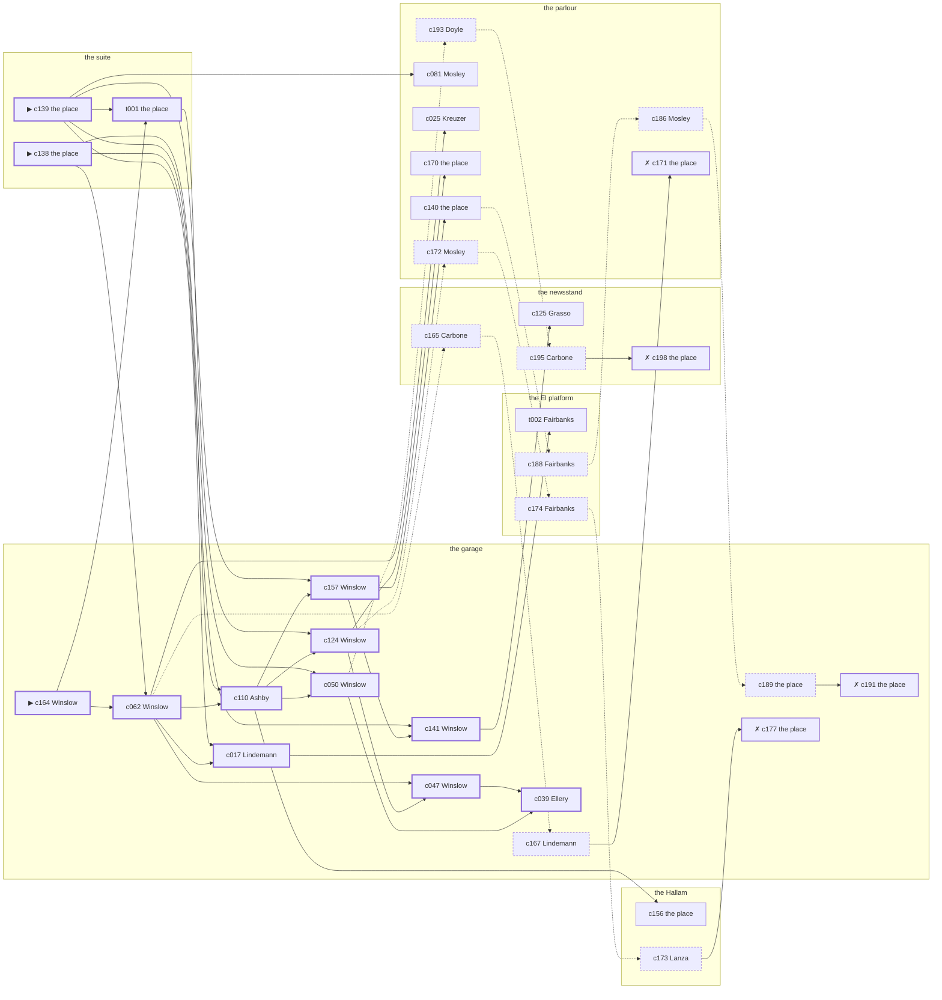

# the Upper West Side — case 9

**Seed** 9 · **Difficulty** 2 · **Attempts** 1 · **Detective** Dashiell

**Type** murder · **Trope** body-at-scene · **Unknowns** who, why, when

**Par** 11 actions · **Slack** 6 · **Budget** 17 · **Findable** 34 (spine 13, corroboration 7, noise 10 + 4 disqualifiers) · **Noise ratio** 41% · **Candidate pool** 201

## 1. The Truth

Anneliese Kreuzer, a stagehand at the Selwyn, a customer of Quill’s, killed Martin Quill, a bail bondsman, with strangling with a cord at the suite at 8:00 PM. Kreuzer blamed Quill for the ruin of Kreuzer’s business (revenge). Kreuzer had been at the parlour earlier in the evening, where the means lived, and was alone with Quill when it happened. Winslow hired us.

## 2. The Act

**murder** · **body-at-scene** · actor **Kreuzer** · at **the suite** · at **8:00 PM**

- found at the suite
- fate: dead

**Givens** — what the briefing states and the report does not ask:

- Quill was found dead at the suite.
- Quill was killed at the suite, and nothing was carried out of the room afterwards.
- The coroner puts it between 7:30 PM and 9:00 PM, which is two hours of nothing useful.
- It was strangling with a cord.

**Unknowns** — exactly what the report asks: **who**, **why**, **when**.

## 3. Dramatis Personae

| Name | Role | Relationship | Class of secret | Motive | Found at | Killer |
| --- | --- | --- | --- | --- | --- | --- |
| Martin Quill | a bail bondsman | the victim | — | — | — | — |
| Delia Doyle | a private nurse | named in Quill’s will | hidden-family | — | the parlour | — |
| Karl Lindemann | the owner of the block | Quill’s landlord | fence | — | the garage | — |
| Anneliese Kreuzer | a stagehand at the Selwyn | a customer of Quill’s | murder (+ gambling-debt) | revenge | the parlour | **YES** |
| Ellsworth Ellery | a ward heeler | a witness against the people Quill worked for | gambling-debt | silence-a-witness | the garage | — |
| Rutherford Winslow (client) | a stringer for the evening papers | a witness against the people Quill worked for | gambling-debt | exposure | the garage | — |
| Rosaria Grasso | a curb broker | in Quill’s debt | fence | debt | the newsstand | — |
| Lurline Mosley | the landlady | fixture (landlady) | — | — | the parlour | — |
| Concetta Carbone | the news dealer | fixture (newsstand) | — | — | the newsstand | — |
| Nunzio Lanza | the elevator man | fixture (elevator-man) | — | — | the Hallam | — |
| Augustus Ashby | the man behind the counter | fixture (counterman) | — | — | the garage | — |
| Prescott Fairbanks | the patrolman on the beat | fixture (beat-cop) | — | — | the El platform | — |

## 4. Dossiers

Every person, by layer: **0** on sight, **1** volunteered, **2** from other people, **3** in the documents.

### Quill — the victim

49, a man, a bail bondsman. Wants: money.

- **Standing** — Quill had stood bail for most of the block at one time or another, and held the paper still.
- **Profession** — Quill wrote bonds out of an office across from the courthouse.
- **Found** — Doyle found Quill at the suite at 11:30 PM. By Doyle, at the suite, at 11:30 PM. Precinct: came-and-went.

**Layer 0, on sight**

- _gender_ — A man.
- _age_ — In his forties.

**Layer 1, volunteered**

- _profession_ — A bail bondsman.
- _detail_ — Quill wrote bonds out of an office across from the courthouse.

**Layer 2, from other people**

- _tie_ — Quill had stood bail for most of the block at one time or another, and held the paper still.
- _want_ — Quill wants money, and is not particular about the shape it arrives in.

**Self-account** (layer 1, what they say when asked about themselves)

- Quill is 49 years old and a bail bondsman.
- Quill wrote bonds out of an office across from the courthouse.
- Quill is the one this is about.

### Doyle

28, a woman, a private nurse. Wants: to-be-left-alone. Tie: named in Quill’s will, for as long as there has been a will.

**Layer 0, on sight**

- _gender_ — A woman.
- _age_ — In the late twenties.
- _profession_ — A private nurse.

**Layer 1, volunteered**

- _detail_ — Doyle has a registry card and takes the cases nobody else will.

**Layer 2, from other people**

- _tie_ — Doyle and Francis Callahan are both named in it, and only one of them knows.
- _want_ — Doyle wants to be left alone.
- _since_ — Doyle has been named in Quill’s will, for as long as there has been a will.
- _third_ — Francis Callahan is the man who held the second mortgage.

**Layer 3, in the documents**

- _secret-hint_ — Doyle sends money out of every pay envelope and cannot say where it goes.

**Self-account** (layer 1, what they say when asked about themselves)

- Doyle is 28 years old and a private nurse.
- Doyle has a registry card and takes the cases nobody else will.
- Doyle is named in Quill’s will.

### Lindemann

54, a man, the owner of the block. Wants: to-keep-what-they-have. Tie: Quill’s landlord, two leases running.

**Layer 0, on sight**

- _gender_ — A man.
- _age_ — In his fifties.

**Layer 1, volunteered**

- _profession_ — The owner of the block.
- _detail_ — Lindemann has a boilerman, a lawyer and no partners.

**Layer 2, from other people**

- _tie_ — Quill rented from Lindemann and was three months behind when it happened.
- _want_ — Lindemann wants to keep what they have and add nothing to it.
- _since_ — Lindemann has been Quill’s landlord, two leases running.

**Layer 3, in the documents**

- _secret-hint_ — Lindemann was carrying a parcel into the garage and came out without it.

**Self-account** (layer 1, what they say when asked about themselves)

- Lindemann is 54 years old and the owner of the block.
- Lindemann has a boilerman, a lawyer and no partners.
- Lindemann is Quill’s landlord.

### Kreuzer — the killer

31, a woman, a stagehand at the Selwyn. Wants: to-be-somebody. Tie: a customer of Quill’s, since the shop opened.

**Layer 0, on sight**

- _gender_ — A woman.
- _age_ — In her thirties.
- _profession_ — A stagehand at the Selwyn.

**Layer 1, volunteered**

- _detail_ — Kreuzer sets and strikes for whatever is playing.

**Layer 2, from other people**

- _tie_ — Kreuzer came to Quill on Emilio Vitale’s introduction and has stayed a customer.
- _want_ — Kreuzer wants a name people know.
- _since_ — Kreuzer has been a customer of Quill’s, since the shop opened.
- _third_ — Emilio Vitale is a cousin who went back to the old country.

**Layer 3, in the documents**

- _secret-hint_ — Kreuzer was asking around for a hundred dollars in a hurry earlier in the week.

**Self-account** (layer 1, what they say when asked about themselves)

- Kreuzer is 31 years old and a stagehand at the Selwyn.
- Kreuzer sets and strikes for whatever is playing.
- Kreuzer is a customer of Quill’s.

### Ellery

42, a man, a ward heeler. Wants: to-be-somebody. Tie: a witness against the people Quill worked for, since last autumn.

**Layer 0, on sight**

- _gender_ — A man.
- _age_ — In his forties.

**Layer 1, volunteered**

- _profession_ — A ward heeler.
- _detail_ — Ellery delivers the vote on the block and the coal in February.

**Layer 2, from other people**

- _tie_ — Ellery talked to the district attorney in ’24 and Albrecht Dettweiler has not spoken to Ellery since.
- _want_ — Ellery wants a name people know.
- _since_ — Ellery has been a witness against the people Quill worked for, since last autumn.
- _third_ — Albrecht Dettweiler is the clerk who kept the ledger before.

**Layer 3, in the documents**

- _secret-hint_ — Ellery was asking around for a hundred dollars in a hurry earlier in the week.

**Self-account** (layer 1, what they say when asked about themselves)

- Ellery is 42 years old and a ward heeler.
- Ellery delivers the vote on the block and the coal in February.
- Ellery is a witness against the people Quill worked for.

### Winslow — the client

44, a man, a stringer for the evening papers. Wants: to-get-out. Tie: a witness against the people Quill worked for, since the indictment.

**Layer 0, on sight**

- _gender_ — A man.
- _age_ — In his forties.

**Layer 1, volunteered**

- _profession_ — A stringer for the evening papers.
- _detail_ — Winslow sells two hundred words at a time to whichever desk is short.

**Layer 2, from other people**

- _tie_ — Winslow talked to the district attorney in ’25 and Lyman Stannard has not spoken to Winslow since.
- _want_ — Winslow wants out of the neighbourhood and has wanted it for years.
- _since_ — Winslow has been a witness against the people Quill worked for, since the indictment.
- _third_ — Lyman Stannard is an old friend who once put up the bail.

**Layer 3, in the documents**

- _secret-hint_ — Winslow was asking around for a hundred dollars in a hurry earlier in the week.

**Self-account** (layer 1, what they say when asked about themselves)

- Winslow is 44 years old and a stringer for the evening papers.
- Winslow sells two hundred words at a time to whichever desk is short.
- Winslow is a witness against the people Quill worked for.

### Grasso

38, a woman, a curb broker. Wants: money. Tie: in Quill’s debt, since ’26.

**Layer 0, on sight**

- _gender_ — A woman.
- _age_ — In her thirties.

**Layer 1, volunteered**

- _profession_ — A curb broker.
- _detail_ — Grasso carries three telephone numbers and no office.

**Layer 2, from other people**

- _tie_ — Quill carried Grasso through a bad winter and has been collecting on it ever since.
- _want_ — Grasso wants money, and is not particular about the shape it arrives in.
- _since_ — Grasso has been in Quill’s debt, since ’26.

**Layer 3, in the documents**

- _secret-hint_ — Grasso was carrying a parcel into the newsstand and came out without it.

**Self-account** (layer 1, what they say when asked about themselves)

- Grasso is 38 years old and a curb broker.
- Grasso carries three telephone numbers and no office.
- Grasso is in Quill’s debt.

### Mosley

44, a woman, the landlady. Wants: money. Tie: the keeper of the parlour.

**Layer 0, on sight**

- _gender_ — A woman.
- _age_ — In her forties.
- _profession_ — The landlady.

**Layer 1, volunteered**

- _detail_ — Mosley keeps the parlour and sits where she can see the stairs.

**Layer 2, from other people**

- _tie_ — Mosley is the keeper of the parlour.
- _want_ — Mosley wants money, and is not particular about the shape it arrives in.

**Self-account** (layer 1, what they say when asked about themselves)

- Mosley is 44 years old and the landlady.
- Mosley keeps the parlour and sits where she can see the stairs.
- Mosley is the keeper of the parlour.

### Carbone

41, a woman, the news dealer. Wants: to-be-left-alone. Tie: at the stand at the newsstand, every day of the year.

**Layer 0, on sight**

- _gender_ — A woman.
- _age_ — In her forties.
- _profession_ — The news dealer.

**Layer 1, volunteered**

- _detail_ — Carbone has had the stand at the newsstand for twenty years and knows every regular by their paper.

**Layer 2, from other people**

- _tie_ — Carbone is at the stand at the newsstand, every day of the year.
- _want_ — Carbone wants to be left alone.

**Self-account** (layer 1, what they say when asked about themselves)

- Carbone is 41 years old and the news dealer.
- Carbone has had the stand at the newsstand for twenty years and knows every regular by their paper.
- Carbone is at the stand at the newsstand, every day of the year.

### Lanza

57, a man, the elevator man. Wants: to-keep-what-they-have. Tie: in the car at the Hallam.

**Layer 0, on sight**

- _gender_ — A man.
- _age_ — In his fifties.
- _profession_ — The elevator man.

**Layer 1, volunteered**

- _detail_ — Lanza has run the car at the Hallam for eleven years and never lost a day.

**Layer 2, from other people**

- _tie_ — Lanza is in the car at the Hallam.
- _want_ — Lanza wants to keep what they have and add nothing to it.

**Self-account** (layer 1, what they say when asked about themselves)

- Lanza is 57 years old and the elevator man.
- Lanza has run the car at the Hallam for eleven years and never lost a day.
- Lanza is in the car at the Hallam.

### Ashby

26, a man, the man behind the counter. Wants: to-get-out. Tie: behind the counter at the garage.

**Layer 0, on sight**

- _gender_ — A man.
- _age_ — In the late twenties.
- _profession_ — The man behind the counter.

**Layer 1, volunteered**

- _detail_ — Ashby serves at the garage and has never once been asked his name.

**Layer 2, from other people**

- _tie_ — Ashby is behind the counter at the garage.
- _want_ — Ashby wants out of the neighbourhood and has wanted it for years.

**Self-account** (layer 1, what they say when asked about themselves)

- Ashby is 26 years old and the man behind the counter.
- Ashby serves at the garage and has never once been asked his name.
- Ashby is behind the counter at the garage.

### Fairbanks

44, a man, the patrolman on the beat. Wants: to-be-feared. Tie: the patrolman whose post takes in the El platform.

**Layer 0, on sight**

- _gender_ — A man.
- _age_ — In his forties.
- _profession_ — The patrolman on the beat.

**Layer 1, volunteered**

- _detail_ — Fairbanks came on at six and will go off at two, the same as every night.

**Layer 2, from other people**

- _tie_ — Fairbanks is the patrolman whose post takes in the El platform.
- _want_ — Fairbanks wants to be the one people are careful around.

**Self-account** (layer 1, what they say when asked about themselves)

- Fairbanks is 44 years old and the patrolman on the beat.
- Fairbanks came on at six and will go off at two, the same as every night.
- Fairbanks is the patrolman whose post takes in the El platform.

## 5. The Client

**Winslow**, a witness against the people Quill worked for. Purpose: **find-the-killer-police-wont**.

- **Why** — Winslow wants the one who killed Quill found, because the precinct has stopped looking.
- **What it costs** — Winslow knows that asking questions on this block is a way of being asked some.
- **Points at** — Ellery: Ellery needed Quill silent before the grand jury. Honest: **yes**.

**Tells:**

- Quill was found dead at the suite.
- Quill was killed at the suite, and nothing was carried out of the room afterwards.
- The coroner puts it between 7:30 PM and 9:00 PM, which is two hours of nothing useful.
- It was strangling with a cord.
- Winslow would rather we started with Ellery: Ellery needed Quill silent before the grand jury.

**Withholds:**

- Winslow does not mention it, but Winslow slips off to the garage from 10:30 PM to settle with a bookmaker.

**Their own evening, as they tell it:**

- Winslow says he was at the newsstand at 6:00 PM.
- Winslow says he was at the garage at 6:30 PM.
- Winslow says he was at the newsstand from 7:00 PM to 7:30 PM.
- Winslow says he was at the parlour at 8:00 PM.

## 6. The Briefing

16 plain sentences, derived. This is the model of the plain register: the engine renders it, and Phase 2 measures pages against it.

1. A man came up the stairs after midnight, and sat down.
2. Rutherford Winslow is 44 years old and a stringer for the evening papers.
3. Winslow sells two hundred words at a time to whichever desk is short.
4. Quill had stood bail for most of the block at one time or another, and held the paper still.
5. Quill was found dead at the suite.
6. Quill was killed at the suite, and nothing was carried out of the room afterwards.
7. The coroner puts it between 7:30 PM and 9:00 PM, which is two hours of nothing useful.
8. It was strangling with a cord.
9. Doyle found Quill at the suite at 11:30 PM.
10. The precinct came, walked through it, and went.
11. Winslow is a witness against the people Quill worked for.
12. Winslow talked to the district attorney in ’25 and Lyman Stannard has not spoken to Winslow since.
13. Winslow wants the one who killed Quill found, because the precinct has stopped looking.
14. Winslow knows that asking questions on this block is a way of being asked some.
15. Winslow wants us to start with Ellery.
16. Ellery needed Quill silent before the grand jury.

## 7. Mentions

- **Francis Callahan** (m-1) — the man who held the second mortgage. Francis Callahan is the man who held the second mortgage.
- **Emilio Vitale** (m-2) — a cousin who went back to the old country. Emilio Vitale is a cousin who went back to the old country.
- **Albrecht Dettweiler** (m-3) — the clerk who kept the ledger before. Albrecht Dettweiler is the clerk who kept the ledger before.
- **Lyman Stannard** (m-4) — an old friend who once put up the bail. Lyman Stannard is an old friend who once put up the bail.

## 8. Places

- **the parlour of Mrs. Teague’s boarding house** (semi) — watched by landlady (Mosley); objects: a length of sash cord, a framed photograph, a wall telephone — where the weapon lived; within earshot of the scene
- **the El platform at Twenty-Third Street** (public) — unwatched; objects: a folded stack of evening papers, a pasted-up timetable
- **the newsstand on the corner** (public) — watched by newsstand (Carbone); objects: the roof-door key, a spike of pawn tickets — within earshot of the scene
- **the vestibule of the Hallam apartments** (private) — watched by elevator-man (Lanza); objects: a nickel-plated revolver, a day ledger
- **the garage on Eleventh Avenue** (semi) — watched by counterman (Ashby); objects: an ice pick, a mechanic’s toolbox
- **Quill’s suite at the residential hotel** (private) — unwatched; objects: a silver cigarette case, a bottle of chloral drops — **THE SCENE**; the victim’s address

## 9. Anchors

The coroner gives 7:30 PM–9:00 PM, four ticks wide. These are what close it: **fuse** and **ice-delivery**.

- **the ice being brought in** — at 7:30 PM; at the newsstand. Somebody reliable notes who was there. Only those present know that the iceman dropped a block on the step and it went in three. Those present carry it: a wet patch down one side of a coat.
- **the fuse going in the building** — at 8:00 PM; at the suite. You can time things by it: a crack in the cellar and every light on the riser out at once. Only those present know that it was the second floor that went dark and not the whole house. Those present carry it: candle smoke on the ceilings of everyone who sat it out.
- **the beat cop’s pass** — at 6:30 PM, 8:00 PM, 9:30 PM, 11:00 PM; on a round through the El platform → the garage → the newsstand → the parlour. Somebody reliable notes who was there.

## 10. Timelines

### Quill — the victim

| Tick | Time | Truth | Claimed | Companion claimed |
| --- | --- | --- | --- | --- |
| 0 | 6:00 PM | the newsstand | the newsstand | — |
| 1 | 6:30 PM | the newsstand | the newsstand | — |
| 2 | 7:00 PM | the newsstand | the newsstand | — |
| 3 | 7:30 PM | the newsstand | the newsstand | — |
| 4 | 8:00 PM | the suite ☠ | the suite | — |
| 5 | 8:30 PM | — | — | — |
| 6 | 9:00 PM | — | — | — |
| 7 | 9:30 PM | — | — | — |
| 8 | 10:00 PM | — | — | — |
| 9 | 10:30 PM | — | — | — |
| 10 | 11:00 PM | — | — | — |
| 11 | 11:30 PM | — | — | — |

### Doyle

| Tick | Time | Truth | Claimed | Companion claimed |
| --- | --- | --- | --- | --- |
| 0 | 6:00 PM | the newsstand | the newsstand | — |
| 1 | 6:30 PM | the Hallam | the Hallam | — |
| 2 | 7:00 PM | the newsstand | the newsstand | — |
| 3 | 7:30 PM | the parlour | **the Hallam** | Kreuzer |
| 4 | 8:00 PM | the parlour | **the Hallam** | Kreuzer |
| 5 | 8:30 PM | the parlour | the parlour | — |
| 6 | 9:00 PM | the parlour | the parlour | — |
| 7 | 9:30 PM | the garage | the garage | — |
| 8 | 10:00 PM | the garage | the garage | — |
| 9 | 10:30 PM | the parlour | the parlour | — |
| 10 | 11:00 PM | the parlour | the parlour | — |
| 11 | 11:30 PM | the suite | the suite | — |

### Lindemann

| Tick | Time | Truth | Claimed | Companion claimed |
| --- | --- | --- | --- | --- |
| 0 | 6:00 PM | the parlour | the parlour | — |
| 1 | 6:30 PM | the garage | **the Hallam** | — |
| 2 | 7:00 PM | the garage | **the Hallam** | — |
| 3 | 7:30 PM | the garage | the garage | — |
| 4 | 8:00 PM | the parlour | the parlour | — |
| 5 | 8:30 PM | the newsstand | the newsstand | — |
| 6 | 9:00 PM | the garage | the garage | — |
| 7 | 9:30 PM | the Hallam | the Hallam | — |
| 8 | 10:00 PM | the Hallam | the Hallam | — |
| 9 | 10:30 PM | the El platform | the El platform | — |
| 10 | 11:00 PM | the newsstand | the newsstand | — |
| 11 | 11:30 PM | the Hallam | the Hallam | — |

### Kreuzer — the killer

| Tick | Time | Truth | Claimed | Companion claimed |
| --- | --- | --- | --- | --- |
| 0 | 6:00 PM | the newsstand | **the El platform** | — |
| 1 | 6:30 PM | the newsstand | **the El platform** | — |
| 2 | 7:00 PM | the parlour | the parlour | — |
| 3 | 7:30 PM | the parlour | the parlour | — |
| 4 | 8:00 PM | the suite ☠ | **the parlour** | — |
| 5 | 8:30 PM | the garage | the garage | — |
| 6 | 9:00 PM | the parlour | the parlour | — |
| 7 | 9:30 PM | the parlour | the parlour | — |
| 8 | 10:00 PM | the Hallam | the Hallam | — |
| 9 | 10:30 PM | the Hallam | the Hallam | — |
| 10 | 11:00 PM | the newsstand | the newsstand | — |
| 11 | 11:30 PM | the garage | the garage | — |

### Ellery

| Tick | Time | Truth | Claimed | Companion claimed |
| --- | --- | --- | --- | --- |
| 0 | 6:00 PM | the newsstand | the newsstand | — |
| 1 | 6:30 PM | the newsstand | the newsstand | — |
| 2 | 7:00 PM | the parlour | the parlour | — |
| 3 | 7:30 PM | the parlour | the parlour | — |
| 4 | 8:00 PM | the garage | **the parlour** | Kreuzer |
| 5 | 8:30 PM | the garage | **the parlour** | Kreuzer |
| 6 | 9:00 PM | the garage | the garage | — |
| 7 | 9:30 PM | the garage | the garage | — |
| 8 | 10:00 PM | the garage | the garage | — |
| 9 | 10:30 PM | the garage | the garage | — |
| 10 | 11:00 PM | the El platform | the El platform | — |
| 11 | 11:30 PM | the El platform | the El platform | — |

### Winslow

| Tick | Time | Truth | Claimed | Companion claimed |
| --- | --- | --- | --- | --- |
| 0 | 6:00 PM | the newsstand | the newsstand | — |
| 1 | 6:30 PM | the garage | the garage | — |
| 2 | 7:00 PM | the newsstand | the newsstand | — |
| 3 | 7:30 PM | the newsstand | the newsstand | — |
| 4 | 8:00 PM | the parlour | the parlour | — |
| 5 | 8:30 PM | the garage | the garage | — |
| 6 | 9:00 PM | the El platform | the El platform | — |
| 7 | 9:30 PM | the El platform | the El platform | — |
| 8 | 10:00 PM | the garage | the garage | — |
| 9 | 10:30 PM | the garage | **the parlour** | — |
| 10 | 11:00 PM | the newsstand | the newsstand | — |
| 11 | 11:30 PM | the garage | the garage | — |

### Grasso

| Tick | Time | Truth | Claimed | Companion claimed |
| --- | --- | --- | --- | --- |
| 0 | 6:00 PM | the newsstand | **the Hallam** | — |
| 1 | 6:30 PM | the newsstand | **the Hallam** | — |
| 2 | 7:00 PM | the newsstand | the newsstand | — |
| 3 | 7:30 PM | the newsstand | the newsstand | — |
| 4 | 8:00 PM | the parlour | the parlour | — |
| 5 | 8:30 PM | the El platform | the El platform | — |
| 6 | 9:00 PM | the parlour | the parlour | — |
| 7 | 9:30 PM | the parlour | the parlour | — |
| 8 | 10:00 PM | the parlour | the parlour | — |
| 9 | 10:30 PM | the newsstand | the newsstand | — |
| 10 | 11:00 PM | the newsstand | the newsstand | — |
| 11 | 11:30 PM | the garage | the garage | — |

### Fixtures (never lie, never withhold)

| Tick | Time | Mosley (the landlady) | Carbone (the news dealer) | Lanza (the elevator man) | Ashby (the man behind the counter) | Fairbanks (the patrolman on the beat) |
| --- | --- | --- | --- | --- | --- | --- |
| 0 | 6:00 PM | the parlour | the newsstand | the Hallam | the garage | — |
| 1 | 6:30 PM | the parlour | the newsstand | the Hallam | the Hallam | the El platform |
| 2 | 7:00 PM | the parlour | the newsstand | the Hallam | the garage | — |
| 3 | 7:30 PM | the parlour | the newsstand | the Hallam | the garage | — |
| 4 | 8:00 PM | the parlour | the newsstand | the Hallam | the garage | the garage |
| 5 | 8:30 PM | the parlour | the newsstand | the Hallam | the garage | — |
| 6 | 9:00 PM | the parlour | the Hallam | the Hallam | the garage | — |
| 7 | 9:30 PM | the parlour | the newsstand | the Hallam | the garage | the newsstand |
| 8 | 10:00 PM | the parlour | the newsstand | the Hallam | the garage | — |
| 9 | 10:30 PM | the parlour | the newsstand | the Hallam | the garage | — |
| 10 | 11:00 PM | the parlour | the newsstand | the Hallam | the garage | the parlour |
| 11 | 11:30 PM | the parlour | the newsstand | the Hallam | the garage | — |

## 11. Secrets in play

- **Doyle** (hidden-family): Doyle goes to the parlour from 7:30 PM to 8:00 PM to see a child nobody is supposed to know about.
- **Lindemann** (fence): Lindemann hands a parcel of stolen goods to a man at the garage from 6:30 PM to 7:00 PM.
- **Kreuzer** (murder): Kreuzer is at the suite from 8:00 PM, alone with Quill when it happens at 8:00 PM.
- **Kreuzer** also (gambling-debt): Kreuzer slips off to the newsstand from 6:00 PM to 6:30 PM to settle with a bookmaker.
- **Ellery** (gambling-debt): Ellery slips off to the garage from 8:00 PM to 8:30 PM to settle with a bookmaker.
- **Winslow** (gambling-debt): Winslow slips off to the garage from 10:30 PM to settle with a bookmaker.
- **Grasso** (fence): Grasso hands a parcel of stolen goods to a man at the newsstand from 6:00 PM to 6:30 PM.

## 12. Clue list — the 34 findable

The opening three, free at the start: c138, c139, c164. Everything else has to be led to. The full candidate pool is in the companion file.

### At the parlour

- **c140** [corroboration] (physical; the place itself) → c188
  - A length of sash cord is gone from the parlour. A cut end of the same hemp is still tied to the fitting it was taken from.
  - _establishes: something gone from the parlour; how it was done_
- **c081** [corroboration] (observation; Mosley on Kreuzer) → (end)
  - Mosley says Kreuzer was at the parlour from 7:00 PM to 7:30 PM.
  - _establishes: Kreuzer at the parlour, 7:00 PM–7:30 PM; Kreuzer could reach the weapon_
- **c025** [corroboration] (observation; Kreuzer on Ellery) → (end)
  - Kreuzer says Ellery was at the parlour from 7:00 PM to 7:30 PM.
  - _establishes: Ellery at the parlour, 7:00 PM–7:30 PM; Ellery could reach the weapon_
- **c170** [corroboration] (overheard; the place itself) → (end)
  - The woman who keeps the child says it straight out: Doyle was at the parlour from 7:30 PM to 8:00 PM, the same as every week, and left with the same face as always.
  - _establishes: Doyle’s hidden-family accounted for; Doyle at the parlour, 7:30 PM–8:00 PM_
- **c186** [noise {b1}] (overheard; Mosley on Winslow) → c189
  - Mosley on Winslow: Winslow was asking around for a hundred dollars in a hurry earlier in the week.
  - _establishes: context only_
- **c172** [noise {b2}] (overheard; Mosley on Lindemann) → c174
  - Mosley on Lindemann: Lindemann was carrying a parcel into the garage and came out without it.
  - _establishes: context only_
- **c193** [noise {b3}] (overheard; Doyle on Grasso) → c195
  - Doyle on Grasso: Grasso was carrying a parcel into the newsstand and came out without it.
  - _establishes: context only_
- **c171** [disqualifier {b4}] (overheard; the place itself) → (end)
  - The parish register at the parlour has the christening in it, and the board money receipted through the evening in question.
  - _establishes: Doyle’s hidden-family accounted for; Doyle at the parlour, 7:30 PM–8:00 PM_

### At the El platform

- **t002** [corroboration] (overheard; Fairbanks on the suite that evening) → (end)
  - Fairbanks says the door at the suite was shut from 8:00 PM on, and nobody came out of it carrying anything.
  - _establishes: Quill at the suite, 8:00 PM_
- **c188** [noise {b1}] (overheard; Fairbanks on Winslow) → c186
  - Fairbanks on Winslow: Winslow goes very quiet when the racing wire is mentioned.
  - _establishes: context only_
- **c174** [noise {b2}] (overheard; Fairbanks on Lindemann) → c173
  - Fairbanks on Lindemann: Lindemann has been selling things that were never Lindemann’s to sell.
  - _establishes: context only_

### At the newsstand

- **c125** [corroboration] (observation; Grasso on Kreuzer’s account) → (end)
  - Grasso was at the parlour at 8:00 PM and says Kreuzer was not.
  - _establishes: Kreuzer not at the parlour, 8:00 PM_
- **c195** [noise {b3}] (overheard; Carbone on Grasso) → c198
  - Carbone on Grasso: Grasso has been selling things that were never Grasso’s to sell.
  - _establishes: context only_
- **c198** [disqualifier {b3}] (overheard; the place itself) → (end)
  - The receiver at the newsstand would rather talk than be held: Grasso was there from 6:00 PM to 6:30 PM handing over a parcel of somebody else’s silver, which is a charge Grasso will take over this one.
  - _establishes: Grasso’s fence accounted for; Grasso at the newsstand, 6:00 PM–6:30 PM_
- **c165** [noise {b4}] (overheard; Carbone on Doyle) → c167
  - Carbone on Doyle: Doyle sends money out of every pay envelope and cannot say where it goes.
  - _establishes: context only_

### At the Hallam

- **c156** [corroboration] (document; the place itself) → (end)
  - Found at the Hallam: A clipping about the failure of Kreuzer’s business, with Quill’s name underlined twice in pencil.
  - _establishes: Kreuzer had a motive (revenge)_
- **c173** [noise {b2}] (overheard; Lanza on Lindemann) → c177
  - Lanza on Lindemann: There is a man who meets people at the garage and nobody will say his name out loud.
  - _establishes: context only_

### At the garage

- **c164** [spine ⟨opening⟩] (client; Winslow on why I was hired) → t001, c062
  - Winslow hired us, and wants it known that Ellery needed Quill silent before the grand jury, and would rather we started there.
  - _establishes: Ellery had a motive (silence-a-witness)_
- **c062** [spine] (observation; Winslow on Grasso) → c110, c047, c017, c025, c165
  - Winslow says Grasso was at the parlour at 8:00 PM.
  - _establishes: Grasso at the parlour, 8:00 PM_
- **c110** [spine] (observation; Ashby on Ellery) → c124, c157, c050, c156
  - Ashby says Ellery was at the garage from 8:00 PM to 10:30 PM.
  - _establishes: Ellery at the garage, 8:00 PM–10:30 PM_
- **c124** [spine] (observation; Winslow on Kreuzer’s account) → c047, c170, c172
  - Winslow was at the parlour at 8:00 PM and says Kreuzer was not.
  - _establishes: Kreuzer not at the parlour, 8:00 PM_
- **c047** [spine] (observation; Winslow on Doyle) → c039
  - Winslow says Doyle was at the parlour at 8:00 PM.
  - _establishes: Doyle at the parlour, 8:00 PM_
- **c157** [spine] (overheard; Winslow on Kreuzer and Quill) → c141, c140
  - Winslow says Kreuzer said Quill had taken everything and would be made to feel it.
  - _establishes: Kreuzer had a motive (revenge)_
- **c017** [spine] (observation; Lindemann on Winslow) → t002
  - Lindemann says Winslow was at the parlour at 8:00 PM.
  - _establishes: Winslow at the parlour, 8:00 PM_
- **c050** [spine] (observation; Winslow on Lindemann) → c039, c193
  - Winslow says Lindemann was at the parlour at 8:00 PM.
  - _establishes: Lindemann at the parlour, 8:00 PM_
- **c039** [spine] (observation; Ellery on Kreuzer) → (end)
  - Ellery says Kreuzer was at the parlour from 7:00 PM to 7:30 PM.
  - _establishes: Kreuzer at the parlour, 7:00 PM–7:30 PM; Kreuzer could reach the weapon_
- **c141** [spine] (anchor; Winslow on Quill that evening) → c125
  - Winslow puts Quill at the newsstand when the ice came, which was 7:30 PM, and alive enough to argue about the weather.
  - _establishes: the victim alive at 7:30 PM; Quill at the newsstand, 7:30 PM_
- **c189** [noise {b1}] (physical; the place itself) → c191
  - Betting slips at the garage in Winslow’s pocketbook, all of them losers, all of them this month.
  - _establishes: context only_
- **c191** [disqualifier {b1}] (overheard; the place itself) → (end)
  - The bookmaker’s runner is found and will say it: Winslow was at the garage from 10:30 PM paying off eleven hundred dollars, a dollar at a time, and went nowhere near the killing.
  - _establishes: Winslow’s gambling-debt accounted for; Winslow at the garage, 10:30 PM_
- **c177** [disqualifier {b2}] (overheard; the place itself) → (end)
  - The receiver at the garage would rather talk than be held: Lindemann was there from 6:30 PM to 7:00 PM handing over a parcel of somebody else’s silver, which is a charge Lindemann will take over this one.
  - _establishes: Lindemann’s fence accounted for; Lindemann at the garage, 6:30 PM–7:00 PM_
- **c167** [noise {b4}] (overheard; Lindemann on Doyle) → c171
  - Lindemann on Doyle: Doyle keeps a photograph and will not be asked about it twice.
  - _establishes: context only_

### At the suite

- **c138** [spine ⟨opening⟩] (scene; the place itself) → c062, c050, c141
  - Quill was found at the suite. His watch glass broke against the floor and the hands have not moved since. The fuse went at 8:00 PM and the lights on that riser were dead from then until the morning.
  - _establishes: the victim dead by 8:00 PM; how it was done_
- **c139** [spine ⟨opening⟩] (morgue; the place itself) → t001, c110, c157, c017, c081
  - The coroner puts death between 7:30 PM and 9:00 PM — two hours of nothing useful. A ligature furrow across the throat. Three fibres of hemp in the skin.
  - _establishes: death between 7:30 PM and 9:00 PM; how it was done_
- **t001** [spine] (physical; the place itself) → c124
  - The rug at the suite is rucked up under Quill and the chair beside it went over backwards. Nothing was carried out of the room.
  - _establishes: Quill at the suite, 8:00 PM_

## 13. Clue graph

## 14. Deduction path

Par is **11 actions** and the budget is par plus 6: **17**. Every id below is a spine clue; the inference is the sheet’s, not the clue’s.

**Time of death.** The coroner gives four ticks. The anchors close it to 8:00 PM: one puts Quill alive at 7:30 PM, the other times the scene at 8:00 PM. _(c139, c141, c138)_

**Clearing the innocent.**

- Doyle was not at the suite at 8:00 PM. _(c047; + 2 corroborating)_
- Lindemann was not at the suite at 8:00 PM. _(c050)_
- Ellery was not at the suite at 8:00 PM. _(c110)_
- Winslow was not at the suite at 8:00 PM. _(c017)_
- Grasso was not at the suite at 8:00 PM. _(c062)_

**Naming the killer.** Kreuzer claims the parlour at 8:00 PM. Two independent sources put that out of the question. _(c124; + 1 corroborating)_

**The weapon.** Kreuzer was at the parlour before 8:00 PM, where a length of sash cord was kept. _(c039; + 1 corroborating)_

**Method.** Strangling with a cord, on two physical sources. _(c138, c139; + 1 corroborating)_

**Motive.** revenge, on two independent sources. _(c157; + 1 corroborating)_

## 15. Red herrings

**Innocents who lie about the murder tick:**

- Doyle claims the Hallam at 8:00 PM and was really at the parlour. Reason: Doyle goes to the parlour from 7:30 PM to 8:00 PM to see a child nobody is supposed to know about.
- Ellery claims the parlour at 8:00 PM and was really at the garage. Reason: Ellery slips off to the garage from 8:00 PM to 8:30 PM to settle with a bookmaker.

**Innocents with a motive:**

- Ellery — silence-a-witness: needed Quill silent before the grand jury.
- Winslow — exposure: was about to be exposed by Quill.
- Grasso — debt: owed Quill four thousand dollars and was past due on it.

**Noise branches, and what knocks each one down:**

- **b1** (Winslow, gambling-debt): c188 → c186 → c189 → **c191** — The bookmaker’s runner is found and will say it: Winslow was at the garage from 10:30 PM paying off eleven hundred dollars, a dollar at a time, and went nowhere near the killing.
- **b2** (Lindemann, fence): c172 → c174 → c173 → **c177** — The receiver at the garage would rather talk than be held: Lindemann was there from 6:30 PM to 7:00 PM handing over a parcel of somebody else’s silver, which is a charge Lindemann will take over this one.
- **b3** (Grasso, fence): c193 → c195 → **c198** — The receiver at the newsstand would rather talk than be held: Grasso was there from 6:00 PM to 6:30 PM handing over a parcel of somebody else’s silver, which is a charge Grasso will take over this one.
- **b4** (Doyle, hidden-family): c165 → c167 → **c171** — The parish register at the parlour has the christening in it, and the board money receipted through the evening in question.

