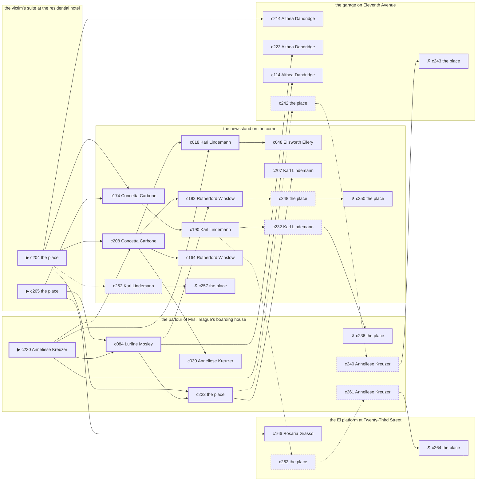

# the Upper West Side — case 9

**Seed** 9 · **Difficulty** 2 · **Attempts** 1 · **Detective** Humphrey

**Par** 8 actions · **Budget** 20 · **Slack** 12 · **Findable** 30 (spine 9, corroboration 9, noise 7 + 5 disqualifiers) · **Noise ratio** 40% · **Candidate pool** 265

## 1. The Truth

Anneliese Kreuzer, a stagehand at the Selwyn, a customer of the victim’s, killed Martin Quill, a bail bondsman, with strangling with a cord at the victim’s suite at the residential hotel at 9:00 PM. Anneliese Kreuzer blamed the victim for a ruin (revenge). Anneliese Kreuzer had been at the parlour of Mrs. Teague’s boarding house earlier in the evening, where the weapon lived, and was alone with Martin Quill when it happened. Anneliese Kreuzer is also the client: the killer hired us.

## 2. Dramatis Personae

| Name | Role | Relationship | Class of secret | Motive | Found at | Killer |
| --- | --- | --- | --- | --- | --- | --- |
| Martin Quill | a bail bondsman | the victim | — | — | — | — |
| Delia Doyle | a private nurse | named in the victim’s will | hidden-family | — | the parlour of Mrs. Teague’s boarding house | — |
| Karl Lindemann | the owner of the block | the victim’s landlord | fence | — | the newsstand on the corner | — |
| Anneliese Kreuzer (client) | a stagehand at the Selwyn | a customer of the victim’s | murder (+ gambling-debt) | revenge | the parlour of Mrs. Teague’s boarding house | **YES** |
| Ellsworth Ellery | a ward heeler | a witness against the people the victim worked for | gambling-debt | silence-a-witness | the newsstand on the corner | — |
| Rutherford Winslow | a stringer for the evening papers | a witness against the people the victim worked for | gambling-debt | exposure | the newsstand on the corner | — |
| Rosaria Grasso | a curb broker | the victim’s creditor | fence | debt | the El platform at Twenty-Third Street | — |
| Lurline Mosley | the landlady | fixture (landlady) | — | — | the parlour of Mrs. Teague’s boarding house | — |
| Concetta Carbone | the news dealer | fixture (newsstand) | — | — | the newsstand on the corner | — |
| Nunzio Lanza | the elevator man | fixture (elevator-man) | — | — | the vestibule of the Hallam apartments | — |
| Althea Dandridge | the man behind the counter | fixture (counterman) | — | — | the garage on Eleventh Avenue | — |
| Louis Lefkowitz | the patrolman on the beat | fixture (beat-cop) | — | — | the El platform at Twenty-Third Street | — |

## 3. Places

- **the parlour of Mrs. Teague’s boarding house** (semi) — watched by landlady (Lurline Mosley); objects: a length of sash cord, a framed photograph, a wall telephone — where the weapon lived; within earshot of the scene
- **the El platform at Twenty-Third Street** (public) — unwatched; objects: a folded stack of evening papers, a pasted-up timetable
- **the newsstand on the corner** (public) — watched by newsstand (Concetta Carbone); objects: the roof-door key, a spike of pawn tickets — within earshot of the scene
- **the vestibule of the Hallam apartments** (private) — watched by elevator-man (Nunzio Lanza); objects: a nickel-plated revolver, a day ledger
- **the garage on Eleventh Avenue** (semi) — watched by counterman (Althea Dandridge); objects: an ice pick, a mechanic’s toolbox
- **the victim’s suite at the residential hotel** (private) — unwatched; objects: a silver cigarette case, a bottle of chloral drops — **THE SCENE**; the victim’s address

## 4. Anchors

The coroner gives 9:00 PM–10:30 PM, four ticks wide. These are what close it: **fuse** and **ice-delivery**.

- **the ice being brought in** — at 8:30 PM; at the newsstand on the corner. Somebody reliable notes who was there. Those present carry it: a wet patch down one side of a coat.
- **the fuse going in the building** — at 9:00 PM; at the victim’s suite at the residential hotel. You can time things by it: a crack in the cellar and every light on the riser out at once. Those present carry it: candle smoke on the ceilings of everyone who sat it out.
- **the beat cop’s pass** — at 6:30 PM, 8:00 PM, 9:30 PM, 11:00 PM; on a round through the El platform at Twenty-Third Street → the garage on Eleventh Avenue → the newsstand on the corner → the parlour of Mrs. Teague’s boarding house. Somebody reliable notes who was there.

## 5. Timelines

### Martin Quill — the victim

| Tick | Time | Truth | Claimed | Companion claimed |
| --- | --- | --- | --- | --- |
| 0 | 6:00 PM | the newsstand on the corner | the newsstand on the corner | — |
| 1 | 6:30 PM | the newsstand on the corner | the newsstand on the corner | — |
| 2 | 7:00 PM | the garage on Eleventh Avenue | the garage on Eleventh Avenue | — |
| 3 | 7:30 PM | the newsstand on the corner | the newsstand on the corner | — |
| 4 | 8:00 PM | the garage on Eleventh Avenue | the garage on Eleventh Avenue | — |
| 5 | 8:30 PM | the newsstand on the corner | the newsstand on the corner | — |
| 6 | 9:00 PM | the victim’s suite at the residential hotel ☠ | the victim’s suite at the residential hotel | — |
| 7 | 9:30 PM | — | — | — |
| 8 | 10:00 PM | — | — | — |
| 9 | 10:30 PM | — | — | — |
| 10 | 11:00 PM | — | — | — |
| 11 | 11:30 PM | — | — | — |

### Delia Doyle

| Tick | Time | Truth | Claimed | Companion claimed |
| --- | --- | --- | --- | --- |
| 0 | 6:00 PM | the parlour of Mrs. Teague’s boarding house | the parlour of Mrs. Teague’s boarding house | — |
| 1 | 6:30 PM | the parlour of Mrs. Teague’s boarding house | the parlour of Mrs. Teague’s boarding house | — |
| 2 | 7:00 PM | the parlour of Mrs. Teague’s boarding house | the parlour of Mrs. Teague’s boarding house | — |
| 3 | 7:30 PM | the garage on Eleventh Avenue | the garage on Eleventh Avenue | — |
| 4 | 8:00 PM | the newsstand on the corner | the newsstand on the corner | — |
| 5 | 8:30 PM | the garage on Eleventh Avenue | the garage on Eleventh Avenue | — |
| 6 | 9:00 PM | the parlour of Mrs. Teague’s boarding house | **the vestibule of the Hallam apartments** | — |
| 7 | 9:30 PM | the El platform at Twenty-Third Street | the El platform at Twenty-Third Street | — |
| 8 | 10:00 PM | the El platform at Twenty-Third Street | the El platform at Twenty-Third Street | — |
| 9 | 10:30 PM | the El platform at Twenty-Third Street | the El platform at Twenty-Third Street | — |
| 10 | 11:00 PM | the parlour of Mrs. Teague’s boarding house | the parlour of Mrs. Teague’s boarding house | — |
| 11 | 11:30 PM | the newsstand on the corner | the newsstand on the corner | — |

### Karl Lindemann

| Tick | Time | Truth | Claimed | Companion claimed |
| --- | --- | --- | --- | --- |
| 0 | 6:00 PM | the El platform at Twenty-Third Street | the El platform at Twenty-Third Street | — |
| 1 | 6:30 PM | the parlour of Mrs. Teague’s boarding house | the parlour of Mrs. Teague’s boarding house | — |
| 2 | 7:00 PM | the parlour of Mrs. Teague’s boarding house | the parlour of Mrs. Teague’s boarding house | — |
| 3 | 7:30 PM | the parlour of Mrs. Teague’s boarding house | the parlour of Mrs. Teague’s boarding house | — |
| 4 | 8:00 PM | the newsstand on the corner | the newsstand on the corner | — |
| 5 | 8:30 PM | the newsstand on the corner | the newsstand on the corner | — |
| 6 | 9:00 PM | the newsstand on the corner | the newsstand on the corner | — |
| 7 | 9:30 PM | the newsstand on the corner | the newsstand on the corner | — |
| 8 | 10:00 PM | the newsstand on the corner | the newsstand on the corner | — |
| 9 | 10:30 PM | the vestibule of the Hallam apartments | the vestibule of the Hallam apartments | — |
| 10 | 11:00 PM | the parlour of Mrs. Teague’s boarding house | the parlour of Mrs. Teague’s boarding house | — |
| 11 | 11:30 PM | the garage on Eleventh Avenue | **the vestibule of the Hallam apartments** | — |

### Anneliese Kreuzer — the killer

| Tick | Time | Truth | Claimed | Companion claimed |
| --- | --- | --- | --- | --- |
| 0 | 6:00 PM | the parlour of Mrs. Teague’s boarding house | the parlour of Mrs. Teague’s boarding house | — |
| 1 | 6:30 PM | the parlour of Mrs. Teague’s boarding house | the parlour of Mrs. Teague’s boarding house | — |
| 2 | 7:00 PM | the El platform at Twenty-Third Street | **the newsstand on the corner** | — |
| 3 | 7:30 PM | the garage on Eleventh Avenue | the garage on Eleventh Avenue | — |
| 4 | 8:00 PM | the victim’s suite at the residential hotel | **the newsstand on the corner** | Rosaria Grasso |
| 5 | 8:30 PM | the victim’s suite at the residential hotel | **the newsstand on the corner** | Rosaria Grasso |
| 6 | 9:00 PM | the victim’s suite at the residential hotel ☠ | **the newsstand on the corner** | Rosaria Grasso |
| 7 | 9:30 PM | the newsstand on the corner | the newsstand on the corner | — |
| 8 | 10:00 PM | the newsstand on the corner | the newsstand on the corner | — |
| 9 | 10:30 PM | the vestibule of the Hallam apartments | the vestibule of the Hallam apartments | — |
| 10 | 11:00 PM | the vestibule of the Hallam apartments | the vestibule of the Hallam apartments | — |
| 11 | 11:30 PM | the El platform at Twenty-Third Street | the El platform at Twenty-Third Street | — |

### Ellsworth Ellery

| Tick | Time | Truth | Claimed | Companion claimed |
| --- | --- | --- | --- | --- |
| 0 | 6:00 PM | the parlour of Mrs. Teague’s boarding house | the parlour of Mrs. Teague’s boarding house | — |
| 1 | 6:30 PM | the El platform at Twenty-Third Street | the El platform at Twenty-Third Street | — |
| 2 | 7:00 PM | the El platform at Twenty-Third Street | the El platform at Twenty-Third Street | — |
| 3 | 7:30 PM | the victim’s suite at the residential hotel | the victim’s suite at the residential hotel | — |
| 4 | 8:00 PM | the newsstand on the corner | the newsstand on the corner | — |
| 5 | 8:30 PM | the garage on Eleventh Avenue | the garage on Eleventh Avenue | — |
| 6 | 9:00 PM | the newsstand on the corner | **the parlour of Mrs. Teague’s boarding house** | — |
| 7 | 9:30 PM | the newsstand on the corner | the newsstand on the corner | — |
| 8 | 10:00 PM | the parlour of Mrs. Teague’s boarding house | the parlour of Mrs. Teague’s boarding house | — |
| 9 | 10:30 PM | the newsstand on the corner | the newsstand on the corner | — |
| 10 | 11:00 PM | the parlour of Mrs. Teague’s boarding house | the parlour of Mrs. Teague’s boarding house | — |
| 11 | 11:30 PM | the El platform at Twenty-Third Street | the El platform at Twenty-Third Street | — |

### Rutherford Winslow

| Tick | Time | Truth | Claimed | Companion claimed |
| --- | --- | --- | --- | --- |
| 0 | 6:00 PM | the El platform at Twenty-Third Street | the El platform at Twenty-Third Street | — |
| 1 | 6:30 PM | the El platform at Twenty-Third Street | the El platform at Twenty-Third Street | — |
| 2 | 7:00 PM | the El platform at Twenty-Third Street | the El platform at Twenty-Third Street | — |
| 3 | 7:30 PM | the garage on Eleventh Avenue | the garage on Eleventh Avenue | — |
| 4 | 8:00 PM | the garage on Eleventh Avenue | the garage on Eleventh Avenue | — |
| 5 | 8:30 PM | the garage on Eleventh Avenue | the garage on Eleventh Avenue | — |
| 6 | 9:00 PM | the newsstand on the corner | the newsstand on the corner | — |
| 7 | 9:30 PM | the parlour of Mrs. Teague’s boarding house | the parlour of Mrs. Teague’s boarding house | — |
| 8 | 10:00 PM | the newsstand on the corner | the newsstand on the corner | — |
| 9 | 10:30 PM | the newsstand on the corner | **the vestibule of the Hallam apartments** | — |
| 10 | 11:00 PM | the newsstand on the corner | the newsstand on the corner | — |
| 11 | 11:30 PM | the newsstand on the corner | the newsstand on the corner | — |

### Rosaria Grasso

| Tick | Time | Truth | Claimed | Companion claimed |
| --- | --- | --- | --- | --- |
| 0 | 6:00 PM | the El platform at Twenty-Third Street | **the vestibule of the Hallam apartments** | Ellsworth Ellery |
| 1 | 6:30 PM | the El platform at Twenty-Third Street | **the vestibule of the Hallam apartments** | Ellsworth Ellery |
| 2 | 7:00 PM | the garage on Eleventh Avenue | the garage on Eleventh Avenue | — |
| 3 | 7:30 PM | the newsstand on the corner | the newsstand on the corner | — |
| 4 | 8:00 PM | the El platform at Twenty-Third Street | the El platform at Twenty-Third Street | — |
| 5 | 8:30 PM | the El platform at Twenty-Third Street | the El platform at Twenty-Third Street | — |
| 6 | 9:00 PM | the newsstand on the corner | the newsstand on the corner | — |
| 7 | 9:30 PM | the newsstand on the corner | the newsstand on the corner | — |
| 8 | 10:00 PM | the vestibule of the Hallam apartments | the vestibule of the Hallam apartments | — |
| 9 | 10:30 PM | the parlour of Mrs. Teague’s boarding house | the parlour of Mrs. Teague’s boarding house | — |
| 10 | 11:00 PM | the parlour of Mrs. Teague’s boarding house | the parlour of Mrs. Teague’s boarding house | — |
| 11 | 11:30 PM | the garage on Eleventh Avenue | the garage on Eleventh Avenue | — |

### Fixtures (never lie, never withhold)

| Tick | Time | Lurline Mosley (the landlady) | Concetta Carbone (the news dealer) | Nunzio Lanza (the elevator man) | Althea Dandridge (the man behind the counter) | Louis Lefkowitz (the patrolman on the beat) |
| --- | --- | --- | --- | --- | --- | --- |
| 0 | 6:00 PM | the parlour of Mrs. Teague’s boarding house | the newsstand on the corner | the vestibule of the Hallam apartments | the garage on Eleventh Avenue | — |
| 1 | 6:30 PM | the parlour of Mrs. Teague’s boarding house | the newsstand on the corner | the vestibule of the Hallam apartments | the garage on Eleventh Avenue | the El platform at Twenty-Third Street |
| 2 | 7:00 PM | the parlour of Mrs. Teague’s boarding house | the newsstand on the corner | the vestibule of the Hallam apartments | the garage on Eleventh Avenue | — |
| 3 | 7:30 PM | the parlour of Mrs. Teague’s boarding house | the newsstand on the corner | the vestibule of the Hallam apartments | the garage on Eleventh Avenue | — |
| 4 | 8:00 PM | the parlour of Mrs. Teague’s boarding house | the newsstand on the corner | the vestibule of the Hallam apartments | the garage on Eleventh Avenue | the garage on Eleventh Avenue |
| 5 | 8:30 PM | the parlour of Mrs. Teague’s boarding house | the newsstand on the corner | the vestibule of the Hallam apartments | the garage on Eleventh Avenue | — |
| 6 | 9:00 PM | the parlour of Mrs. Teague’s boarding house | the newsstand on the corner | the vestibule of the Hallam apartments | the parlour of Mrs. Teague’s boarding house | — |
| 7 | 9:30 PM | the parlour of Mrs. Teague’s boarding house | the newsstand on the corner | the vestibule of the Hallam apartments | the garage on Eleventh Avenue | the newsstand on the corner |
| 8 | 10:00 PM | the El platform at Twenty-Third Street | the newsstand on the corner | the garage on Eleventh Avenue | the garage on Eleventh Avenue | — |
| 9 | 10:30 PM | the parlour of Mrs. Teague’s boarding house | the newsstand on the corner | the vestibule of the Hallam apartments | the garage on Eleventh Avenue | — |
| 10 | 11:00 PM | the parlour of Mrs. Teague’s boarding house | the newsstand on the corner | the vestibule of the Hallam apartments | the garage on Eleventh Avenue | the parlour of Mrs. Teague’s boarding house |
| 11 | 11:30 PM | the parlour of Mrs. Teague’s boarding house | the newsstand on the corner | the vestibule of the Hallam apartments | the garage on Eleventh Avenue | — |

## 6. Secrets in play

- **Delia Doyle** (hidden-family): Delia Doyle goes to the parlour of Mrs. Teague’s boarding house from 9:00 PM to see a child nobody is supposed to know about.
- **Karl Lindemann** (fence): Karl Lindemann hands a parcel of stolen goods to a man at the garage on Eleventh Avenue from 11:30 PM.
- **Anneliese Kreuzer** (murder): Anneliese Kreuzer is at the victim’s suite at the residential hotel from 8:00 PM to 9:00 PM, alone with Martin Quill when it happens at 9:00 PM.
- **Anneliese Kreuzer** also (gambling-debt): Anneliese Kreuzer slips off to the El platform at Twenty-Third Street from 7:00 PM to settle with a bookmaker.
- **Ellsworth Ellery** (gambling-debt): Ellsworth Ellery slips off to the newsstand on the corner from 9:00 PM to settle with a bookmaker.
- **Rutherford Winslow** (gambling-debt): Rutherford Winslow slips off to the newsstand on the corner from 10:30 PM to settle with a bookmaker.
- **Rosaria Grasso** (fence): Rosaria Grasso hands a parcel of stolen goods to a man at the El platform at Twenty-Third Street from 6:00 PM to 6:30 PM.

## 7. Clue list — the 30 findable

The opening three, free at the start: c204, c205, c230. Everything else has to be led to. The full candidate pool is in the companion file.

### At the parlour of Mrs. Teague’s boarding house

- **c230** [spine ⟨opening⟩] (client; Anneliese Kreuzer on why I was hired) → c084, c208, c018, c114
  - Anneliese Kreuzer hired us. Anneliese Kreuzer wants it known that Ellsworth Ellery needed the victim silent, and would rather we started there.
  - _establishes: Ellsworth Ellery had a motive (silence-a-witness)_
- **c084** [spine] (observation; Lurline Mosley on Delia Doyle) → c192, c222, c223
  - Lurline Mosley says Delia Doyle was at the parlour of Mrs. Teague’s boarding house at 9:00 PM.
  - _establishes: Delia Doyle at the parlour of Mrs. Teague’s boarding house, 9:00 PM_
- **c222** [spine] (document; the place itself) → c207, c242
  - Found at the parlour of Mrs. Teague’s boarding house: A clipping about the failure of Anneliese Kreuzer’s business, with Martin Quill’s name underlined twice in pencil.
  - _establishes: Anneliese Kreuzer had a motive (revenge)_
- **c030** [corroboration] (observation; Anneliese Kreuzer on Delia Doyle) → (end)
  - Anneliese Kreuzer says Delia Doyle was at the parlour of Mrs. Teague’s boarding house from 6:00 PM to 6:30 PM.
  - _establishes: Delia Doyle at the parlour of Mrs. Teague’s boarding house, 6:00 PM–6:30 PM; Delia Doyle could reach the weapon_
- **c236** [disqualifier {b1}] (overheard; the place itself) → (end)
  - The woman who keeps the child says it straight out: Delia Doyle was at the parlour of Mrs. Teague’s boarding house from 9:00 PM, the same as every week, and left with the same face as always.
  - _establishes: Delia Doyle’s hidden-family accounted for; Delia Doyle at the parlour of Mrs. Teague’s boarding house, 9:00 PM_
- **c240** [noise {b2}] (overheard; Anneliese Kreuzer on Karl Lindemann) → c243
  - Anneliese Kreuzer on Karl Lindemann: Karl Lindemann has been selling things that were never Karl Lindemann’s to sell.
  - _establishes: context only_
- **c261** [noise {b3}] (overheard; Anneliese Kreuzer on Rosaria Grasso) → c264
  - Anneliese Kreuzer on Rosaria Grasso: Rosaria Grasso has been selling things that were never Rosaria Grasso’s to sell.
  - _establishes: context only_

### At the El platform at Twenty-Third Street

- **c166** [corroboration] (observation; Rosaria Grasso on who was there at 9:00 PM) → (end)
  - Rosaria Grasso runs through it: at 9:00 PM there were Karl Lindemann, Ellsworth Ellery, Rutherford Winslow at the newsstand on the corner, and nobody else worth naming.
  - _establishes: Karl Lindemann at the newsstand on the corner, 9:00 PM; Ellsworth Ellery at the newsstand on the corner, 9:00 PM; Rutherford Winslow at the newsstand on the corner, 9:00 PM_
- **c262** [noise {b3}] (physical; the place itself) → c261
  - Wrapping paper and a cut string at the El platform at Twenty-Third Street, and the shop it came from closed two years ago.
  - _establishes: context only_
- **c264** [disqualifier {b3}] (overheard; the place itself) → (end)
  - The receiver at the El platform at Twenty-Third Street would rather talk than be held: Rosaria Grasso was there from 6:00 PM to 6:30 PM handing over a parcel of somebody else’s silver, which is a charge Rosaria Grasso will take over this one.
  - _establishes: Rosaria Grasso’s fence accounted for; Rosaria Grasso at the El platform at Twenty-Third Street, 6:00 PM–6:30 PM_

### At the newsstand on the corner

- **c174** [spine] (observation; Concetta Carbone on who was there at 9:00 PM) → c190
  - Concetta Carbone runs through it: at 9:00 PM there were Karl Lindemann, Ellsworth Ellery, Rutherford Winslow, Rosaria Grasso at the newsstand on the corner, and nobody else worth naming.
  - _establishes: Karl Lindemann at the newsstand on the corner, 9:00 PM; Ellsworth Ellery at the newsstand on the corner, 9:00 PM; Rutherford Winslow at the newsstand on the corner, 9:00 PM; Rosaria Grasso at the newsstand on the corner, 9:00 PM_
- **c208** [spine] (anchor; Concetta Carbone on Martin Quill that evening) → c192, c018, c164, c030
  - Concetta Carbone puts Martin Quill at the newsstand on the corner when the ice came, which was 8:30 PM, and alive enough to argue about the weather.
  - _establishes: the victim alive at 8:30 PM; Martin Quill at the newsstand on the corner, 8:30 PM_
- **c192** [spine] (observation; Rutherford Winslow on Anneliese Kreuzer’s account) → c248
  - Rutherford Winslow was at the newsstand on the corner at 9:00 PM and says Anneliese Kreuzer was not.
  - _establishes: Anneliese Kreuzer not at the newsstand on the corner, 9:00 PM_
- **c018** [spine] (observation; Karl Lindemann on Anneliese Kreuzer) → c048
  - Karl Lindemann says Anneliese Kreuzer was at the parlour of Mrs. Teague’s boarding house at 6:30 PM.
  - _establishes: Anneliese Kreuzer at the parlour of Mrs. Teague’s boarding house, 6:30 PM; Anneliese Kreuzer could reach the weapon_
- **c190** [corroboration] (observation; Karl Lindemann on Anneliese Kreuzer’s account) → c232, c262
  - Karl Lindemann was at the newsstand on the corner from 8:00 PM to 9:00 PM and says Anneliese Kreuzer was not.
  - _establishes: Anneliese Kreuzer not at the newsstand on the corner, 8:00 PM–9:00 PM_
- **c164** [corroboration] (observation; Rutherford Winslow on who was there at 9:00 PM) → (end)
  - Rutherford Winslow runs through it: at 9:00 PM there were Karl Lindemann, Ellsworth Ellery, Rosaria Grasso at the newsstand on the corner, and nobody else worth naming.
  - _establishes: Karl Lindemann at the newsstand on the corner, 9:00 PM; Ellsworth Ellery at the newsstand on the corner, 9:00 PM; Rosaria Grasso at the newsstand on the corner, 9:00 PM_
- **c048** [corroboration] (observation; Ellsworth Ellery on Anneliese Kreuzer) → (end)
  - Ellsworth Ellery says Anneliese Kreuzer was at the parlour of Mrs. Teague’s boarding house at 6:00 PM.
  - _establishes: Anneliese Kreuzer at the parlour of Mrs. Teague’s boarding house, 6:00 PM; Anneliese Kreuzer could reach the weapon_
- **c207** [corroboration] (anchor; Karl Lindemann on Martin Quill that evening) → (end)
  - Karl Lindemann puts Martin Quill at the newsstand on the corner when the ice came, which was 8:30 PM, and alive enough to argue about the weather.
  - _establishes: the victim alive at 8:30 PM; Martin Quill at the newsstand on the corner, 8:30 PM_
- **c232** [noise {b1}] (overheard; Karl Lindemann on Delia Doyle) → c236
  - Karl Lindemann on Delia Doyle: A woman at the parlour of Mrs. Teague’s boarding house asked for Delia Doyle by a name Delia Doyle has not used in years.
  - _establishes: context only_
- **c248** [noise {b4}] (physical; the place itself) → c250
  - Betting slips at the newsstand on the corner in Ellsworth Ellery’s pocketbook, all of them losers, all of them this month.
  - _establishes: context only_
- **c250** [disqualifier {b4}] (overheard; the place itself) → (end)
  - The bookmaker’s runner is found and will say it: Ellsworth Ellery was at the newsstand on the corner from 9:00 PM paying off eleven hundred dollars, a dollar at a time, and went nowhere near the killing.
  - _establishes: Ellsworth Ellery’s gambling-debt accounted for; Ellsworth Ellery at the newsstand on the corner, 9:00 PM_
- **c252** [noise {b5}] (overheard; Karl Lindemann on Rutherford Winslow) → c257
  - Karl Lindemann on Rutherford Winslow: Rutherford Winslow was asking around for a hundred dollars in a hurry earlier in the week.
  - _establishes: context only_
- **c257** [disqualifier {b5}] (overheard; the place itself) → (end)
  - The bookmaker’s runner is found and will say it: Rutherford Winslow was at the newsstand on the corner from 10:30 PM paying off eleven hundred dollars, a dollar at a time, and went nowhere near the killing.
  - _establishes: Rutherford Winslow’s gambling-debt accounted for; Rutherford Winslow at the newsstand on the corner, 10:30 PM_

### At the garage on Eleventh Avenue

- **c214** [corroboration] (anchor; Althea Dandridge on the noise that evening) → (end)
  - Althea Dandridge was at the parlour of Mrs. Teague’s boarding house at 9:00 PM and heard a scuffle and a chair dragging from the direction of the victim’s suite at the residential hotel, when the lights went.
  - _establishes: noise at the victim’s suite at the residential hotel at 9:00 PM; the victim dead by 9:00 PM; how it was done_
- **c223** [corroboration] (overheard; Althea Dandridge on Anneliese Kreuzer and Martin Quill) → (end)
  - Althea Dandridge says Anneliese Kreuzer said Martin Quill had taken everything and would be made to feel it.
  - _establishes: Anneliese Kreuzer had a motive (revenge)_
- **c114** [corroboration] (observation; Althea Dandridge on Delia Doyle) → (end)
  - Althea Dandridge says Delia Doyle was at the parlour of Mrs. Teague’s boarding house at 9:00 PM.
  - _establishes: Delia Doyle at the parlour of Mrs. Teague’s boarding house, 9:00 PM_
- **c242** [noise {b2}] (physical; the place itself) → c240
  - A pawn ticket at the garage on Eleventh Avenue in a name that does not exist, made out at the hour in question.
  - _establishes: context only_
- **c243** [disqualifier {b2}] (overheard; the place itself) → (end)
  - The receiver at the garage on Eleventh Avenue would rather talk than be held: Karl Lindemann was there from 11:30 PM handing over a parcel of somebody else’s silver, which is a charge Karl Lindemann will take over this one.
  - _establishes: Karl Lindemann’s fence accounted for; Karl Lindemann at the garage on Eleventh Avenue, 11:30 PM_

### At the victim’s suite at the residential hotel

- **c204** [spine ⟨opening⟩] (scene; the place itself) → c174, c208, c222, c214, c252
  - Martin Quill was found at the victim’s suite at the residential hotel. His watch glass broke against the floor and the hands have not moved since. The fuse going in the building came at 9:00 PM, and the lights on that riser were dead from then until the morning. That puts the killing in that half hour and no later.
  - _establishes: the victim dead by 9:00 PM; how it was done_
- **c205** [spine ⟨opening⟩] (morgue; the place itself) → c174, c084, c166
  - The coroner puts death between 9:00 PM and 10:30 PM — two hours of nothing useful. A ligature furrow across the throat. Three fibres of hemp in the skin.
  - _establishes: death between 9:00 PM and 10:30 PM; how it was done_

## 8. Clue graph

## 9. Deduction path

Par is **8 actions** against a budget of 20: 12 spare. Every id below is a spine clue.

**Time of death.** The coroner gives four ticks. The anchors close it to 9:00 PM: one puts Martin Quill alive at 8:30 PM, the other times the scene at 9:00 PM. _(c205, c208, c204; + 2 corroborating)_

**Clearing the innocent.**

- Delia Doyle was not at the victim’s suite at the residential hotel at 9:00 PM, on two independent sources. _(c084; + 2 corroborating)_
- Karl Lindemann was not at the victim’s suite at the residential hotel at 9:00 PM, on two independent sources. _(c174; + 2 corroborating)_
- Ellsworth Ellery was not at the victim’s suite at the residential hotel at 9:00 PM, on two independent sources. _(c174; + 3 corroborating)_
- Rutherford Winslow was not at the victim’s suite at the residential hotel at 9:00 PM, on two independent sources. _(c174; + 1 corroborating)_
- Rosaria Grasso was not at the victim’s suite at the residential hotel at 9:00 PM, on two independent sources. _(c174; + 1 corroborating)_

**Naming the killer.** Anneliese Kreuzer claims the newsstand on the corner at 9:00 PM. Two independent sources put that out of the question. _(c192; + 1 corroborating)_

**The weapon.** Anneliese Kreuzer was at the parlour of Mrs. Teague’s boarding house before 9:00 PM, where a length of sash cord was kept. _(c018; + 1 corroborating)_

**Method.** Strangling with a cord, on two physical sources. _(c204, c205; + 1 corroborating)_

**Motive.** revenge, on two independent sources. _(c222; + 1 corroborating)_

## 10. Red herrings

**Innocents who lie about the murder tick:**

- Delia Doyle claims the vestibule of the Hallam apartments at 9:00 PM and was really at the parlour of Mrs. Teague’s boarding house. Reason: Delia Doyle goes to the parlour of Mrs. Teague’s boarding house from 9:00 PM to see a child nobody is supposed to know about.
- Ellsworth Ellery claims the parlour of Mrs. Teague’s boarding house at 9:00 PM and was really at the newsstand on the corner. Reason: Ellsworth Ellery slips off to the newsstand on the corner from 9:00 PM to settle with a bookmaker.

**Innocents with a motive:**

- Ellsworth Ellery — silence-a-witness: needed the victim silent.
- Rutherford Winslow — exposure: was about to be exposed by the victim.
- Rosaria Grasso — debt: owed the victim money.

**Noise branches, and what knocks each one down:**

- **b1** (Delia Doyle, hidden-family): c232 → **c236** — The woman who keeps the child says it straight out: Delia Doyle was at the parlour of Mrs. Teague’s boarding house from 9:00 PM, the same as every week, and left with the same face as always.
- **b2** (Karl Lindemann, fence): c242 → c240 → **c243** — The receiver at the garage on Eleventh Avenue would rather talk than be held: Karl Lindemann was there from 11:30 PM handing over a parcel of somebody else’s silver, which is a charge Karl Lindemann will take over this one.
- **b3** (Rosaria Grasso, fence): c262 → c261 → **c264** — The receiver at the El platform at Twenty-Third Street would rather talk than be held: Rosaria Grasso was there from 6:00 PM to 6:30 PM handing over a parcel of somebody else’s silver, which is a charge Rosaria Grasso will take over this one.
- **b4** (Ellsworth Ellery, gambling-debt): c248 → **c250** — The bookmaker’s runner is found and will say it: Ellsworth Ellery was at the newsstand on the corner from 9:00 PM paying off eleven hundred dollars, a dollar at a time, and went nowhere near the killing.
- **b5** (Rutherford Winslow, gambling-debt): c252 → **c257** — The bookmaker’s runner is found and will say it: Rutherford Winslow was at the newsstand on the corner from 10:30 PM paying off eleven hundred dollars, a dollar at a time, and went nowhere near the killing.

