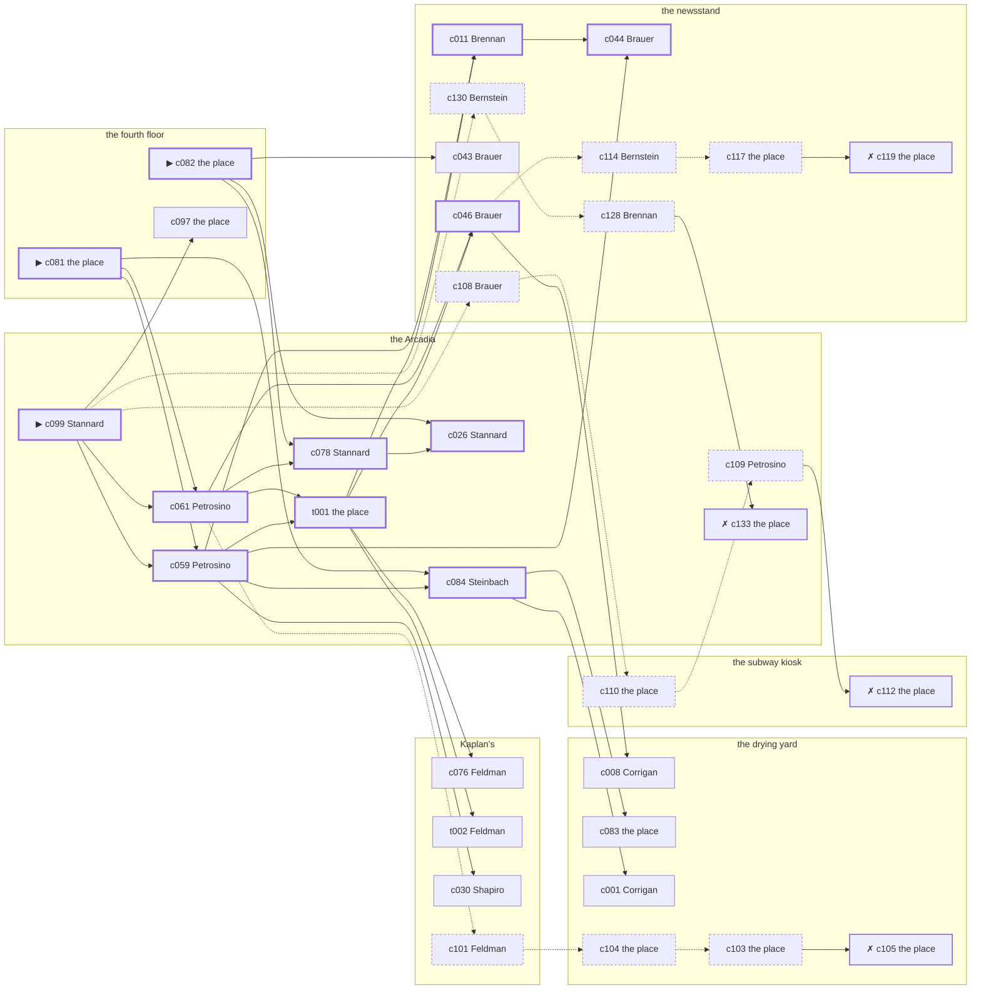

# the Gas House District — case 2

**Seed** 2 · **Difficulty** 2 · **Attempts** 5 · **Detective** Dashiell

**Type** murder · **Trope** body-moved · **Unknowns** who, why, when, where

**Par** 11 actions · **Slack** 6 · **Budget** 17 · **Findable** 34 (spine 12, corroboration 8, noise 10 + 4 disqualifiers) · **Noise ratio** 41% · **Candidate pool** 136

## 1. The Truth

Sadie Shapiro, a chorus girl between engagements, a customer of Doyle’s, killed Edward Doyle, a theatrical agent, with strangling with a cord at the fourth floor at 7:00 PM. Shapiro owed Doyle four thousand dollars and was past due on it (debt). Shapiro had been at the drying yard earlier in the evening, where the means lived, and was alone with Doyle when it happened. Stannard hired us.

## 2. The Act

**murder** · **body-moved** · actor **Shapiro** · at **the fourth floor** · at **7:00 PM**

- found at the Arcadia
- fate: dead

**Givens** — what the briefing states and the report does not ask:

- Doyle was found dead at the Arcadia.
- Doyle was not killed at the Arcadia: there is no blood there and no sign of a struggle.
- The coroner puts it between 6:30 PM and 8:00 PM.
- It was strangling with a cord, and it happened somewhere else.

**Unknowns** — exactly what the report asks: **who**, **why**, **when**, **where**.

## 3. Dramatis Personae

| Name | Role | Relationship | Class of secret | Motive | Found at | Killer |
| --- | --- | --- | --- | --- | --- | --- |
| Edward Doyle | a theatrical agent | the victim | — | — | — | — |
| Patrick Corrigan | a doorman at a club with no sign on it | in Doyle’s debt | fence | — | the drying yard | — |
| Bridget Brennan | a society columnist | a witness against the people Doyle worked for | dope | — | the newsstand | — |
| Alonzo Broadnax | a hack driver | a childhood friend of Doyle’s from the same block | fence | revenge | the newsstand | — |
| Marion Stannard (client) | a dentist with a chair and a waiting room | Doyle’s neighbour across the airshaft | dope | property | the Arcadia | — |
| Sadie Shapiro | a chorus girl between engagements | a customer of Doyle’s | murder | debt | Kaplan’s | **YES** |
| Wilhelm Steinbach | the night manager at the hotel | Doyle’s tenant | secret-drinking | — | the Arcadia | — |
| Ernst Brauer | the news dealer | fixture (newsstand) | — | — | the newsstand | — |
| Bernard Feldman | the druggist | fixture (druggist) | — | — | Kaplan’s | — |
| Rosaria Petrosino | the ticket-taker | fixture (ticket-taker) | — | — | the Arcadia | — |
| Louis Bernstein | the patrolman on the beat | fixture (beat-cop) | — | — | the newsstand | — |

## 4. Dossiers

Every person, by layer: **0** on sight, **1** volunteered, **2** from other people, **3** in the documents.

### Doyle — the victim

40, a man, a theatrical agent. Wants: to-keep-what-they-have.

- **Standing** — Doyle had half the neighbourhood waiting on a telephone call that never came.
- **Profession** — Doyle had the say over who worked in the spring and who did not.
- **Found** — Stannard found Doyle at the Arcadia at 7:30 PM. By Stannard, at the Arcadia, at 7:30 PM. Precinct: called-it-a-fall.

**Layer 0, on sight**

- _gender_ — A man.
- _age_ — In his forties.

**Layer 1, volunteered**

- _profession_ — A theatrical agent.
- _detail_ — Doyle had the say over who worked in the spring and who did not.

**Layer 2, from other people**

- _tie_ — Doyle had half the neighbourhood waiting on a telephone call that never came.
- _want_ — Doyle wants to keep what they have and add nothing to it.

**Self-account** (layer 1, what they say when asked about themselves)

- Doyle is 40 years old and a theatrical agent.
- Doyle had the say over who worked in the spring and who did not.
- Doyle is the one this is about.

### Corrigan

43, a man, a doorman at a club with no sign on it. Wants: to-keep-what-they-have. Tie: in Doyle’s debt, since ’24.

**Layer 0, on sight**

- _gender_ — A man.
- _age_ — In his forties.
- _profession_ — A doorman at a club with no sign on it.

**Layer 1, volunteered**

- _detail_ — Corrigan stands the door at a club with no sign on it and knows every face that comes to it.

**Layer 2, from other people**

- _tie_ — Doyle carried Corrigan through a bad winter and has been collecting on it ever since.
- _want_ — Corrigan wants to keep what they have and add nothing to it.
- _since_ — Corrigan has been in Doyle’s debt, since ’24.

**Layer 3, in the documents**

- _secret-hint_ — Corrigan was carrying a parcel into the drying yard and came out without it.

**Self-account** (layer 1, what they say when asked about themselves)

- Corrigan is 43 years old and a doorman at a club with no sign on it.
- Corrigan stands the door at a club with no sign on it and knows every face that comes to it.
- Corrigan is in Doyle’s debt.

### Brennan

42, a woman, a society columnist. Wants: respectability. Tie: a witness against the people Doyle worked for, since last autumn.

**Layer 0, on sight**

- _gender_ — A woman.
- _age_ — In her forties.

**Layer 1, volunteered**

- _profession_ — A society columnist.
- _detail_ — Brennan has a standing table at a place the bill never comes to.

**Layer 2, from other people**

- _tie_ — Brennan gave a statement about the people Doyle worked for and has been careful ever since.
- _want_ — Brennan wants to be thought respectable by people who are not.
- _since_ — Brennan has been a witness against the people Doyle worked for, since last autumn.

**Layer 3, in the documents**

- _secret-hint_ — Brennan’s sleeves are buttoned at the wrist in a warm room.

**Self-account** (layer 1, what they say when asked about themselves)

- Brennan is 42 years old and a society columnist.
- Brennan has a standing table at a place the bill never comes to.
- Brennan is a witness against the people Doyle worked for.

### Broadnax

45, a man, a hack driver. Wants: to-be-left-alone. Tie: a childhood friend of Doyle’s from the same block, since they were boys on the same stoop.

**Layer 0, on sight**

- _gender_ — A man.
- _age_ — In his forties.
- _profession_ — A hack driver.

**Layer 1, volunteered**

- _detail_ — Broadnax owns the cab and owes on it.

**Layer 2, from other people**

- _tie_ — Broadnax and Doyle were boys together and neither of them ever left the neighbourhood.
- _want_ — Broadnax wants to be left alone.
- _since_ — Broadnax has been a childhood friend of Doyle’s from the same block, since they were boys on the same stoop.

**Layer 3, in the documents**

- _secret-hint_ — Broadnax was carrying a parcel into the newsstand and came out without it.

**Self-account** (layer 1, what they say when asked about themselves)

- Broadnax is 45 years old and a hack driver.
- Broadnax owns the cab and owes on it.
- Broadnax is a childhood friend of Doyle’s from the same block.

### Stannard — the client

39, a woman, a dentist with a chair and a waiting room. Wants: money. Tie: Doyle’s neighbour across the airshaft, since the building changed hands.

**Layer 0, on sight**

- _gender_ — A woman.
- _age_ — In her thirties.

**Layer 1, volunteered**

- _profession_ — A dentist with a chair and a waiting room.
- _detail_ — Stannard bought the practice second-hand and is still paying for the chair.

**Layer 2, from other people**

- _tie_ — Stannard lives across the airshaft from Doyle and can hear the wireless through it.
- _want_ — Stannard wants money, and is not particular about the shape it arrives in.
- _since_ — Stannard has been Doyle’s neighbour across the airshaft, since the building changed hands.

**Layer 3, in the documents**

- _secret-hint_ — Stannard’s sleeves are buttoned at the wrist in a warm room.

**Self-account** (layer 1, what they say when asked about themselves)

- Stannard is 39 years old and a dentist with a chair and a waiting room.
- Stannard bought the practice second-hand and is still paying for the chair.
- Stannard is Doyle’s neighbour across the airshaft.

### Shapiro — the killer

32, a woman, a chorus girl between engagements. Wants: to-be-somebody. Tie: a customer of Doyle’s, since ’26.

**Layer 0, on sight**

- _gender_ — A woman.
- _age_ — In her thirties.

**Layer 1, volunteered**

- _profession_ — A chorus girl between engagements.
- _detail_ — Shapiro makes the rounds of the agencies at eleven and is home by one.

**Layer 2, from other people**

- _tie_ — Shapiro has bought from Doyle for years and settled at the end of every month.
- _want_ — Shapiro wants a name people know.
- _since_ — Shapiro has been a customer of Doyle’s, since ’26.

**Self-account** (layer 1, what they say when asked about themselves)

- Shapiro is 32 years old and a chorus girl between engagements.
- Shapiro makes the rounds of the agencies at eleven and is home by one.
- Shapiro is a customer of Doyle’s.

### Steinbach

55, a man, the night manager at the hotel. Wants: money. Tie: Doyle’s tenant, since the flu year.

**Layer 0, on sight**

- _gender_ — A man.
- _age_ — In his fifties.
- _profession_ — The night manager at the hotel.

**Layer 1, volunteered**

- _detail_ — Steinbach has the desk from six at night until six in the morning.

**Layer 2, from other people**

- _tie_ — Steinbach has rented from Doyle since ’18 and has the same window and the same complaint.
- _want_ — Steinbach wants money, and is not particular about the shape it arrives in.
- _since_ — Steinbach has been Doyle’s tenant, since the flu year.

**Layer 3, in the documents**

- _secret-hint_ — Steinbach had taken a drink and had gone to some trouble about the smell of it.

**Self-account** (layer 1, what they say when asked about themselves)

- Steinbach is 55 years old and the night manager at the hotel.
- Steinbach has the desk from six at night until six in the morning.
- Steinbach is Doyle’s tenant.

### Brauer

59, a man, the news dealer. Wants: to-keep-what-they-have. Tie: at the stand at the newsstand, every day of the year.

**Layer 0, on sight**

- _gender_ — A man.
- _age_ — In his fifties.
- _profession_ — The news dealer.

**Layer 1, volunteered**

- _detail_ — Brauer sells papers at the newsstand from before six until the last edition is gone.

**Layer 2, from other people**

- _tie_ — Brauer is at the stand at the newsstand, every day of the year.
- _want_ — Brauer wants to keep what they have and add nothing to it.

**Self-account** (layer 1, what they say when asked about themselves)

- Brauer is 59 years old and the news dealer.
- Brauer sells papers at the newsstand from before six until the last edition is gone.
- Brauer is at the stand at the newsstand, every day of the year.

### Feldman

50, a man, the druggist. Wants: money. Tie: behind the counter at Kaplan’s.

**Layer 0, on sight**

- _gender_ — A man.
- _age_ — In his fifties.
- _profession_ — The druggist.

**Layer 1, volunteered**

- _detail_ — Feldman has had Kaplan’s since before the war and knows what everybody on the block takes.

**Layer 2, from other people**

- _tie_ — Feldman is behind the counter at Kaplan’s.
- _want_ — Feldman wants money, and is not particular about the shape it arrives in.

**Self-account** (layer 1, what they say when asked about themselves)

- Feldman is 50 years old and the druggist.
- Feldman has had Kaplan’s since before the war and knows what everybody on the block takes.
- Feldman is behind the counter at Kaplan’s.

### Petrosino

31, a woman, the ticket-taker. Wants: respectability. Tie: on the door at the Arcadia, every performance.

**Layer 0, on sight**

- _gender_ — A woman.
- _age_ — In her thirties.
- _profession_ — The ticket-taker.

**Layer 1, volunteered**

- _detail_ — Petrosino has taken tickets at the Arcadia since the house opened.

**Layer 2, from other people**

- _tie_ — Petrosino is on the door at the Arcadia, every performance.
- _want_ — Petrosino wants to be thought respectable by people who are not.

**Self-account** (layer 1, what they say when asked about themselves)

- Petrosino is 31 years old and the ticket-taker.
- Petrosino has taken tickets at the Arcadia since the house opened.
- Petrosino is on the door at the Arcadia, every performance.

### Bernstein

36, a man, the patrolman on the beat. Wants: to-keep-what-they-have. Tie: the patrolman whose post takes in the newsstand.

**Layer 0, on sight**

- _gender_ — A man.
- _age_ — In his thirties.
- _profession_ — The patrolman on the beat.

**Layer 1, volunteered**

- _detail_ — Bernstein has had this post for four years and can time the round to the minute.

**Layer 2, from other people**

- _tie_ — Bernstein is the patrolman whose post takes in the newsstand.
- _want_ — Bernstein wants to keep what they have and add nothing to it.

**Self-account** (layer 1, what they say when asked about themselves)

- Bernstein is 36 years old and the patrolman on the beat.
- Bernstein has had this post for four years and can time the round to the minute.
- Bernstein is the patrolman whose post takes in the newsstand.

## 5. The Client

**Stannard**, Doyle’s neighbour across the airshaft. Purpose: **clear-my-name**.

- **Why** — Stannard wants it established that it was not them, before anybody says otherwise.
- **What it costs** — Stannard was near enough to it that night to know exactly how it looks, and says so first.
- **Points at** — Shapiro: Shapiro owed Doyle four thousand dollars and was past due on it. Honest: **yes**.

**Tells:**

- Doyle was found dead at the Arcadia.
- Doyle was not killed at the Arcadia: there is no blood there and no sign of a struggle.
- The coroner puts it between 6:30 PM and 8:00 PM.
- It was strangling with a cord, and it happened somewhere else.
- Stannard would rather we started with Shapiro: Shapiro owed Doyle four thousand dollars and was past due on it.

**Withholds:**

- Stannard does not mention it, but Stannard buys morphine at the Arcadia from 7:00 PM to 7:30 PM and would rather be thought a murderer than a hop-head.

**Their own evening, as they tell it:**

- Stannard says she was at the drying yard from 6:00 PM to 6:30 PM.
- Stannard says she was at the newsstand from 7:00 PM to 7:30 PM.
- Stannard says she was at the Arcadia from 8:00 PM to 10:00 PM.
- Stannard says she was at the subway kiosk from 10:30 PM to 11:30 PM.

## 6. The Briefing

16 plain sentences, derived. This is the model of the plain register: the engine renders it, and Phase 2 measures pages against it.

1. A woman came up the stairs after midnight, and sat down.
2. Marion Stannard is 39 years old and a dentist with a chair and a waiting room.
3. Stannard bought the practice second-hand and is still paying for the chair.
4. Doyle had half the neighbourhood waiting on a telephone call that never came.
5. Doyle was found dead at the Arcadia.
6. Doyle was not killed at the Arcadia: there is no blood there and no sign of a struggle.
7. The coroner puts it between 6:30 PM and 8:00 PM.
8. It was strangling with a cord, and it happened somewhere else.
9. Stannard found Doyle at the Arcadia at 7:30 PM.
10. The precinct wrote it down as a fall and closed the book on it.
11. Stannard is Doyle’s neighbour across the airshaft.
12. Stannard lives across the airshaft from Doyle and can hear the wireless through it.
13. Stannard wants it established that it was not them, before anybody says otherwise.
14. Stannard was near enough to it that night to know exactly how it looks, and says so first.
15. Stannard wants us to start with Shapiro.
16. Shapiro owed Doyle four thousand dollars and was past due on it.

## 7. Mentions

- Nobody outside the case is named.

## 8. Places

- **the newsstand on the corner** (public) — watched by newsstand (Brauer); objects: a folded stack of evening papers, the roof-door key, a pasted-up timetable — within earshot of the scene
- **the subway kiosk at the corner** (public) — unwatched; objects: a brass umbrella stand — within earshot of the scene
- **Kaplan’s drugstore with the soda fountain** (public) — watched by druggist (Feldman); objects: a wall telephone, a bottle of chloral drops, an ice pick
- **Doyle’s apartment on the fourth floor** (private) — unwatched; objects: a nickel-plated revolver, a framed photograph, a japanned cash box — **THE SCENE**; the victim’s address
- **the Arcadia dance hall** (public) — watched by ticket-taker (Petrosino); objects: a standing ashtray, a silver cigarette case
- **the drying yard behind the laundry** (private) — unwatched; objects: a length of sash cord, a mop and bucket — where the weapon lived

## 9. Anchors

The coroner gives 6:30 PM–8:00 PM, four ticks wide. These are what close it: **dumbwaiter** and **ice-delivery**.

- **the ice being brought in** — at 6:30 PM; at Kaplan’s. Somebody reliable notes who was there. Only those present know that the iceman dropped a block on the step and it went in three. Those present carry it: a wet patch down one side of a coat.
- **the dumbwaiter squeal** — at 7:00 PM, 8:30 PM, 10:00 PM, 11:30 PM; at the fourth floor. You can time things by it: a noise the whole shaft hears and nobody in the building can sleep through. Only those present know that the car came up with somebody’s wash still in it, and stuck halfway.
- **the beat cop’s pass** — at 6:30 PM, 8:00 PM, 9:30 PM, 11:00 PM; on a round through the newsstand → the subway kiosk → Kaplan’s → the Arcadia. Somebody reliable notes who was there.

## 10. Timelines

### Doyle — the victim

| Tick | Time | Truth | Claimed | Companion claimed |
| --- | --- | --- | --- | --- |
| 0 | 6:00 PM | the Arcadia | the Arcadia | — |
| 1 | 6:30 PM | Kaplan’s | Kaplan’s | — |
| 2 | 7:00 PM | the fourth floor ☠ | the fourth floor | — |
| 3 | 7:30 PM | — | — | — |
| 4 | 8:00 PM | — | — | — |
| 5 | 8:30 PM | — | — | — |
| 6 | 9:00 PM | — | — | — |
| 7 | 9:30 PM | — | — | — |
| 8 | 10:00 PM | — | — | — |
| 9 | 10:30 PM | — | — | — |
| 10 | 11:00 PM | — | — | — |
| 11 | 11:30 PM | — | — | — |

### Corrigan

| Tick | Time | Truth | Claimed | Companion claimed |
| --- | --- | --- | --- | --- |
| 0 | 6:00 PM | the drying yard | the drying yard | — |
| 1 | 6:30 PM | the drying yard | the drying yard | — |
| 2 | 7:00 PM | the newsstand | the newsstand | — |
| 3 | 7:30 PM | the subway kiosk | the subway kiosk | — |
| 4 | 8:00 PM | the subway kiosk | the subway kiosk | — |
| 5 | 8:30 PM | the Arcadia | the Arcadia | — |
| 6 | 9:00 PM | the Arcadia | the Arcadia | — |
| 7 | 9:30 PM | the Arcadia | the Arcadia | — |
| 8 | 10:00 PM | the Arcadia | the Arcadia | — |
| 9 | 10:30 PM | the subway kiosk | the subway kiosk | — |
| 10 | 11:00 PM | the drying yard | **Kaplan’s** | — |
| 11 | 11:30 PM | the drying yard | **Kaplan’s** | — |

### Brennan

| Tick | Time | Truth | Claimed | Companion claimed |
| --- | --- | --- | --- | --- |
| 0 | 6:00 PM | the subway kiosk | the subway kiosk | — |
| 1 | 6:30 PM | the Arcadia | the Arcadia | — |
| 2 | 7:00 PM | the newsstand | the newsstand | — |
| 3 | 7:30 PM | the newsstand | the newsstand | — |
| 4 | 8:00 PM | the newsstand | the newsstand | — |
| 5 | 8:30 PM | the newsstand | the newsstand | — |
| 6 | 9:00 PM | the newsstand | the newsstand | — |
| 7 | 9:30 PM | the newsstand | the newsstand | — |
| 8 | 10:00 PM | the newsstand | the newsstand | — |
| 9 | 10:30 PM | the subway kiosk | **the drying yard** | — |
| 10 | 11:00 PM | the subway kiosk | **the drying yard** | — |
| 11 | 11:30 PM | the subway kiosk | the subway kiosk | — |

### Broadnax

| Tick | Time | Truth | Claimed | Companion claimed |
| --- | --- | --- | --- | --- |
| 0 | 6:00 PM | the drying yard | the drying yard | — |
| 1 | 6:30 PM | the drying yard | the drying yard | — |
| 2 | 7:00 PM | the newsstand | **the Arcadia** | Brennan |
| 3 | 7:30 PM | the newsstand | the newsstand | — |
| 4 | 8:00 PM | the newsstand | the newsstand | — |
| 5 | 8:30 PM | the newsstand | the newsstand | — |
| 6 | 9:00 PM | the newsstand | the newsstand | — |
| 7 | 9:30 PM | the newsstand | the newsstand | — |
| 8 | 10:00 PM | the newsstand | the newsstand | — |
| 9 | 10:30 PM | the newsstand | the newsstand | — |
| 10 | 11:00 PM | the newsstand | the newsstand | — |
| 11 | 11:30 PM | Kaplan’s | Kaplan’s | — |

### Stannard

| Tick | Time | Truth | Claimed | Companion claimed |
| --- | --- | --- | --- | --- |
| 0 | 6:00 PM | the drying yard | the drying yard | — |
| 1 | 6:30 PM | the drying yard | the drying yard | — |
| 2 | 7:00 PM | the Arcadia | **the newsstand** | — |
| 3 | 7:30 PM | the Arcadia | **the newsstand** | — |
| 4 | 8:00 PM | the Arcadia | the Arcadia | — |
| 5 | 8:30 PM | the Arcadia | the Arcadia | — |
| 6 | 9:00 PM | the Arcadia | the Arcadia | — |
| 7 | 9:30 PM | the Arcadia | the Arcadia | — |
| 8 | 10:00 PM | the Arcadia | the Arcadia | — |
| 9 | 10:30 PM | the subway kiosk | the subway kiosk | — |
| 10 | 11:00 PM | the subway kiosk | the subway kiosk | — |
| 11 | 11:30 PM | the subway kiosk | the subway kiosk | — |

### Shapiro — the killer

| Tick | Time | Truth | Claimed | Companion claimed |
| --- | --- | --- | --- | --- |
| 0 | 6:00 PM | the drying yard | the drying yard | — |
| 1 | 6:30 PM | the fourth floor | **the Arcadia** | Stannard |
| 2 | 7:00 PM | the fourth floor ☠ | **the Arcadia** | Stannard |
| 3 | 7:30 PM | the subway kiosk | the subway kiosk | — |
| 4 | 8:00 PM | Kaplan’s | Kaplan’s | — |
| 5 | 8:30 PM | Kaplan’s | Kaplan’s | — |
| 6 | 9:00 PM | Kaplan’s | Kaplan’s | — |
| 7 | 9:30 PM | Kaplan’s | Kaplan’s | — |
| 8 | 10:00 PM | the Arcadia | the Arcadia | — |
| 9 | 10:30 PM | Kaplan’s | Kaplan’s | — |
| 10 | 11:00 PM | Kaplan’s | Kaplan’s | — |
| 11 | 11:30 PM | the subway kiosk | the subway kiosk | — |

### Steinbach

| Tick | Time | Truth | Claimed | Companion claimed |
| --- | --- | --- | --- | --- |
| 0 | 6:00 PM | Kaplan’s | Kaplan’s | — |
| 1 | 6:30 PM | Kaplan’s | Kaplan’s | — |
| 2 | 7:00 PM | the Arcadia | **the subway kiosk** | Corrigan |
| 3 | 7:30 PM | the Arcadia | **the subway kiosk** | Corrigan |
| 4 | 8:00 PM | the Arcadia | the Arcadia | — |
| 5 | 8:30 PM | the subway kiosk | the subway kiosk | — |
| 6 | 9:00 PM | the subway kiosk | the subway kiosk | — |
| 7 | 9:30 PM | the newsstand | the newsstand | — |
| 8 | 10:00 PM | the newsstand | the newsstand | — |
| 9 | 10:30 PM | the newsstand | the newsstand | — |
| 10 | 11:00 PM | the drying yard | the drying yard | — |
| 11 | 11:30 PM | the drying yard | the drying yard | — |

### Fixtures (never lie, never withhold)

| Tick | Time | Brauer (the news dealer) | Feldman (the druggist) | Petrosino (the ticket-taker) | Bernstein (the patrolman on the beat) |
| --- | --- | --- | --- | --- | --- |
| 0 | 6:00 PM | the newsstand | Kaplan’s | the Arcadia | — |
| 1 | 6:30 PM | the newsstand | Kaplan’s | the Arcadia | the newsstand |
| 2 | 7:00 PM | the newsstand | the Arcadia | the Arcadia | — |
| 3 | 7:30 PM | the newsstand | Kaplan’s | the Arcadia | — |
| 4 | 8:00 PM | the newsstand | Kaplan’s | the Arcadia | the subway kiosk |
| 5 | 8:30 PM | the newsstand | Kaplan’s | the Arcadia | — |
| 6 | 9:00 PM | the drying yard | Kaplan’s | the Arcadia | — |
| 7 | 9:30 PM | the newsstand | Kaplan’s | the Arcadia | Kaplan’s |
| 8 | 10:00 PM | the newsstand | Kaplan’s | the Arcadia | — |
| 9 | 10:30 PM | the newsstand | Kaplan’s | the Arcadia | — |
| 10 | 11:00 PM | the newsstand | Kaplan’s | the Arcadia | the Arcadia |
| 11 | 11:30 PM | the newsstand | Kaplan’s | the Arcadia | — |

## 11. Secrets in play

- **Corrigan** (fence): Corrigan hands a parcel of stolen goods to a man at the drying yard from 11:00 PM to 11:30 PM.
- **Brennan** (dope): Brennan buys morphine at the subway kiosk from 10:30 PM to 11:00 PM and would rather be thought a murderer than a hop-head.
- **Broadnax** (fence): Broadnax hands a parcel of stolen goods to a man at the newsstand from 7:00 PM.
- **Stannard** (dope): Stannard buys morphine at the Arcadia from 7:00 PM to 7:30 PM and would rather be thought a murderer than a hop-head.
- **Shapiro** (murder): Shapiro is at the fourth floor from 6:30 PM to 7:00 PM, alone with Doyle when it happens at 7:00 PM.
- **Steinbach** (secret-drinking): Steinbach drinks alone at the Arcadia from 7:00 PM to 7:30 PM and will claim to have been anywhere else.

## 12. Clue list — the 34 findable

The opening three, free at the start: c081, c082, c099. Everything else has to be led to. The full candidate pool is in the companion file.

### At the newsstand

- **c011** [spine] (observation; Brennan on Corrigan) → c044
  - Brennan says Corrigan was at the newsstand at 7:00 PM.
  - _establishes: Corrigan at the newsstand, 7:00 PM_
- **c046** [spine] (observation; Brauer on Broadnax) → c008, c114
  - Brauer says Broadnax was at the newsstand from 7:00 PM to 8:30 PM.
  - _establishes: Broadnax at the newsstand, 7:00 PM–8:30 PM_
- **c044** [spine] (observation; Brauer on Brennan) → (end)
  - Brauer says Brennan was at the newsstand from 7:00 PM to 8:30 PM.
  - _establishes: Brennan at the newsstand, 7:00 PM–8:30 PM_
- **c043** [corroboration] (observation; Brauer on Corrigan) → (end)
  - Brauer says Corrigan was at the newsstand at 7:00 PM.
  - _establishes: Corrigan at the newsstand, 7:00 PM_
- **c108** [noise {b1}] (overheard; Brauer on Brennan) → c110
  - Brauer on Brennan: Somebody at the subway kiosk sells what a druggist will not, and Brennan knows which door.
  - _establishes: context only_
- **c114** [noise {b3}] (overheard; Bernstein on Broadnax) → c117
  - Bernstein on Broadnax: Broadnax was carrying a parcel into the newsstand and came out without it.
  - _establishes: context only_
- **c117** [noise {b3}] (physical; the place itself) → c119
  - Wrapping paper and a cut string at the newsstand, and the shop it came from closed two years ago.
  - _establishes: context only_
- **c119** [disqualifier {b3}] (overheard; the place itself) → (end)
  - The receiver at the newsstand would rather talk than be held: Broadnax was there from 7:00 PM handing over a parcel of somebody else’s silver, which is a charge Broadnax will take over this one.
  - _establishes: Broadnax’s fence accounted for; Broadnax at the newsstand, 7:00 PM_
- **c130** [noise {b4}] (overheard; Bernstein on Steinbach) → c128
  - Bernstein on Steinbach: Somebody at the Arcadia says Steinbach is in more often than Steinbach lets on.
  - _establishes: context only_
- **c128** [noise {b4}] (overheard; Brennan on Steinbach) → c133
  - Brennan on Steinbach: Steinbach had taken a drink and had gone to some trouble about the smell of it.
  - _establishes: context only_

### At the subway kiosk

- **c110** [noise {b1}] (physical; the place itself) → c109
  - A paper of powder at the subway kiosk, folded the way one particular hand folds them.
  - _establishes: context only_
- **c112** [disqualifier {b1}] (overheard; the place itself) → (end)
  - The man who sells it at the subway kiosk gives it up rather than be held: Brennan was there from 10:30 PM to 11:00 PM, and stayed until it took hold.
  - _establishes: Brennan’s dope accounted for; Brennan at the subway kiosk, 10:30 PM–11:00 PM_

### At Kaplan’s

- **c076** [corroboration] (observation; Feldman on Shapiro’s account) → (end)
  - Feldman was at the Arcadia at 7:00 PM and says Shapiro was not.
  - _establishes: Shapiro not at the Arcadia, 7:00 PM_
- **t002** [corroboration] (overheard; Feldman on a heavy fare that evening) → (end)
  - Feldman says somebody carried a heavy thing down from the fourth floor to the Arcadia in the half hour after 7:00 PM, wrapped in a rug, and did not want help with it.
  - _establishes: Doyle at the fourth floor, 7:00 PM_
- **c030** [corroboration] (observation; Shapiro on Corrigan) → (end)
  - Shapiro says Corrigan was at the drying yard at 6:00 PM.
  - _establishes: Corrigan at the drying yard, 6:00 PM; Corrigan could reach the weapon_
- **c101** [noise {b2}] (overheard; Feldman on Corrigan) → c104
  - Feldman on Corrigan: There is a man who meets people at the drying yard and nobody will say his name out loud.
  - _establishes: context only_

### At the fourth floor

- **c081** [spine ⟨opening⟩] (scene; the place itself) → c061, c059, c084
  - Doyle was found at the Arcadia. His watch glass broke against the floor and the hands have not moved since. The dumbwaiter car was worked at 7:00 PM, as it is on the hour and the half hour.
  - _establishes: the victim dead by 7:00 PM; how it was done_
- **c082** [spine ⟨opening⟩] (morgue; the place itself) → c078, c026, c043
  - The coroner puts death between 6:30 PM and 8:00 PM — two hours of nothing useful. A ligature furrow across the throat. Three fibres of hemp in the skin.
  - _establishes: death between 6:30 PM and 8:00 PM; how it was done_
- **c097** [corroboration] (document; the place itself) → (end)
  - Found at the fourth floor: A promissory note for $4,000 signed by Shapiro, endorsed to Doyle, three months past due.
  - _establishes: Shapiro had a motive (debt)_

### At the Arcadia

- **c099** [spine ⟨opening⟩] (client; Stannard on why I was hired) → c061, c059, c097, c108, c130
  - Stannard hired us, and wants it known that Shapiro owed Doyle four thousand dollars and was past due on it, and would rather we started there.
  - _establishes: Shapiro had a motive (debt)_
- **c061** [spine] (observation; Petrosino on Steinbach) → c078, t001, c046, c101
  - Petrosino says Steinbach was at the Arcadia from 7:00 PM to 8:00 PM.
  - _establishes: Steinbach at the Arcadia, 7:00 PM–8:00 PM_
- **c078** [spine] (denial; Stannard on Shapiro’s account) → c026
  - Shapiro names Stannard as the company for the Arcadia from 6:30 PM to 7:00 PM. Stannard says they were not together that evening.
  - _establishes: Shapiro not at the Arcadia, 6:30 PM–7:00 PM_
- **c026** [spine] (observation; Stannard on Shapiro) → (end)
  - Stannard says Shapiro was at the drying yard at 6:00 PM.
  - _establishes: Shapiro at the drying yard, 6:00 PM; Shapiro could reach the weapon_
- **c059** [spine] (observation; Petrosino on Stannard) → c084, t001, c011, c044, c030
  - Petrosino says Stannard was at the Arcadia from 7:00 PM to 10:00 PM.
  - _establishes: Stannard at the Arcadia, 7:00 PM–10:00 PM_
- **c084** [spine] (anchor; Steinbach on Doyle that evening) → c083, c001
  - Steinbach puts Doyle at Kaplan’s when the ice came, which was 6:30 PM, and alive enough to argue about the weather.
  - _establishes: the victim alive at 6:30 PM; Doyle at Kaplan’s, 6:30 PM_
- **t001** [spine] (physical; the place itself) → c011, c046, c076, t002
  - The stairs down to the Arcadia are scuffed the whole way in two parallel lines, and the dust in the scuffs is the grey dust off the floor at the fourth floor.
  - _establishes: Doyle at the fourth floor, 7:00 PM_
- **c109** [noise {b1}] (overheard; Petrosino on Brennan) → c112
  - Petrosino on Brennan: Brennan was steady at nine and shaking at seven, and it was not nerves about the police.
  - _establishes: context only_
- **c133** [disqualifier {b4}] (overheard; the place itself) → (end)
  - The man behind the counter at the Arcadia knows exactly: Steinbach was on the same stool from 7:00 PM to 7:30 PM and was in no condition to walk anywhere, let alone do this.
  - _establishes: Steinbach’s secret-drinking accounted for; Steinbach at the Arcadia, 7:00 PM–7:30 PM_

### At the drying yard

- **c008** [corroboration] (observation; Corrigan on Shapiro) → (end)
  - Corrigan says Shapiro was at the drying yard at 6:00 PM.
  - _establishes: Shapiro at the drying yard, 6:00 PM; Shapiro could reach the weapon_
- **c083** [corroboration] (physical; the place itself) → (end)
  - A length of sash cord is gone from the drying yard. A cut end of the same hemp is still tied to the fitting it was taken from.
  - _establishes: something gone from the drying yard; how it was done_
- **c001** [corroboration] (observation; Corrigan on Brennan) → (end)
  - Corrigan says Brennan was at the newsstand at 7:00 PM.
  - _establishes: Brennan at the newsstand, 7:00 PM_
- **c104** [noise {b2}] (physical; the place itself) → c103
  - A pawn ticket at the drying yard in a name that does not exist, made out at the hour in question.
  - _establishes: context only_
- **c103** [noise {b2}] (physical; the place itself) → c105
  - Wrapping paper and a cut string at the drying yard, and the shop it came from closed two years ago.
  - _establishes: context only_
- **c105** [disqualifier {b2}] (overheard; the place itself) → (end)
  - The receiver at the drying yard would rather talk than be held: Corrigan was there from 11:00 PM to 11:30 PM handing over a parcel of somebody else’s silver, which is a charge Corrigan will take over this one.
  - _establishes: Corrigan’s fence accounted for; Corrigan at the drying yard, 11:00 PM–11:30 PM_

## 13. Clue graph

## 14. Deduction path

Par is **11 actions** and the budget is par plus 6: **17**. Every id below is a spine clue; the inference is the sheet’s, not the clue’s.

**Time of death.** The coroner gives four ticks. The anchors close it to 7:00 PM: one puts Doyle alive at 6:30 PM, the other times the scene at 7:00 PM. _(c082, c084, c081)_

**Clearing the innocent.**

- Corrigan was not at the fourth floor at 7:00 PM. _(c011; + 1 corroborating)_
- Brennan was not at the fourth floor at 7:00 PM. _(c044; + 1 corroborating)_
- Broadnax was not at the fourth floor at 7:00 PM. _(c046; + 1 corroborating)_
- Stannard was not at the fourth floor at 7:00 PM. _(c059)_
- Steinbach was not at the fourth floor at 7:00 PM. _(c061; + 1 corroborating)_

**Naming the killer.** Shapiro claims the Arcadia at 7:00 PM. Two independent sources put that out of the question. _(c078; + 1 corroborating)_

**The weapon.** Shapiro was at the drying yard before 7:00 PM, where a length of sash cord was kept. _(c026; + 1 corroborating)_

**Method.** Strangling with a cord, on two physical sources. _(c081, c082; + 1 corroborating)_

**Motive.** debt, on two independent sources. _(c099; + 1 corroborating)_

## 15. Red herrings

**Innocents who lie about the murder tick:**

- Broadnax claims the Arcadia at 7:00 PM and was really at the newsstand. Reason: Broadnax hands a parcel of stolen goods to a man at the newsstand from 7:00 PM.
- Stannard claims the newsstand at 7:00 PM and was really at the Arcadia. Reason: Stannard buys morphine at the Arcadia from 7:00 PM to 7:30 PM and would rather be thought a murderer than a hop-head.
- Steinbach claims the subway kiosk at 7:00 PM and was really at the Arcadia. Reason: Steinbach drinks alone at the Arcadia from 7:00 PM to 7:30 PM and will claim to have been anywhere else.

**Innocents with a motive:**

- Broadnax — revenge: blamed Doyle for the ruin of Broadnax’s business.
- Stannard — property: wanted Doyle out of the lease and the lease in Stannard’s name.

**Noise branches, and what knocks each one down:**

- **b1** (Brennan, dope): c108 → c110 → c109 → **c112** — The man who sells it at the subway kiosk gives it up rather than be held: Brennan was there from 10:30 PM to 11:00 PM, and stayed until it took hold.
- **b2** (Corrigan, fence): c101 → c104 → c103 → **c105** — The receiver at the drying yard would rather talk than be held: Corrigan was there from 11:00 PM to 11:30 PM handing over a parcel of somebody else’s silver, which is a charge Corrigan will take over this one.
- **b3** (Broadnax, fence): c114 → c117 → **c119** — The receiver at the newsstand would rather talk than be held: Broadnax was there from 7:00 PM handing over a parcel of somebody else’s silver, which is a charge Broadnax will take over this one.
- **b4** (Steinbach, secret-drinking): c130 → c128 → **c133** — The man behind the counter at the Arcadia knows exactly: Steinbach was on the same stool from 7:00 PM to 7:30 PM and was in no condition to walk anywhere, let alone do this.

