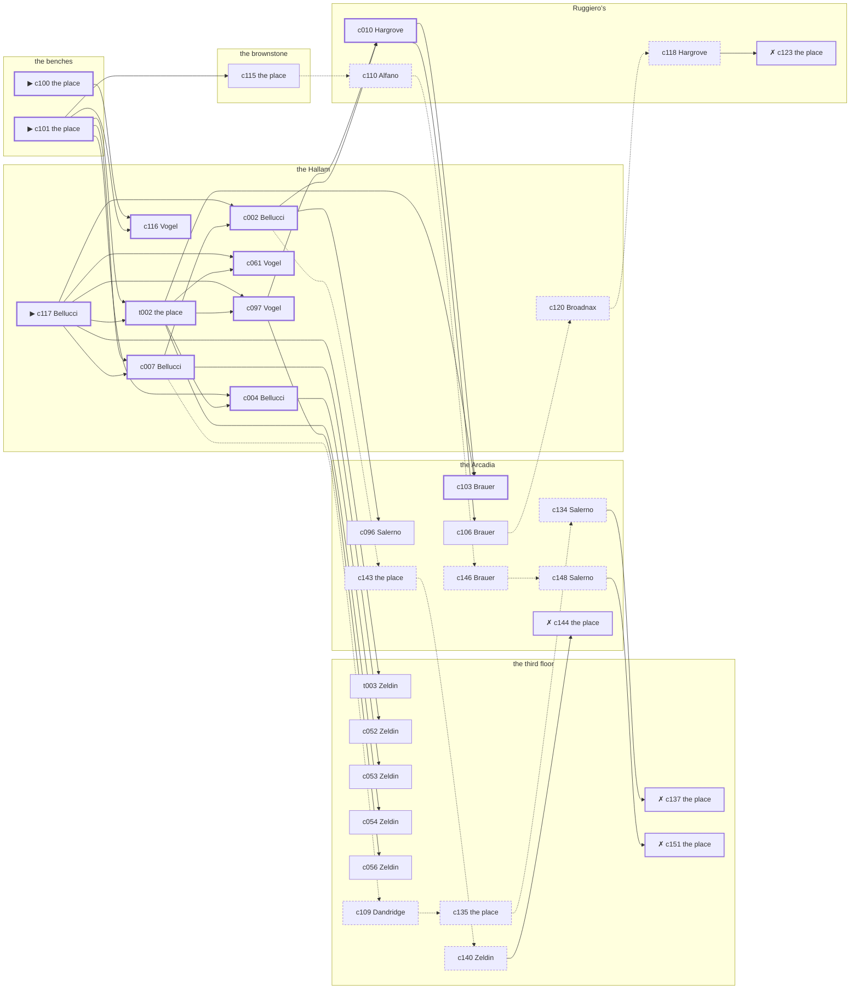

# Gramercy — case 2

**Seed** 2 · **Difficulty** 2 · **Attempts** 1 · **Detective** Dashiell

**Type** robbery · **Trope** inside-job · **Unknowns** who, entry, goods

**Par** 12 actions · **Slack** 6 · **Budget** 18 · **Findable** 34 (spine 12, corroboration 8, noise 10 + 4 disqualifiers) · **Noise ratio** 41% · **Candidate pool** 155

## 1. The Truth

Wendell Broadnax, a private secretary, engaged to Abramowitz’s daughter, took a packet of bearer bonds from the benches, which belonged to Hannah Abramowitz, a bail bondsman, at 8:00 PM, by a key off the board. Broadnax was jealous of Abramowitz over Wilhelmina Hauck (jealousy). Broadnax had been at the Hallam earlier in the evening, where the means lived, and was alone at the benches when it happened. Bellucci hired us.

## 2. The Act

**robbery** · **inside-job** · actor **Broadnax** · at **the benches** · at **8:00 PM**

- taken: a packet of bearer bonds
- entry: key
- goods went to the brownstone

**Givens** — what the briefing states and the report does not ask:

- A packet of bearer bonds was taken from the benches, which is Abramowitz’s.
- Nothing at the benches was forced: the lock was turned and the door was shut again after.
- The precinct puts it between 8:00 PM and 9:30 PM.
- Abramowitz is not saying much about what was in it.

**Unknowns** — exactly what the report asks: **who**, **entry**, **goods**.

## 3. Dramatis Personae

| Name | Role | Relationship | Class of secret | Motive | Found at | Killer |
| --- | --- | --- | --- | --- | --- | --- |
| Hannah Abramowitz | a bail bondsman | the victim | — | — | — | — |
| Giovanna Bellucci (client) | a curb broker | Abramowitz’s rival in trade | gambling-debt | property | the Hallam | — |
| Roscoe Hargrove | a ward heeler | a witness against the people Abramowitz worked for | gambling-debt | — | Ruggiero’s | — |
| Eunice Dandridge | the owner of the block | Abramowitz’s business partner | embezzling | — | the third floor | — |
| Giuseppe Salerno | a bookkeeper | in Abramowitz’s debt | forged-identity | exposure | the Arcadia | — |
| Teresa Alfano | a switchboard operator | Abramowitz’s former employee | hidden-family | — | Ruggiero’s | — |
| Wendell Broadnax | a private secretary | engaged to Abramowitz’s daughter | murder (+ blackmail) | jealousy | the Hallam | **YES** |
| Sadie Zeldin | the landlady | fixture (landlady) | — | — | the third floor | — |
| Gustav Vogel | the elevator man | fixture (elevator-man) | — | — | the Hallam | — |
| Heinrich Brauer | the ticket-taker | fixture (ticket-taker) | — | — | the Arcadia | — |
| Prescott Ellery | the man behind the counter | fixture (counterman) | — | — | Ruggiero’s | — |

## 4. Dossiers

Every person, by layer: **0** on sight, **1** volunteered, **2** from other people, **3** in the documents.

### Abramowitz — the victim

55, a woman, a bail bondsman. Wants: to-be-feared.

- **Standing** — Abramowitz owned a piece of four houses that had been put up as security.
- **Profession** — Abramowitz took a house or a wedding ring as security and kept the paper on both.
- **Found** — Bellucci found the door at the benches shut and a packet of bearer bonds gone, at 11:30 PM. By Bellucci, at the benches, at 11:30 PM. Precinct: came-and-went.

**Layer 0, on sight**

- _gender_ — A woman.
- _age_ — In her fifties.

**Layer 1, volunteered**

- _profession_ — A bail bondsman.
- _detail_ — Abramowitz took a house or a wedding ring as security and kept the paper on both.

**Layer 2, from other people**

- _tie_ — Abramowitz owned a piece of four houses that had been put up as security.
- _want_ — Abramowitz wants to be the one people are careful around.

**Self-account** (layer 1, what they say when asked about themselves)

- Abramowitz is 55 years old and a bail bondsman.
- Abramowitz took a house or a wedding ring as security and kept the paper on both.
- Abramowitz is the one this is about.

### Bellucci — the client

50, a woman, a curb broker. Wants: to-keep-what-they-have. Tie: Abramowitz’s rival in trade, since ’24.

**Layer 0, on sight**

- _gender_ — A woman.
- _age_ — In her fifties.

**Layer 1, volunteered**

- _profession_ — A curb broker.
- _detail_ — Bellucci trades on the street for men who would rather not be seen doing it.

**Layer 2, from other people**

- _tie_ — Bellucci took two of Abramowitz’s best accounts and Abramowitz took one of them back.
- _want_ — Bellucci wants to keep what they have and add nothing to it.
- _since_ — Bellucci has been Abramowitz’s rival in trade, since ’24.

**Layer 3, in the documents**

- _secret-hint_ — Bellucci was asking around for a hundred dollars in a hurry earlier in the week.

**Self-account** (layer 1, what they say when asked about themselves)

- Bellucci is 50 years old and a curb broker.
- Bellucci trades on the street for men who would rather not be seen doing it.
- Bellucci is Abramowitz’s rival in trade.

### Hargrove

46, a man, a ward heeler. Wants: money. Tie: a witness against the people Abramowitz worked for, since last autumn.

**Layer 0, on sight**

- _gender_ — A man.
- _age_ — In his forties.

**Layer 1, volunteered**

- _profession_ — A ward heeler.
- _detail_ — Hargrove carries the district for the club and is paid in favours.

**Layer 2, from other people**

- _tie_ — Hargrove gave a statement about the people Abramowitz worked for and has been careful ever since.
- _want_ — Hargrove wants money, and is not particular about the shape it arrives in.
- _since_ — Hargrove has been a witness against the people Abramowitz worked for, since last autumn.

**Layer 3, in the documents**

- _secret-hint_ — Hargrove was asking around for a hundred dollars in a hurry earlier in the week.

**Self-account** (layer 1, what they say when asked about themselves)

- Hargrove is 46 years old and a ward heeler.
- Hargrove carries the district for the club and is paid in favours.
- Hargrove is a witness against the people Abramowitz worked for.

### Dandridge

50, a woman, the owner of the block. Wants: to-keep-what-they-have. Tie: Abramowitz’s business partner, going on eight years.

**Layer 0, on sight**

- _gender_ — A woman.
- _age_ — In her fifties.

**Layer 1, volunteered**

- _profession_ — The owner of the block.
- _detail_ — Dandridge owns four buildings on the same street and collects in person.

**Layer 2, from other people**

- _tie_ — Dandridge put up the money and Abramowitz put up the name, and neither of them ever wrote it down.
- _want_ — Dandridge wants to keep what they have and add nothing to it.
- _since_ — Dandridge has been Abramowitz’s business partner, going on eight years.

**Layer 3, in the documents**

- _secret-hint_ — Dandridge had a key to the third floor that Dandridge had no business having.

**Self-account** (layer 1, what they say when asked about themselves)

- Dandridge is 50 years old and the owner of the block.
- Dandridge owns four buildings on the same street and collects in person.
- Dandridge is Abramowitz’s business partner.

### Salerno

50, a man, a bookkeeper. Wants: respectability. Tie: in Abramowitz’s debt, since ’19.

**Layer 0, on sight**

- _gender_ — A man.
- _age_ — In his fifties.

**Layer 1, volunteered**

- _profession_ — A bookkeeper.
- _detail_ — Salerno does the payroll on Thursdays and the ledgers the rest of the week.

**Layer 2, from other people**

- _tie_ — Salerno has owed Abramowitz money since ’19 and has not been asked for it lately.
- _want_ — Salerno wants to be thought respectable by people who are not.
- _since_ — Salerno has been in Abramowitz’s debt, since ’19.

**Layer 3, in the documents**

- _secret-hint_ — Salerno’s registration card gives an address on a street that does not exist.

**Self-account** (layer 1, what they say when asked about themselves)

- Salerno is 50 years old and a bookkeeper.
- Salerno does the payroll on Thursdays and the ledgers the rest of the week.
- Salerno is in Abramowitz’s debt.

### Alfano

27, a woman, a switchboard operator. Wants: to-be-somebody. Tie: Abramowitz’s former employee, until last winter.

**Layer 0, on sight**

- _gender_ — A woman.
- _age_ — In the late twenties.
- _profession_ — A switchboard operator.

**Layer 1, volunteered**

- _detail_ — Alfano plugs the calls through and is not supposed to listen.

**Layer 2, from other people**

- _tie_ — Alfano worked for Abramowitz for four years and was let go in ’19 without a reference.
- _want_ — Alfano wants a name people know.
- _since_ — Alfano has been Abramowitz’s former employee, until last winter.

**Layer 3, in the documents**

- _secret-hint_ — Alfano sends money out of every pay envelope and cannot say where it goes.

**Self-account** (layer 1, what they say when asked about themselves)

- Alfano is 27 years old and a switchboard operator.
- Alfano plugs the calls through and is not supposed to listen.
- Alfano is Abramowitz’s former employee.

### Broadnax — the killer

29, a man, a private secretary. Wants: money. Tie: engaged to Abramowitz’s daughter, two years engaged.

**Layer 0, on sight**

- _gender_ — A man.
- _age_ — In the late twenties.

**Layer 1, volunteered**

- _profession_ — A private secretary.
- _detail_ — Broadnax answers the letters, keeps the diary, and knows what is in both.

**Layer 2, from other people**

- _tie_ — Broadnax has been engaged to Abramowitz’s daughter since ’25, with no date set.
- _want_ — Broadnax wants money, and is not particular about the shape it arrives in.
- _since_ — Broadnax has been engaged to Abramowitz’s daughter, two years engaged.

**Layer 3, in the documents**

- _secret-hint_ — Broadnax and Abramowitz were heard at the brownstone, and one of them was doing all the talking.

**Self-account** (layer 1, what they say when asked about themselves)

- Broadnax is 29 years old and a private secretary.
- Broadnax answers the letters, keeps the diary, and knows what is in both.
- Broadnax is engaged to Abramowitz’s daughter.

### Zeldin

64, a woman, the landlady. Wants: respectability. Tie: the keeper of the third floor.

**Layer 0, on sight**

- _gender_ — A woman.
- _age_ — In her sixties.
- _profession_ — The landlady.

**Layer 1, volunteered**

- _detail_ — Zeldin keeps the third floor and sits where she can see the stairs.

**Layer 2, from other people**

- _tie_ — Zeldin is the keeper of the third floor.
- _want_ — Zeldin wants to be thought respectable by people who are not.

**Self-account** (layer 1, what they say when asked about themselves)

- Zeldin is 64 years old and the landlady.
- Zeldin keeps the third floor and sits where she can see the stairs.
- Zeldin is the keeper of the third floor.

### Vogel

65, a man, the elevator man. Wants: to-keep-what-they-have. Tie: in the car at the Hallam.

**Layer 0, on sight**

- _gender_ — A man.
- _age_ — In his sixties.
- _profession_ — The elevator man.

**Layer 1, volunteered**

- _detail_ — Vogel runs the car at the Hallam and knows which floor everybody wants before they say it.

**Layer 2, from other people**

- _tie_ — Vogel is in the car at the Hallam.
- _want_ — Vogel wants to keep what they have and add nothing to it.

**Self-account** (layer 1, what they say when asked about themselves)

- Vogel is 65 years old and the elevator man.
- Vogel runs the car at the Hallam and knows which floor everybody wants before they say it.
- Vogel is in the car at the Hallam.

### Brauer

35, a man, the ticket-taker. Wants: to-be-left-alone. Tie: on the door at the Arcadia, every performance.

**Layer 0, on sight**

- _gender_ — A man.
- _age_ — In his thirties.
- _profession_ — The ticket-taker.

**Layer 1, volunteered**

- _detail_ — Brauer stands the box at the Arcadia from seven until the last house goes in.

**Layer 2, from other people**

- _tie_ — Brauer is on the door at the Arcadia, every performance.
- _want_ — Brauer wants to be left alone.

**Self-account** (layer 1, what they say when asked about themselves)

- Brauer is 35 years old and the ticket-taker.
- Brauer stands the box at the Arcadia from seven until the last house goes in.
- Brauer is on the door at the Arcadia, every performance.

### Ellery

24, a man, the man behind the counter. Wants: to-get-out. Tie: behind the counter at Ruggiero’s.

**Layer 0, on sight**

- _gender_ — A man.
- _age_ — Not much past twenty.
- _profession_ — The man behind the counter.

**Layer 1, volunteered**

- _detail_ — Ellery has the counter at Ruggiero’s from four until midnight.

**Layer 2, from other people**

- _tie_ — Ellery is behind the counter at Ruggiero’s.
- _want_ — Ellery wants out of the neighbourhood and has wanted it for years.

**Self-account** (layer 1, what they say when asked about themselves)

- Ellery is 24 years old and the man behind the counter.
- Ellery has the counter at Ruggiero’s from four until midnight.
- Ellery is behind the counter at Ruggiero’s.

## 5. The Client

**Bellucci**, Abramowitz’s rival in trade. Purpose: **find-it-before-the-cops**.

- **Why** — Bellucci wants it found before the police find it.
- **What it costs** — Bellucci would rather not explain to a sergeant what it was doing there.
- **Points at** — Salerno: Salerno was about to be exposed by Abramowitz. Honest: **yes**.

**Tells:**

- A packet of bearer bonds was taken from the benches, which is Abramowitz’s.
- Nothing at the benches was forced: the lock was turned and the door was shut again after.
- The precinct puts it between 8:00 PM and 9:30 PM.
- Abramowitz is not saying much about what was in it.
- Bellucci would rather we started with Salerno: Salerno was about to be exposed by Abramowitz.

**Withholds:**

- Bellucci does not mention it, but Bellucci slips off to Ruggiero’s from 9:30 PM to settle with a bookmaker.

**Their own evening, as they tell it:**

- Bellucci says she was at the benches at 6:00 PM.
- Bellucci says she was at the Hallam from 6:30 PM to 7:30 PM.
- Bellucci says she was at the third floor from 8:00 PM to 9:30 PM.
- Bellucci says she was at Ruggiero’s from 10:00 PM to 10:30 PM.

## 6. The Briefing

16 plain sentences, derived. This is the model of the plain register: the engine renders it, and Phase 2 measures pages against it.

1. A woman came up the stairs after midnight, and sat down.
2. Giovanna Bellucci is 50 years old and a curb broker.
3. Bellucci trades on the street for men who would rather not be seen doing it.
4. Abramowitz owned a piece of four houses that had been put up as security.
5. A packet of bearer bonds was taken from the benches, which is Abramowitz’s.
6. Nothing at the benches was forced: the lock was turned and the door was shut again after.
7. The precinct puts it between 8:00 PM and 9:30 PM.
8. Abramowitz is not saying much about what was in it.
9. Bellucci found the door at the benches shut and a packet of bearer bonds gone, at 11:30 PM.
10. The precinct came, walked through it, and went.
11. Bellucci is Abramowitz’s rival in trade.
12. Bellucci took two of Abramowitz’s best accounts and Abramowitz took one of them back.
13. Bellucci wants it found before the police find it.
14. Bellucci would rather not explain to a sergeant what it was doing there.
15. Bellucci wants us to start with Salerno.
16. Salerno was about to be exposed by Abramowitz.

## 7. Mentions

- **Wilhelmina Hauck** (m-1) — a woman they had both been seeing. Wilhelmina Hauck is a woman they had both been seeing.

## 8. Places

- **the third-floor walk-up on Ninth** (private) — watched by landlady (Zeldin); objects: a length of sash cord, a stack of hatboxes, a bronze bookend
- **the vestibule of the Hallam apartments** (private) — watched by elevator-man (Vogel); objects: the roof-door key, a nickel-plated revolver, a camel-hair overcoat on a hook, a day ledger — where the weapon lived
- **Abramowitz’s rooms in the brownstone** (private) — unwatched; objects: a framed photograph, a wall telephone, a bottle of chloral drops — the victim’s address
- **the Arcadia dance hall** (public) — watched by ticket-taker (Brauer); objects: a standing ashtray, a silver cigarette case — within earshot of the scene
- **Ruggiero’s barber shop** (semi) — watched by counterman (Ellery); objects: an ice pick, a folded stack of evening papers — within earshot of the scene
- **the benches at the north end of the square** (public) — unwatched; objects: a packet of bearer bonds, a brass umbrella stand — **THE SCENE**

## 9. Anchors

The coroner gives 8:00 PM–9:30 PM, four ticks wide. These are what close it: **bar-radio** and **ice-delivery**.

- **the fight card on the bar radio** — at 7:30 PM; at the Arcadia. Only those present know that the challenger went down in the fourth and the crowd booed it. You can time things by it: the set was turned up loud enough to carry into the street.
- **the ice being brought in** — at 8:00 PM; at Ruggiero’s. Somebody reliable notes who was there. Only those present know that the iceman dropped a block on the step and it went in three. Those present carry it: a wet patch down one side of a coat.

## 10. Timelines

### Abramowitz — the victim

| Tick | Time | Truth | Claimed | Companion claimed |
| --- | --- | --- | --- | --- |
| 0 | 6:00 PM | the Arcadia | the Arcadia | — |
| 1 | 6:30 PM | the Arcadia | the Arcadia | — |
| 2 | 7:00 PM | the Arcadia | the Arcadia | — |
| 3 | 7:30 PM | the Arcadia | the Arcadia | — |
| 4 | 8:00 PM | the Arcadia | the Arcadia | — |
| 5 | 8:30 PM | the Arcadia | the Arcadia | — |
| 6 | 9:00 PM | the Arcadia | the Arcadia | — |
| 7 | 9:30 PM | the Arcadia | the Arcadia | — |
| 8 | 10:00 PM | the Arcadia | the Arcadia | — |
| 9 | 10:30 PM | the Arcadia | the Arcadia | — |
| 10 | 11:00 PM | the Arcadia | the Arcadia | — |
| 11 | 11:30 PM | the Arcadia | the Arcadia | — |

### Bellucci

| Tick | Time | Truth | Claimed | Companion claimed |
| --- | --- | --- | --- | --- |
| 0 | 6:00 PM | the benches | the benches | — |
| 1 | 6:30 PM | the Hallam | the Hallam | — |
| 2 | 7:00 PM | the Hallam | the Hallam | — |
| 3 | 7:30 PM | the Hallam | the Hallam | — |
| 4 | 8:00 PM | the third floor | the third floor | — |
| 5 | 8:30 PM | the third floor | the third floor | — |
| 6 | 9:00 PM | the third floor | the third floor | — |
| 7 | 9:30 PM | Ruggiero’s | **the third floor** | Hargrove |
| 8 | 10:00 PM | Ruggiero’s | Ruggiero’s | — |
| 9 | 10:30 PM | Ruggiero’s | Ruggiero’s | — |
| 10 | 11:00 PM | the Arcadia | the Arcadia | — |
| 11 | 11:30 PM | the benches | the benches | — |

### Hargrove

| Tick | Time | Truth | Claimed | Companion claimed |
| --- | --- | --- | --- | --- |
| 0 | 6:00 PM | Ruggiero’s | Ruggiero’s | — |
| 1 | 6:30 PM | Ruggiero’s | Ruggiero’s | — |
| 2 | 7:00 PM | Ruggiero’s | Ruggiero’s | — |
| 3 | 7:30 PM | Ruggiero’s | Ruggiero’s | — |
| 4 | 8:00 PM | the third floor | the third floor | — |
| 5 | 8:30 PM | Ruggiero’s | Ruggiero’s | — |
| 6 | 9:00 PM | Ruggiero’s | Ruggiero’s | — |
| 7 | 9:30 PM | Ruggiero’s | Ruggiero’s | — |
| 8 | 10:00 PM | Ruggiero’s | Ruggiero’s | — |
| 9 | 10:30 PM | Ruggiero’s | Ruggiero’s | — |
| 10 | 11:00 PM | Ruggiero’s | Ruggiero’s | — |
| 11 | 11:30 PM | Ruggiero’s | **the Arcadia** | — |

### Dandridge

| Tick | Time | Truth | Claimed | Companion claimed |
| --- | --- | --- | --- | --- |
| 0 | 6:00 PM | the third floor | the third floor | — |
| 1 | 6:30 PM | the third floor | the third floor | — |
| 2 | 7:00 PM | the third floor | the third floor | — |
| 3 | 7:30 PM | the third floor | the third floor | — |
| 4 | 8:00 PM | the third floor | **Ruggiero’s** | Broadnax |
| 5 | 8:30 PM | the third floor | the third floor | — |
| 6 | 9:00 PM | the third floor | the third floor | — |
| 7 | 9:30 PM | the third floor | the third floor | — |
| 8 | 10:00 PM | the third floor | the third floor | — |
| 9 | 10:30 PM | the third floor | the third floor | — |
| 10 | 11:00 PM | the third floor | the third floor | — |
| 11 | 11:30 PM | the third floor | the third floor | — |

### Salerno

| Tick | Time | Truth | Claimed | Companion claimed |
| --- | --- | --- | --- | --- |
| 0 | 6:00 PM | Ruggiero’s | Ruggiero’s | — |
| 1 | 6:30 PM | the Hallam | the Hallam | — |
| 2 | 7:00 PM | the third floor | the third floor | — |
| 3 | 7:30 PM | Ruggiero’s | Ruggiero’s | — |
| 4 | 8:00 PM | the Arcadia | the Arcadia | — |
| 5 | 8:30 PM | Ruggiero’s | Ruggiero’s | — |
| 6 | 9:00 PM | the brownstone | the brownstone | — |
| 7 | 9:30 PM | the Arcadia | the Arcadia | — |
| 8 | 10:00 PM | the Arcadia | the Arcadia | — |
| 9 | 10:30 PM | the Arcadia | the Arcadia | — |
| 10 | 11:00 PM | the Arcadia | the Arcadia | — |
| 11 | 11:30 PM | Ruggiero’s | Ruggiero’s | — |

### Alfano

| Tick | Time | Truth | Claimed | Companion claimed |
| --- | --- | --- | --- | --- |
| 0 | 6:00 PM | Ruggiero’s | Ruggiero’s | — |
| 1 | 6:30 PM | Ruggiero’s | Ruggiero’s | — |
| 2 | 7:00 PM | Ruggiero’s | Ruggiero’s | — |
| 3 | 7:30 PM | Ruggiero’s | Ruggiero’s | — |
| 4 | 8:00 PM | the third floor | **Ruggiero’s** | — |
| 5 | 8:30 PM | the third floor | the third floor | — |
| 6 | 9:00 PM | the third floor | the third floor | — |
| 7 | 9:30 PM | the third floor | the third floor | — |
| 8 | 10:00 PM | Ruggiero’s | Ruggiero’s | — |
| 9 | 10:30 PM | the brownstone | the brownstone | — |
| 10 | 11:00 PM | Ruggiero’s | Ruggiero’s | — |
| 11 | 11:30 PM | Ruggiero’s | Ruggiero’s | — |

### Broadnax — the killer

| Tick | Time | Truth | Claimed | Companion claimed |
| --- | --- | --- | --- | --- |
| 0 | 6:00 PM | the brownstone | **the third floor** | Salerno |
| 1 | 6:30 PM | the Hallam | the Hallam | — |
| 2 | 7:00 PM | the benches | **the Arcadia** | Dandridge |
| 3 | 7:30 PM | the benches | **the Arcadia** | Dandridge |
| 4 | 8:00 PM | the benches ☠ | **the Arcadia** | Dandridge |
| 5 | 8:30 PM | the brownstone | the brownstone | — |
| 6 | 9:00 PM | the brownstone | the brownstone | — |
| 7 | 9:30 PM | the Hallam | the Hallam | — |
| 8 | 10:00 PM | the Hallam | the Hallam | — |
| 9 | 10:30 PM | the Arcadia | the Arcadia | — |
| 10 | 11:00 PM | the Hallam | the Hallam | — |
| 11 | 11:30 PM | the Hallam | the Hallam | — |

### Fixtures (never lie, never withhold)

| Tick | Time | Zeldin (the landlady) | Vogel (the elevator man) | Brauer (the ticket-taker) | Ellery (the man behind the counter) |
| --- | --- | --- | --- | --- | --- |
| 0 | 6:00 PM | the third floor | the Hallam | the Arcadia | Ruggiero’s |
| 1 | 6:30 PM | the third floor | the Hallam | the Arcadia | Ruggiero’s |
| 2 | 7:00 PM | the Hallam | the Hallam | the Arcadia | Ruggiero’s |
| 3 | 7:30 PM | the third floor | the Hallam | the Arcadia | Ruggiero’s |
| 4 | 8:00 PM | the third floor | the Arcadia | the Arcadia | Ruggiero’s |
| 5 | 8:30 PM | the third floor | the Hallam | the Arcadia | Ruggiero’s |
| 6 | 9:00 PM | the third floor | the Hallam | the third floor | Ruggiero’s |
| 7 | 9:30 PM | the third floor | the Hallam | the Arcadia | Ruggiero’s |
| 8 | 10:00 PM | the third floor | the Hallam | the Arcadia | Ruggiero’s |
| 9 | 10:30 PM | the third floor | the Hallam | the Arcadia | Ruggiero’s |
| 10 | 11:00 PM | the third floor | the Hallam | the Arcadia | the brownstone |
| 11 | 11:30 PM | the third floor | the Hallam | the Arcadia | Ruggiero’s |

## 11. Secrets in play

- **Bellucci** (gambling-debt): Bellucci slips off to Ruggiero’s from 9:30 PM to settle with a bookmaker.
- **Hargrove** (gambling-debt): Hargrove slips off to Ruggiero’s from 11:30 PM to settle with a bookmaker.
- **Dandridge** (embezzling): Dandridge goes through the books at the third floor from 8:00 PM, while there is nobody to see.
- **Salerno** (forged-identity): Salerno is not the person the papers say. Nothing about the evening is hidden; the lie is all in the paperwork.
- **Alfano** (hidden-family): Alfano goes to the third floor from 8:00 PM to see a child nobody is supposed to know about.
- **Broadnax** (murder): Broadnax is at the benches from 7:00 PM to 8:00 PM, alone with what Abramowitz kept there, and takes it at 8:00 PM.
- **Broadnax** also (blackmail): Broadnax meets Abramowitz alone at the brownstone from 6:00 PM and asks for money.

## 12. Clue list — the 34 findable

The opening three, free at the start: c100, c101, c117. Everything else has to be led to. The full candidate pool is in the companion file.

### At the third floor

- **t003** [corroboration] (overheard; Zeldin on the lock) → (end)
  - Zeldin says the lock at the benches has never been changed, and that the people who can open it can be counted on one hand.
  - _establishes: Broadnax could reach the weapon_
- **c052** [corroboration] (observation; Zeldin on Bellucci) → (end)
  - Zeldin says Bellucci was at the Hallam at 7:00 PM.
  - _establishes: Bellucci at the Hallam, 7:00 PM; Bellucci could reach the weapon_
- **c053** [corroboration] (observation; Zeldin on Bellucci) → (end)
  - Zeldin says Bellucci was at the third floor from 8:00 PM to 9:00 PM.
  - _establishes: Bellucci at the third floor, 8:00 PM–9:00 PM_
- **c054** [corroboration] (observation; Zeldin on Hargrove) → (end)
  - Zeldin says Hargrove was at the third floor at 8:00 PM.
  - _establishes: Hargrove at the third floor, 8:00 PM_
- **c056** [corroboration] (observation; Zeldin on Dandridge) → (end)
  - Zeldin says Dandridge was at the third floor from 7:30 PM to 11:30 PM.
  - _establishes: Dandridge at the third floor, 7:30 PM–11:30 PM_
- **c109** [noise {b1}] (anchor; Dandridge on the ice being brought in) → c135
  - Dandridge claims Ruggiero’s at 8:00 PM, which is when the ice being brought in was on. Asked about it, Dandridge cannot say that the iceman dropped a block on the step and it went in three — and everybody who was there can.
  - _establishes: Dandridge not at Ruggiero’s, 8:00 PM_
- **c135** [noise {b1}] (physical; the place itself) → c134
  - A carbon of a deposit slip at the third floor, made out in Dandridge’s hand to an account in another name.
  - _establishes: context only_
- **c137** [disqualifier {b1}] (overheard; the place itself) → (end)
  - The bank confirms the account: Dandridge has been taking two hundred a month for a year, and was at the third floor doing exactly that from 8:00 PM. It is theft, and it is not murder.
  - _establishes: Dandridge’s embezzling accounted for; Dandridge at the third floor, 8:00 PM_
- **c151** [disqualifier {b2}] (overheard; the place itself) → (end)
  - The woman who keeps the child says it straight out: Alfano was at the third floor from 8:00 PM, the same as every week, and left with the same face as always.
  - _establishes: Alfano’s hidden-family accounted for; Alfano at the third floor, 8:00 PM_
- **c140** [noise {b3}] (overheard; Zeldin on Salerno) → c144
  - Zeldin on Salerno: Two signatures of Salerno’s, a month apart, are in different hands.
  - _establishes: context only_

### At the Hallam

- **c117** [spine ⟨opening⟩] (client; Bellucci on why I was hired) → t002, c097, c061, c007, c002, t003
  - Bellucci hired us, and wants it known that Salerno was about to be exposed by Abramowitz, and would rather we started there.
  - _establishes: Salerno had a motive (exposure)_
- **t002** [spine] (document; the place itself) → c097, c004, c061, c103, c054
  - The key list at the Hallam runs to four names, and Broadnax is the third of them. The book has Broadnax there at 6:30 PM.
  - _establishes: Broadnax could reach the weapon; Broadnax at the Hallam, 6:30 PM_
- **c116** [spine] (overheard; Vogel on Broadnax and Abramowitz) → (end)
  - Vogel says Broadnax told Abramowitz to keep away from Wilhelmina Hauck, loud enough to turn heads.
  - _establishes: Broadnax had a motive (jealousy)_
- **c097** [spine] (observation; Vogel on Broadnax’s account) → c010, c056
  - Vogel was at the Arcadia at 8:00 PM and says Broadnax was not.
  - _establishes: Broadnax not at the Arcadia, 8:00 PM_
- **c004** [spine] (observation; Bellucci on Dandridge) → c053
  - Bellucci says Dandridge was at the third floor from 8:00 PM to 9:00 PM.
  - _establishes: Dandridge at the third floor, 8:00 PM–9:00 PM_
- **c061** [spine] (observation; Vogel on Salerno) → (end)
  - Vogel says Salerno was at the Arcadia at 8:00 PM.
  - _establishes: Salerno at the Arcadia, 8:00 PM_
- **c007** [spine] (observation; Bellucci on Alfano) → c002, c052, c109
  - Bellucci says Alfano was at the third floor from 8:00 PM to 9:00 PM.
  - _establishes: Alfano at the third floor, 8:00 PM–9:00 PM_
- **c002** [spine] (observation; Bellucci on Hargrove) → c010, c096, c143
  - Bellucci says Hargrove was at the third floor at 8:00 PM.
  - _establishes: Hargrove at the third floor, 8:00 PM_
- **c120** [noise {b4}] (overheard; Broadnax on Bellucci) → c118
  - Broadnax on Bellucci: Bellucci goes very quiet when the racing wire is mentioned.
  - _establishes: context only_

### At the brownstone

- **c115** [corroboration] (document; the place itself) → c110
  - Found at the brownstone: Three letters in Abramowitz’s hand to Wilhelmina Hauck, kept in Broadnax’s drawer, the last one opened.
  - _establishes: Broadnax had a motive (jealousy)_

### At the Arcadia

- **c103** [spine] (anchor; Brauer on Abramowitz that evening) → (end)
  - Brauer puts Abramowitz at the Arcadia while the fight was on the radio, which was 7:30 PM, and nothing had been touched then.
  - _establishes: the victim alive at 7:30 PM; Abramowitz at the Arcadia, 7:30 PM_
- **c106** [corroboration] (anchor; Brauer on the noise that evening) → c120
  - Brauer was at the Arcadia at 8:00 PM and heard a door being locked from the outside from the direction of the benches, as the ice was being brought in.
  - _establishes: noise at the benches at 8:00 PM; the victim dead by 8:00 PM; how it was done_
- **c096** [corroboration] (observation; Salerno on Broadnax’s account) → (end)
  - Salerno was at the Arcadia at 8:00 PM and says Broadnax was not.
  - _establishes: Broadnax not at the Arcadia, 8:00 PM_
- **c134** [noise {b1}] (overheard; Salerno on Dandridge) → c137
  - Salerno on Dandridge: Somebody heard a drawer being worked at the third floor some time after 8:00 PM.
  - _establishes: context only_
- **c146** [noise {b2}] (overheard; Brauer on Alfano) → c148
  - Brauer on Alfano: Alfano sends money out of every pay envelope and cannot say where it goes.
  - _establishes: context only_
- **c148** [noise {b2}] (overheard; Salerno on Alfano) → c151
  - Salerno on Alfano: Alfano keeps a photograph and will not be asked about it twice.
  - _establishes: context only_
- **c143** [noise {b3}] (physical; the place itself) → c140
  - A steamship ticket stub among Salerno’s things, in the name of a man who died at Belleau Wood.
  - _establishes: context only_
- **c144** [disqualifier {b3}] (overheard; the place itself) → (end)
  - The name Salerno was born with turns up on a desertion warrant from 1918. Salerno has been hiding from the Army for eleven years and from nobody else.
  - _establishes: Salerno’s forged-identity accounted for_

### At Ruggiero’s

- **c010** [spine] (observation; Hargrove on Bellucci) → c103, c106
  - Hargrove says Bellucci was at the third floor at 8:00 PM.
  - _establishes: Bellucci at the third floor, 8:00 PM_
- **c110** [noise {b2}] (anchor; Alfano on the ice being brought in) → c146
  - Alfano claims Ruggiero’s at 8:00 PM, which is when the ice being brought in was on. Asked about it, Alfano cannot say that the iceman dropped a block on the step and it went in three — and everybody who was there can.
  - _establishes: Alfano not at Ruggiero’s, 8:00 PM_
- **c118** [noise {b4}] (overheard; Hargrove on Bellucci) → c123
  - Hargrove on Bellucci: Bellucci was asking around for a hundred dollars in a hurry earlier in the week.
  - _establishes: context only_
- **c123** [disqualifier {b4}] (overheard; the place itself) → (end)
  - The bookmaker’s runner is found and will say it: Bellucci was at Ruggiero’s from 9:30 PM paying off eleven hundred dollars, a dollar at a time, and went nowhere near the killing.
  - _establishes: Bellucci’s gambling-debt accounted for; Bellucci at Ruggiero’s, 9:30 PM_

### At the benches

- **c100** [spine ⟨opening⟩] (scene; the place itself) → c116
  - A packet of bearer bonds is gone from the benches, which is Abramowitz’s. There is a clean rectangle in the dust where it stood, and nothing else in the room was moved. The ice was brought in at 8:00 PM and the iceman’s book has the delivery timed and signed for.
  - _establishes: the victim dead by 8:00 PM; how it was done_
- **c101** [spine ⟨opening⟩] (morgue; the place itself) → t002, c116, c004, c007, c115
  - The desk sergeant's report puts it between 8:00 PM and 9:30 PM — two hours of nothing useful. The precinct report says the lock was not forced. It was opened, and it was locked again afterwards.
  - _establishes: death between 8:00 PM and 9:30 PM; how it was done_

## 13. Clue graph

## 14. Deduction path

Par is **12 actions** and the budget is par plus 6: **18**. Every id below is a spine clue; the inference is the sheet’s, not the clue’s.

**Time of death.** The coroner gives four ticks. The anchors close it to 8:00 PM: one puts Abramowitz alive at 7:30 PM, the other times the scene at 8:00 PM. _(c101, c103, c100; + 1 corroborating)_

**Clearing the innocent.**

- Bellucci was not at the benches at 8:00 PM. _(c010; + 1 corroborating)_
- Hargrove was not at the benches at 8:00 PM. _(c002; + 1 corroborating)_
- Dandridge was not at the benches at 8:00 PM. _(c004; + 2 corroborating)_
- Salerno was not at the benches at 8:00 PM. _(c061)_
- Alfano was not at the benches at 8:00 PM. _(c007; + 1 corroborating)_

**Naming the killer.** Broadnax claims the Arcadia at 8:00 PM. Two independent sources put that out of the question. _(c097; + 1 corroborating)_

**The weapon.** Broadnax was at the Hallam before 8:00 PM, where the roof-door key was kept. _(t002; + 1 corroborating)_

**Method.** A key off the board, on two physical sources. _(c100, c101; + 1 corroborating)_

**Motive.** jealousy, on two independent sources. _(c116; + 1 corroborating)_

## 15. Red herrings

**Innocents who lie about the murder tick:**

- Dandridge claims Ruggiero’s at 8:00 PM and was really at the third floor. Reason: Dandridge goes through the books at the third floor from 8:00 PM, while there is nobody to see.
- Alfano claims Ruggiero’s at 8:00 PM and was really at the third floor. Reason: Alfano goes to the third floor from 8:00 PM to see a child nobody is supposed to know about.

**Innocents with a motive:**

- Bellucci — property: wanted Abramowitz out of the lease and the lease in Bellucci’s name.
- Salerno — exposure: was about to be exposed by Abramowitz.

**Noise branches, and what knocks each one down:**

- **b1** (Dandridge, embezzling): c109 → c135 → c134 → **c137** — The bank confirms the account: Dandridge has been taking two hundred a month for a year, and was at the third floor doing exactly that from 8:00 PM. It is theft, and it is not murder.
- **b2** (Alfano, hidden-family): c110 → c146 → c148 → **c151** — The woman who keeps the child says it straight out: Alfano was at the third floor from 8:00 PM, the same as every week, and left with the same face as always.
- **b3** (Salerno, forged-identity): c143 → c140 → **c144** — The name Salerno was born with turns up on a desertion warrant from 1918. Salerno has been hiding from the Army for eleven years and from nobody else.
- **b4** (Bellucci, gambling-debt): c120 → c118 → **c123** — The bookmaker’s runner is found and will say it: Bellucci was at Ruggiero’s from 9:30 PM paying off eleven hundred dollars, a dollar at a time, and went nowhere near the killing.

