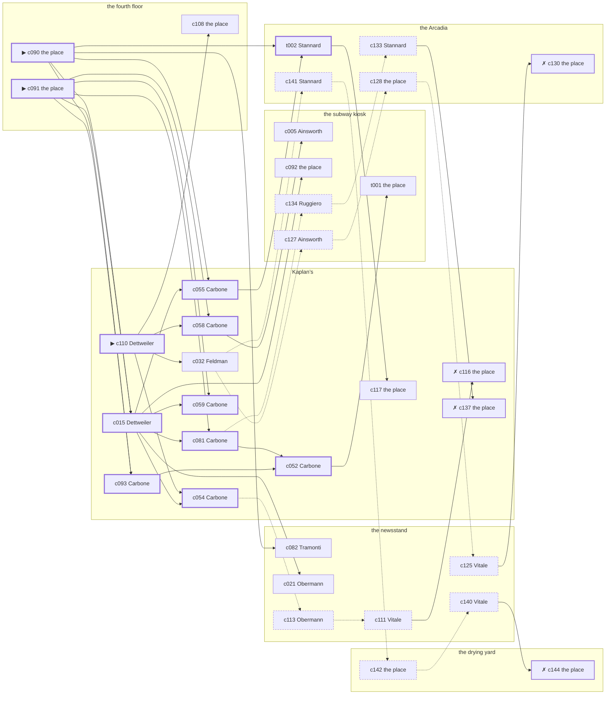

# the Gas House District — case 2

**Seed** 2 · **Difficulty** 2 · **Attempts** 1 · **Detective** Dashiell

**Type** missing · **Trope** left · **Unknowns** whereabouts, why

**Par** 11 actions · **Slack** 6 · **Budget** 17 · **Findable** 34 (spine 12, corroboration 8, noise 10 + 4 disqualifiers) · **Noise ratio** 41% · **Candidate pool** 147

## 1. The Truth

Prescott Ellery, a lawyer with one clerk, engaged to Prentiss’s daughter, was the last to be with Eunice Prentiss, a theatrical agent, at the fourth floor at 9:30 PM, and saw them off by a train out, and the timetable it was read off. Ellery stands to inherit from Prentiss (inheritance). Ellery had been at the subway kiosk earlier in the evening, where the means lived, and was alone with Prentiss when it happened. Dettweiler hired us.

## 2. The Act

**missing** · **left** · actor **Prentiss** · at **the fourth floor** · at **9:30 PM**

- whereabouts: the subway kiosk
- fate: left

**Givens** — what the briefing states and the report does not ask:

- Prentiss has not been seen since 9:00 PM on Tuesday evening.
- Carbone saw Prentiss at Kaplan’s at 9:00 PM, and nobody has seen Prentiss since.
- Prentiss’s rooms were left tidy and the rent was paid to the end of the month.
- The precinct took a statement and filed it, because a grown person may go where they like.

**Unknowns** — exactly what the report asks: **whereabouts**, **why**.

## 3. Dramatis Personae

| Name | Role | Relationship | Class of secret | Motive | Found at | Killer |
| --- | --- | --- | --- | --- | --- | --- |
| Eunice Prentiss | a theatrical agent | the victim | — | — | — | — |
| Constance Ainsworth | a dentist with a chair and a waiting room | Prentiss’s tenant | dope | debt | the subway kiosk | — |
| Elsa Dettweiler (client) | a switchboard operator | Prentiss’s tenant | hidden-family | — | Kaplan’s | — |
| Frieda Obermann | a widow with rooms on the avenue | named in Prentiss’s will | secret-drinking | insurance | the newsstand | — |
| Prescott Ellery | a lawyer with one clerk | engaged to Prentiss’s daughter | murder | inheritance | Kaplan’s | **YES** |
| Morris Feldman | a ward heeler | Prentiss’s business partner | gambling-debt | — | Kaplan’s | — |
| Vincenzo Ruggiero | a doorman at a club with no sign on it | in Prentiss’s debt | fence | — | the subway kiosk | — |
| Concetta Vitale | the news dealer | fixture (newsstand) | — | — | the newsstand | — |
| Rocco Carbone | the druggist | fixture (druggist) | — | — | Kaplan’s | — |
| Prudence Stannard | the ticket-taker | fixture (ticket-taker) | — | — | the Arcadia | — |
| Antonio Tramonti | the patrolman on the beat | fixture (beat-cop) | — | — | the newsstand | — |

## 4. Dossiers

Every person, by layer: **0** on sight, **1** volunteered, **2** from other people, **3** in the documents.

### Prentiss — the victim

56, a woman, a theatrical agent. Wants: money.

- **Standing** — Prentiss had half the neighbourhood waiting on a telephone call that never came.
- **Profession** — Prentiss had the say over who worked in the spring and who did not.
- **Last seen** — Carbone saw Prentiss at Kaplan’s at 9:00 PM, and nobody has seen Prentiss since. By Carbone, at Kaplan’s, at 9:00 PM.

**Layer 0, on sight**

- _gender_ — A woman.
- _age_ — In her fifties.

**Layer 1, volunteered**

- _profession_ — A theatrical agent.
- _detail_ — Prentiss had the say over who worked in the spring and who did not.

**Layer 2, from other people**

- _tie_ — Prentiss had half the neighbourhood waiting on a telephone call that never came.
- _want_ — Prentiss wants money, and is not particular about the shape it arrives in.

**Self-account** (layer 1, what they say when asked about themselves)

- Prentiss is 56 years old and a theatrical agent.
- Prentiss had the say over who worked in the spring and who did not.
- Prentiss is the one this is about.

### Ainsworth

45, a woman, a dentist with a chair and a waiting room. Wants: to-be-left-alone. Tie: Prentiss’s tenant, four years in the same rooms.

**Layer 0, on sight**

- _gender_ — A woman.
- _age_ — In her forties.

**Layer 1, volunteered**

- _profession_ — A dentist with a chair and a waiting room.
- _detail_ — Ainsworth bought the practice second-hand and is still paying for the chair.

**Layer 2, from other people**

- _tie_ — Prentiss put Ainsworth’s rent up twice in a year and Ainsworth paid it twice.
- _want_ — Ainsworth wants to be left alone.
- _since_ — Ainsworth has been Prentiss’s tenant, four years in the same rooms.

**Layer 3, in the documents**

- _secret-hint_ — Ainsworth’s sleeves are buttoned at the wrist in a warm room.

**Self-account** (layer 1, what they say when asked about themselves)

- Ainsworth is 45 years old and a dentist with a chair and a waiting room.
- Ainsworth bought the practice second-hand and is still paying for the chair.
- Ainsworth is Prentiss’s tenant.

### Dettweiler — the client

22, a woman, a switchboard operator. Wants: money. Tie: Prentiss’s tenant, since the flu year.

**Layer 0, on sight**

- _gender_ — A woman.
- _age_ — Not much past twenty.
- _profession_ — A switchboard operator.

**Layer 1, volunteered**

- _detail_ — Dettweiler works the exchange and knows every number on the floor.

**Layer 2, from other people**

- _tie_ — Prentiss put Dettweiler’s rent up twice in a year and Dettweiler paid it twice.
- _want_ — Dettweiler wants money, and is not particular about the shape it arrives in.
- _since_ — Dettweiler has been Prentiss’s tenant, since the flu year.

**Layer 3, in the documents**

- _secret-hint_ — Dettweiler sends money out of every pay envelope and cannot say where it goes.

**Self-account** (layer 1, what they say when asked about themselves)

- Dettweiler is 22 years old and a switchboard operator.
- Dettweiler works the exchange and knows every number on the floor.
- Dettweiler is Prentiss’s tenant.

### Obermann

61, a woman, a widow with rooms on the avenue. Wants: to-keep-what-they-have. Tie: named in Prentiss’s will, since ’27.

**Layer 0, on sight**

- _gender_ — A woman.
- _age_ — In her sixties.

**Layer 1, volunteered**

- _profession_ — A widow with rooms on the avenue.
- _detail_ — Obermann lives on an annuity and the rent from a house in Flushing.

**Layer 2, from other people**

- _tie_ — Prentiss told Obermann there was something in the will and never said how much.
- _want_ — Obermann wants to keep what they have and add nothing to it.
- _since_ — Obermann has been named in Prentiss’s will, since ’27.

**Layer 3, in the documents**

- _secret-hint_ — Obermann had taken a drink and had gone to some trouble about the smell of it.

**Self-account** (layer 1, what they say when asked about themselves)

- Obermann is 61 years old and a widow with rooms on the avenue.
- Obermann lives on an annuity and the rent from a house in Flushing.
- Obermann is named in Prentiss’s will.

### Ellery — the killer

58, a man, a lawyer with one clerk. Wants: respectability. Tie: engaged to Prentiss’s daughter, since ’25.

**Layer 0, on sight**

- _gender_ — A man.
- _age_ — In his fifties.

**Layer 1, volunteered**

- _profession_ — A lawyer with one clerk.
- _detail_ — Ellery has a list of clients and will not read any of it aloud.

**Layer 2, from other people**

- _tie_ — Ellery asked Prentiss for the daughter and was told to come back when there was money.
- _want_ — Ellery wants to be thought respectable by people who are not.
- _since_ — Ellery has been engaged to Prentiss’s daughter, since ’25.

**Self-account** (layer 1, what they say when asked about themselves)

- Ellery is 58 years old and a lawyer with one clerk.
- Ellery has a list of clients and will not read any of it aloud.
- Ellery is engaged to Prentiss’s daughter.

### Feldman

57, a man, a ward heeler. Wants: money. Tie: Prentiss’s business partner, three years this spring.

**Layer 0, on sight**

- _gender_ — A man.
- _age_ — In his fifties.

**Layer 1, volunteered**

- _profession_ — A ward heeler.
- _detail_ — Feldman sits in the clubhouse and settles what can be settled there.

**Layer 2, from other people**

- _tie_ — Feldman and Prentiss took the lease together in ’18 and have been arguing about it since.
- _want_ — Feldman wants money, and is not particular about the shape it arrives in.
- _since_ — Feldman has been Prentiss’s business partner, three years this spring.

**Layer 3, in the documents**

- _secret-hint_ — Feldman was asking around for a hundred dollars in a hurry earlier in the week.

**Self-account** (layer 1, what they say when asked about themselves)

- Feldman is 57 years old and a ward heeler.
- Feldman sits in the clubhouse and settles what can be settled there.
- Feldman is Prentiss’s business partner.

### Ruggiero

26, a man, a doorman at a club with no sign on it. Wants: to-keep-what-they-have. Tie: in Prentiss’s debt, since ’18.

**Layer 0, on sight**

- _gender_ — A man.
- _age_ — In the late twenties.
- _profession_ — A doorman at a club with no sign on it.

**Layer 1, volunteered**

- _detail_ — Ruggiero has the door from nine until they close.

**Layer 2, from other people**

- _tie_ — Ruggiero signed a note to Prentiss that Agnes Sweeney witnessed and nobody has torn up.
- _want_ — Ruggiero wants to keep what they have and add nothing to it.
- _since_ — Ruggiero has been in Prentiss’s debt, since ’18.
- _third_ — Agnes Sweeney is a woman they had both been seeing.

**Layer 3, in the documents**

- _secret-hint_ — Ruggiero was carrying a parcel into the drying yard and came out without it.

**Self-account** (layer 1, what they say when asked about themselves)

- Ruggiero is 26 years old and a doorman at a club with no sign on it.
- Ruggiero has the door from nine until they close.
- Ruggiero is in Prentiss’s debt.

### Vitale

65, a woman, the news dealer. Wants: money. Tie: at the stand at the newsstand, every day of the year.

**Layer 0, on sight**

- _gender_ — A woman.
- _age_ — In her sixties.
- _profession_ — The news dealer.

**Layer 1, volunteered**

- _detail_ — Vitale runs the stand at the newsstand and misses nothing that crosses the pavement.

**Layer 2, from other people**

- _tie_ — Vitale is at the stand at the newsstand, every day of the year.
- _want_ — Vitale wants money, and is not particular about the shape it arrives in.

**Self-account** (layer 1, what they say when asked about themselves)

- Vitale is 65 years old and the news dealer.
- Vitale runs the stand at the newsstand and misses nothing that crosses the pavement.
- Vitale is at the stand at the newsstand, every day of the year.

### Carbone

58, a man, the druggist. Wants: respectability. Tie: behind the counter at Kaplan’s.

**Layer 0, on sight**

- _gender_ — A man.
- _age_ — In his fifties.
- _profession_ — The druggist.

**Layer 1, volunteered**

- _detail_ — Carbone stands the counter at Kaplan’s and writes down every prescription twice.

**Layer 2, from other people**

- _tie_ — Carbone is behind the counter at Kaplan’s.
- _want_ — Carbone wants to be thought respectable by people who are not.

**Self-account** (layer 1, what they say when asked about themselves)

- Carbone is 58 years old and the druggist.
- Carbone stands the counter at Kaplan’s and writes down every prescription twice.
- Carbone is behind the counter at Kaplan’s.

### Stannard

54, a woman, the ticket-taker. Wants: money. Tie: on the door at the Arcadia, every performance.

**Layer 0, on sight**

- _gender_ — A woman.
- _age_ — In her fifties.
- _profession_ — The ticket-taker.

**Layer 1, volunteered**

- _detail_ — Stannard has taken tickets at the Arcadia since the house opened.

**Layer 2, from other people**

- _tie_ — Stannard is on the door at the Arcadia, every performance.
- _want_ — Stannard wants money, and is not particular about the shape it arrives in.

**Self-account** (layer 1, what they say when asked about themselves)

- Stannard is 54 years old and the ticket-taker.
- Stannard has taken tickets at the Arcadia since the house opened.
- Stannard is on the door at the Arcadia, every performance.

### Tramonti

51, a man, the patrolman on the beat. Wants: to-be-feared. Tie: the patrolman whose post takes in the newsstand.

**Layer 0, on sight**

- _gender_ — A man.
- _age_ — In his fifties.
- _profession_ — The patrolman on the beat.

**Layer 1, volunteered**

- _detail_ — Tramonti walks the same eight corners every night and rattles every door on them.

**Layer 2, from other people**

- _tie_ — Tramonti is the patrolman whose post takes in the newsstand.
- _want_ — Tramonti wants to be the one people are careful around.

**Self-account** (layer 1, what they say when asked about themselves)

- Tramonti is 51 years old and the patrolman on the beat.
- Tramonti walks the same eight corners every night and rattles every door on them.
- Tramonti is the patrolman whose post takes in the newsstand.

## 5. The Client

**Dettweiler**, Prentiss’s tenant. Purpose: **clear-my-name**.

- **Why** — Dettweiler wants it established that it was not them, before anybody says otherwise.
- **What it costs** — Dettweiler was near enough to it that night to know exactly how it looks, and says so first.
- **Points at** — Ellery: Ellery stands to inherit from Prentiss. Honest: **yes**.

**Tells:**

- Prentiss has not been seen since 9:00 PM on Tuesday evening.
- Carbone saw Prentiss at Kaplan’s at 9:00 PM, and nobody has seen Prentiss since.
- Prentiss’s rooms were left tidy and the rent was paid to the end of the month.
- The precinct took a statement and filed it, because a grown person may go where they like.
- Dettweiler would rather we started with Ellery: Ellery stands to inherit from Prentiss.

**Withholds:**

- Dettweiler does not mention it, but Dettweiler goes to Kaplan’s from 9:30 PM to 10:00 PM to see a child nobody is supposed to know about.

**Their own evening, as they tell it:**

- Dettweiler says she was at the Arcadia from 6:00 PM to 7:00 PM.
- Dettweiler says she was at Kaplan’s from 7:30 PM to 8:00 PM.
- Dettweiler says she was at the subway kiosk from 8:30 PM to 9:00 PM.
- Dettweiler says she was at the drying yard from 9:30 PM to 10:00 PM.

## 6. The Briefing

15 plain sentences, derived. This is the model of the plain register: the engine renders it, and Phase 2 measures pages against it.

1. A woman came up the stairs after midnight, and sat down.
2. Elsa Dettweiler is 22 years old and a switchboard operator.
3. Dettweiler works the exchange and knows every number on the floor.
4. Prentiss had half the neighbourhood waiting on a telephone call that never came.
5. Prentiss has not been seen since 9:00 PM on Tuesday evening.
6. Carbone saw Prentiss at Kaplan’s at 9:00 PM, and nobody has seen Prentiss since.
7. Prentiss’s rooms were left tidy and the rent was paid to the end of the month.
8. The precinct took a statement and filed it, because a grown person may go where they like.
9. Carbone saw Prentiss at Kaplan’s at 9:00 PM, and nobody has seen Prentiss since.
10. Dettweiler is Prentiss’s tenant.
11. Prentiss put Dettweiler’s rent up twice in a year and Dettweiler paid it twice.
12. Dettweiler wants it established that it was not them, before anybody says otherwise.
13. Dettweiler was near enough to it that night to know exactly how it looks, and says so first.
14. Dettweiler wants us to start with Ellery.
15. Ellery stands to inherit from Prentiss.

## 7. Mentions

- **Agnes Sweeney** (m-1) — a woman they had both been seeing. Agnes Sweeney is a woman they had both been seeing.

## 8. Places

- **the newsstand on the corner** (public) — watched by newsstand (Vitale); objects: the roof-door key, a folded stack of evening papers, a spike of pawn tickets — within earshot of the scene
- **the subway kiosk at the corner** (public) — unwatched; objects: a pasted-up timetable, a brass umbrella stand — where the weapon lived; within earshot of the scene
- **Kaplan’s drugstore with the soda fountain** (public) — watched by druggist (Carbone); objects: a wall telephone, a bottle of chloral drops
- **Prentiss’s apartment on the fourth floor** (private) — unwatched; objects: a nickel-plated revolver, a framed photograph — **THE SCENE**; the victim’s address
- **the Arcadia dance hall** (public) — watched by ticket-taker (Stannard); objects: a standing ashtray, a silver cigarette case
- **the drying yard behind the laundry** (private) — unwatched; objects: an ice pick, a length of sash cord, a mop and bucket

## 9. Anchors

The coroner gives 9:00 PM–10:30 PM, four ticks wide. These are what close it: **dumbwaiter** and **ice-delivery**.

- **the ice being brought in** — at 9:00 PM; at Kaplan’s. Somebody reliable notes who was there. Only those present know that the iceman dropped a block on the step and it went in three. Those present carry it: a wet patch down one side of a coat.
- **the dumbwaiter squeal** — at 6:30 PM, 8:00 PM, 9:30 PM, 11:00 PM; at the fourth floor. You can time things by it: a noise the whole shaft hears and nobody in the building can sleep through. Only those present know that the car came up with somebody’s wash still in it, and stuck halfway.
- **the beat cop’s pass** — at 6:30 PM, 8:00 PM, 9:30 PM, 11:00 PM; on a round through the newsstand → the subway kiosk → Kaplan’s → the Arcadia. Somebody reliable notes who was there.

## 10. Timelines

### Prentiss — the victim

| Tick | Time | Truth | Claimed | Companion claimed |
| --- | --- | --- | --- | --- |
| 0 | 6:00 PM | the newsstand | the newsstand | — |
| 1 | 6:30 PM | the newsstand | the newsstand | — |
| 2 | 7:00 PM | Kaplan’s | Kaplan’s | — |
| 3 | 7:30 PM | Kaplan’s | Kaplan’s | — |
| 4 | 8:00 PM | Kaplan’s | Kaplan’s | — |
| 5 | 8:30 PM | the subway kiosk | the subway kiosk | — |
| 6 | 9:00 PM | Kaplan’s | Kaplan’s | — |
| 7 | 9:30 PM | the fourth floor ☠ | the fourth floor | — |
| 8 | 10:00 PM | the subway kiosk | the subway kiosk | — |
| 9 | 10:30 PM | the subway kiosk | the subway kiosk | — |
| 10 | 11:00 PM | the subway kiosk | the subway kiosk | — |
| 11 | 11:30 PM | the subway kiosk | the subway kiosk | — |

### Ainsworth

| Tick | Time | Truth | Claimed | Companion claimed |
| --- | --- | --- | --- | --- |
| 0 | 6:00 PM | the subway kiosk | the subway kiosk | — |
| 1 | 6:30 PM | the subway kiosk | the subway kiosk | — |
| 2 | 7:00 PM | the subway kiosk | the subway kiosk | — |
| 3 | 7:30 PM | the subway kiosk | the subway kiosk | — |
| 4 | 8:00 PM | the Arcadia | the Arcadia | — |
| 5 | 8:30 PM | the subway kiosk | the subway kiosk | — |
| 6 | 9:00 PM | the subway kiosk | the subway kiosk | — |
| 7 | 9:30 PM | Kaplan’s | **the newsstand** | Feldman |
| 8 | 10:00 PM | Kaplan’s | **the newsstand** | Feldman |
| 9 | 10:30 PM | Kaplan’s | Kaplan’s | — |
| 10 | 11:00 PM | Kaplan’s | Kaplan’s | — |
| 11 | 11:30 PM | Kaplan’s | Kaplan’s | — |

### Dettweiler

| Tick | Time | Truth | Claimed | Companion claimed |
| --- | --- | --- | --- | --- |
| 0 | 6:00 PM | the Arcadia | the Arcadia | — |
| 1 | 6:30 PM | the Arcadia | the Arcadia | — |
| 2 | 7:00 PM | the Arcadia | the Arcadia | — |
| 3 | 7:30 PM | Kaplan’s | Kaplan’s | — |
| 4 | 8:00 PM | Kaplan’s | Kaplan’s | — |
| 5 | 8:30 PM | the subway kiosk | the subway kiosk | — |
| 6 | 9:00 PM | the subway kiosk | the subway kiosk | — |
| 7 | 9:30 PM | Kaplan’s | **the drying yard** | — |
| 8 | 10:00 PM | Kaplan’s | **the drying yard** | — |
| 9 | 10:30 PM | Kaplan’s | Kaplan’s | — |
| 10 | 11:00 PM | Kaplan’s | Kaplan’s | — |
| 11 | 11:30 PM | Kaplan’s | Kaplan’s | — |

### Obermann

| Tick | Time | Truth | Claimed | Companion claimed |
| --- | --- | --- | --- | --- |
| 0 | 6:00 PM | the newsstand | the newsstand | — |
| 1 | 6:30 PM | the newsstand | the newsstand | — |
| 2 | 7:00 PM | the newsstand | the newsstand | — |
| 3 | 7:30 PM | the newsstand | the newsstand | — |
| 4 | 8:00 PM | the Arcadia | the Arcadia | — |
| 5 | 8:30 PM | the Arcadia | **the newsstand** | Ruggiero |
| 6 | 9:00 PM | the Arcadia | **the newsstand** | Ruggiero |
| 7 | 9:30 PM | Kaplan’s | Kaplan’s | — |
| 8 | 10:00 PM | the newsstand | the newsstand | — |
| 9 | 10:30 PM | the newsstand | the newsstand | — |
| 10 | 11:00 PM | the newsstand | the newsstand | — |
| 11 | 11:30 PM | the newsstand | the newsstand | — |

### Ellery — the killer

| Tick | Time | Truth | Claimed | Companion claimed |
| --- | --- | --- | --- | --- |
| 0 | 6:00 PM | the subway kiosk | the subway kiosk | — |
| 1 | 6:30 PM | Kaplan’s | Kaplan’s | — |
| 2 | 7:00 PM | Kaplan’s | Kaplan’s | — |
| 3 | 7:30 PM | Kaplan’s | Kaplan’s | — |
| 4 | 8:00 PM | Kaplan’s | Kaplan’s | — |
| 5 | 8:30 PM | the subway kiosk | the subway kiosk | — |
| 6 | 9:00 PM | the subway kiosk | the subway kiosk | — |
| 7 | 9:30 PM | the fourth floor ☠ | **Kaplan’s** | — |
| 8 | 10:00 PM | the drying yard | the drying yard | — |
| 9 | 10:30 PM | the drying yard | the drying yard | — |
| 10 | 11:00 PM | the Arcadia | the Arcadia | — |
| 11 | 11:30 PM | the Arcadia | the Arcadia | — |

### Feldman

| Tick | Time | Truth | Claimed | Companion claimed |
| --- | --- | --- | --- | --- |
| 0 | 6:00 PM | Kaplan’s | Kaplan’s | — |
| 1 | 6:30 PM | the subway kiosk | the subway kiosk | — |
| 2 | 7:00 PM | the subway kiosk | the subway kiosk | — |
| 3 | 7:30 PM | the drying yard | the drying yard | — |
| 4 | 8:00 PM | the drying yard | the drying yard | — |
| 5 | 8:30 PM | the drying yard | the drying yard | — |
| 6 | 9:00 PM | Kaplan’s | **the subway kiosk** | Obermann |
| 7 | 9:30 PM | Kaplan’s | **the subway kiosk** | Obermann |
| 8 | 10:00 PM | Kaplan’s | Kaplan’s | — |
| 9 | 10:30 PM | Kaplan’s | Kaplan’s | — |
| 10 | 11:00 PM | Kaplan’s | Kaplan’s | — |
| 11 | 11:30 PM | Kaplan’s | Kaplan’s | — |

### Ruggiero

| Tick | Time | Truth | Claimed | Companion claimed |
| --- | --- | --- | --- | --- |
| 0 | 6:00 PM | the fourth floor | the fourth floor | — |
| 1 | 6:30 PM | the fourth floor | the fourth floor | — |
| 2 | 7:00 PM | the drying yard | **the subway kiosk** | — |
| 3 | 7:30 PM | the drying yard | **the subway kiosk** | — |
| 4 | 8:00 PM | the fourth floor | the fourth floor | — |
| 5 | 8:30 PM | the subway kiosk | the subway kiosk | — |
| 6 | 9:00 PM | the subway kiosk | the subway kiosk | — |
| 7 | 9:30 PM | Kaplan’s | Kaplan’s | — |
| 8 | 10:00 PM | Kaplan’s | Kaplan’s | — |
| 9 | 10:30 PM | the subway kiosk | the subway kiosk | — |
| 10 | 11:00 PM | the subway kiosk | the subway kiosk | — |
| 11 | 11:30 PM | the Arcadia | the Arcadia | — |

### Fixtures (never lie, never withhold)

| Tick | Time | Vitale (the news dealer) | Carbone (the druggist) | Stannard (the ticket-taker) | Tramonti (the patrolman on the beat) |
| --- | --- | --- | --- | --- | --- |
| 0 | 6:00 PM | the newsstand | Kaplan’s | the Arcadia | — |
| 1 | 6:30 PM | the newsstand | Kaplan’s | the Arcadia | the newsstand |
| 2 | 7:00 PM | the newsstand | Kaplan’s | the Arcadia | — |
| 3 | 7:30 PM | the newsstand | Kaplan’s | the Arcadia | — |
| 4 | 8:00 PM | the newsstand | Kaplan’s | the drying yard | the subway kiosk |
| 5 | 8:30 PM | the newsstand | Kaplan’s | the Arcadia | — |
| 6 | 9:00 PM | the newsstand | Kaplan’s | the Arcadia | — |
| 7 | 9:30 PM | the newsstand | Kaplan’s | the Arcadia | Kaplan’s |
| 8 | 10:00 PM | the newsstand | Kaplan’s | the Arcadia | — |
| 9 | 10:30 PM | the newsstand | Kaplan’s | the Arcadia | — |
| 10 | 11:00 PM | the drying yard | Kaplan’s | the Arcadia | the Arcadia |
| 11 | 11:30 PM | the newsstand | Kaplan’s | the Arcadia | — |

## 11. Secrets in play

- **Ainsworth** (dope): Ainsworth buys morphine at Kaplan’s from 9:30 PM to 10:00 PM and would rather be thought a murderer than a hop-head.
- **Dettweiler** (hidden-family): Dettweiler goes to Kaplan’s from 9:30 PM to 10:00 PM to see a child nobody is supposed to know about.
- **Obermann** (secret-drinking): Obermann drinks alone at the Arcadia from 8:30 PM to 9:00 PM and will claim to have been anywhere else.
- **Ellery** (murder): Ellery is at the fourth floor from 9:30 PM, alone with Prentiss, who is not seen again after 9:30 PM.
- **Feldman** (gambling-debt): Feldman slips off to Kaplan’s from 9:00 PM to 9:30 PM to settle with a bookmaker.
- **Ruggiero** (fence): Ruggiero hands a parcel of stolen goods to a man at the drying yard from 7:00 PM to 7:30 PM.

## 12. Clue list — the 34 findable

The opening three, free at the start: c090, c091, c110. Everything else has to be led to. The full candidate pool is in the companion file.

### At the newsstand

- **c082** [corroboration] (observation; Tramonti on Ellery’s account) → (end)
  - Tramonti was at Kaplan’s at 9:30 PM and says Ellery was not.
  - _establishes: Ellery not at Kaplan’s, 9:30 PM_
- **c021** [corroboration] (observation; Obermann on Dettweiler) → (end)
  - Obermann says Dettweiler was at Kaplan’s at 9:30 PM.
  - _establishes: Dettweiler at Kaplan’s, 9:30 PM_
- **c140** [noise {b1}] (overheard; Vitale on Ruggiero) → c144
  - Vitale on Ruggiero: There is a man who meets people at the drying yard and nobody will say his name out loud.
  - _establishes: context only_
- **c125** [noise {b2}] (overheard; Vitale on Obermann) → c130
  - Vitale on Obermann: Obermann had taken a drink and had gone to some trouble about the smell of it.
  - _establishes: context only_
- **c113** [noise {b3}] (overheard; Obermann on Ainsworth) → c111
  - Obermann on Ainsworth: Ainsworth was steady at nine and shaking at seven, and it was not nerves about the police.
  - _establishes: context only_
- **c111** [noise {b3}] (overheard; Vitale on Ainsworth) → c116
  - Vitale on Ainsworth: Ainsworth’s sleeves are buttoned at the wrist in a warm room.
  - _establishes: context only_

### At the subway kiosk

- **c005** [corroboration] (observation; Ainsworth on Ellery) → (end)
  - Ainsworth says Ellery was at the subway kiosk at 6:00 PM.
  - _establishes: Ellery at the subway kiosk, 6:00 PM; Ellery could reach the weapon_
- **t001** [corroboration] (document; the place itself) → (end)
  - A pawn ticket written at the subway kiosk at 10:00 PM, for a ring, in a hand that matches the rent book Prentiss signs.
  - _establishes: Prentiss at the subway kiosk, 10:00 PM_
- **c092** [corroboration] (physical; the place itself) → (end)
  - A pasted-up timetable is gone from the subway kiosk. The timetable has been pulled off the wall, and the corner of it is still pasted there.
  - _establishes: something gone from the subway kiosk; how it was done_
- **c127** [noise {b2}] (overheard; Ainsworth on Obermann) → c128
  - Ainsworth on Obermann: Somebody at the Arcadia says Obermann is in more often than Obermann lets on.
  - _establishes: context only_
- **c134** [noise {b4}] (overheard; Ruggiero on Feldman) → c133
  - Ruggiero on Feldman: Feldman goes very quiet when the racing wire is mentioned.
  - _establishes: context only_

### At Kaplan’s

- **c110** [spine ⟨opening⟩] (client; Dettweiler on why I was hired) → c058, c054, c108, c032
  - Dettweiler hired us, and wants it known that Ellery stands to inherit from Prentiss, and would rather we started there.
  - _establishes: Ellery had a motive (inheritance)_
- **c015** [spine] (observation; Dettweiler on Ellery) → c081, c055, c054, c059, c092, c021
  - Dettweiler says Ellery was at the subway kiosk from 8:30 PM to 9:00 PM.
  - _establishes: Ellery at the subway kiosk, 8:30 PM–9:00 PM; Ellery could reach the weapon_
- **c081** [spine] (observation; Carbone on Ellery’s account) → c052, c134
  - Carbone was at Kaplan’s at 9:30 PM and says Ellery was not.
  - _establishes: Ellery not at Kaplan’s, 9:30 PM_
- **c055** [spine] (observation; Carbone on Obermann) → t002
  - Carbone says Obermann was at Kaplan’s at 9:30 PM.
  - _establishes: Obermann at Kaplan’s, 9:30 PM_
- **c058** [spine] (observation; Carbone on Feldman) → c005
  - Carbone says Feldman was at Kaplan’s from 9:00 PM to 11:30 PM.
  - _establishes: Feldman at Kaplan’s, 9:00 PM–11:30 PM_
- **c093** [spine] (anchor; Carbone on Prentiss that evening) → c052
  - Carbone puts Prentiss at Kaplan’s when the ice came, which was 9:00 PM, and in no hurry to be anywhere.
  - _establishes: the victim alive at 9:00 PM; Prentiss at Kaplan’s, 9:00 PM_
- **c054** [spine] (observation; Carbone on Dettweiler) → c113
  - Carbone says Dettweiler was at Kaplan’s from 9:30 PM to 11:30 PM.
  - _establishes: Dettweiler at Kaplan’s, 9:30 PM–11:30 PM_
- **c059** [spine] (observation; Carbone on Ruggiero) → (end)
  - Carbone says Ruggiero was at Kaplan’s from 9:30 PM to 10:00 PM.
  - _establishes: Ruggiero at Kaplan’s, 9:30 PM–10:00 PM_
- **c052** [spine] (observation; Carbone on Ainsworth) → t001
  - Carbone says Ainsworth was at Kaplan’s from 9:30 PM to 11:30 PM.
  - _establishes: Ainsworth at Kaplan’s, 9:30 PM–11:30 PM_
- **c032** [corroboration] (observation; Feldman on Ainsworth) → c141, c127
  - Feldman says Ainsworth was at the subway kiosk from 6:30 PM to 7:00 PM.
  - _establishes: Ainsworth at the subway kiosk, 6:30 PM–7:00 PM; Ainsworth could reach the weapon_
- **c117** [corroboration] (overheard; the place itself) → (end)
  - The doctor Ainsworth used to see confirms the habit and the hour: Ainsworth was at Kaplan’s from 9:30 PM to 10:00 PM, and could not have crossed the street unhelped.
  - _establishes: Ainsworth’s dope accounted for; Ainsworth at Kaplan’s, 9:30 PM–10:00 PM_
- **c116** [disqualifier {b3}] (overheard; the place itself) → (end)
  - The man who sells it at Kaplan’s gives it up rather than be held: Ainsworth was there from 9:30 PM to 10:00 PM, and stayed until it took hold.
  - _establishes: Ainsworth’s dope accounted for; Ainsworth at Kaplan’s, 9:30 PM–10:00 PM_
- **c137** [disqualifier {b4}] (overheard; the place itself) → (end)
  - The bookmaker’s runner is found and will say it: Feldman was at Kaplan’s from 9:00 PM to 9:30 PM paying off eleven hundred dollars, a dollar at a time, and went nowhere near the killing.
  - _establishes: Feldman’s gambling-debt accounted for; Feldman at Kaplan’s, 9:00 PM–9:30 PM_

### At the fourth floor

- **c090** [spine ⟨opening⟩] (scene; the place itself) → c015, c055, c093, t002, c082
  - Prentiss is not at the fourth floor and has not been since that evening. The room was left tidy and the bed was not slept in. The dumbwaiter car was worked at 9:30 PM, as it is on the hour and the half hour.
  - _establishes: the victim dead by 9:30 PM; how it was done_
- **c091** [spine ⟨opening⟩] (morgue; the place itself) → c015, c081, c058, c093, c059
  - Nobody can put it closer than between 9:00 PM and 10:30 PM, which is two hours of nothing useful. The precinct took a statement and filed it. A grown person is allowed to go where they like.
  - _establishes: death between 9:00 PM and 10:30 PM; how it was done_
- **c108** [corroboration] (document; the place itself) → (end)
  - Found at the fourth floor: A draft codicil in Prentiss’s hand striking Ellery out of the will, dated last Tuesday and unsigned.
  - _establishes: Ellery had a motive (inheritance)_

### At the Arcadia

- **t002** [spine] (overheard; Stannard on Prentiss since Tuesday) → c117
  - Stannard says there was somebody at the subway kiosk at 11:00 PM reading the departures off a timetable, and that it was Prentiss.
  - _establishes: Prentiss at the subway kiosk, 11:00 PM_
- **c141** [noise {b1}] (overheard; Stannard on Ruggiero) → c142
  - Stannard on Ruggiero: Ruggiero has been selling things that were never Ruggiero’s to sell.
  - _establishes: context only_
- **c128** [noise {b2}] (physical; the place itself) → c125
  - A bottle at the Arcadia pushed behind the pipes, the seal broken and the level down.
  - _establishes: context only_
- **c130** [disqualifier {b2}] (overheard; the place itself) → (end)
  - The man behind the counter at the Arcadia knows exactly: Obermann was on the same stool from 8:30 PM to 9:00 PM and was in no condition to walk anywhere, let alone do this.
  - _establishes: Obermann’s secret-drinking accounted for; Obermann at the Arcadia, 8:30 PM–9:00 PM_
- **c133** [noise {b4}] (overheard; Stannard on Feldman) → c137
  - Stannard on Feldman: A man nobody knew was waiting for Feldman at Kaplan’s and would not give a name.
  - _establishes: context only_

### At the drying yard

- **c142** [noise {b1}] (physical; the place itself) → c140
  - Wrapping paper and a cut string at the drying yard, and the shop it came from closed two years ago.
  - _establishes: context only_
- **c144** [disqualifier {b1}] (overheard; the place itself) → (end)
  - The receiver at the drying yard would rather talk than be held: Ruggiero was there from 7:00 PM to 7:30 PM handing over a parcel of somebody else’s silver, which is a charge Ruggiero will take over this one.
  - _establishes: Ruggiero’s fence accounted for; Ruggiero at the drying yard, 7:00 PM–7:30 PM_

## 13. Clue graph

## 14. Deduction path

Par is **11 actions** and the budget is par plus 6: **17**. Every id below is a spine clue; the inference is the sheet’s, not the clue’s.

**Time of death.** The coroner gives four ticks. The anchors close it to 9:30 PM: one puts Prentiss alive at 9:00 PM, the other times the scene at 9:30 PM. _(c091, c093, c090)_

**Clearing the innocent.**

- Ainsworth was not at the fourth floor at 9:30 PM. _(c052; + 2 corroborating)_
- Dettweiler was not at the fourth floor at 9:30 PM. _(c054; + 1 corroborating)_
- Obermann was not at the fourth floor at 9:30 PM. _(c055)_
- Feldman was not at the fourth floor at 9:30 PM. _(c058; + 1 corroborating)_
- Ruggiero was not at the fourth floor at 9:30 PM. _(c059)_

**Naming the killer.** Ellery claims Kaplan’s at 9:30 PM. Two independent sources put that out of the question. _(c081; + 1 corroborating)_

**The weapon.** Ellery was at the subway kiosk before 9:30 PM, where a pasted-up timetable was kept. _(c015; + 1 corroborating)_

**Method.** A train out, and the timetable it was read off, on two physical sources. _(c090, c091; + 1 corroborating)_

**Motive.** inheritance, on two independent sources. _(c110; + 1 corroborating)_

## 15. Red herrings

**Innocents who lie about the murder tick:**

- Ainsworth claims the newsstand at 9:30 PM and was really at Kaplan’s. Reason: Ainsworth buys morphine at Kaplan’s from 9:30 PM to 10:00 PM and would rather be thought a murderer than a hop-head.
- Dettweiler claims the drying yard at 9:30 PM and was really at Kaplan’s. Reason: Dettweiler goes to Kaplan’s from 9:30 PM to 10:00 PM to see a child nobody is supposed to know about.
- Feldman claims the subway kiosk at 9:30 PM and was really at Kaplan’s. Reason: Feldman slips off to Kaplan’s from 9:00 PM to 9:30 PM to settle with a bookmaker.

**Innocents with a motive:**

- Ainsworth — debt: owed Prentiss four thousand dollars and was past due on it.
- Obermann — insurance: was the beneficiary of a ten-thousand-dollar policy on Prentiss’s life.

**Noise branches, and what knocks each one down:**

- **b1** (Ruggiero, fence): c141 → c142 → c140 → **c144** — The receiver at the drying yard would rather talk than be held: Ruggiero was there from 7:00 PM to 7:30 PM handing over a parcel of somebody else’s silver, which is a charge Ruggiero will take over this one.
- **b2** (Obermann, secret-drinking): c127 → c128 → c125 → **c130** — The man behind the counter at the Arcadia knows exactly: Obermann was on the same stool from 8:30 PM to 9:00 PM and was in no condition to walk anywhere, let alone do this.
- **b3** (Ainsworth, dope): c113 → c111 → **c116** — The man who sells it at Kaplan’s gives it up rather than be held: Ainsworth was there from 9:30 PM to 10:00 PM, and stayed until it took hold.
- **b4** (Feldman, gambling-debt): c134 → c133 → **c137** — The bookmaker’s runner is found and will say it: Feldman was at Kaplan’s from 9:00 PM to 9:30 PM paying off eleven hundred dollars, a dollar at a time, and went nowhere near the killing.

