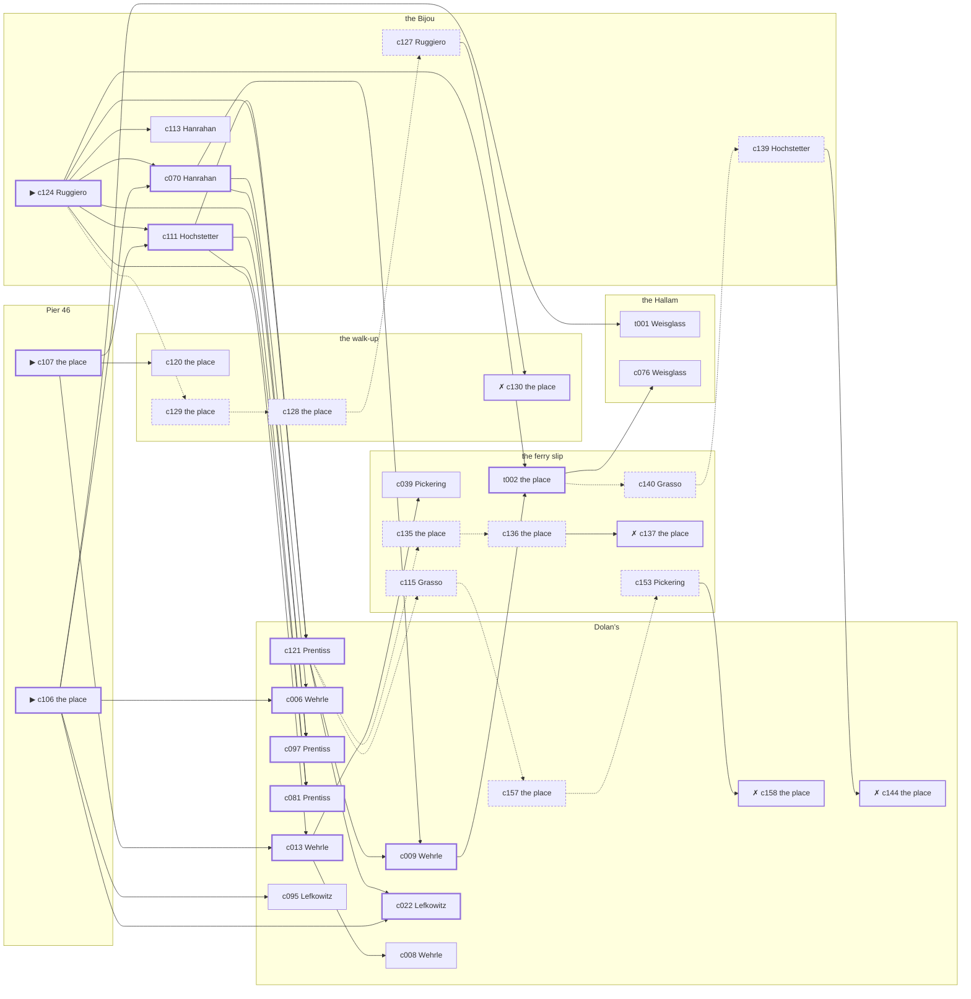

# Chelsea — case 1

**Seed** 1 · **Difficulty** 2 · **Attempts** 1 · **Detective** Dashiell

**Type** robbery · **Trope** payroll · **Unknowns** who, goods, how

**Par** 13 actions · **Slack** 6 · **Budget** 19 · **Findable** 34 (spine 13, corroboration 7, noise 10 + 4 disqualifiers) · **Noise ratio** 41% · **Candidate pool** 161

## 1. The Truth

Karl Hochstetter, a ward heeler, a witness against the people Steinbach worked for, took a payroll envelope from Pier 46, which belonged to Elsa Steinbach, the landlord of three tenements on Ninth Avenue, at 8:00 PM, by a key off the board. Hochstetter was about to be exposed by Steinbach (exposure). Hochstetter had been at the Hallam earlier in the evening, where the means lived, and was alone at Pier 46 when it happened. Ruggiero hired us.

## 2. The Act

**robbery** · **payroll** · actor **Hochstetter** · at **Pier 46** · at **8:00 PM**

- taken: a payroll envelope
- entry: key
- goods went to the ferry slip

**Givens** — what the briefing states and the report does not ask:

- A payroll envelope went from the Hallam to Pier 46 the way it goes every Friday, and Steinbach carried it.
- Steinbach had it at the Hallam at 7:30 PM, buttoned into an inside pocket.
- It was gone from Pier 46 by 8:00 PM.
- Nobody was hurt and nothing was broken.

**Unknowns** — exactly what the report asks: **who**, **goods**, **how**.

## 3. Dramatis Personae

| Name | Role | Relationship | Class of secret | Motive | Found at | Killer |
| --- | --- | --- | --- | --- | --- | --- |
| Elsa Steinbach | the landlord of three tenements on Ninth Avenue | the victim | — | — | — | — |
| Albrecht Wehrle | a curb broker | Steinbach’s business partner | embezzling | debt | Dolan’s | — |
| Gittel Lefkowitz | a seamstress | Steinbach’s neighbour across the airshaft | union-organizing | — | Dolan’s | — |
| Karl Hochstetter | a ward heeler | a witness against the people Steinbach worked for | murder | exposure | the Bijou | **YES** |
| Beatrice Pickering | a stringer for the evening papers | Steinbach’s neighbour across the airshaft | gambling-debt | — | the ferry slip | — |
| Nunzio Ruggiero (client) | a dentist with a chair and a waiting room | Steinbach’s tenant | dope | property | the Bijou | — |
| Pasquale Grasso | a hack driver | a childhood friend of Steinbach’s from the same block | gambling-debt | — | the ferry slip | — |
| James Hanrahan | the ticket-taker | fixture (ticket-taker) | — | — | the Bijou | — |
| Bernard Weisglass | the elevator man | fixture (elevator-man) | — | — | the Hallam | — |
| Eunice Prentiss | the bartender | fixture (bartender) | — | — | Dolan’s | — |

## 4. Dossiers

Every person, by layer: **0** on sight, **1** volunteered, **2** from other people, **3** in the documents.

### Steinbach — the victim

62, a woman, the landlord of three tenements on Ninth Avenue. Wants: to-keep-what-they-have.

- **Standing** — Steinbach owned more of the street than anybody who lived on it.
- **Profession** — Steinbach held three tenements on Ninth Avenue and the mortgages on two more.
- **Found** — Wehrle found the door at Pier 46 shut and a payroll envelope gone, at 11:30 PM. By Wehrle, at Pier 46, at 11:30 PM. Precinct: took-a-statement.

**Layer 0, on sight**

- _gender_ — A woman.
- _age_ — In her sixties.

**Layer 1, volunteered**

- _profession_ — The landlord of three tenements on Ninth Avenue.
- _detail_ — Steinbach held three tenements on Ninth Avenue and the mortgages on two more.

**Layer 2, from other people**

- _tie_ — Steinbach owned more of the street than anybody who lived on it.
- _want_ — Steinbach wants to keep what they have and add nothing to it.

**Self-account** (layer 1, what they say when asked about themselves)

- Steinbach is 62 years old and the landlord of three tenements on Ninth Avenue.
- Steinbach held three tenements on Ninth Avenue and the mortgages on two more.
- Steinbach is the one this is about.

### Wehrle

36, a man, a curb broker. Wants: money. Tie: Steinbach’s business partner, three years this spring.

**Layer 0, on sight**

- _gender_ — A man.
- _age_ — In his thirties.

**Layer 1, volunteered**

- _profession_ — A curb broker.
- _detail_ — Wehrle trades on the street for men who would rather not be seen doing it.

**Layer 2, from other people**

- _tie_ — Wehrle bought into Steinbach’s business the year Clementine Mosley walked out of it.
- _want_ — Wehrle wants money, and is not particular about the shape it arrives in.
- _since_ — Wehrle has been Steinbach’s business partner, three years this spring.
- _third_ — Clementine Mosley is a woman they had both been seeing.

**Layer 3, in the documents**

- _secret-hint_ — Wehrle had a key to the walk-up that Wehrle had no business having.

**Self-account** (layer 1, what they say when asked about themselves)

- Wehrle is 36 years old and a curb broker.
- Wehrle trades on the street for men who would rather not be seen doing it.
- Wehrle is Steinbach’s business partner.

### Lefkowitz

34, a woman, a seamstress. Wants: to-be-forgiven. Tie: Steinbach’s neighbour across the airshaft, since the building changed hands.

**Layer 0, on sight**

- _gender_ — A woman.
- _age_ — In her thirties.
- _profession_ — A seamstress.

**Layer 1, volunteered**

- _detail_ — Lefkowitz works a machine in a loft and is paid by the dozen.

**Layer 2, from other people**

- _tie_ — Lefkowitz has lived on the same landing as Steinbach since ’20.
- _want_ — Lefkowitz wants to be forgiven for something nobody else remembers.
- _since_ — Lefkowitz has been Steinbach’s neighbour across the airshaft, since the building changed hands.

**Layer 3, in the documents**

- _secret-hint_ — Lefkowitz has been seen with men from three different shops and none of them were drinking.

**Self-account** (layer 1, what they say when asked about themselves)

- Lefkowitz is 34 years old and a seamstress.
- Lefkowitz works a machine in a loft and is paid by the dozen.
- Lefkowitz is Steinbach’s neighbour across the airshaft.

### Hochstetter — the killer

54, a man, a ward heeler. Wants: to-be-somebody. Tie: a witness against the people Steinbach worked for, since ’26.

**Layer 0, on sight**

- _gender_ — A man.
- _age_ — In his fifties.

**Layer 1, volunteered**

- _profession_ — A ward heeler.
- _detail_ — Hochstetter sits in the clubhouse and settles what can be settled there.

**Layer 2, from other people**

- _tie_ — Hochstetter gave a statement about the people Steinbach worked for and has been careful ever since.
- _want_ — Hochstetter wants a name people know.
- _since_ — Hochstetter has been a witness against the people Steinbach worked for, since ’26.

**Self-account** (layer 1, what they say when asked about themselves)

- Hochstetter is 54 years old and a ward heeler.
- Hochstetter sits in the clubhouse and settles what can be settled there.
- Hochstetter is a witness against the people Steinbach worked for.

### Pickering

28, a woman, a stringer for the evening papers. Wants: to-be-somebody. Tie: Steinbach’s neighbour across the airshaft, since the building changed hands.

**Layer 0, on sight**

- _gender_ — A woman.
- _age_ — In the late twenties.

**Layer 1, volunteered**

- _profession_ — A stringer for the evening papers.
- _detail_ — Pickering sells two hundred words at a time to whichever desk is short.

**Layer 2, from other people**

- _tie_ — Pickering has lived on the same landing as Steinbach since ’20.
- _want_ — Pickering wants a name people know.
- _since_ — Pickering has been Steinbach’s neighbour across the airshaft, since the building changed hands.

**Layer 3, in the documents**

- _secret-hint_ — Pickering was asking around for a hundred dollars in a hurry earlier in the week.

**Self-account** (layer 1, what they say when asked about themselves)

- Pickering is 28 years old and a stringer for the evening papers.
- Pickering sells two hundred words at a time to whichever desk is short.
- Pickering is Steinbach’s neighbour across the airshaft.

### Ruggiero — the client

32, a man, a dentist with a chair and a waiting room. Wants: respectability. Tie: Steinbach’s tenant, since the flu year.

**Layer 0, on sight**

- _gender_ — A man.
- _age_ — In his thirties.

**Layer 1, volunteered**

- _profession_ — A dentist with a chair and a waiting room.
- _detail_ — Ruggiero has a chair, a waiting room and a girl on the door.

**Layer 2, from other people**

- _tie_ — Ruggiero has rented from Steinbach since ’24 and has the same window and the same complaint.
- _want_ — Ruggiero wants to be thought respectable by people who are not.
- _since_ — Ruggiero has been Steinbach’s tenant, since the flu year.

**Layer 3, in the documents**

- _secret-hint_ — Ruggiero’s sleeves are buttoned at the wrist in a warm room.

**Self-account** (layer 1, what they say when asked about themselves)

- Ruggiero is 32 years old and a dentist with a chair and a waiting room.
- Ruggiero has a chair, a waiting room and a girl on the door.
- Ruggiero is Steinbach’s tenant.

### Grasso

49, a man, a hack driver. Wants: to-be-left-alone. Tie: a childhood friend of Steinbach’s from the same block, since they were boys on the same stoop.

**Layer 0, on sight**

- _gender_ — A man.
- _age_ — In his forties.
- _profession_ — A hack driver.

**Layer 1, volunteered**

- _detail_ — Grasso drives nights and sleeps while the city works.

**Layer 2, from other people**

- _tie_ — Grasso, Steinbach and Rivka Kessler were inseparable for ten years and have not been in a room together since.
- _want_ — Grasso wants to be left alone.
- _since_ — Grasso has been a childhood friend of Steinbach’s from the same block, since they were boys on the same stoop.
- _third_ — Rivka Kessler is the landlady at the old address.

**Layer 3, in the documents**

- _secret-hint_ — Grasso was asking around for a hundred dollars in a hurry earlier in the week.

**Self-account** (layer 1, what they say when asked about themselves)

- Grasso is 49 years old and a hack driver.
- Grasso drives nights and sleeps while the city works.
- Grasso is a childhood friend of Steinbach’s from the same block.

### Hanrahan

48, a man, the ticket-taker. Wants: money. Tie: on the door at the Bijou, every performance.

**Layer 0, on sight**

- _gender_ — A man.
- _age_ — In his forties.
- _profession_ — The ticket-taker.

**Layer 1, volunteered**

- _detail_ — Hanrahan has taken tickets at the Bijou since the house opened.

**Layer 2, from other people**

- _tie_ — Hanrahan is on the door at the Bijou, every performance.
- _want_ — Hanrahan wants money, and is not particular about the shape it arrives in.

**Self-account** (layer 1, what they say when asked about themselves)

- Hanrahan is 48 years old and the ticket-taker.
- Hanrahan has taken tickets at the Bijou since the house opened.
- Hanrahan is on the door at the Bijou, every performance.

### Weisglass

47, a man, the elevator man. Wants: money. Tie: in the car at the Hallam.

**Layer 0, on sight**

- _gender_ — A man.
- _age_ — In his forties.
- _profession_ — The elevator man.

**Layer 1, volunteered**

- _detail_ — Weisglass has the car at the Hallam from three until eleven.

**Layer 2, from other people**

- _tie_ — Weisglass is in the car at the Hallam.
- _want_ — Weisglass wants money, and is not particular about the shape it arrives in.

**Self-account** (layer 1, what they say when asked about themselves)

- Weisglass is 47 years old and the elevator man.
- Weisglass has the car at the Hallam from three until eleven.
- Weisglass is in the car at the Hallam.

### Prentiss

30, a woman, the bartender. Wants: to-be-left-alone. Tie: behind the bar at Dolan’s, every night of the week.

**Layer 0, on sight**

- _gender_ — A woman.
- _age_ — In her thirties.
- _profession_ — The bartender.

**Layer 1, volunteered**

- _detail_ — Prentiss works Dolan’s from four until they lock the door.

**Layer 2, from other people**

- _tie_ — Prentiss is behind the bar at Dolan’s, every night of the week.
- _want_ — Prentiss wants to be left alone.

**Self-account** (layer 1, what they say when asked about themselves)

- Prentiss is 30 years old and the bartender.
- Prentiss works Dolan’s from four until they lock the door.
- Prentiss is behind the bar at Dolan’s, every night of the week.

## 5. The Client

**Ruggiero**, Steinbach’s tenant. Purpose: **clear-my-name**.

- **Why** — Ruggiero wants it established that it was not them, before anybody says otherwise.
- **What it costs** — Ruggiero was near enough to it that night to know exactly how it looks, and says so first.
- **Points at** — Wehrle: Wehrle owed Steinbach four thousand dollars and was past due on it. Honest: **yes**.

**Tells:**

- A payroll envelope went from the Hallam to Pier 46 the way it goes every Friday, and Steinbach carried it.
- Steinbach had it at the Hallam at 7:30 PM, buttoned into an inside pocket.
- It was gone from Pier 46 by 8:00 PM.
- Nobody was hurt and nothing was broken.
- Ruggiero would rather we started with Wehrle: Wehrle owed Steinbach four thousand dollars and was past due on it.

**Withholds:**

- Ruggiero does not mention it, but Ruggiero buys morphine at the Bijou from 7:30 PM to 8:00 PM and would rather be thought a murderer than a hop-head.

**Their own evening, as they tell it:**

- Ruggiero says he was at the Hallam from 6:00 PM to 7:00 PM.
- Ruggiero says he was at the ferry slip from 7:30 PM to 8:00 PM.
- Ruggiero says he was at the Bijou from 8:30 PM to 9:00 PM.
- Ruggiero says he was at Dolan’s from 9:30 PM to 10:30 PM.

## 6. The Briefing

16 plain sentences, derived. This is the model of the plain register: the engine renders it, and Phase 2 measures pages against it.

1. A man came up the stairs after midnight, and sat down.
2. Nunzio Ruggiero is 32 years old and a dentist with a chair and a waiting room.
3. Ruggiero has a chair, a waiting room and a girl on the door.
4. Steinbach owned more of the street than anybody who lived on it.
5. A payroll envelope went from the Hallam to Pier 46 the way it goes every Friday, and Steinbach carried it.
6. Steinbach had it at the Hallam at 7:30 PM, buttoned into an inside pocket.
7. It was gone from Pier 46 by 8:00 PM.
8. Nobody was hurt and nothing was broken.
9. Wehrle found the door at Pier 46 shut and a payroll envelope gone, at 11:30 PM.
10. The precinct took a statement at the desk and filed it.
11. Ruggiero is Steinbach’s tenant.
12. Ruggiero has rented from Steinbach since ’24 and has the same window and the same complaint.
13. Ruggiero wants it established that it was not them, before anybody says otherwise.
14. Ruggiero was near enough to it that night to know exactly how it looks, and says so first.
15. Ruggiero wants us to start with Wehrle.
16. Wehrle owed Steinbach four thousand dollars and was past due on it.

## 7. Mentions

- **Clementine Mosley** (m-1) — a woman they had both been seeing. Clementine Mosley is a woman they had both been seeing.
- **Rivka Kessler** (m-2) — the landlady at the old address. Rivka Kessler is the landlady at the old address.

## 8. Places

- **Steinbach’s walk-up over the drugstore** (private) — unwatched; objects: a stack of hatboxes, a bottle of chloral drops — the victim’s address
- **the Bijou picture house** (public) — watched by ticket-taker (Hanrahan); objects: a silver cigarette case, a standing ashtray — within earshot of the scene
- **the ferry slip at the foot of the street** (public) — unwatched; objects: a folded stack of evening papers, a strapped suitcase, a pasted-up timetable — within earshot of the scene
- **the vestibule of the Hallam apartments** (private) — watched by elevator-man (Weisglass); objects: the roof-door key, a brass umbrella stand, a day ledger — where the weapon lived
- **Dolan’s Bar** (semi) — watched by bartender (Prentiss); objects: a seltzer siphon, an ice pick
- **Pier 46, under the shed** (private) — unwatched; objects: a payroll envelope, a length of sash cord, a mechanic’s toolbox — **THE SCENE**

## 9. Anchors

The coroner gives 8:00 PM–9:30 PM, four ticks wide. These are what close it: **church-bells** and **fuse**.

- **the fuse going in the building** — at 7:30 PM; at the Hallam. You can time things by it: a crack in the cellar and every light on the riser out at once. Only those present know that it was the second floor that went dark and not the whole house. Those present carry it: candle smoke on the ceilings of everyone who sat it out.
- **the bells at St. Malachy’s** — at 6:00 PM, 7:00 PM, 8:00 PM, 9:00 PM, 10:00 PM, 11:00 PM; across the whole neighbourhood. You can time things by it: the half hours are rung and the whole hours are rung twice.

## 10. Timelines

### Steinbach — the victim

| Tick | Time | Truth | Claimed | Companion claimed |
| --- | --- | --- | --- | --- |
| 0 | 6:00 PM | the Bijou | the Bijou | — |
| 1 | 6:30 PM | the ferry slip | the ferry slip | — |
| 2 | 7:00 PM | the ferry slip | the ferry slip | — |
| 3 | 7:30 PM | the Hallam | the Hallam | — |
| 4 | 8:00 PM | the Hallam | the Hallam | — |
| 5 | 8:30 PM | the Hallam | the Hallam | — |
| 6 | 9:00 PM | the Hallam | the Hallam | — |
| 7 | 9:30 PM | the Hallam | the Hallam | — |
| 8 | 10:00 PM | Dolan’s | Dolan’s | — |
| 9 | 10:30 PM | the Bijou | the Bijou | — |
| 10 | 11:00 PM | the Bijou | the Bijou | — |
| 11 | 11:30 PM | the Bijou | the Bijou | — |

### Wehrle

| Tick | Time | Truth | Claimed | Companion claimed |
| --- | --- | --- | --- | --- |
| 0 | 6:00 PM | Pier 46 | Pier 46 | — |
| 1 | 6:30 PM | the Bijou | the Bijou | — |
| 2 | 7:00 PM | Pier 46 | Pier 46 | — |
| 3 | 7:30 PM | the Hallam | the Hallam | — |
| 4 | 8:00 PM | Dolan’s | Dolan’s | — |
| 5 | 8:30 PM | Dolan’s | Dolan’s | — |
| 6 | 9:00 PM | the walk-up | **Dolan’s** | — |
| 7 | 9:30 PM | Dolan’s | Dolan’s | — |
| 8 | 10:00 PM | Dolan’s | Dolan’s | — |
| 9 | 10:30 PM | Dolan’s | Dolan’s | — |
| 10 | 11:00 PM | Dolan’s | Dolan’s | — |
| 11 | 11:30 PM | Pier 46 | Pier 46 | — |

### Lefkowitz

| Tick | Time | Truth | Claimed | Companion claimed |
| --- | --- | --- | --- | --- |
| 0 | 6:00 PM | Pier 46 | Pier 46 | — |
| 1 | 6:30 PM | the Bijou | the Bijou | — |
| 2 | 7:00 PM | the Hallam | the Hallam | — |
| 3 | 7:30 PM | the Hallam | the Hallam | — |
| 4 | 8:00 PM | Dolan’s | Dolan’s | — |
| 5 | 8:30 PM | the ferry slip | **the Bijou** | Pickering |
| 6 | 9:00 PM | the ferry slip | **the Bijou** | Pickering |
| 7 | 9:30 PM | Dolan’s | Dolan’s | — |
| 8 | 10:00 PM | Dolan’s | Dolan’s | — |
| 9 | 10:30 PM | Dolan’s | Dolan’s | — |
| 10 | 11:00 PM | the Bijou | the Bijou | — |
| 11 | 11:30 PM | the Bijou | the Bijou | — |

### Hochstetter — the killer

| Tick | Time | Truth | Claimed | Companion claimed |
| --- | --- | --- | --- | --- |
| 0 | 6:00 PM | the walk-up | the walk-up | — |
| 1 | 6:30 PM | the walk-up | the walk-up | — |
| 2 | 7:00 PM | the walk-up | the walk-up | — |
| 3 | 7:30 PM | the Hallam | the Hallam | — |
| 4 | 8:00 PM | Pier 46 ☠ | **Dolan’s** | — |
| 5 | 8:30 PM | the walk-up | the walk-up | — |
| 6 | 9:00 PM | the Bijou | the Bijou | — |
| 7 | 9:30 PM | the Bijou | the Bijou | — |
| 8 | 10:00 PM | the Bijou | the Bijou | — |
| 9 | 10:30 PM | the Bijou | the Bijou | — |
| 10 | 11:00 PM | the Bijou | the Bijou | — |
| 11 | 11:30 PM | the Bijou | the Bijou | — |

### Pickering

| Tick | Time | Truth | Claimed | Companion claimed |
| --- | --- | --- | --- | --- |
| 0 | 6:00 PM | the ferry slip | the ferry slip | — |
| 1 | 6:30 PM | the ferry slip | the ferry slip | — |
| 2 | 7:00 PM | the ferry slip | the ferry slip | — |
| 3 | 7:30 PM | the ferry slip | the ferry slip | — |
| 4 | 8:00 PM | Dolan’s | Dolan’s | — |
| 5 | 8:30 PM | the ferry slip | the ferry slip | — |
| 6 | 9:00 PM | the ferry slip | the ferry slip | — |
| 7 | 9:30 PM | the walk-up | the walk-up | — |
| 8 | 10:00 PM | Dolan’s | **the ferry slip** | Lefkowitz |
| 9 | 10:30 PM | the ferry slip | the ferry slip | — |
| 10 | 11:00 PM | the ferry slip | the ferry slip | — |
| 11 | 11:30 PM | the walk-up | the walk-up | — |

### Ruggiero

| Tick | Time | Truth | Claimed | Companion claimed |
| --- | --- | --- | --- | --- |
| 0 | 6:00 PM | the Hallam | the Hallam | — |
| 1 | 6:30 PM | the Hallam | the Hallam | — |
| 2 | 7:00 PM | the Hallam | the Hallam | — |
| 3 | 7:30 PM | the Bijou | **the ferry slip** | Lefkowitz |
| 4 | 8:00 PM | the Bijou | **the ferry slip** | Lefkowitz |
| 5 | 8:30 PM | the Bijou | the Bijou | — |
| 6 | 9:00 PM | the Bijou | the Bijou | — |
| 7 | 9:30 PM | Dolan’s | Dolan’s | — |
| 8 | 10:00 PM | Dolan’s | Dolan’s | — |
| 9 | 10:30 PM | Dolan’s | Dolan’s | — |
| 10 | 11:00 PM | the Bijou | the Bijou | — |
| 11 | 11:30 PM | the Bijou | the Bijou | — |

### Grasso

| Tick | Time | Truth | Claimed | Companion claimed |
| --- | --- | --- | --- | --- |
| 0 | 6:00 PM | Pier 46 | Pier 46 | — |
| 1 | 6:30 PM | the ferry slip | the ferry slip | — |
| 2 | 7:00 PM | the ferry slip | the ferry slip | — |
| 3 | 7:30 PM | Dolan’s | **the Hallam** | — |
| 4 | 8:00 PM | Dolan’s | **the Hallam** | — |
| 5 | 8:30 PM | the ferry slip | the ferry slip | — |
| 6 | 9:00 PM | the ferry slip | the ferry slip | — |
| 7 | 9:30 PM | the ferry slip | the ferry slip | — |
| 8 | 10:00 PM | the ferry slip | the ferry slip | — |
| 9 | 10:30 PM | the ferry slip | the ferry slip | — |
| 10 | 11:00 PM | the ferry slip | the ferry slip | — |
| 11 | 11:30 PM | the ferry slip | the ferry slip | — |

### Fixtures (never lie, never withhold)

| Tick | Time | Hanrahan (the ticket-taker) | Weisglass (the elevator man) | Prentiss (the bartender) |
| --- | --- | --- | --- | --- |
| 0 | 6:00 PM | the Bijou | the Hallam | Dolan’s |
| 1 | 6:30 PM | the Bijou | the Hallam | Dolan’s |
| 2 | 7:00 PM | the ferry slip | the Hallam | Dolan’s |
| 3 | 7:30 PM | the Bijou | the Hallam | Dolan’s |
| 4 | 8:00 PM | the Bijou | the Bijou | Dolan’s |
| 5 | 8:30 PM | the Bijou | the Hallam | Dolan’s |
| 6 | 9:00 PM | the Bijou | the Hallam | Dolan’s |
| 7 | 9:30 PM | the Bijou | the Hallam | Dolan’s |
| 8 | 10:00 PM | the Bijou | the Hallam | Dolan’s |
| 9 | 10:30 PM | the Bijou | the Hallam | Dolan’s |
| 10 | 11:00 PM | the Bijou | the Hallam | Dolan’s |
| 11 | 11:30 PM | the Bijou | the Hallam | Dolan’s |

## 11. Secrets in play

- **Wehrle** (embezzling): Wehrle goes through the books at the walk-up from 9:00 PM, while there is nobody to see.
- **Lefkowitz** (union-organizing): Lefkowitz is at the ferry slip from 8:30 PM to 9:00 PM signing men up, which is a firing offence and worse.
- **Hochstetter** (murder): Hochstetter is at Pier 46 from 8:00 PM, alone with what Steinbach kept there, and takes it at 8:00 PM.
- **Pickering** (gambling-debt): Pickering slips off to Dolan’s from 10:00 PM to settle with a bookmaker.
- **Ruggiero** (dope): Ruggiero buys morphine at the Bijou from 7:30 PM to 8:00 PM and would rather be thought a murderer than a hop-head.
- **Grasso** (gambling-debt): Grasso slips off to Dolan’s from 7:30 PM to 8:00 PM to settle with a bookmaker.

## 12. Clue list — the 34 findable

The opening three, free at the start: c106, c107, c124. Everything else has to be led to. The full candidate pool is in the companion file.

### At the walk-up

- **c120** [corroboration] (document; the place itself) → (end)
  - Found at the walk-up: A typed page of dates and sums in Steinbach’s file, headed with Hochstetter’s name.
  - _establishes: Hochstetter had a motive (exposure)_
- **c129** [noise {b2}] (physical; the place itself) → c128
  - Ledger pages at the walk-up where the totals have been rubbed and written over.
  - _establishes: context only_
- **c128** [noise {b2}] (physical; the place itself) → c127
  - A carbon of a deposit slip at the walk-up, made out in Wehrle’s hand to an account in another name.
  - _establishes: context only_
- **c130** [disqualifier {b2}] (overheard; the place itself) → (end)
  - The bank confirms the account: Wehrle has been taking two hundred a month for a year, and was at the walk-up doing exactly that from 9:00 PM. It is theft, and it is not murder.
  - _establishes: Wehrle’s embezzling accounted for; Wehrle at the walk-up, 9:00 PM_

### At the Bijou

- **c124** [spine ⟨opening⟩] (client; Ruggiero on why I was hired) → c070, c111, c121, c097, c081, t002, c113, c129
  - Ruggiero hired us, and wants it known that Wehrle owed Steinbach four thousand dollars and was past due on it, and would rather we started there.
  - _establishes: Wehrle had a motive (debt)_
- **c070** [spine] (observation; Hanrahan on Ruggiero) → c006, c009, c097
  - Hanrahan says Ruggiero was at the Bijou from 7:30 PM to 9:00 PM.
  - _establishes: Ruggiero at the Bijou, 7:30 PM–9:00 PM_
- **c111** [spine] (anchor; Hochstetter on Steinbach that evening) → c121, c081, c013
  - Hochstetter puts Steinbach at the Hallam when the lights went, which was 7:30 PM, and nothing had been touched then.
  - _establishes: the victim alive at 7:30 PM; Steinbach at the Hallam, 7:30 PM_
- **c113** [corroboration] (anchor; Hanrahan on the noise that evening) → (end)
  - Hanrahan was at the Bijou at 8:00 PM and heard a door being locked from the outside from the direction of Pier 46, while the bells were going.
  - _establishes: noise at Pier 46 at 8:00 PM; the victim dead by 8:00 PM; how it was done_
- **c127** [noise {b2}] (overheard; Ruggiero on Wehrle) → c130
  - Ruggiero on Wehrle: Somebody heard a drawer being worked at the walk-up some time after 9:00 PM.
  - _establishes: context only_
- **c139** [noise {b4}] (overheard; Hochstetter on Pickering) → c144
  - Hochstetter on Pickering: Pickering was asking around for a hundred dollars in a hurry earlier in the week.
  - _establishes: context only_

### At the ferry slip

- **t002** [spine] (physical; the place itself) → c076, c140
  - A payroll envelope turned up at the ferry slip, behind the pipes, empty and slit along the fold.
  - _establishes: something gone from Pier 46_
- **c039** [corroboration] (observation; Pickering on Wehrle) → (end)
  - Pickering says Wehrle was at Dolan’s at 8:00 PM.
  - _establishes: Wehrle at Dolan’s, 8:00 PM_
- **c115** [noise {b1}] (anchor; Grasso on the fuse going in the building) → c157
  - Grasso claims the Hallam at 7:30 PM, which is when the fuse going in the building was on. Asked about it, Grasso cannot say that it was the second floor that went dark and not the whole house — and everybody who was there can.
  - _establishes: Grasso not at the Hallam, 7:30 PM_
- **c153** [noise {b1}] (overheard; Pickering on Grasso) → c158
  - Pickering on Grasso: Grasso was asking around for a hundred dollars in a hurry earlier in the week.
  - _establishes: context only_
- **c135** [noise {b3}] (physical; the place itself) → c136
  - A sheaf of signed cards at the ferry slip, forty of them, in a strapped envelope.
  - _establishes: context only_
- **c136** [noise {b3}] (physical; the place itself) → c137
  - A hall rental receipt at the ferry slip made out to a name that means nothing to anyone.
  - _establishes: context only_
- **c137** [disqualifier {b3}] (overheard; the place itself) → (end)
  - Forty men will swear to it if they have to: Lefkowitz was at the ferry slip from 8:30 PM to 9:00 PM taking their names, and the only thing Lefkowitz is guilty of is a charter.
  - _establishes: Lefkowitz’s union-organizing accounted for; Lefkowitz at the ferry slip, 8:30 PM–9:00 PM_
- **c140** [noise {b4}] (overheard; Grasso on Pickering) → c139
  - Grasso on Pickering: A man nobody knew was waiting for Pickering at Dolan’s and would not give a name.
  - _establishes: context only_

### At the Hallam

- **t001** [corroboration] (overheard; Weisglass on the route that evening) → (end)
  - Weisglass sees Steinbach come past the Hallam at 7:30 PM every week of the year, and saw it that evening, with the envelope still buttoned in.
  - _establishes: Steinbach at the Hallam, 7:30 PM_
- **c076** [corroboration] (observation; Weisglass on Lefkowitz) → (end)
  - Weisglass says Lefkowitz was at the Hallam from 7:00 PM to 7:30 PM.
  - _establishes: Lefkowitz at the Hallam, 7:00 PM–7:30 PM; Lefkowitz could reach the weapon_

### At Dolan’s

- **c121** [spine] (overheard; Prentiss on Hochstetter and Steinbach) → c009, c022, c115, c135
  - Prentiss says Steinbach told Hochstetter that the story would run whether Hochstetter liked it or not.
  - _establishes: Hochstetter had a motive (exposure)_
- **c006** [spine] (observation; Wehrle on Lefkowitz) → (end)
  - Wehrle says Lefkowitz was at Dolan’s at 8:00 PM.
  - _establishes: Lefkowitz at Dolan’s, 8:00 PM_
- **c009** [spine] (observation; Wehrle on Pickering) → t002
  - Wehrle says Pickering was at Dolan’s at 8:00 PM.
  - _establishes: Pickering at Dolan’s, 8:00 PM_
- **c097** [spine] (observation; Prentiss on Hochstetter’s account) → (end)
  - Prentiss was at Dolan’s at 8:00 PM and says Hochstetter was not.
  - _establishes: Hochstetter not at Dolan’s, 8:00 PM_
- **c081** [spine] (observation; Prentiss on Wehrle) → (end)
  - Prentiss says Wehrle was at Dolan’s from 8:00 PM to 8:30 PM.
  - _establishes: Wehrle at Dolan’s, 8:00 PM–8:30 PM_
- **c022** [spine] (observation; Lefkowitz on Hochstetter) → (end)
  - Lefkowitz says Hochstetter was at the Hallam at 7:30 PM.
  - _establishes: Hochstetter at the Hallam, 7:30 PM; Hochstetter could reach the weapon_
- **c013** [spine] (observation; Wehrle on Grasso) → c008, c039
  - Wehrle says Grasso was at Dolan’s at 8:00 PM.
  - _establishes: Grasso at Dolan’s, 8:00 PM_
- **c008** [corroboration] (observation; Wehrle on Hochstetter) → (end)
  - Wehrle says Hochstetter was at the Hallam at 7:30 PM.
  - _establishes: Hochstetter at the Hallam, 7:30 PM; Hochstetter could reach the weapon_
- **c095** [corroboration] (observation; Lefkowitz on Hochstetter’s account) → (end)
  - Lefkowitz was at Dolan’s at 8:00 PM and says Hochstetter was not.
  - _establishes: Hochstetter not at Dolan’s, 8:00 PM_
- **c157** [noise {b1}] (physical; the place itself) → c153
  - A book of markers at Dolan’s with Grasso’s initials against four of them.
  - _establishes: context only_
- **c158** [disqualifier {b1}] (overheard; the place itself) → (end)
  - The bookmaker’s runner is found and will say it: Grasso was at Dolan’s from 7:30 PM to 8:00 PM paying off eleven hundred dollars, a dollar at a time, and went nowhere near the killing.
  - _establishes: Grasso’s gambling-debt accounted for; Grasso at Dolan’s, 7:30 PM–8:00 PM_
- **c144** [disqualifier {b4}] (overheard; the place itself) → (end)
  - The bookmaker’s runner is found and will say it: Pickering was at Dolan’s from 10:00 PM paying off eleven hundred dollars, a dollar at a time, and went nowhere near the killing.
  - _establishes: Pickering’s gambling-debt accounted for; Pickering at Dolan’s, 10:00 PM_

### At Pier 46

- **c106** [spine ⟨opening⟩] (scene; the place itself) → c070, c006, c022, t001, c095
  - A payroll envelope is gone from Pier 46, which is Steinbach’s. There is a clean rectangle in the dust where it stood, and nothing else in the room was moved. The bells rang the half hour at 8:00 PM. The sexton rings them off the sacristy clock and it keeps good time.
  - _establishes: the victim dead by 8:00 PM; how it was done_
- **c107** [spine ⟨opening⟩] (morgue; the place itself) → c111, c013, c120
  - The desk sergeant's report puts it between 8:00 PM and 9:30 PM — two hours of nothing useful. The precinct report says the lock was not forced. It was opened, and it was locked again afterwards.
  - _establishes: death between 8:00 PM and 9:30 PM; how it was done_

## 13. Clue graph

## 14. Deduction path

Par is **13 actions** and the budget is par plus 6: **19**. Every id below is a spine clue; the inference is the sheet’s, not the clue’s.

**Time of death.** The coroner gives four ticks. The anchors close it to 8:00 PM: one puts Steinbach alive at 7:30 PM, the other times the scene at 8:00 PM. _(c107, c111, c106; + 1 corroborating)_

**Clearing the innocent.**

- Wehrle was not at Pier 46 at 8:00 PM. _(c081; + 1 corroborating)_
- Lefkowitz was not at Pier 46 at 8:00 PM. _(c006)_
- Pickering was not at Pier 46 at 8:00 PM. _(c009)_
- Ruggiero was not at Pier 46 at 8:00 PM. _(c070)_
- Grasso was not at Pier 46 at 8:00 PM. _(c013; + 1 corroborating)_

**Naming the killer.** Hochstetter claims Dolan’s at 8:00 PM. Two independent sources put that out of the question. _(c097; + 1 corroborating)_

**The weapon.** Hochstetter was at the Hallam before 8:00 PM, where the roof-door key was kept. _(c022; + 1 corroborating)_

**Method.** A key off the board, on two physical sources. _(c106, c107; + 1 corroborating)_

**Motive.** exposure, on two independent sources. _(c121; + 1 corroborating)_

## 15. Red herrings

**Innocents who lie about the murder tick:**

- Ruggiero claims the ferry slip at 8:00 PM and was really at the Bijou. Reason: Ruggiero buys morphine at the Bijou from 7:30 PM to 8:00 PM and would rather be thought a murderer than a hop-head.
- Grasso claims the Hallam at 8:00 PM and was really at Dolan’s. Reason: Grasso slips off to Dolan’s from 7:30 PM to 8:00 PM to settle with a bookmaker.

**Innocents with a motive:**

- Wehrle — debt: owed Steinbach four thousand dollars and was past due on it.
- Ruggiero — property: wanted Steinbach out of the lease and the lease in Ruggiero’s name.

**Noise branches, and what knocks each one down:**

- **b1** (Grasso, gambling-debt): c115 → c157 → c153 → **c158** — The bookmaker’s runner is found and will say it: Grasso was at Dolan’s from 7:30 PM to 8:00 PM paying off eleven hundred dollars, a dollar at a time, and went nowhere near the killing.
- **b2** (Wehrle, embezzling): c129 → c128 → c127 → **c130** — The bank confirms the account: Wehrle has been taking two hundred a month for a year, and was at the walk-up doing exactly that from 9:00 PM. It is theft, and it is not murder.
- **b3** (Lefkowitz, union-organizing): c135 → c136 → **c137** — Forty men will swear to it if they have to: Lefkowitz was at the ferry slip from 8:30 PM to 9:00 PM taking their names, and the only thing Lefkowitz is guilty of is a charter.
- **b4** (Pickering, gambling-debt): c140 → c139 → **c144** — The bookmaker’s runner is found and will say it: Pickering was at Dolan’s from 10:00 PM paying off eleven hundred dollars, a dollar at a time, and went nowhere near the killing.

