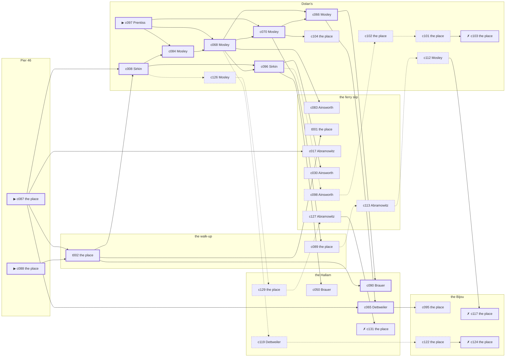

# Chelsea — case 1

**Seed** 1 · **Difficulty** 2 · **Attempts** 1 · **Detective** Dashiell

**Type** murder · **Trope** the-frame · **Unknowns** who, why, when

**Par** 12 actions · **Slack** 6 · **Budget** 18 · **Findable** 34 (spine 12, corroboration 8, noise 10 + 4 disqualifiers) · **Noise ratio** 41% · **Candidate pool** 134

## 1. The Truth

Percival Prentiss, a ward heeler, a witness against the people Corrigan worked for, killed Edward Corrigan, a retired dry-goods wholesaler, with a blunt object at Pier 46 at 9:00 PM. Prentiss needed Corrigan silent before the grand jury (silence-a-witness). Prentiss had been at the walk-up earlier in the evening, where the means lived, and was alone with Corrigan when it happened. Prentiss is also the client: the one who did it hired us.

## 2. The Act

**murder** · **the-frame** · actor **Prentiss** · at **Pier 46** · at **9:00 PM**

- found at Pier 46
- fate: dead

**Givens** — what the briefing states and the report does not ask:

- Corrigan was found dead at Pier 46.
- The coroner puts it between 7:30 PM and 9:00 PM.
- It was a blunt object.
- The precinct found the weapon in Abramowitz’s rooms and stopped looking.
- Abramowitz says it was put there, and has been saying so since Tuesday.

**Unknowns** — exactly what the report asks: **who**, **why**, **when**.

## 3. Dramatis Personae

| Name | Role | Relationship | Class of secret | Motive | Found at | Killer |
| --- | --- | --- | --- | --- | --- | --- |
| Edward Corrigan | a retired dry-goods wholesaler | the victim | — | — | — | — |
| Esther Sirkin | an insurance adjuster | a witness against the people Corrigan worked for | gambling-debt | — | Dolan’s | — |
| Bella Abramowitz | the night manager at the hotel | Corrigan’s brother-in-law | secret-drinking | — | the ferry slip | — |
| Ilse Reinhardt | a society columnist | a witness against the people Corrigan worked for | dope | — | the Bijou | — |
| Thaddeus Ainsworth | a doorman at a club with no sign on it | a childhood friend of Corrigan’s from the same block | dope | debt | the ferry slip | — |
| Percival Prentiss (client) | a ward heeler | a witness against the people Corrigan worked for | murder (+ gambling-debt) | silence-a-witness | Dolan’s | **YES** |
| Wilhelm Brauer | a lawyer with one clerk | Corrigan’s creditor | blackmail | — | the Hallam | — |
| Angelina Tramonti | the ticket-taker | fixture (ticket-taker) | — | — | the Bijou | — |
| Rudolf Dettweiler | the elevator man | fixture (elevator-man) | — | — | the Hallam | — |
| Augustus Mosley | the bartender | fixture (bartender) | — | — | Dolan’s | — |

## 4. Dossiers

Every person, by layer: **0** on sight, **1** volunteered, **2** from other people, **3** in the documents.

### Corrigan — the victim

70, a man, a retired dry-goods wholesaler. Wants: respectability.

- **Standing** — Corrigan had lent money to four families on the block and forgiven none of it.
- **Profession** — Corrigan ran a dry-goods house on Canal Street for thirty years.
- **Found** — Sirkin found Corrigan at Pier 46 at 11:30 PM. By Sirkin, at Pier 46, at 11:30 PM. Precinct: closed-it-in-an-hour.

**Layer 0, on sight**

- _gender_ — A man.
- _age_ — Past seventy.

**Layer 1, volunteered**

- _profession_ — A retired dry-goods wholesaler.
- _detail_ — Corrigan ran a dry-goods house on Canal Street for thirty years.

**Layer 2, from other people**

- _tie_ — Corrigan had lent money to four families on the block and forgiven none of it.
- _want_ — Corrigan wants to be thought respectable by people who are not.

**Self-account** (layer 1, what they say when asked about themselves)

- Corrigan is 70 years old and a retired dry-goods wholesaler.
- Corrigan ran a dry-goods house on Canal Street for thirty years.
- Corrigan is the one this is about.

### Sirkin

36, a woman, an insurance adjuster. Wants: money. Tie: a witness against the people Corrigan worked for, since the indictment.

**Layer 0, on sight**

- _gender_ — A woman.
- _age_ — In her thirties.

**Layer 1, volunteered**

- _profession_ — An insurance adjuster.
- _detail_ — Sirkin walks fire jobs for the company and writes up what he finds.

**Layer 2, from other people**

- _tie_ — Sirkin gave a statement about the people Corrigan worked for and has been careful ever since.
- _want_ — Sirkin wants money, and is not particular about the shape it arrives in.
- _since_ — Sirkin has been a witness against the people Corrigan worked for, since the indictment.

**Layer 3, in the documents**

- _secret-hint_ — Sirkin was asking around for a hundred dollars in a hurry earlier in the week.

**Self-account** (layer 1, what they say when asked about themselves)

- Sirkin is 36 years old and an insurance adjuster.
- Sirkin walks fire jobs for the company and writes up what he finds.
- Sirkin is a witness against the people Corrigan worked for.

### Abramowitz

54, a woman, the night manager at the hotel. Wants: to-keep-what-they-have. Tie: Corrigan’s brother-in-law, since ’18.

**Layer 0, on sight**

- _gender_ — A woman.
- _age_ — In her fifties.
- _profession_ — The night manager at the hotel.

**Layer 1, volunteered**

- _detail_ — Abramowitz has the desk from six at night until six in the morning.

**Layer 2, from other people**

- _tie_ — Abramowitz is Corrigan’s brother-in-law and has been told so at every holiday.
- _want_ — Abramowitz wants to keep what they have and add nothing to it.
- _since_ — Abramowitz has been Corrigan’s brother-in-law, since ’18.

**Layer 3, in the documents**

- _secret-hint_ — Abramowitz had taken a drink and had gone to some trouble about the smell of it.

**Self-account** (layer 1, what they say when asked about themselves)

- Abramowitz is 54 years old and the night manager at the hotel.
- Abramowitz has the desk from six at night until six in the morning.
- Abramowitz is Corrigan’s brother-in-law.

### Reinhardt

39, a woman, a society columnist. Wants: to-be-somebody. Tie: a witness against the people Corrigan worked for, since last autumn.

**Layer 0, on sight**

- _gender_ — A woman.
- _age_ — In her thirties.

**Layer 1, volunteered**

- _profession_ — A society columnist.
- _detail_ — Reinhardt keeps a card index of everybody worth a paragraph.

**Layer 2, from other people**

- _tie_ — Reinhardt is due before the grand jury about Corrigan’s people, and the date is set.
- _want_ — Reinhardt wants a name people know.
- _since_ — Reinhardt has been a witness against the people Corrigan worked for, since last autumn.

**Layer 3, in the documents**

- _secret-hint_ — Reinhardt’s sleeves are buttoned at the wrist in a warm room.

**Self-account** (layer 1, what they say when asked about themselves)

- Reinhardt is 39 years old and a society columnist.
- Reinhardt keeps a card index of everybody worth a paragraph.
- Reinhardt is a witness against the people Corrigan worked for.

### Ainsworth

33, a man, a doorman at a club with no sign on it. Wants: money. Tie: a childhood friend of Corrigan’s from the same block, all their lives.

**Layer 0, on sight**

- _gender_ — A man.
- _age_ — In his thirties.
- _profession_ — A doorman at a club with no sign on it.

**Layer 1, volunteered**

- _detail_ — Ainsworth stands the door at a club with no sign on it and knows every face that comes to it.

**Layer 2, from other people**

- _tie_ — Ainsworth, Corrigan and Gittel Feldman were inseparable for ten years and have not been in a room together since.
- _want_ — Ainsworth wants money, and is not particular about the shape it arrives in.
- _since_ — Ainsworth has been a childhood friend of Corrigan’s from the same block, all their lives.
- _third_ — Gittel Feldman is the landlady at the old address.

**Layer 3, in the documents**

- _secret-hint_ — Ainsworth’s sleeves are buttoned at the wrist in a warm room.

**Self-account** (layer 1, what they say when asked about themselves)

- Ainsworth is 33 years old and a doorman at a club with no sign on it.
- Ainsworth stands the door at a club with no sign on it and knows every face that comes to it.
- Ainsworth is a childhood friend of Corrigan’s from the same block.

### Prentiss — the killer — the client

36, a man, a ward heeler. Wants: to-be-feared. Tie: a witness against the people Corrigan worked for, since last autumn.

**Layer 0, on sight**

- _gender_ — A man.
- _age_ — In his thirties.

**Layer 1, volunteered**

- _profession_ — A ward heeler.
- _detail_ — Prentiss carries the district for the club and is paid in favours.

**Layer 2, from other people**

- _tie_ — Prentiss gave a statement about the people Corrigan worked for and has been careful ever since.
- _want_ — Prentiss wants to be the one people are careful around.
- _since_ — Prentiss has been a witness against the people Corrigan worked for, since last autumn.

**Layer 3, in the documents**

- _secret-hint_ — Prentiss was asking around for a hundred dollars in a hurry earlier in the week.

**Self-account** (layer 1, what they say when asked about themselves)

- Prentiss is 36 years old and a ward heeler.
- Prentiss carries the district for the club and is paid in favours.
- Prentiss is a witness against the people Corrigan worked for.

### Brauer

43, a man, a lawyer with one clerk. Wants: money. Tie: Corrigan’s creditor, three renewals running.

**Layer 0, on sight**

- _gender_ — A man.
- _age_ — In his forties.

**Layer 1, volunteered**

- _profession_ — A lawyer with one clerk.
- _detail_ — Brauer has a list of clients and will not read any of it aloud.

**Layer 2, from other people**

- _tie_ — Brauer lent Corrigan money in front of Wilhelmina Kreuzer and has been reminded of it ever since.
- _want_ — Brauer wants money, and is not particular about the shape it arrives in.
- _since_ — Brauer has been Corrigan’s creditor, three renewals running.
- _third_ — Wilhelmina Kreuzer is a sister who married out of the neighbourhood.

**Layer 3, in the documents**

- _secret-hint_ — Brauer and Corrigan were heard at the Hallam, and one of them was doing all the talking.

**Self-account** (layer 1, what they say when asked about themselves)

- Brauer is 43 years old and a lawyer with one clerk.
- Brauer has a list of clients and will not read any of it aloud.
- Brauer is Corrigan’s creditor.

### Tramonti

44, a woman, the ticket-taker. Wants: respectability. Tie: on the door at the Bijou, every performance.

**Layer 0, on sight**

- _gender_ — A woman.
- _age_ — In her forties.
- _profession_ — The ticket-taker.

**Layer 1, volunteered**

- _detail_ — Tramonti takes the tickets at the Bijou and tears every one of them in half.

**Layer 2, from other people**

- _tie_ — Tramonti is on the door at the Bijou, every performance.
- _want_ — Tramonti wants to be thought respectable by people who are not.

**Self-account** (layer 1, what they say when asked about themselves)

- Tramonti is 44 years old and the ticket-taker.
- Tramonti takes the tickets at the Bijou and tears every one of them in half.
- Tramonti is on the door at the Bijou, every performance.

### Dettweiler

46, a man, the elevator man. Wants: money. Tie: in the car at the Hallam.

**Layer 0, on sight**

- _gender_ — A man.
- _age_ — In his forties.
- _profession_ — The elevator man.

**Layer 1, volunteered**

- _detail_ — Dettweiler has run the car at the Hallam for eleven years and never lost a day.

**Layer 2, from other people**

- _tie_ — Dettweiler is in the car at the Hallam.
- _want_ — Dettweiler wants money, and is not particular about the shape it arrives in.

**Self-account** (layer 1, what they say when asked about themselves)

- Dettweiler is 46 years old and the elevator man.
- Dettweiler has run the car at the Hallam for eleven years and never lost a day.
- Dettweiler is in the car at the Hallam.

### Mosley

55, a man, the bartender. Wants: money. Tie: behind the bar at Dolan’s, every night of the week.

**Layer 0, on sight**

- _gender_ — A man.
- _age_ — In his fifties.
- _profession_ — The bartender.

**Layer 1, volunteered**

- _detail_ — Mosley pours at Dolan’s six nights a week and takes Mondays.

**Layer 2, from other people**

- _tie_ — Mosley is behind the bar at Dolan’s, every night of the week.
- _want_ — Mosley wants money, and is not particular about the shape it arrives in.

**Self-account** (layer 1, what they say when asked about themselves)

- Mosley is 55 years old and the bartender.
- Mosley pours at Dolan’s six nights a week and takes Mondays.
- Mosley is behind the bar at Dolan’s, every night of the week.

## 5. The Client

**Prentiss**, a witness against the people Corrigan worked for. Purpose: **clear-my-name** — and the killer.

- **Why** — Prentiss wants it established that it was not them, before anybody says otherwise.
- **What it costs** — Prentiss was near enough to it that night to know exactly how it looks, and says so first.
- **Points at** — Ainsworth: Ainsworth owed Corrigan four thousand dollars and was past due on it. Honest: **no**.

**Tells:**

- Corrigan was found dead at Pier 46.
- The coroner puts it between 7:30 PM and 9:00 PM.
- It was a blunt object.
- The precinct found the weapon in Abramowitz’s rooms and stopped looking.
- Abramowitz says it was put there, and has been saying so since Tuesday.
- Prentiss would rather we started with Ainsworth: Ainsworth owed Corrigan four thousand dollars and was past due on it.

**Withholds:**

- Prentiss does not mention being at Pier 46 at 9:00 PM, which is where Prentiss was.

**Their own evening, as they tell it:**

- Prentiss says he was at the Bijou at 6:00 PM.
- Prentiss says he was at the ferry slip at 6:30 PM.
- Prentiss says he was at Dolan’s at 7:00 PM.
- Prentiss says he was at the walk-up at 7:30 PM.

## 6. The Briefing

16 plain sentences, derived. This is the model of the plain register: the engine renders it, and Phase 2 measures pages against it.

1. A man came up the stairs after midnight, and sat down.
2. Percival Prentiss is 36 years old and a ward heeler.
3. Prentiss carries the district for the club and is paid in favours.
4. Corrigan had lent money to four families on the block and forgiven none of it.
5. Corrigan was found dead at Pier 46.
6. The coroner puts it between 7:30 PM and 9:00 PM.
7. It was a blunt object.
8. The precinct found the weapon in Abramowitz’s rooms and stopped looking.
9. Sirkin found Corrigan at Pier 46 at 11:30 PM.
10. The precinct had somebody for it inside the hour.
11. Prentiss is a witness against the people Corrigan worked for.
12. Prentiss gave a statement about the people Corrigan worked for and has been careful ever since.
13. Prentiss wants it established that it was not them, before anybody says otherwise.
14. Prentiss was near enough to it that night to know exactly how it looks, and says so first.
15. Prentiss wants us to start with Ainsworth.
16. Ainsworth owed Corrigan four thousand dollars and was past due on it.

## 7. Mentions

- **Gittel Feldman** (m-1) — the landlady at the old address. Gittel Feldman is the landlady at the old address.
- **Wilhelmina Kreuzer** (m-2) — a sister who married out of the neighbourhood. Wilhelmina Kreuzer is a sister who married out of the neighbourhood.

## 8. Places

- **Corrigan’s walk-up over the drugstore** (private) — unwatched; objects: a bronze bookend, a bottle of chloral drops, a stack of hatboxes — the victim’s address; where the weapon lived
- **the Bijou picture house** (public) — watched by ticket-taker (Tramonti); objects: a silver cigarette case, a standing ashtray, a length of sash cord — within earshot of the scene
- **the ferry slip at the foot of the street** (public) — unwatched; objects: a strapped suitcase, a pasted-up timetable — within earshot of the scene
- **the vestibule of the Hallam apartments** (private) — watched by elevator-man (Dettweiler); objects: a camel-hair overcoat on a hook, a brass umbrella stand, a day ledger
- **Dolan’s Bar** (semi) — watched by bartender (Mosley); objects: a seltzer siphon, an ice pick
- **Pier 46, under the shed** (private) — unwatched; objects: a mechanic’s toolbox — **THE SCENE**

## 9. Anchors

The coroner gives 7:30 PM–9:00 PM, four ticks wide. These are what close it: **church-bells** and **fuse**.

- **the fuse going in the building** — at 8:30 PM; at the Hallam. You can time things by it: a crack in the cellar and every light on the riser out at once. Only those present know that it was the second floor that went dark and not the whole house. Those present carry it: candle smoke on the ceilings of everyone who sat it out.
- **the bells at St. Malachy’s** — at 6:00 PM, 7:00 PM, 8:00 PM, 9:00 PM, 10:00 PM, 11:00 PM; across the whole neighbourhood. You can time things by it: the half hours are rung and the whole hours are rung twice.

## 10. Timelines

### Corrigan — the victim

| Tick | Time | Truth | Claimed | Companion claimed |
| --- | --- | --- | --- | --- |
| 0 | 6:00 PM | the walk-up | the walk-up | — |
| 1 | 6:30 PM | the walk-up | the walk-up | — |
| 2 | 7:00 PM | the Bijou | the Bijou | — |
| 3 | 7:30 PM | the Bijou | the Bijou | — |
| 4 | 8:00 PM | the Hallam | the Hallam | — |
| 5 | 8:30 PM | the Hallam | the Hallam | — |
| 6 | 9:00 PM | Pier 46 ☠ | Pier 46 | — |
| 7 | 9:30 PM | — | — | — |
| 8 | 10:00 PM | — | — | — |
| 9 | 10:30 PM | — | — | — |
| 10 | 11:00 PM | — | — | — |
| 11 | 11:30 PM | — | — | — |

### Sirkin

| Tick | Time | Truth | Claimed | Companion claimed |
| --- | --- | --- | --- | --- |
| 0 | 6:00 PM | the walk-up | the walk-up | — |
| 1 | 6:30 PM | the walk-up | the walk-up | — |
| 2 | 7:00 PM | the walk-up | the walk-up | — |
| 3 | 7:30 PM | the walk-up | the walk-up | — |
| 4 | 8:00 PM | the Bijou | the Bijou | — |
| 5 | 8:30 PM | Dolan’s | **the Bijou** | Brauer |
| 6 | 9:00 PM | Dolan’s | **the Bijou** | Brauer |
| 7 | 9:30 PM | Dolan’s | Dolan’s | — |
| 8 | 10:00 PM | Dolan’s | Dolan’s | — |
| 9 | 10:30 PM | Dolan’s | Dolan’s | — |
| 10 | 11:00 PM | the Bijou | the Bijou | — |
| 11 | 11:30 PM | Pier 46 | Pier 46 | — |

### Abramowitz

| Tick | Time | Truth | Claimed | Companion claimed |
| --- | --- | --- | --- | --- |
| 0 | 6:00 PM | the ferry slip | the ferry slip | — |
| 1 | 6:30 PM | the ferry slip | the ferry slip | — |
| 2 | 7:00 PM | the ferry slip | the ferry slip | — |
| 3 | 7:30 PM | the walk-up | the walk-up | — |
| 4 | 8:00 PM | the walk-up | the walk-up | — |
| 5 | 8:30 PM | Dolan’s | **the ferry slip** | — |
| 6 | 9:00 PM | Dolan’s | **the ferry slip** | — |
| 7 | 9:30 PM | the ferry slip | the ferry slip | — |
| 8 | 10:00 PM | the ferry slip | the ferry slip | — |
| 9 | 10:30 PM | the walk-up | the walk-up | — |
| 10 | 11:00 PM | the ferry slip | the ferry slip | — |
| 11 | 11:30 PM | the ferry slip | the ferry slip | — |

### Reinhardt

| Tick | Time | Truth | Claimed | Companion claimed |
| --- | --- | --- | --- | --- |
| 0 | 6:00 PM | the Hallam | the Hallam | — |
| 1 | 6:30 PM | the Hallam | the Hallam | — |
| 2 | 7:00 PM | the Bijou | the Bijou | — |
| 3 | 7:30 PM | the Bijou | **the Hallam** | — |
| 4 | 8:00 PM | the Bijou | the Bijou | — |
| 5 | 8:30 PM | the Bijou | the Bijou | — |
| 6 | 9:00 PM | Dolan’s | Dolan’s | — |
| 7 | 9:30 PM | Dolan’s | Dolan’s | — |
| 8 | 10:00 PM | Dolan’s | Dolan’s | — |
| 9 | 10:30 PM | Dolan’s | Dolan’s | — |
| 10 | 11:00 PM | Dolan’s | Dolan’s | — |
| 11 | 11:30 PM | the Bijou | the Bijou | — |

### Ainsworth

| Tick | Time | Truth | Claimed | Companion claimed |
| --- | --- | --- | --- | --- |
| 0 | 6:00 PM | the ferry slip | the ferry slip | — |
| 1 | 6:30 PM | Dolan’s | Dolan’s | — |
| 2 | 7:00 PM | the walk-up | the walk-up | — |
| 3 | 7:30 PM | the ferry slip | the ferry slip | — |
| 4 | 8:00 PM | the ferry slip | the ferry slip | — |
| 5 | 8:30 PM | the ferry slip | the ferry slip | — |
| 6 | 9:00 PM | Dolan’s | Dolan’s | — |
| 7 | 9:30 PM | Dolan’s | Dolan’s | — |
| 8 | 10:00 PM | the Bijou | **the walk-up** | Prentiss |
| 9 | 10:30 PM | the Bijou | **the walk-up** | Prentiss |
| 10 | 11:00 PM | the Bijou | the Bijou | — |
| 11 | 11:30 PM | the ferry slip | the ferry slip | — |

### Prentiss — the killer

| Tick | Time | Truth | Claimed | Companion claimed |
| --- | --- | --- | --- | --- |
| 0 | 6:00 PM | the Bijou | the Bijou | — |
| 1 | 6:30 PM | Dolan’s | **the ferry slip** | — |
| 2 | 7:00 PM | Dolan’s | Dolan’s | — |
| 3 | 7:30 PM | the walk-up | the walk-up | — |
| 4 | 8:00 PM | Pier 46 | **Dolan’s** | Sirkin |
| 5 | 8:30 PM | Pier 46 | **Dolan’s** | Sirkin |
| 6 | 9:00 PM | Pier 46 ☠ | **Dolan’s** | Sirkin |
| 7 | 9:30 PM | the Hallam | the Hallam | — |
| 8 | 10:00 PM | the Hallam | the Hallam | — |
| 9 | 10:30 PM | the Hallam | the Hallam | — |
| 10 | 11:00 PM | Dolan’s | Dolan’s | — |
| 11 | 11:30 PM | the ferry slip | the ferry slip | — |

### Brauer

| Tick | Time | Truth | Claimed | Companion claimed |
| --- | --- | --- | --- | --- |
| 0 | 6:00 PM | the ferry slip | the ferry slip | — |
| 1 | 6:30 PM | the ferry slip | the ferry slip | — |
| 2 | 7:00 PM | the ferry slip | the ferry slip | — |
| 3 | 7:30 PM | the walk-up | the walk-up | — |
| 4 | 8:00 PM | the Hallam | **the ferry slip** | — |
| 5 | 8:30 PM | the Hallam | the Hallam | — |
| 6 | 9:00 PM | the Hallam | the Hallam | — |
| 7 | 9:30 PM | the Hallam | the Hallam | — |
| 8 | 10:00 PM | the Hallam | the Hallam | — |
| 9 | 10:30 PM | the Hallam | the Hallam | — |
| 10 | 11:00 PM | the Hallam | the Hallam | — |
| 11 | 11:30 PM | the ferry slip | the ferry slip | — |

### Fixtures (never lie, never withhold)

| Tick | Time | Tramonti (the ticket-taker) | Dettweiler (the elevator man) | Mosley (the bartender) |
| --- | --- | --- | --- | --- |
| 0 | 6:00 PM | the Bijou | the Hallam | Dolan’s |
| 1 | 6:30 PM | the Bijou | the Hallam | Dolan’s |
| 2 | 7:00 PM | the Bijou | the Hallam | Dolan’s |
| 3 | 7:30 PM | the Bijou | the Hallam | Dolan’s |
| 4 | 8:00 PM | the Bijou | the Hallam | Dolan’s |
| 5 | 8:30 PM | the Bijou | the Hallam | Dolan’s |
| 6 | 9:00 PM | the Hallam | the Hallam | Dolan’s |
| 7 | 9:30 PM | the Bijou | the Hallam | Dolan’s |
| 8 | 10:00 PM | the Bijou | the Hallam | Dolan’s |
| 9 | 10:30 PM | the Bijou | the Hallam | Dolan’s |
| 10 | 11:00 PM | the Bijou | the ferry slip | Dolan’s |
| 11 | 11:30 PM | the Bijou | the Hallam | Dolan’s |

## 11. Secrets in play

- **Sirkin** (gambling-debt): Sirkin slips off to Dolan’s from 8:30 PM to 9:00 PM to settle with a bookmaker.
- **Abramowitz** (secret-drinking): Abramowitz drinks alone at Dolan’s from 8:30 PM to 9:00 PM and will claim to have been anywhere else.
- **Reinhardt** (dope): Reinhardt buys morphine at the Bijou from 7:30 PM and would rather be thought a murderer than a hop-head.
- **Ainsworth** (dope): Ainsworth buys morphine at the Bijou from 10:00 PM to 10:30 PM and would rather be thought a murderer than a hop-head.
- **Prentiss** (murder): Prentiss is at Pier 46 from 8:00 PM to 9:00 PM, alone with Corrigan when it happens at 9:00 PM.
- **Prentiss** also (gambling-debt): Prentiss slips off to Dolan’s from 6:30 PM to settle with a bookmaker.
- **Brauer** (blackmail): Brauer meets Corrigan alone at the Hallam from 8:00 PM and asks for money.

## 12. Clue list — the 34 findable

The opening three, free at the start: c087, c088, c097. Everything else has to be led to. The full candidate pool is in the companion file.

### At the walk-up

- **t002** [spine] (document; the place itself) → c008, c090, t001
  - The book at the walk-up has a bronze bookend going out the day before, in a hand that is not Abramowitz’s. Abramowitz was at Dolan’s at 9:00 PM.
  - _establishes: Abramowitz not at Pier 46, 9:00 PM_
- **c089** [corroboration] (physical; the place itself) → c113
  - A bronze bookend is gone from the walk-up. There is a clean square in the dust where it stood.
  - _establishes: something gone from the walk-up; how it was done_

### At the Bijou

- **c095** [corroboration] (document; the place itself) → (end)
  - Found at the Bijou: A subpoena naming Corrigan before the grand jury, with Prentiss’s name written in the margin.
  - _establishes: Prentiss had a motive (silence-a-witness)_
- **c117** [disqualifier {b3}] (overheard; the place itself) → (end)
  - The man who sells it at the Bijou gives it up rather than be held: Reinhardt was there from 7:30 PM, and stayed until it took hold.
  - _establishes: Reinhardt’s dope accounted for; Reinhardt at the Bijou, 7:30 PM_
- **c122** [noise {b4}] (physical; the place itself) → c124
  - A paper of powder at the Bijou, folded the way one particular hand folds them.
  - _establishes: context only_
- **c124** [disqualifier {b4}] (overheard; the place itself) → (end)
  - The man who sells it at the Bijou gives it up rather than be held: Ainsworth was there from 10:00 PM to 10:30 PM, and stayed until it took hold.
  - _establishes: Ainsworth’s dope accounted for; Ainsworth at the Bijou, 10:00 PM–10:30 PM_

### At the ferry slip

- **c083** [corroboration] (observation; Ainsworth on Prentiss’s account) → (end)
  - Ainsworth was at Dolan’s at 9:00 PM and says Prentiss was not.
  - _establishes: Prentiss not at Dolan’s, 9:00 PM_
- **t001** [corroboration] (physical; the place itself) → (end)
  - A bronze bookend was found at the ferry slip wrapped in newspaper, and the newspaper is dated the day after Abramowitz was last in the room.
  - _establishes: Abramowitz not at Pier 46, 9:00 PM_
- **c017** [corroboration] (observation; Abramowitz on Brauer) → (end)
  - Abramowitz says Brauer was at the walk-up at 7:30 PM.
  - _establishes: Brauer at the walk-up, 7:30 PM; Brauer could reach the weapon_
- **c030** [corroboration] (observation; Ainsworth on Reinhardt) → (end)
  - Ainsworth says Reinhardt was at Dolan’s from 9:00 PM to 9:30 PM.
  - _establishes: Reinhardt at Dolan’s, 9:00 PM–9:30 PM_
- **c127** [noise {b1}] (overheard; Abramowitz on Brauer) → c131
  - Abramowitz on Brauer: Brauer has come into money lately and has no visible way of having come into money.
  - _establishes: context only_
- **c098** [noise {b2}] (overheard; Ainsworth on Sirkin) → c102
  - Ainsworth on Sirkin: Sirkin was asking around for a hundred dollars in a hurry earlier in the week.
  - _establishes: context only_
- **c113** [noise {b3}] (overheard; Abramowitz on Reinhardt) → c112
  - Abramowitz on Reinhardt: Somebody at the Bijou sells what a druggist will not, and Reinhardt knows which door.
  - _establishes: context only_

### At the Hallam

- **c090** [spine] (anchor; Brauer on Corrigan that evening) → (end)
  - Brauer puts Corrigan at the Hallam when the lights went, which was 8:30 PM, and alive enough to argue about the weather.
  - _establishes: the victim alive at 8:30 PM; Corrigan at the Hallam, 8:30 PM_
- **c065** [spine] (observation; Dettweiler on Brauer) → c095
  - Dettweiler says Brauer was at the Hallam from 8:00 PM to 10:30 PM.
  - _establishes: Brauer at the Hallam, 8:00 PM–10:30 PM_
- **c050** [corroboration] (observation; Brauer on Prentiss) → (end)
  - Brauer says Prentiss was at the walk-up at 7:30 PM.
  - _establishes: Prentiss at the walk-up, 7:30 PM; Prentiss could reach the weapon_
- **c129** [noise {b1}] (physical; the place itself) → c127
  - An envelope at the Hallam with nothing in it, addressed in Corrigan’s hand to no one.
  - _establishes: context only_
- **c131** [disqualifier {b1}] (overheard; the place itself) → (end)
  - Corrigan’s bank book settles it: four payments, and Brauer at the Hallam from 8:00 PM collecting the fifth. It is extortion, and an extortionist wants Corrigan alive.
  - _establishes: Brauer’s blackmail accounted for; Brauer at the Hallam, 8:00 PM_
- **c119** [noise {b4}] (overheard; Dettweiler on Ainsworth) → c122
  - Dettweiler on Ainsworth: Ainsworth’s sleeves are buttoned at the wrist in a warm room.
  - _establishes: context only_

### At Dolan’s

- **c097** [spine ⟨opening⟩] (client; Prentiss on why I was hired) → c084, c068, c070
  - Prentiss hired us, and wants it known that Ainsworth owed Corrigan four thousand dollars and was past due on it, and would rather we started there.
  - _establishes: Ainsworth had a motive (debt)_
- **c008** [spine] (observation; Sirkin on Prentiss) → c084, c096, c126
  - Sirkin says Prentiss was at the walk-up at 7:30 PM.
  - _establishes: Prentiss at the walk-up, 7:30 PM; Prentiss could reach the weapon_
- **c084** [spine] (observation; Mosley on Prentiss’s account) → c068
  - Mosley was at Dolan’s from 8:00 PM to 9:00 PM and says Prentiss was not.
  - _establishes: Prentiss not at Dolan’s, 8:00 PM–9:00 PM_
- **c068** [spine] (observation; Mosley on Reinhardt) → c096, c070, c066, c083, c119
  - Mosley says Reinhardt was at Dolan’s from 9:00 PM to 11:00 PM.
  - _establishes: Reinhardt at Dolan’s, 9:00 PM–11:00 PM_
- **c096** [spine] (overheard; Sirkin on Prentiss and Corrigan) → c050, c030, c098
  - Sirkin says Corrigan said to Prentiss that a man who testifies sleeps better.
  - _establishes: Prentiss had a motive (silence-a-witness)_
- **c070** [spine] (observation; Mosley on Ainsworth) → c066, c089, c104
  - Mosley says Ainsworth was at Dolan’s from 9:00 PM to 9:30 PM.
  - _establishes: Ainsworth at Dolan’s, 9:00 PM–9:30 PM_
- **c066** [spine] (observation; Mosley on Sirkin) → c090, c065
  - Mosley says Sirkin was at Dolan’s from 8:30 PM to 10:30 PM.
  - _establishes: Sirkin at Dolan’s, 8:30 PM–10:30 PM_
- **c104** [corroboration] (overheard; the place itself) → (end)
  - The book at Dolan’s has the payment entered against Sirkin’s name and the time beside it, from 8:30 PM to 9:00 PM, in the clerk’s own hand.
  - _establishes: Sirkin’s gambling-debt accounted for; Sirkin at Dolan’s, 8:30 PM–9:00 PM_
- **c126** [noise {b1}] (overheard; Mosley on Brauer) → c129
  - Mosley on Brauer: Brauer and Corrigan were heard at the Hallam, and one of them was doing all the talking.
  - _establishes: context only_
- **c102** [noise {b2}] (physical; the place itself) → c101
  - A book of markers at Dolan’s with Sirkin’s initials against four of them.
  - _establishes: context only_
- **c101** [noise {b2}] (physical; the place itself) → c103
  - Betting slips at Dolan’s in Sirkin’s pocketbook, all of them losers, all of them this month.
  - _establishes: context only_
- **c103** [disqualifier {b2}] (overheard; the place itself) → (end)
  - The bookmaker’s runner is found and will say it: Sirkin was at Dolan’s from 8:30 PM to 9:00 PM paying off eleven hundred dollars, a dollar at a time, and went nowhere near the killing.
  - _establishes: Sirkin’s gambling-debt accounted for; Sirkin at Dolan’s, 8:30 PM–9:00 PM_
- **c112** [noise {b3}] (overheard; Mosley on Reinhardt) → c117
  - Mosley on Reinhardt: Reinhardt’s sleeves are buttoned at the wrist in a warm room.
  - _establishes: context only_

### At Pier 46

- **c087** [spine ⟨opening⟩] (scene; the place itself) → t002, c008, c065, c017
  - Corrigan was found at Pier 46. The lamp came down with him and the bulb is still warm in its socket, unbroken. The bells rang the half hour at 9:00 PM. The sexton rings them off the sacristy clock and it keeps good time.
  - _establishes: the victim dead by 9:00 PM; how it was done_
- **c088** [spine ⟨opening⟩] (morgue; the place itself) → t002
  - The coroner puts death between 7:30 PM and 9:00 PM — two hours of nothing useful. One depressed fracture at the back of the skull. Death was not instant.
  - _establishes: death between 7:30 PM and 9:00 PM; how it was done_

## 13. Clue graph

## 14. Deduction path

Par is **12 actions** and the budget is par plus 6: **18**. Every id below is a spine clue; the inference is the sheet’s, not the clue’s.

**Time of death.** The coroner gives four ticks. The anchors close it to 9:00 PM: one puts Corrigan alive at 8:30 PM, the other times the scene at 9:00 PM. _(c088, c090, c087)_

**Clearing the innocent.**

- Sirkin was not at Pier 46 at 9:00 PM. _(c066; + 2 corroborating)_
- Abramowitz was not at Pier 46 at 9:00 PM. _(t002; + 1 corroborating)_
- Reinhardt was not at Pier 46 at 9:00 PM. _(c068; + 1 corroborating)_
- Ainsworth was not at Pier 46 at 9:00 PM. _(c070)_
- Brauer was not at Pier 46 at 9:00 PM. _(c065)_

**Naming the killer.** Prentiss claims Dolan’s at 9:00 PM. Two independent sources put that out of the question. _(c084; + 1 corroborating)_

**The weapon.** Prentiss was at the walk-up before 9:00 PM, where a bronze bookend was kept. _(c008; + 1 corroborating)_

**Method.** A blunt object, on two physical sources. _(c087, c088; + 1 corroborating)_

**Motive.** silence-a-witness, on two independent sources. _(c096; + 1 corroborating)_

## 15. Red herrings

**Innocents who lie about the murder tick:**

- Sirkin claims the Bijou at 9:00 PM and was really at Dolan’s. Reason: Sirkin slips off to Dolan’s from 8:30 PM to 9:00 PM to settle with a bookmaker.
- Abramowitz claims the ferry slip at 9:00 PM and was really at Dolan’s. Reason: Abramowitz drinks alone at Dolan’s from 8:30 PM to 9:00 PM and will claim to have been anywhere else.

**Innocents with a motive:**

- Ainsworth — debt: owed Corrigan four thousand dollars and was past due on it.

**Noise branches, and what knocks each one down:**

- **b1** (Brauer, blackmail): c126 → c129 → c127 → **c131** — Corrigan’s bank book settles it: four payments, and Brauer at the Hallam from 8:00 PM collecting the fifth. It is extortion, and an extortionist wants Corrigan alive.
- **b2** (Sirkin, gambling-debt): c098 → c102 → c101 → **c103** — The bookmaker’s runner is found and will say it: Sirkin was at Dolan’s from 8:30 PM to 9:00 PM paying off eleven hundred dollars, a dollar at a time, and went nowhere near the killing.
- **b3** (Reinhardt, dope): c113 → c112 → **c117** — The man who sells it at the Bijou gives it up rather than be held: Reinhardt was there from 7:30 PM, and stayed until it took hold.
- **b4** (Ainsworth, dope): c119 → c122 → **c124** — The man who sells it at the Bijou gives it up rather than be held: Ainsworth was there from 10:00 PM to 10:30 PM, and stayed until it took hold.

